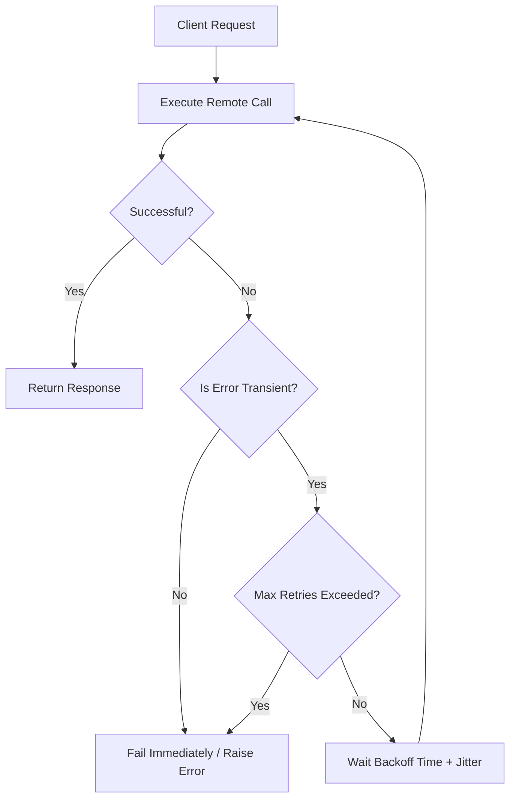
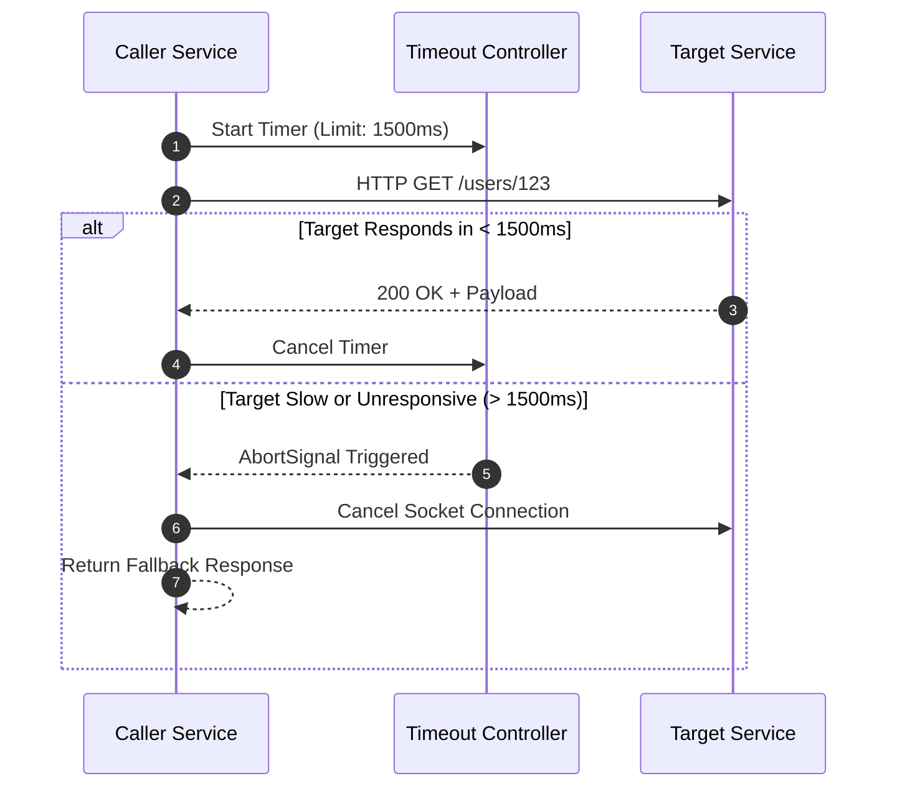
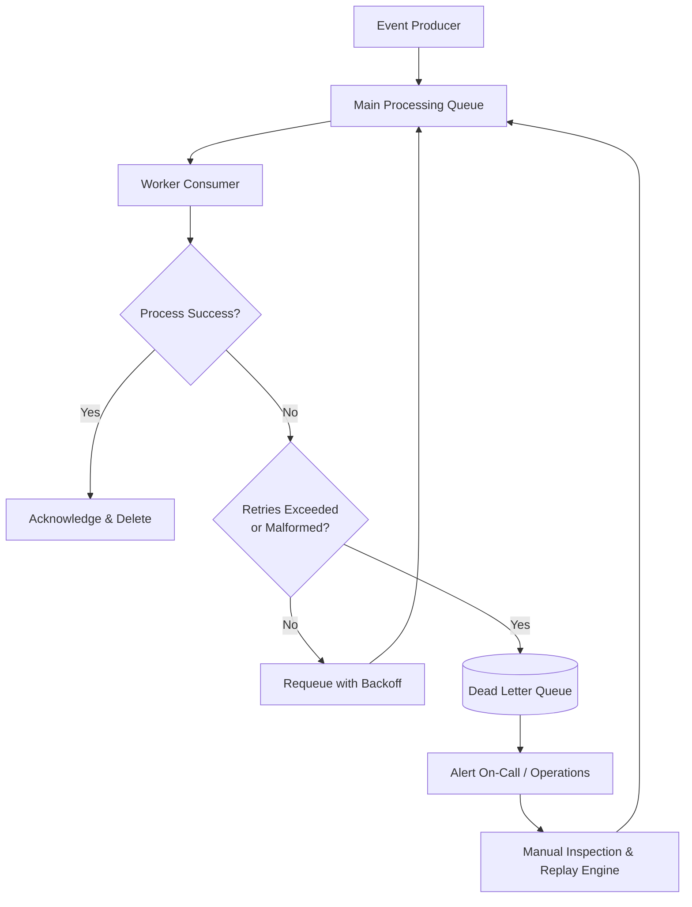
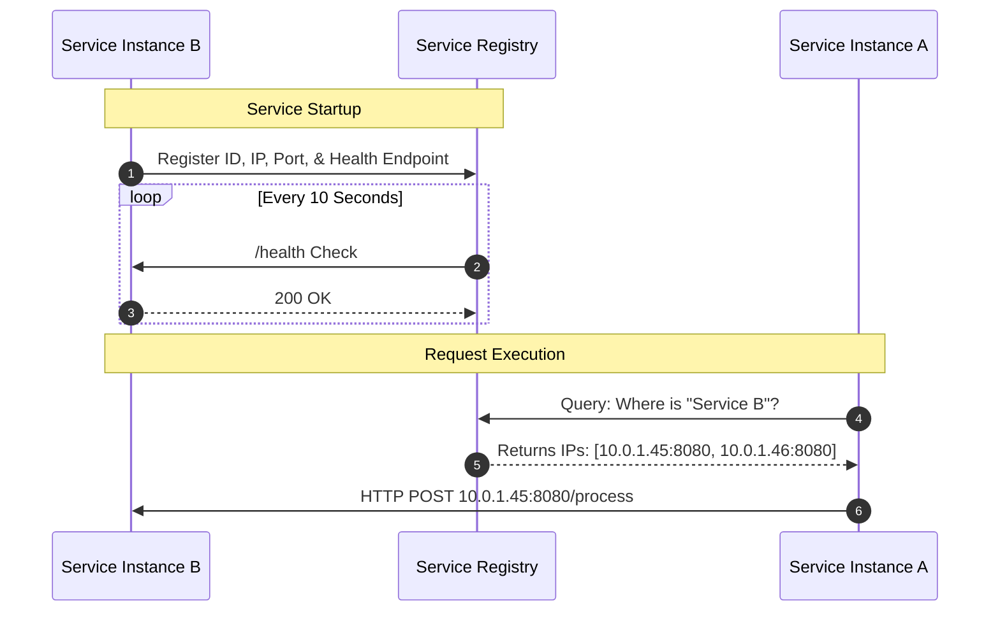
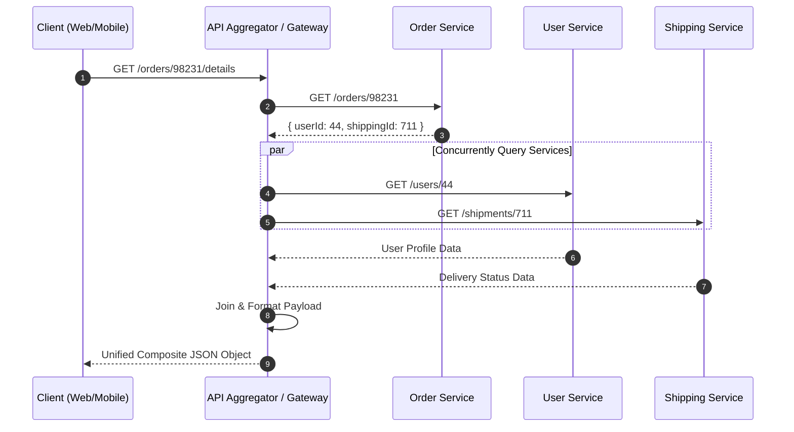
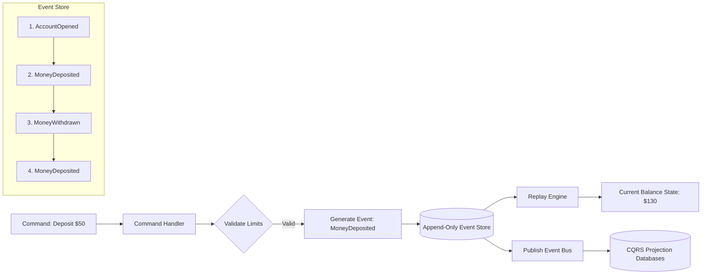
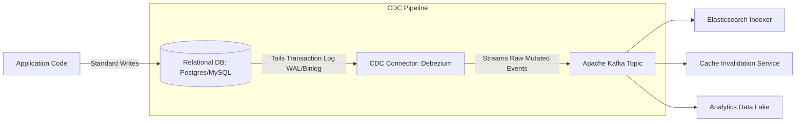
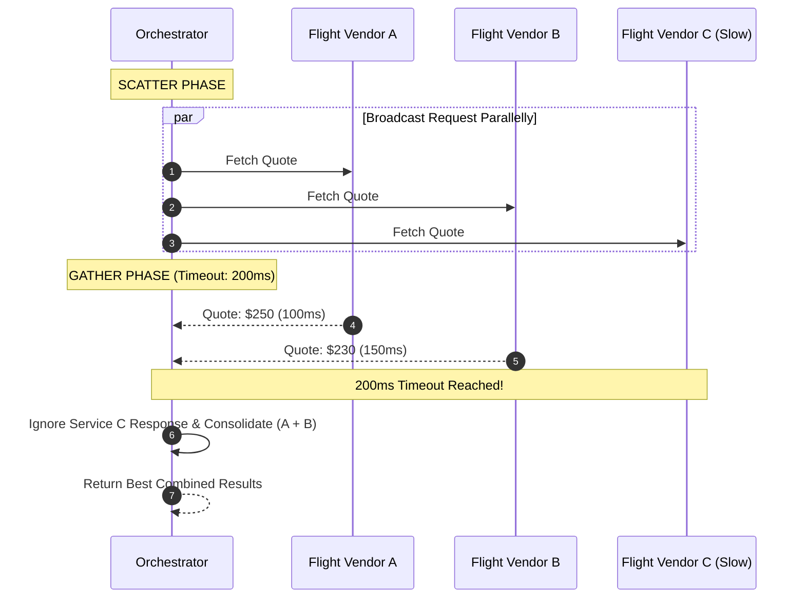
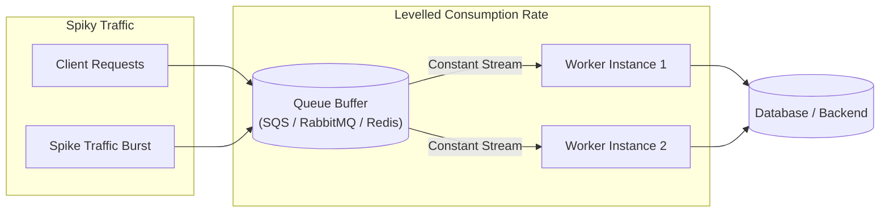
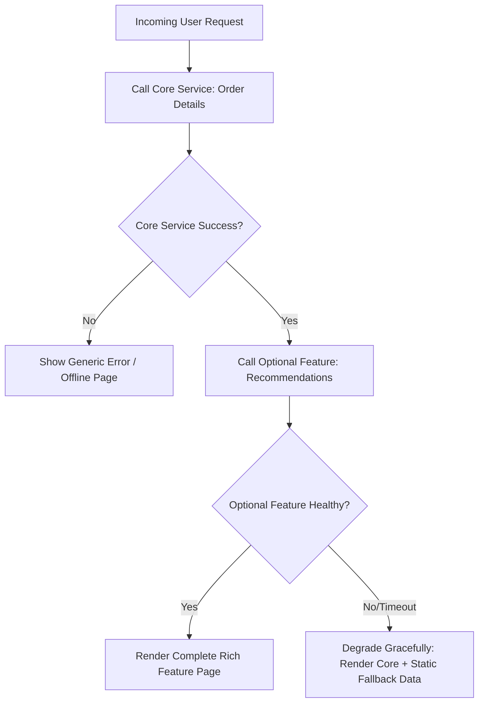

# Introduction

Modern distributed applications are built from dozens—or even hundreds—of independently deployable services. While this architecture provides greater scalability and development flexibility, it also introduces new challenges such as network failures, service outages, data consistency issues, and increased operational complexity.

In this guide, you'll explore **10 essential architectural patterns** that help engineers build resilient, scalable, and fault-tolerant microservice ecosystems. These patterns are widely adopted by organizations such as Netflix, Amazon, Uber, Microsoft, and Google to improve reliability and simplify communication between distributed services.

## What You Will Learn

### Fault Tolerance & Resilience
Learn how to keep systems available even when failures occur by implementing patterns such as:

- Retry
- Timeout
- Dead Letter Queue (DLQ)
- Queue-Based Load Leveling
- Graceful Degradation

### Service Coordination & Aggregation
Understand how distributed services communicate efficiently and expose unified APIs using:

- Service Discovery
- API Composition
- Scatter-Gather

### Event-Driven Data Management
Explore patterns that improve data consistency, auditing, and real-time data synchronization:

- Event Sourcing
- Change Data Capture (CDC)

so Let's start :)


## 1. Retry Pattern

## Overview

The **Retry Pattern** improves reliability by automatically retrying failed operations that are likely caused by temporary or transient failures. Instead of failing immediately, the system waits briefly and retries the request, increasing the chances of success without requiring user intervention.

- **When to Use:** Network I/O operations, database connection drops, or external API calls with temporary hiccups.

- **When to Avoid:** Non-transient errors like **401 Unauthorized**, **404 Not Found**, or invalid payload validation errors (**400 Bad Request**).



---

## Implementation Tradeoffs

| Pros / Advantages | Cons / Disadvantages |
|-------------------|----------------------|
| • Increases system resilience without user intervention. | • Can worsen outages if non-transient errors are retried aggressively. |
| • Absorbs temporary network glitches automatically. | • Increases latency for end-users when operations repeatedly fail before aborting. |


```python
import time
import random
from tenacity import retry, stop_after_attempt, wait_random_exponential, retry_if_exception_type

class TransientNetworkError(Exception):
    """Custom exception representing a momentary failure."""
    pass

# Retries up to 5 times with exponential backoff + jitter
@retry(
    retry=retry_if_exception_type(TransientNetworkError),
    stop=stop_after_attempt(5),
    wait=wait_random_exponential(multiplier=1, max=10)
)
def call_external_payment_gateway():
    print(f"[{time.strftime('%H:%M:%S')}] Attempting payment request...")
    # Simulate high failure rate for demonstration
    if random.random() < 0.7:
        raise TransientNetworkError("503 Service Unavailable: Temporary network spike")
    return {"status": "SUCCESS", "transaction_id": "tx_992184"}

# Usage
try:
    result = call_external_payment_gateway()
    print("Payment Succeeded:", result)
except Exception as e:
    print("All retry attempts failed:", e)

```


## 2. Timeout Pattern

## Overview

The **Timeout Pattern** prevents thread starvation and cascading failures across microservices by setting a hard maximum limit on how long a service will wait for a response from an external dependency. If the target service fails to respond within the designated window, the caller cancels the operation, frees bound resources, and proceeds with an error or fallback.

- **When to Use:** Every remote network call, database query, or third-party service invocation.

- **When to Avoid:** Asynchronous or batch background processing jobs (use polling, queues, or webhooks instead).



---

## Implementation Tradeoffs

| Pros / Advantages | Cons / Disadvantages |
|-------------------|----------------------|
| • Prevents resource exhaustion (thread/socket leaks). | • Setting limits too aggressively can cause false positives during minor network spikes. |
| • Protects upstream services from cascading latency spikes. | • Requires tuning per dependency based on p99 latency metrics. |


```javascript

import axios from 'axios';

async function fetchUserProfile(userId) {
  try {
    // Hard abort if downstream service takes longer than 1500ms
    const response = await axios.get(`https://api.internal/users/${userId}`, {
      timeout: 1500, // 1.5 seconds hard timeout
      headers: { 'Accept': 'application/json' }
    });
    return response.data;
  } catch (error) {
    if (error.code === 'ECONNABORTED') {
      console.error(`[TIMEOUT] Request to /users/${userId} timed out after 1500ms`);
      return { id: userId, name: "Guest User", fallback: true };
    }
    throw error;
  }
}

```

## 3. Dead Letter Queue (DLQ)
## Overview

A **Dead Letter Queue (DLQ)** is a specialized message queue used in asynchronous event-driven architectures to isolate messages that cannot be processed successfully after multiple retries. Instead of blocking the processing pipeline with **poison pill** messages or permanently dropping data, unprocessable messages are routed to a DLQ for manual inspection, debugging, and re-processing.

- **When to Use:** Asynchronous message processing (Kafka, RabbitMQ, Amazon SQS) where invalid schemas, unexpected payloads, or persistent bugs cause consumers to fail.

- **When to Avoid:** Real-time, synchronous REST or gRPC APIs.



---

## Implementation Tradeoffs

| Pros / Advantages | Cons / Disadvantages |
|-------------------|----------------------|
| • Prevents unprocessable ("poison pill") messages from blocking message streams. | • Requires operational overhead to monitor, analyze, and replay dead-lettered messages. |
| • Guarantees zero data loss for failed asynchronous tasks. | • Can mask underlying software bugs if proper alerting and monitoring are missing. |


```python
import json

def process_queue_message(message):
    MAX_ATTEMPTS = 3
    retry_count = message['attributes'].get('ApproximateReceiveCount', 1)
    
    try:
        payload = json.loads(message['body'])
        # Simulating business logic execution
        validate_and_save_order(payload)
        acknowledge_message(message['receipt_handle'])
        
    except (json.JSONDecodeError, KeyError, ValueError) as err:
        print(f"Malformed message payload: {err}")
        # Non-retryable error -> Move straight to DLQ
        send_to_dead_letter_queue(message, reason=str(err))
        acknowledge_message(message['receipt_handle'])
        
    except Exception as err:
        if retry_count >= MAX_ATTEMPTS:
            print(f"Message exceeded {MAX_ATTEMPTS} retries. Moving to DLQ.")
            send_to_dead_letter_queue(message, reason=str(err))
            acknowledge_message(message['receipt_handle'])
        else:
            # Requeue for retry with delay
            change_visibility_timeout(message['receipt_handle'], delay_seconds=10)


```

## 4. Service Discovery

## Overview

**Service Discovery** provides dynamic registry mechanisms that allow microservice instances to locate each other across network boundaries without hardcoding static IP addresses or port numbers. In elastic, cloud-native environments where containers scale up and down dynamically, services automatically register themselves when they start and deregister when they shut down.

- **Client-Side Discovery:** The client queries the **Service Registry** (e.g., Consul, Eureka) to retrieve available service instances and performs client-side load balancing.

- **Server-Side Discovery:** The client sends requests to a router or load balancer, which queries the registry and forwards the request to an available service instance (e.g., Kubernetes Services).



---
## Implementation Tradeoffs

| Pros / Advantages | Cons / Disadvantages |
|-------------------|----------------------|
| • Eliminates hardcoded IP management in dynamic container environments. | • The service registry becomes a critical single point of failure if not deployed with high availability. |
| • Integrates seamlessly with auto-scaling groups and service mesh architectures. | • Increases network hops or introduces client-side caching complexity. |


```python

package main

import (
	"fmt"
	"log"
	"github.com/hashicorp/consul/api"
)

func registerServiceWithConsul() {
	config := api.DefaultConfig()
	client, err := api.NewClient(config)
	if err != nil {
		log.Fatalf("Failed to connect to Consul: %v", err)
	}

	registration := &api.AgentServiceRegistration{
		ID:      "order-service-node-1",
		Name:    "order-service",
		Port:    8080,
		Address: "10.0.1.45",
		Check: &api.AgentServiceCheck{
			HTTP:     "http://10.0.1.45:8080/health",
			Interval: "10s",
			Timeout:  "2s",
		},
	}

	err = client.Agent().ServiceRegister(registration)
	if err != nil {
		log.Fatalf("Service registration failed: %v", err)
	}
	fmt.Println("Successfully registered order-service with Consul Registry.")
}

```

## 5. API Composition

## Overview

The **API Composition Pattern** solves the challenge of querying distributed data spread across multiple microservice databases. Instead of allowing client applications to directly call multiple backend services, an **API Composer** (or API Gateway / Aggregator) receives a single client request, invokes the required microservices in parallel, aggregates and transforms their responses, and returns a unified payload to the client.

- **When to Use:** Rendering complex frontend dashboards or unified views (e.g., Order Details combining User Info, Payment Status, and Shipping Details).

- **When to Avoid:** Aggregating massive datasets across hundreds of services. For large-scale joins, consider **CQRS** or dedicated **Read Views** instead.



---

## Implementation Tradeoffs

| Pros / Advantages | Cons / Disadvantages |
|-------------------|----------------------|
| • Reduces network round trips between client applications and backend services. | • Can suffer from high latency if downstream service calls are executed sequentially instead of in parallel. |
| • Hides backend microservice fragmentation behind a clean and unified API contract. | • Risk of increased memory usage at the aggregator layer when processing large payloads. |

```javascript
import express from 'express';
import axios from 'axios';

const app = express();

app.get('/api/v1/orders/:orderId/details', async (req, res) => {
  const { orderId } = req.params;

  try {
    const orderRes = await axios.get(`http://order-service/orders/${orderId}`);
    const order = orderRes.data;

    // Concurrently query dependent services in parallel
    const [userRes, paymentRes, shippingRes] = await Promise.all([
      axios.get(`http://user-service/users/${order.userId}`),
      axios.get(`http://payment-service/payments/${order.paymentId}`),
      axios.get(`http://shipping-service/shipments/${order.shippingId}`)
    ]);

    const aggregatedPayload = {
      orderId: order.id,
      created: order.createdAt,
      customer: { id: userRes.data.id, name: userRes.data.fullName },
      payment: { status: paymentRes.data.status, amount: paymentRes.data.total },
      shipping: { trackingNumber: shippingRes.data.trackingCode, status: shippingRes.data.deliveryStatus }
    };

    res.status(200).json(aggregatedPayload);
  } catch (error) {
    res.status(500).json({ error: "Failed to compose order details aggregate." });
  }
});

```

## 6. Event Sourcing

## Overview

**Event Sourcing** stores every change to an entity as an append-only sequence of immutable events instead of updating only its current state. For example, events such as **OrderCreated**, **ItemAdded**, **PaymentReceived**, and **OrderShipped** are persisted in order. The current state of an entity is reconstructed by replaying all historical events from the beginning.

- **Key Advantage:** Provides a complete, immutable audit trail, supports temporal queries (e.g., "What was the state at 2 PM yesterday?"), and helps eliminate concurrency update conflicts.

- **Trade-off:** Introduces eventual consistency, increases schema migration complexity, and often requires snapshot mechanisms for aggregates with long event histories.



---

## Implementation Tradeoffs

| Pros / Advantages | Cons / Disadvantages |
|-------------------|----------------------|
| • Provides a complete, immutable audit log out of the box. | • Has a steep learning curve and introduces eventual consistency challenges. |
| • Enables temporal queries, time-travel debugging, and state restoration. | • Requires snapshotting mechanisms to avoid slow state reconstruction for aggregates with long event histories. |


```python
import dataclasses
from typing import List
from datetime import datetime

@dataclasses.dataclass(frozen=True)
class Event:
    event_id: str
    aggregate_id: str
    event_type: str
    payload: dict
    timestamp: str = dataclasses.field(default_factory=lambda: datetime.utcnow().isoformat())

class BankAccountAggregate:
    def __init__(self, account_id: str):
        self.account_id = account_id
        self.balance = 0.0
        self.version = 0

    def apply(self, event: Event):
        """Replays events to rebuild aggregate state."""
        if event.event_type == "AccountOpened":
            self.balance = event.payload.get("initial_deposit", 0.0)
        elif event.event_type == "MoneyDeposited":
            self.balance += event.payload["amount"]
        elif event.event_type == "MoneyWithdrawn":
            self.balance -= event.payload["amount"]
        self.version += 1

event_stream = [
    Event("1", "acc-101", "AccountOpened", {"initial_deposit": 100.0}),
    Event("2", "acc-101", "MoneyDeposited", {"amount": 50.0}),
    Event("3", "acc-101", "MoneyWithdrawn", {"amount": 20.0}),
]

account = BankAccountAggregate("acc-101")
for evt in event_stream:
    account.apply(evt)

print(f"Derived Account State: Balance = ${account.balance}, Version = {account.version}")

```

## 7. Change Data Capture (CDC)

## Overview

**Change Data Capture (CDC)** captures row-level database changes—such as **INSERT**, **UPDATE**, and **DELETE** operations—directly from a database's transaction log (e.g., PostgreSQL WAL or MySQL Binlog) and streams them in near real time to downstream systems like message brokers, search indexes, or analytics platforms. This approach eliminates dual-write problems and removes the responsibility of publishing events from application code.

- **When to Use:** Synchronizing primary databases with Elasticsearch or Solr, populating data warehouses, cache invalidation, or triggering downstream microservice workflows without modifying legacy application code.

- **Key Tools:** Debezium, Kafka Connect, AWS Database Migration Service (DMS).


---

## Implementation Tradeoffs

| Pros / Advantages | Cons / Disadvantages |
|-------------------|----------------------|
| • Eliminates application-level dual writes and distributed transaction issues. | • Tightly couples streamed events to the underlying database schema. |
| • Adds virtually no overhead to application code execution. | • Requires specialized infrastructure such as Kafka Connect and Debezium to operate and maintain. |


```json
{
  "before": {
    "id": 1001,
    "email": "john@olddomain.com",
    "status": "PENDING"
  },
  "after": {
    "id": 1001,
    "email": "john@newdomain.com",
    "status": "VERIFIED"
  },
  "source": {
    "version": "2.4.0.Final",
    "connector": "postgresql",
    "name": "db_server_1",
    "ts_ms": 1721817600000,
    "db": "users_db",
    "schema": "public",
    "table": "users"
  },
  "op": "u",
  "ts_ms": 1721817600500
}

```
## 8. Scatter-Gather Pattern

## Overview

The **Scatter-Gather Pattern** distributes a request to multiple independent services or parallel workers simultaneously (**Scatter**) and then collects their asynchronous responses into a single aggregated result (**Gather**). To prevent slow or unresponsive services from delaying the entire request, the aggregator typically enforces a configurable timeout and can return partial results when necessary.

- **When to Use:** Aggregating flight or hotel prices from multiple providers, querying multiple search engines, or executing distributed parallel workloads.

- **When to Avoid:** Workflows that require strict transactional consistency or sequential execution where every step depends on the previous one.


---

## Implementation Tradeoffs

| Pros / Advantages | Cons / Disadvantages |
|-------------------|----------------------|
| • Maximizes performance by executing requests across multiple services in parallel. | • Can heavily increase network traffic and downstream service load during fan-out spikes. |
| • Improves resilience by returning partial results even if one or more services fail. | • Requires complex synchronization, timeout handling, and late-response management logic. |


```python
package main

import (
	"context"
	"fmt"
	"sync"
	"time"
)

type Quote struct {
	Provider string
	Price    float64
}

func fetchQuote(ctx context.Context, provider string, delay time.Duration, price float64, ch chan<- Quote, wg *sync.WaitGroup) {
	defer wg.Done()
	select {
	case <-time.After(delay):
		ch <- Quote{Provider: provider, Price: price}
	case <-ctx.Done():
		return
	}
}

func main() {
	ctx, cancel := context.WithTimeout(context.Background(), 200*time.Millisecond)
	defer cancel()

	providers := []struct {
		name  string
		delay time.Duration
		price float64
	}{
		{"Provider A", 100 * time.Millisecond, 250.0},
		{"Provider B", 150 * time.Millisecond, 230.0},
		{"Provider C (Slow)", 350 * time.Millisecond, 190.0}, // Times out
	}

	ch := make(chan Quote, len(providers))
	var wg sync.WaitGroup

	// SCATTER: Launch goroutines in parallel
	for _, p := range providers {
		wg.Add(1)
		go fetchQuote(ctx, p.name, p.delay, p.price, ch, &wg)
	}

	go func() {
		wg.Wait()
		close(ch)
	}()

	// GATHER: Collect responses until deadline
	var collected []Quote
	for quote := range ch {
		collected = append(collected, quote)
	}

	fmt.Printf("Gathered %d valid quotes before timeout:\n", len(collected))
	for _, q := range collected {
		fmt.Printf("- %s: $%.2f\n", q.Provider, q.Price)
	}
}

```

## 9. Queue-Based Load Leveling

## Overview

The **Queue-Based Load Leveling Pattern** uses a message queue as a buffer between producers that generate work and consumers that process it. By decoupling request generation from processing speed, the system absorbs unpredictable traffic spikes and allows backend services to process tasks at a steady, sustainable rate, preventing databases and services from being overwhelmed during peak loads.

- **When to Use:** E-commerce flash sales, log processing pipelines, document rendering systems, or third-party webhook ingestion.

- **Trade-off:** Introduces asynchronous processing delays, meaning callers do not receive immediate processing results as they would with synchronous APIs.



---

## Implementation Tradeoffs

| Pros / Advantages | Cons / Disadvantages |
|-------------------|----------------------|
| • Protects backend services and databases from sudden traffic bursts and CPU spikes. | • Breaks synchronous HTTP/REST request-response workflows, requiring asynchronous result handling. |
| • Improves infrastructure cost efficiency by sizing workers for average load instead of peak demand. | • Queue backlogs can introduce noticeable processing latency during heavy traffic. |


```python
import time
import queue
import threading

work_buffer = queue.Queue(maxsize=1000)

def producer_traffic_spike():
    """Simulates a sudden flash spike of incoming user actions."""
    for i in range(1, 10):
        print(f"[PRODUCER] Burst incoming request #{i}")
        work_buffer.put(f"Task_{i}")
        time.sleep(0.05)

def consumer_worker():
    """Worker processes messages at a controlled, constant rate."""
    while True:
        try:
            task = work_buffer.get(timeout=2)
            print(f"  [CONSUMER WORKER] Processing {task} at controlled speed...")
            time.sleep(0.3)
            work_buffer.task_done()
        except queue.Empty:
            break

worker_thread = threading.Thread(target=consumer_worker, daemon=True)
worker_thread.start()

producer_traffic_spike()
work_buffer.join()
print("All buffered requests smoothed and processed successfully.")

```

## 10. Graceful Degradation

## Overview

The **Graceful Degradation Pattern** ensures that when non-critical components or downstream dependencies fail, the application remains operational by disabling or simplifying non-essential features instead of failing completely. Rather than sacrificing core business functionality, the system continues serving users with reduced capabilities until the dependency recovers.

- **Examples:**
  - **E-commerce:** If the personalized recommendations service is unavailable, display generic **Top Sellers** instead of breaking the checkout experience.
  - **Streaming:** If network bandwidth decreases, automatically lower the video quality instead of buffering indefinitely.




---

## Implementation Tradeoffs

| Pros / Advantages | Cons / Disadvantages |
|-------------------|----------------------|
| • Maximizes application availability and customer satisfaction during partial outages. | • Requires carefully designed fallback UX/UI flows and additional testing for degraded states. |
| • Prevents failures in non-critical components from bringing down the entire platform. | • Cached or static fallback content may temporarily confuse users if it becomes outdated. |

```javascript
async function renderProductPage(productId) {
  let productCore = null;
  try {
    productCore = await fetchProductDetails(productId);
  } catch (error) {
    return renderFatalErrorPage("Product currently unavailable.");
  }

  // Non-essential feature with graceful fallback
  let recommendations = [];
  try {
    recommendations = await fetchAIRecommendations(productCore.userId, { timeout: 400 });
  } catch (error) {
    console.warn("Recommendations unreachable. Degrading gracefully to defaults.");
    recommendations = [
      { id: "def_1", title: "Popular Item A" },
      { id: "def_2", title: "Popular Item B" }
    ];
  }

  return {
    title: productCore.title,
    price: productCore.price,
    inventory: productCore.inStock,
    recommendedSection: recommendations
  };
}

```


