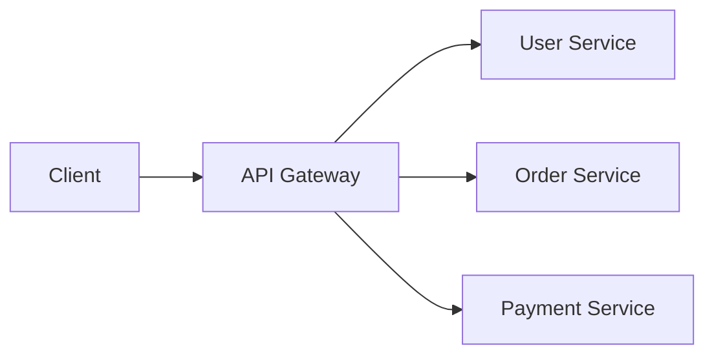
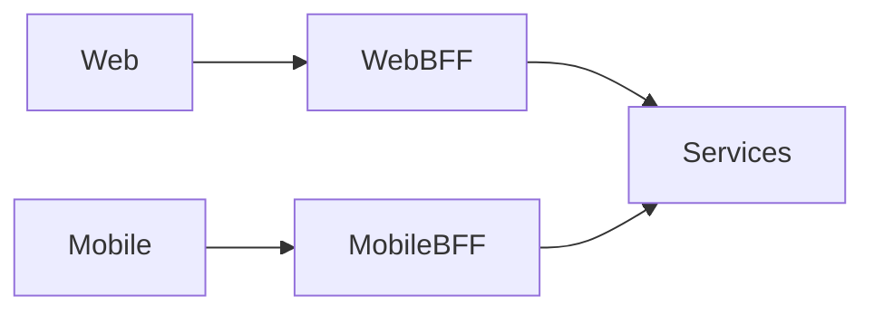
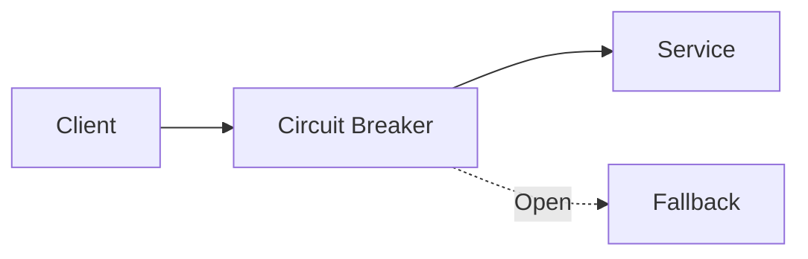
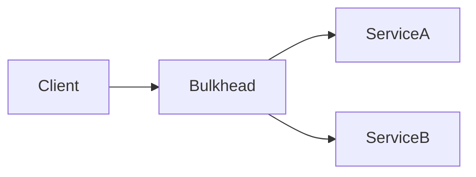
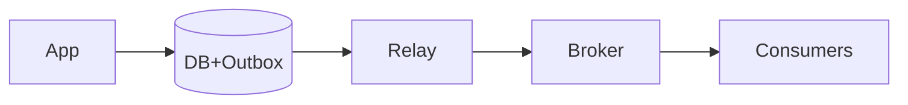
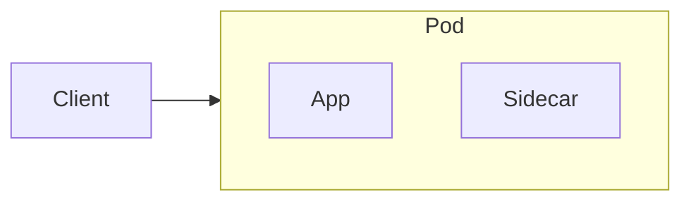
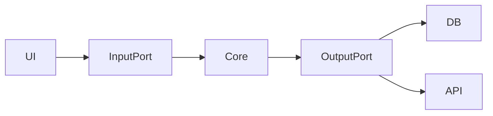

# 7 Modern Advance Backend Architecture Patterns

# 1. API Gateway Pattern

## 1. Overview

The API Gateway Pattern acts as a single entry point for all client requests in a microservices architecture. Instead of clients communicating directly with multiple backend services, every request first passes through the API Gateway. The gateway is responsible for routing requests, authentication, authorization, rate limiting, caching, logging, monitoring, request/response transformation, and load balancing. This simplifies client applications because they only need to communicate with one endpoint. It also centralizes cross-cutting concerns, making backend services smaller and focused only on business logic. API Gateway is widely used in systems built with microservices where dozens or even hundreds of services need to be exposed securely and efficiently to web, mobile, and third-party applications.
## 2. Architecture

## 3. Best Use Cases
- Microservices
- Public APIs
- Mobile/Web apps
- SaaS Platforms

## 4. Advantages
- Single entry point
- Improved security
- Simpler clients
- Centralized policies

## 5. Best Practices
- Keep gateway stateless
- Use JWT/OAuth
- Implement rate limiting
- Avoid business logic
- Enable tracing & metrics

---

# 2. Backend for Frontend (BFF) Pattern

## 1. Overview

The Backend for Frontend (BFF) pattern creates a dedicated backend service for each frontend application, such as web, mobile, or partner portals. Instead of using one generic API for every client, each frontend communicates with its own BFF that aggregates data from multiple backend services and returns only the information required by that specific client. This reduces over-fetching and under-fetching while improving performance and user experience. Each BFF can implement its own authentication, caching, and response structure without affecting other clients. The pattern allows frontend teams to evolve independently from backend teams and is commonly used by companies like Netflix and Spotify to optimize APIs for different platforms.
## 2. Architecture

## 3. Best Use Cases
- Multi-platform apps
- Mobile APIs
- Partner portals
- Super apps

## 4. Advantages
- Optimized responses
- Independent frontend teams
- Reduced API calls

## 5. Best Practices
- Keep BFF thin
- Aggregate only when needed
- Cache read-heavy APIs
- Own BFF per frontend team

---

# 3. Circuit Breaker Pattern

## 1. Overview

The Circuit Breaker Pattern prevents cascading failures in distributed systems by temporarily stopping requests to unhealthy services. When a downstream service starts failing repeatedly, the circuit breaker "opens" and immediately rejects incoming requests instead of continuously retrying them. After a configurable timeout, it enters a half-open state to test whether the service has recovered. If successful, it closes and resumes normal traffic. This approach prevents thread exhaustion, reduces latency, and protects the overall system from failure propagation. Circuit breakers are commonly implemented using libraries such as Resilience4j, Hystrix, or Polly and are considered essential for building resilient microservices and cloud-native applications.
## 2. Architecture

## 3. Best Use Cases
- External APIs
- Microservices
- Payment systems

## 4. Advantages
- Improves resilience
- Prevents cascading failures
- Fast failure detection

## 5. Best Practices
- Configure timeouts
- Use fallback responses
- Monitor failure rates
- Tune thresholds

---

# 4. Bulkhead Pattern

## 1. Overview

The Bulkhead Pattern isolates critical resources so that failures in one part of the system do not impact others. Inspired by ship bulkheads that prevent flooding from spreading, this pattern separates thread pools, connection pools, queues, or compute resources for different services or workloads. If one service becomes overloaded or crashes, only its allocated resources are affected while the remaining services continue operating normally. This greatly improves fault tolerance, stability, and system availability during unexpected traffic spikes or failures. Bulkhead is often combined with Circuit Breaker and Rate Limiting to build highly resilient distributed systems capable of handling failures gracefully without affecting unrelated business functions.
## 2. Architecture

## 3. Best Use Cases
- High-traffic systems
- Critical workloads
- Cloud services

## 4. Advantages
- Fault isolation
- Better stability
- Independent resource allocation

## 5. Best Practices
- Separate pools
- Monitor utilization
- Combine with circuit breaker

---

# 5. Outbox Pattern (Transactional Outbox)

## 1. Overview

The Outbox Pattern ensures reliable event publishing by storing business data and outgoing events within the same database transaction. Instead of publishing messages directly to Kafka or RabbitMQ after updating the database, the application writes the event into an Outbox table atomically. A background worker continuously reads unpublished events from the Outbox table and sends them to the message broker. Once successfully delivered, the event is marked as published or removed. This eliminates the risk of database updates succeeding while message publishing fails, ensuring eventual consistency across distributed systems. The Outbox Pattern is widely used in event-driven architectures and microservices where reliable communication is critical.
## 2. Architecture

## 3. Best Use Cases
- Event-driven systems
- Reliable messaging
- Microservices

## 4. Advantages
- No lost events
- Reliable delivery
- Eventual consistency

## 5. Best Practices
- Use idempotent consumers
- Retry safely
- Clean old outbox records

---

# 6. Sidecar Pattern

## 1. Overview

The Sidecar Pattern deploys an additional helper container or process alongside the main application. Instead of embedding cross-cutting concerns directly into business logic, responsibilities like logging, monitoring, service discovery, security, configuration management, traffic routing, and metrics collection are handled by the sidecar. Both containers run within the same pod or host and communicate locally, allowing the application to remain clean and focused on business functionality. Because sidecars can be updated independently, operational features evolve without modifying application code. This pattern is heavily used in Kubernetes and service meshes such as Istio and Linkerd to provide observability, security, and networking capabilities across distributed applications.
## 2. Architecture

## 3. Best Use Cases
- Kubernetes
- Service Mesh
- Observability

## 4. Advantages
- Separation of concerns
- Reusable infrastructure
- Independent updates

## 5. Best Practices
- Keep app logic separate
- Monitor sidecars
- Limit resource usage

---

# 7. Hexagonal Architecture (Ports & Adapters)

## 1. Overview

Hexagonal Architecture, also known as Ports and Adapters, separates business logic from external systems such as databases, APIs, user interfaces, and messaging platforms. The application's core contains only domain logic and communicates with the outside world through abstract interfaces called ports. External components implement these interfaces as adapters, making it easy to replace technologies without changing core business logic. This architecture improves maintainability, testability, and flexibility because dependencies always point inward toward the domain. Developers can switch databases, messaging systems, or frameworks with minimal impact on business rules. Hexagonal Architecture is widely adopted in enterprise applications, Domain-Driven Design (DDD), and modern clean architecture implementations.
## 2. Architecture

## 3. Best Use Cases
- Enterprise apps
- DDD
- Clean Architecture

## 4. Advantages
- Highly testable
- Framework independent
- Maintainable

## 5. Best Practices
- Keep domain pure
- Depend on interfaces
- Inject adapters

