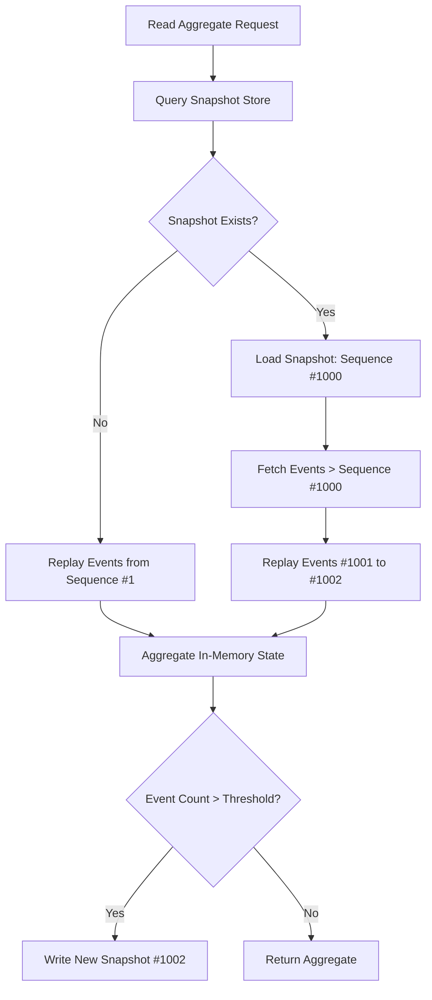
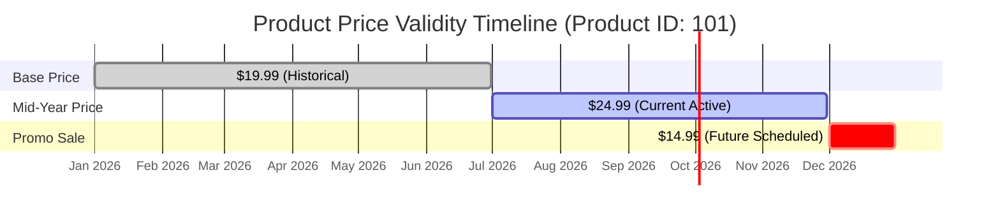
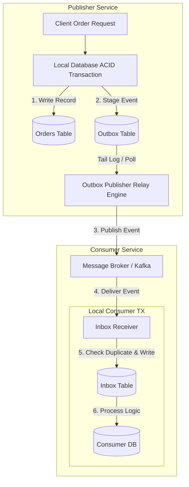
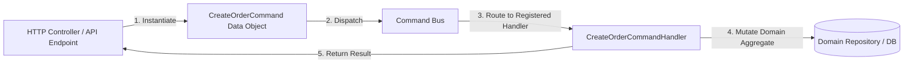
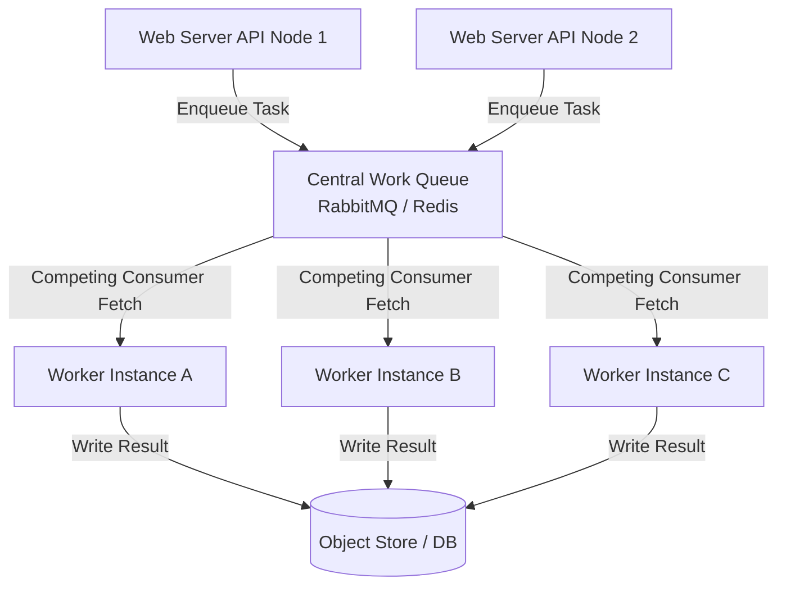
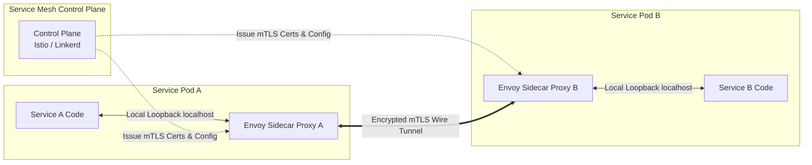

# 1. Snapshot Pattern

## Overview

The **Snapshot Pattern** is an optimization technique commonly used in **Event Sourcing** to improve aggregate loading performance. Instead of rebuilding an aggregate by replaying every event from the beginning of its event stream, the application periodically captures the aggregate's current state and stores it as a **snapshot**.

When the aggregate is loaded, the system first retrieves the latest snapshot and then replays only the events that occurred after the snapshot's sequence number or timestamp. This significantly reduces the number of events that need to be processed, resulting in faster startup times, lower CPU usage, and reduced I/O overhead.

Snapshots do not replace the event stream—they simply act as checkpoints that accelerate aggregate rehydration while preserving the complete event history.

---

## Snapshot Workflow

A typical snapshot lifecycle consists of the following steps:

1. Commands generate events that are appended to the event store.
2. The aggregate state is rebuilt by applying events.
3. After a configured number of events (or time interval), a snapshot is created.
4. The snapshot stores the aggregate's current state along with its event sequence number.
5. When the aggregate is loaded again, the latest snapshot is retrieved.
6. Only events created after the snapshot are replayed.
7. The aggregate is fully restored with significantly fewer events to process.

---

## When to Use

The Snapshot Pattern is ideal for event-sourced aggregates that accumulate a large number of events over time.

Typical use cases include:

- Bank accounts
- Shopping carts
- Inventory management
- Order processing
- Gaming state management
- Financial ledgers
- IoT device state
- Workflow engines
- User profiles
- Long-running business processes

---

## When to Avoid

Snapshots may not provide meaningful benefits when:

- Aggregates have very few lifetime events.
- Event replay completes within a few milliseconds.
- Aggregate state changes infrequently.
- Simplicity is preferred over optimization.
- Storage overhead outweighs performance gains.




---

## Implementation Tradeoffs

| Pros / Advantages | Cons / Disadvantages |
|-------------------|----------------------|
| Dramatically reduces aggregate load time by replaying only recent events instead of the entire event stream. | Introduces additional complexity for snapshot creation, storage, and lifecycle management. |
| Reduces CPU usage and I/O pressure during aggregate rehydration. | Snapshots consume extra storage and require periodic maintenance. |
| Improves application startup and request latency. | Snapshot frequency must be carefully tuned to balance performance and storage. |
| Enables efficient loading of long-lived aggregates with thousands of events. | Corrupted or outdated snapshots require rebuilding the aggregate from the full event stream. |
| Works seamlessly with Event Sourcing while preserving complete event history. | Snapshot versioning must be handled when aggregate schemas evolve. |

---

## Common Technologies

- EventStoreDB
- Axon Framework
- Kafka
- Apache Pulsar
- Akka Persistence
- Marten
- NEventStore
- PostgreSQL
- MongoDB
- Redis

---

## Common Use Cases

- Event Sourcing
- CQRS architectures
- Financial systems
- Banking applications
- E-commerce platforms
- Gaming backends
- Workflow engines
- Inventory management
- Order management
- Audit and compliance systems


## Code Example

```python

import dataclasses
from typing import List, Optional
from datetime import datetime

@dataclasses.dataclass(frozen=True)
class Event:
    sequence_nr: int
    event_type: str
    payload: dict

@dataclasses.dataclass
class Snapshot:
    last_sequence_nr: int
    state: dict
    timestamp: str = dataclasses.field(default_factory=lambda: datetime.utcnow().isoformat())

class AccountAggregate:
    def __init__(self, account_id: str):
        self.account_id = account_id
        self.balance = 0.0
        self.sequence_nr = 0

    def apply(self, event: Event):
        if event.event_type == "MoneyDeposited":
            self.balance += event.payload["amount"]
        elif event.event_type == "MoneyWithdrawn":
            self.balance -= event.payload["amount"]
        self.sequence_nr = event.sequence_nr

    def load_from_snapshot(self, snapshot: Snapshot):
        self.balance = snapshot.state["balance"]
        self.sequence_nr = snapshot.last_sequence_nr

    def create_snapshot(self) -> Snapshot:
        return Snapshot(
            last_sequence_nr=self.sequence_nr,
            state={"balance": self.balance}
        )

# Example Rehydration Execution Flow
def rehydrate_account(account_id: str, snapshot: Optional[Snapshot], pending_events: List[Event]) -> AccountAggregate:
    acc = AccountAggregate(account_id)
    
    # Step 1: Restore base state from snapshot if available
    if snapshot:
        acc.load_from_snapshot(snapshot)
        print(f"Loaded snapshot at sequence {snapshot.last_sequence_nr}. Balance = ${acc.balance}")

    # Step 2: Replay only subsequent events
    for evt in pending_events:
        if evt.sequence_nr > acc.sequence_nr:
            acc.apply(evt)
            print(f"Replayed event {evt.sequence_nr} ({evt.event_type}). Balance = ${acc.balance}")
            
    return acc

# Simulated Run
saved_snapshot = Snapshot(last_sequence_nr=1000, state={"balance": 1500.0})
new_events = [
    Event(sequence_nr=1001, event_type="MoneyDeposited", payload={"amount": 200.0}),
    Event(sequence_nr=1002, event_type="MoneyWithdrawn", payload={"amount": 50.0}),
]

account = rehydrate_account("acc-992", saved_snapshot, new_events)

```


# 2. Temporal Data Pattern

## Overview

The **Temporal Data Pattern** is a database design pattern that preserves the complete history of data by storing records with associated time periods instead of overwriting existing values. Each record contains timestamps that define when it is valid, enabling applications to query historical, current, or future states of the data.

Unlike traditional audit logs, temporal data supports **point-in-time queries**, allowing applications to answer questions such as *"What was the customer's address on January 1st?"* or *"What will the product price be next month?"* This makes it ideal for systems that require historical accuracy, compliance, and future scheduling.

Temporal databases commonly support two time dimensions:

- **Valid Time** – The period during which a fact is true in the real world.
- **Transaction Time** – The period during which the database stores that fact.

When both dimensions are maintained, the model is known as **Bitemporal Data**, providing a complete historical record of both business events and database changes.

---

## Temporal Data Workflow

A typical temporal data lifecycle consists of the following steps:

1. A new record is created with `valid_from` and `valid_to`.
2. Instead of updating the record, a new version is inserted.
3. The previous version's `valid_to` is updated.
4. Historical versions remain unchanged.
5. Queries can retrieve the current, historical, or future state.
6. Reports and audits use point-in-time queries for accurate historical analysis.

---

## When to Use

The Temporal Data Pattern is ideal when historical accuracy and time-based querying are business requirements.

Typical use cases include:

- Financial systems
- Banking applications
- Healthcare records
- Insurance policies
- HR systems
- Pricing history
- Contract management
- Inventory tracking
- Compliance reporting
- Government record systems

---

## When to Avoid

Temporal data may not be necessary when:

- Historical data is never queried.
- Records change infrequently.
- Simplicity is more important than historical tracking.
- Storage costs outweigh the benefits.
- Standard audit logging is sufficient.



---

## Implementation Tradeoffs

| Pros / Advantages | Cons / Disadvantages |
|-------------------|----------------------|
| Enables accurate point-in-time queries for auditing and reporting. | Query logic becomes more complex due to time-range filtering and joins. |
| Supports future-effective changes without scheduled background jobs. | Database size grows continuously as new versions are added. |
| Preserves complete historical records without overwriting data. | Indexing and optimization require additional planning. |
| Simplifies compliance with regulatory and audit requirements. | Maintaining temporal constraints increases implementation complexity. |
| Allows historical analysis, forecasting, and trend reporting. | Updates create additional rows instead of modifying existing records. |

---

## Common Technologies

- PostgreSQL
- SQL Server (System-Versioned Tables)
- Oracle Database
- IBM Db2
- MariaDB
- Hibernate Envers
- EventStoreDB
- MongoDB
- CockroachDB
- Apache Iceberg

---

## Common Use Cases

- Bitemporal databases
- Audit and compliance systems
- Financial ledgers
- Price history tracking
- Insurance policy management
- Healthcare records
- Contract lifecycle management
- Employee history tracking
- Inventory history
- Regulatory reporting


## SQL Code Example

```sql
-- PostgreSQL Schema for Temporal Pricing
CREATE TABLE product_prices (
    price_id SERIAL PRIMARY KEY,
    product_id INT NOT NULL,
    price_cents INT NOT NULL,
    -- Valid Time range defining when this price applies in real life
    valid_from TIMESTAMP WITH TIME ZONE NOT NULL,
    valid_to TIMESTAMP WITH TIME ZONE DEFAULT '9999-12-31 23:59:59+00',
    -- Transaction Time recording when this row was written
    created_at TIMESTAMP WITH TIME ZONE DEFAULT CURRENT_TIMESTAMP
);

-- Insert historical, current, and future scheduled price changes
INSERT INTO product_prices (product_id, price_cents, valid_from, valid_to) VALUES
(101, 1999, '2026-01-01 00:00:00+00', '2026-06-30 23:59:59+00'),
(101, 2499, '2026-07-01 00:00:00+00', '2026-11-30 23:59:59+00'),
(101, 1499, '2026-12-01 00:00:00+00', '2026-12-31 23:59:59+00'); -- Holiday Sale

-- Querying historical price active on July 15th, 2026
SELECT product_id, price_cents / 100.0 AS price_usd
FROM product_prices
WHERE product_id = 101
  AND '2026-07-15 12:00:00+00' BETWEEN valid_from AND valid_to;

```


# 3. Inbox–Outbox Pattern

## Overview

The **Inbox–Outbox Pattern** is a reliability pattern that ensures **data consistency** between a database and a message broker without relying on distributed transactions such as **Two-Phase Commit (2PC)**. It solves the **dual-write problem**, where updating a database and publishing an event separately can lead to inconsistent system state if one operation succeeds while the other fails.

The **Outbox Pattern** guarantees reliable event publishing by storing outgoing events in an **Outbox table** within the same ACID transaction as the business data. A background relay process, Change Data Capture (CDC), or polling service later publishes these events to a message broker such as Kafka or RabbitMQ.

The **Inbox Pattern** complements this by ensuring consumers process each incoming event exactly once. Every received event is first recorded in an **Inbox table**, allowing duplicate events to be detected and ignored before executing business logic.

Together, the Inbox and Outbox patterns provide reliable event delivery, eventual consistency, and fault tolerance for distributed microservice architectures.

---

## Workflow

A typical Inbox–Outbox flow consists of the following steps:

1. A business transaction updates the local database.
2. The same transaction writes an event to the Outbox table.
3. The transaction commits successfully.
4. A relay service reads unpublished Outbox events.
5. Events are published to the message broker.
6. Consumers receive the event.
7. Each consumer stores the event in its Inbox table.
8. Duplicate events are ignored before executing business logic.

---

## When to Use

The Inbox–Outbox Pattern is ideal for systems that require reliable event delivery and data consistency.

Typical use cases include:

- Event-driven architectures
- Microservices
- CQRS systems
- Saga orchestration
- Order processing
- Payment systems
- Inventory management
- Financial transactions
- Notification services
- Distributed workflows

---

## When to Avoid

The pattern may be unnecessary when:

- The application is a monolith.
- No message broker is involved.
- Event delivery guarantees are not critical.
- Simple CRUD applications are sufficient.
- Distributed consistency is not a requirement.


---

## Implementation Tradeoffs

| Pros / Advantages | Cons / Disadvantages |
|-------------------|----------------------|
| Eliminates data loss caused by partial database and message broker writes. | Event publication is eventually consistent rather than immediate. |
| Guarantees reliable event delivery without Two-Phase Commit (2PC). | Requires additional relay services or CDC infrastructure. |
| Supports exactly-once processing through Inbox deduplication. | More database tables and background processes must be maintained. |
| Decouples business transactions from asynchronous messaging. | Monitoring failed event publishing adds operational complexity. |
| Improves reliability and fault tolerance in distributed systems. | Relay failures require retry and recovery mechanisms. |

---

## Common Technologies

- Apache Kafka
- RabbitMQ
- Debezium
- EventStoreDB
- PostgreSQL
- MySQL
- SQL Server
- MongoDB
- Spring Boot
- MassTransit

---

## Common Use Cases

- Microservices communication
- Event-driven systems
- CQRS architectures
- Saga Pattern
- Order management
- Payment processing
- Inventory synchronization
- Notification systems
- Workflow orchestration
- Distributed transactions


## Code Example

```python

from sqlalchemy.orm import Session
from sqlalchemy import Column, String, Text, Boolean, DateTime
from datetime import datetime
import json
import uuid

# Models
class Order:
    # Order database table model...
    pass

class OutboxMessage:
    __tablename__ = 'outbox'
    id = Column(String, primary_key=True, default=lambda: str(uuid.uuid4()))
    aggregate_type = Column(String, nullable=False)
    aggregate_id = Column(String, nullable=False)
    event_type = Column(String, nullable=False)
    payload = Column(Text, nullable=False)
    processed = Column(Boolean, default=False)
    created_at = Column(DateTime, default=datetime.utcnow)

def create_order_transactional(session: Session, user_id: str, amount: float):
    order_id = str(uuid.uuid4())
    
    # 1. Mutate Domain Entity
    new_order = Order(id=order_id, user_id=user_id, amount=amount)
    session.add(new_order)
    
    # 2. Stage Outbox Event in the SAME ACID Transaction
    event_payload = json.dumps({"order_id": order_id, "user_id": user_id, "amount": amount})
    outbox_entry = OutboxMessage(
        aggregate_type="Order",
        aggregate_id=order_id,
        event_type="OrderCreated",
        payload=event_payload
    )
    session.add(outbox_entry)
    
    # Atomic Commit: Both order and event record are saved together or neither is saved
    session.commit()
    print(f"[ACID SUCCESS] Order {order_id} and Outbox Event staged atomically.")

```

# 4. Command Pattern (Backend)

## Overview

The **Command Pattern** is a behavioral design pattern that encapsulates a request or state-changing operation into a dedicated **Command object**. Rather than executing business logic directly, the application packages all information required to perform an action into a command, which is then handled by a specialized **Command Handler**.

In modern backend systems, particularly those following **CQRS (Command Query Responsibility Segregation)**, commands represent user intent, such as `CreateOrderCommand`, `UpdateProfileCommand`, or `CancelSubscriptionCommand`. Each command is responsible only for describing *what* should happen, while the handler contains the business logic that performs the operation.

This separation improves maintainability, testability, and scalability by decoupling request handling from business execution. Commands can also be validated, logged, queued, retried, audited, or executed asynchronously without changing the core business logic.

---

## Command Workflow

A typical command execution flow consists of the following steps:

1. A client sends a request.
2. The controller creates a Command object.
3. The command is validated.
4. A Command Bus or Dispatcher routes it to the appropriate Command Handler.
5. The handler executes the business logic.
6. Data is persisted to the database.
7. Optional events are published for downstream services.
8. A response is returned to the client.

---

## When to Use

The Command Pattern is ideal for applications that separate request handling from business execution.

Typical use cases include:

- CQRS architectures
- Task scheduling
- Background job processing
- Event-driven systems
- Workflow engines
- Undo/Redo functionality
- Payment processing
- Order management
- Approval workflows
- Asynchronous operations

---

## When to Avoid

The pattern may be unnecessary when:

- Applications contain only simple CRUD operations.
- Business logic is minimal.
- Commands add unnecessary abstraction.
- Small projects prioritize simplicity over extensibility.
- Request handling and execution are tightly coupled.


---

## Implementation Tradeoffs

| Pros / Advantages | Cons / Disadvantages |
|-------------------|----------------------|
| Decouples request creation from request execution. | Introduces additional classes and boilerplate code. |
| Improves maintainability through dedicated command handlers. | Requires command routing or dispatcher infrastructure. |
| Simplifies validation, logging, auditing, and authorization pipelines. | Can increase project complexity for small applications. |
| Supports asynchronous execution and background processing. | Debugging command flow may require tracing multiple components. |
| Makes business logic easier to test and extend. | More files and abstractions increase the learning curve. |

---

## Common Technologies

- MediatR
- Axon Framework
- NestJS CQRS
- Spring Boot
- MassTransit
- RabbitMQ
- Apache Kafka
- Hangfire
- Celery
- Temporal

---

## Common Use Cases

- CQRS implementations
- Order processing
- Payment workflows
- Background jobs
- Task scheduling
- Workflow automation
- Approval systems
- Inventory management
- Event-driven microservices
- Undo/Redo operations

```javascript

// Command Interface representing user intent
interface Command<TResult> {
  readonly kind: string;
}

// Concrete Command Data Object
class CreateOrderCommand implements Command<string> {
  readonly kind = "CreateOrderCommand";
  constructor(
    public readonly customerId: string,
    public readonly items: string[],
    public readonly totalAmount: number
  ) {}
}

// Command Handler Responsible for Execution
interface CommandHandler<TCommand extends Command<any>, TResult> {
  handle(command: TCommand): Promise<TResult>;
}

class CreateOrderHandler implements CommandHandler<CreateOrderCommand, string> {
  async handle(command: CreateOrderCommand): Promise<string> {
    console.log(`[HANDLING COMMAND] Creating order for ${command.customerId}...`);
    // Business logic, repository writes, and event emissions occur here
    const generatedOrderId = `ord_${Math.floor(Math.random() * 100000)}`;
    return generatedOrderId;
  }
}

// Simple Command Bus Dispatcher
class CommandBus {
  private handlers = new Map<string, CommandHandler<any, any>>();

  register<T extends Command<any>, R>(kind: string, handler: CommandHandler<T, R>) {
    self = this;
    this.handlers.set(kind, handler);
  }

  async execute<R>(command: Command<R>): Promise<R> {
    const handler = this.handlers.get(command.kind);
    if (!handler) {
      throw new Error(`No handler registered for command: ${command.kind}`);
    }
    return handler.handle(command);
  }
}

// Usage
const bus = new CommandBus();
bus.register("CreateOrderCommand", new CreateOrderHandler());

const cmd = new CreateOrderCommand("cust_8831", ["laptop", "mouse"], 1299.99);
bus.execute(cmd).then(orderId => console.log("Created Order ID:", orderId));

```

# 5. Backpressure Pattern

## Overview

The **Backpressure Pattern** is a flow-control mechanism used in asynchronous and distributed systems to prevent fast producers from overwhelming slower consumers. Instead of allowing requests, messages, or events to accumulate indefinitely, backpressure enables consumers to communicate their processing capacity so producers can slow down, pause, buffer, or shed excess load.

Without backpressure, incoming data may fill queues, exhaust memory, increase latency, and eventually cause service failures or **Out-of-Memory (OOM)** crashes. By regulating the flow of data, backpressure keeps systems stable under heavy traffic while ensuring resources are used efficiently.

Backpressure is a fundamental concept in **Reactive Streams**, stream processing platforms, and message-driven architectures where producers and consumers operate at different speeds.

---

## Backpressure Mechanisms

### 1. Reactive Streams (Pull-Based Flow Control)

Consumers explicitly control how much data they can process by requesting a fixed number of items using mechanisms such as `request(n)`.

This prevents producers from sending more data than consumers can safely handle.

---

### 2. Buffer Saturation & Load Shedding

When internal queues reach their capacity, the system applies strategies such as:

- Tail dropping
- Message prioritization
- Rate limiting
- Request rejection
- Load shedding

These mechanisms prevent resource exhaustion while maintaining system stability.

---

## When to Use

The Backpressure Pattern is ideal for systems with asynchronous communication and varying processing speeds.

Typical use cases include:

- Reactive applications
- Event streaming platforms
- Kafka consumers
- RabbitMQ consumers
- Message queues
- API gateways
- Real-time analytics
- IoT platforms
- Data pipelines
- High-throughput microservices

---

## When to Avoid

Backpressure may not be necessary when:

- Workloads are small and predictable.
- Producers and consumers operate at similar speeds.
- Applications are synchronous.
- Traffic volume is consistently low.
- Simple rate limiting is sufficient.

  ```mermaid

  sequenceDiagram
    autonumber
    participant Producer as Fast Producer
    participant Buffer as Consumer Buffer
    participant Consumer as Slow Consumer Worker

    Producer->>Buffer: Push Data Chunk 1
    Producer->>Buffer: Push Data Chunk 2
    Producer->>Buffer: Push Data Chunk 3
    
    Note over Buffer: Buffer Max Threshold Reached (100% Capacity)
    Buffer-->>Producer: Signal: STOP / PAUSE (Backpressure Triggered)
    
    Consumer->>Buffer: Drain & Process Chunk 1
    Consumer->>Buffer: Drain & Process Chunk 2
    
    Note over Buffer: Buffer Space Available (< 50% Capacity)
    Buffer-->>Producer: Signal: DRAIN / RESUME
    Producer->>Buffer: Push Data Chunk 4


  ```

---

## Implementation Tradeoffs

| Pros / Advantages | Cons / Disadvantages |
|-------------------|----------------------|
| Prevents Out-of-Memory (OOM) crashes during traffic spikes. | Producers must support throttling, buffering, or dropping strategies. |
| Maintains system stability under heavy load. | May increase request latency during sustained traffic. |
| Protects downstream services from overload. | Some requests or messages may be delayed or rejected. |
| Improves resource utilization and overall reliability. | Flow-control logic adds implementation complexity. |
| Enables predictable processing rates in distributed systems. | Requires careful tuning of queue sizes and buffering policies. |

---

## Common Technologies

- Reactive Streams
- Project Reactor
- RxJava
- Apache Kafka
- RabbitMQ
- Apache Pulsar
- Akka Streams
- gRPC
- Envoy Proxy
- Kubernetes

---

## Common Use Cases

- Event-driven architectures
- Streaming platforms
- Message queue consumers
- API rate control
- Real-time analytics
- IoT data processing
- Log processing pipelines
- Video streaming
- High-throughput microservices
- Distributed systems

## Code Example

```javascript

import fs from 'fs';
import http from 'http';

// HTTP Server serving a large file stream with built-in Backpressure
const server = http.createServer((req, res) => {
  if (req.url === '/download') {
    const readStream = fs.createReadStream('./large_analytics_export.csv');

    // Handle backpressure automatically via Stream pipe()
    readStream.on('data', (chunk) => {
      const canContinue = res.write(chunk);
      
      if (!canContinue) {
        // Backpressure triggered: Consumer buffer full! Pause reading from disk.
        console.warn('[BACKPRESSURE] Consumer buffer filled. Pausing disk read stream...');
        readStream.pause();
      }
    });

    // Resume reading when downstream network buffer drains
    res.on('drain', () => {
      console.log('[DRAINED] Network socket buffer cleared. Resuming disk read stream...');
      readStream.resume();
    });

    readStream.on('end', () => res.end());
  }
});

server.listen(3000, () => console.log('Backpressure stream server running on port 3000'));
```


# 6. Work Queue Pattern

## Overview

The **Work Queue Pattern**, also known as the **Competing Consumers Pattern**, is an asynchronous messaging pattern that distributes long-running or resource-intensive tasks across multiple worker processes. Instead of executing heavy operations during a user request, the application places tasks into a shared queue where available workers independently retrieve, process, and acknowledge completion.

Because multiple stateless workers consume tasks from the same queue, workloads can be processed in parallel, improving throughput, scalability, and system responsiveness. Each task is handled by only one worker, allowing the system to efficiently balance work across available resources.

The Work Queue Pattern is widely used in distributed systems to offload background processing, ensuring user-facing services remain responsive while computationally expensive tasks execute asynchronously.

---

## Workflow

A typical Work Queue flow consists of the following steps:

1. A client submits a request.
2. The application creates a background task.
3. The task is placed into a shared message queue.
4. Multiple worker instances listen for available tasks.
5. One worker claims and processes each task.
6. Upon successful completion, the worker acknowledges the task.
7. Failed tasks are retried or moved to a Dead Letter Queue (DLQ).

---

## When to Use

The Work Queue Pattern is ideal for workloads that can be processed asynchronously.

Typical use cases include:

- Video transcoding
- Image processing
- PDF generation
- Email notifications
- Report generation
- Payment processing
- Machine learning inference
- File uploads
- Data import/export
- Background jobs

---

## When to Avoid

The pattern may not be suitable when:

- Tasks require immediate synchronous responses.
- Operations must execute in a strict order.
- Workloads are lightweight and complete quickly.
- Applications have very low traffic.
- Task dependencies require sequential execution.


---

## Implementation Tradeoffs

| Pros / Advantages | Cons / Disadvantages |
|-------------------|----------------------|
| Scales horizontally by adding more worker instances. | Tasks must be idempotent to safely handle retries and worker failures. |
| Keeps user-facing services responsive by offloading heavy work. | Task execution order is not guaranteed across competing consumers. |
| Improves throughput through parallel task processing. | Requires monitoring, retry logic, and queue management. |
| Increases fault tolerance with retry and recovery mechanisms. | Debugging distributed background jobs is more complex. |
| Enables efficient resource utilization during traffic spikes. | Queue infrastructure introduces additional operational overhead. |

---

## Common Technologies

- RabbitMQ
- Apache Kafka
- Amazon SQS
- Google Cloud Pub/Sub
- Azure Service Bus
- Redis Streams
- Celery
- BullMQ
- Sidekiq
- Hangfire

---

## Common Use Cases

- Background job processing
- Video transcoding
- Image resizing
- Email delivery
- PDF generation
- Data processing pipelines
- Machine learning workloads
- Report generation
- Batch processing
- Asynchronous microservices

## Code Example

```python
# tasks.py - Worker Definition
import time
from celery import Celery

# Connect to Redis broker acting as the work queue manager
app = Celery('tasks', broker='redis://localhost:6379/0', backend='redis://localhost:6379/0')

@app.task(bind=True, max_retries=3)
def process_pdf_watermark(self, document_id: str, file_path: str):
    print(f"[WORKER] Starting watermark processing for {document_id}...")
    try:
        # Simulate heavy CPU processing
        time.sleep(2.5) 
        print(f"[WORKER SUCCESS] Watermark generated for {document_id}")
        return {"status": "COMPLETED", "document_id": document_id}
    except Exception as exc:
        print(f"[WORKER ERROR] Processing failed. Retrying task...")
        raise self.retry(exc=exc, countdown=5)

# web_api.py - Task Submission (Producer)
# from tasks import process_pdf_watermark
# result = process_pdf_watermark.delay("doc_10923", "/uploads/file.pdf")

```


# 7. Service Mesh Pattern

## Overview

The **Service Mesh Pattern** is an infrastructure pattern that manages **service-to-service communication** in a microservices architecture without requiring networking logic inside application code. Instead of every service implementing features such as retries, load balancing, security, and observability, these responsibilities are delegated to lightweight **Sidecar Proxies** (such as Envoy) deployed alongside each service instance.

A service mesh consists of two primary components:

- **Control Plane** – Centrally manages proxy configuration, traffic policies, service discovery, certificate management, and mTLS authentication.
- **Data Plane** – Sidecar proxies intercept all inbound and outbound network traffic, transparently applying routing rules, retries, circuit breakers, encryption, rate limiting, and distributed tracing.

By separating operational concerns from business logic, a service mesh provides a consistent communication layer across all microservices, regardless of the programming language or framework being used.

---

## Service Mesh Workflow

A typical Service Mesh flow consists of the following steps:

1. A client sends a request to a microservice.
2. The request first passes through the service's sidecar proxy.
3. The proxy applies routing policies, authentication, retries, and traffic rules.
4. The request is securely forwarded to the destination service through its sidecar proxy.
5. Response traffic follows the same proxy path.
6. Metrics, logs, and traces are collected automatically and sent to monitoring systems.

---

## When to Use

The Service Mesh Pattern is ideal for large-scale microservice environments requiring centralized traffic management and security.

Typical use cases include:

- Kubernetes clusters
- Microservices architectures
- Multi-cluster deployments
- Multi-cloud environments
- Zero Trust networking
- Service-to-service authentication
- API traffic management
- Distributed tracing
- Progressive deployments
- Enterprise platforms

---

## When to Avoid

The pattern may not be suitable when:

- Applications are monolithic.
- Only a few services exist.
- Operational complexity outweighs the benefits.
- Infrastructure resources are limited.
- Simple service communication is sufficient.

  

---

## Implementation Tradeoffs

| Pros / Advantages | Cons / Disadvantages |
|-------------------|----------------------|
| Removes networking concerns from application business logic. | Sidecar proxies consume additional CPU and memory resources. |
| Centralizes traffic management, security, and policy enforcement. | Introduces slight network latency for each proxy hop (typically 1–3 ms). |
| Provides built-in mTLS, retries, circuit breakers, and load balancing. | Increases deployment and operational complexity. |
| Enables consistent observability with metrics, logs, and distributed tracing. | Requires learning and managing additional infrastructure components. |
| Supports polyglot microservices without modifying application code. | Debugging network traffic becomes more complex due to proxy layers. |

---

## Common Technologies

- Istio
- Linkerd
- Envoy Proxy
- Kuma
- Consul Connect
- AWS App Mesh
- Open Service Mesh (OSM)
- Cilium Service Mesh
- Kubernetes
- Prometheus

---

## Common Use Cases

- Kubernetes microservices
- Zero Trust networking
- mTLS encryption
- Traffic routing
- Canary deployments
- Blue-Green deployments
- Distributed tracing
- API resilience
- Multi-cluster communication
- Enterprise service platforms

```yaml

apiVersion: apps/v1
kind: Deployment
metadata:
  name: payment-service
  namespace: production
  labels:
    app: payment-service
spec:
  replicas: 3
  template:
    metadata:
      annotations:
        # Instructs Service Mesh Control Plane to auto-inject Envoy Sidecar Proxy
        sidecar.istio.io/inject: "true"
    spec:
      containers:
      # Primary Application Container
      - name: payment-app
        image: company/payment-service:v2.1.0
        ports:
        - containerPort: 8080
        env:
        - name: PORT
          value: "8080"

```
