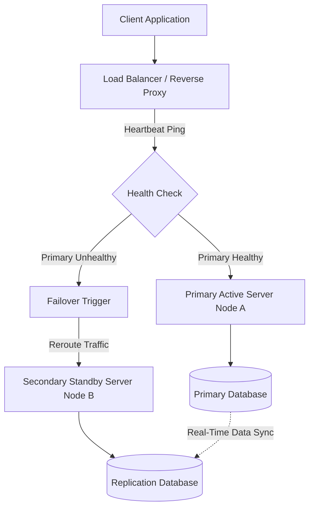
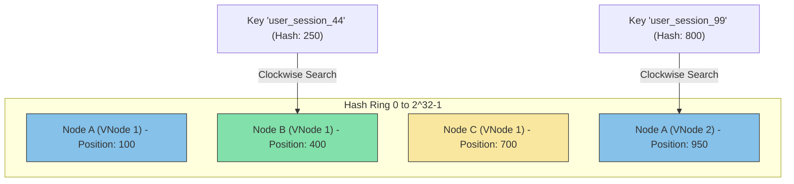
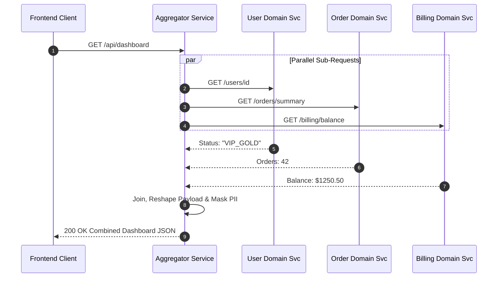
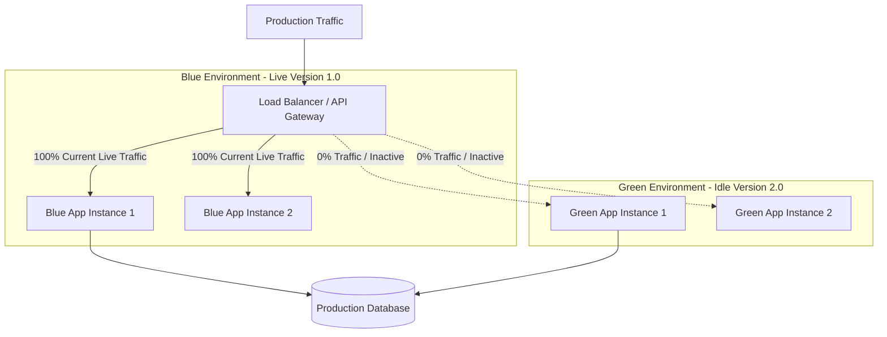
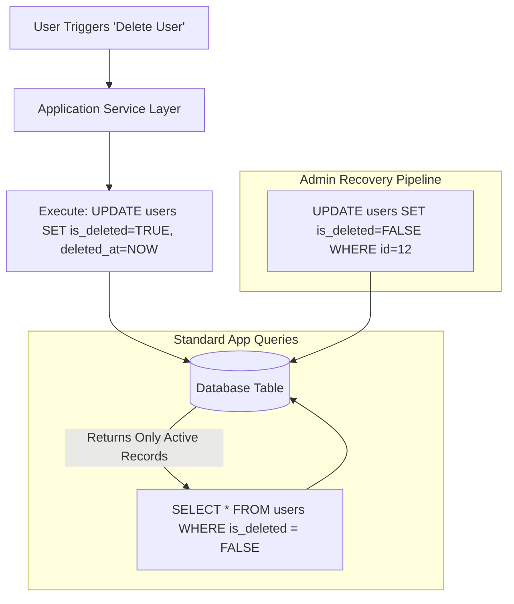
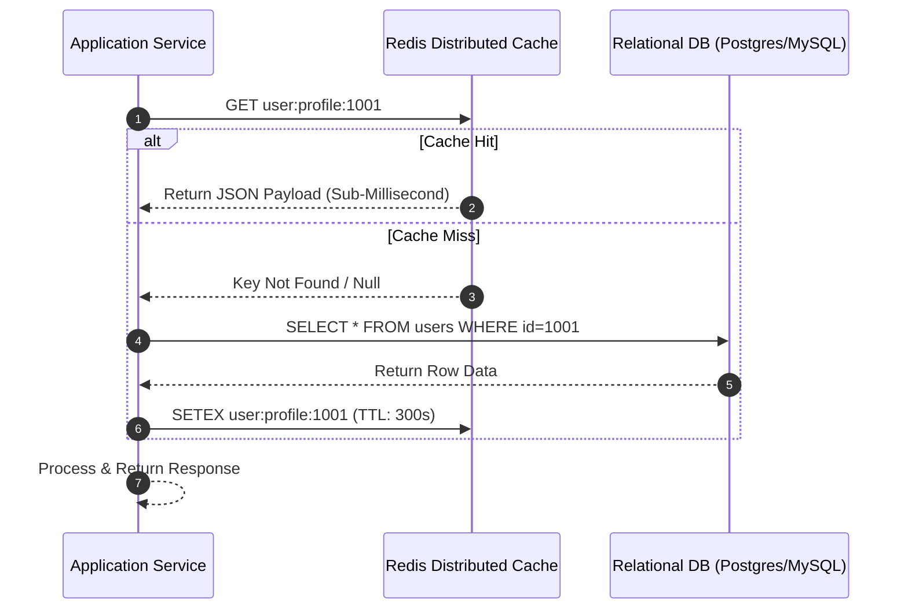
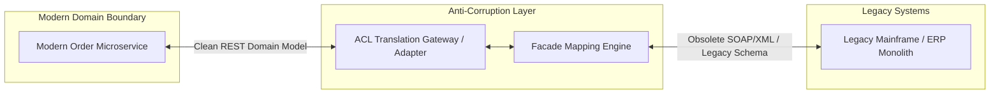

# 1. Failover Pattern

## Overview

The **Failover Pattern** is a high-availability architecture pattern that automatically redirects traffic from a failed primary instance to a healthy secondary instance whenever an outage occurs. Its primary goal is to minimize downtime, improve reliability, and ensure uninterrupted service even during hardware failures, software crashes, network outages, or infrastructure maintenance.

A failover mechanism continuously monitors the health of services using **heartbeat signals**, **health checks**, or **monitoring agents**. When the primary instance becomes unavailable or unhealthy, the system automatically promotes or redirects traffic to a standby instance without requiring manual intervention. Once the failed instance recovers, it can either rejoin the cluster or become the standby node again, depending on the configured failback strategy.

Failover is a fundamental building block for designing highly available systems and is commonly implemented using **load balancers**, **DNS failover**, **database replication**, **Kubernetes**, or cloud-managed services. Organizations such as Netflix, AWS, Google Cloud, Azure, and Cloudflare rely on failover mechanisms to keep their services operational despite infrastructure failures.

---

## Types of Failover

### 1. Active-Passive (Warm/Cold Standby)

In an **Active-Passive** configuration, only the primary instance serves production traffic while the secondary instance remains on standby. The standby server continuously receives replicated data or periodic synchronization but does not process user requests until the primary instance fails.

When a failure is detected, traffic is automatically redirected to the standby instance, ensuring business continuity with minimal downtime.

**Best suited for:**

- Databases
- Internal business applications
- Disaster recovery environments
- Cost-sensitive architectures

---

### 2. Active-Active (Hot Standby)

In an **Active-Active** configuration, multiple instances simultaneously serve live production traffic behind a load balancer. Requests are distributed across all healthy nodes, allowing better resource utilization and horizontal scalability.

If one instance becomes unavailable, the load balancer automatically routes all incoming requests to the remaining healthy nodes without interrupting client requests.

**Best suited for:**

- High-traffic web applications
- APIs
- Microservices
- Global SaaS platforms
- Multi-region deployments



---

## Implementation Tradeoffs

| Pros / Advantages | Cons / Disadvantages |
|-------------------|----------------------|
| Ensures high availability (HA) and minimizes unplanned downtime. | Requires redundant infrastructure, increasing operational costs. |
| Automatically redirects traffic without manual intervention. | Split-brain scenarios can occur if failure detection is inaccurate. |
| Improves disaster recovery and business continuity. | Data replication introduces additional complexity. |
| Enables seamless maintenance and infrastructure upgrades. | Failover testing must be performed regularly. |
| Reduces customer-facing outages during infrastructure failures. | Synchronization lag may lead to temporary data inconsistency. |
| Integrates well with load balancers, DNS failover, and cloud services. | Health check configuration must be carefully tuned to avoid false failovers. |

---

## Common Technologies

- HAProxy
- NGINX
- AWS Route 53 Failover Routing
- Azure Traffic Manager
- Google Cloud Load Balancer
- Kubernetes
- Keepalived (VRRP)
- Pacemaker Cluster
- PostgreSQL Streaming Replication
- MySQL Group Replication
- Redis Sentinel

---

## Common Use Cases

- High Availability (HA) systems
- Disaster Recovery (DR)
- Multi-region deployments
- Database replication
- Kubernetes clusters
- Load-balanced APIs
- Mission-critical financial systems
- Healthcare platforms
- E-commerce applications
- Cloud-native microservices


## Code Example

```python

import time
import requests

class FailoverClient:
    def __init__(self, primary_url: str, secondary_url: str, timeout_sec: float = 1.0):
        self.primary_url = primary_url
        self.secondary_url = secondary_url
        self.timeout_sec = timeout_sec
        self.is_primary_healthy = True

    def _check_health(self, url: str) -> bool:
        try:
            resp = requests.get(f"{url}/health", timeout=self.timeout_sec)
            return resp.status_code == 200
        except requests.RequestException:
            return False

    def execute_request(self, endpoint: str, payload: dict) -> dict:
        target = self.primary_url if self.is_primary_healthy else self.secondary_url
        
        try:
            response = requests.post(f"{target}{endpoint}", json=payload, timeout=self.timeout_sec)
            response.raise_for_status()
            return response.json()
        except requests.RequestException as err:
            print(f"[FAILOVER WARNING] Target {target} failed: {err}")
            
            # Re-evaluating health and switching target
            if target == self.primary_url:
                print("[FAILOVER ACTION] Primary failed. Switching traffic to Secondary...")
                self.is_primary_healthy = False
                # Retry request against secondary standby node
                resp = requests.post(f"{self.secondary_url}{endpoint}", json=payload, timeout=self.timeout_sec)
                return resp.json()
            else:
                raise RuntimeError("Both Primary and Secondary standby nodes failed.")

client = FailoverClient(
    primary_url="https://primary.internal-api.com",
    secondary_url="https://standby.internal-api.com"
)

```

# 2. Consistent Hashing Pattern

## Overview

**Consistent Hashing** is a distributed partitioning technique that efficiently distributes data across multiple servers while minimizing data movement during cluster scaling. Instead of assigning data using a simple modulo operation, both **data keys** and **server nodes** are mapped onto a logical **hash ring** (typically ranging from `0` to `2³² - 1`). Each key is stored on the first node encountered while traversing the ring in a clockwise direction.

Unlike traditional hashing (`hash(key) % n`), where adding or removing a server causes nearly every key to be redistributed, consistent hashing only reassigns a small subset of keys. On average, when a new node joins or an existing node leaves the cluster, only approximately **k / n** keys are remapped, where:

- **k** = Total number of keys
- **n** = Total number of nodes

This significantly reduces cache invalidation, network traffic, and data migration, making consistent hashing ideal for highly scalable distributed systems.

---

## Virtual Nodes (VNodes)

A physical server is typically represented by **multiple virtual nodes (VNodes)** placed at different positions on the hash ring instead of a single location.

Using virtual nodes provides several advantages:

- Improves load balancing across the cluster.
- Prevents uneven key distribution and data hotspots.
- Supports heterogeneous hardware by assigning more virtual nodes to more powerful servers.
- Reduces the impact when a node is added or removed.

Without virtual nodes, some servers may own significantly larger portions of the ring than others, leading to poor resource utilization and uneven traffic distribution.

---

## When to Use

Consistent Hashing is commonly used in systems that require horizontal scalability and dynamic cluster membership, including:

- Distributed cache clusters (Redis Cluster, Memcached)
- Distributed databases (Apache Cassandra, Amazon DynamoDB, Riak)
- Distributed object storage
- Content Delivery Networks (CDNs)
- Layer-7 load balancers
- API Gateway request routing
- Session storage
- Service discovery systems
- Peer-to-peer (P2P) networks



---

## Implementation Tradeoffs

| Pros / Advantages | Cons / Disadvantages |
|-------------------|----------------------|
| Only a small percentage of keys are redistributed when nodes join or leave the cluster. | More complex to implement than traditional modulo hashing. |
| Minimizes cache invalidation during scaling events. | Requires virtual nodes (VNodes) for balanced key distribution. |
| Supports seamless horizontal scaling without large-scale data migration. | Debugging hash ring issues can be challenging. |
| Reduces network traffic during cluster expansion or shrinkage. | Ring maintenance introduces additional operational complexity. |
| Provides better fault tolerance during node failures. | Data replication strategies must be implemented separately. |
| Enables efficient request routing in distributed systems. | Uneven distribution may occur if virtual nodes are poorly configured. |

---

## Common Technologies

- Redis Cluster
- Memcached
- Apache Cassandra
- Amazon DynamoDB
- Riak
- Envoy Proxy
- HAProxy
- NGINX
- Akamai CDN
- Cloudflare

---

## Common Use Cases

- Distributed caching
- Distributed databases
- Cache sharding
- CDN edge routing
- API Gateway request routing
- Session storage
- Service discovery
- Distributed object storage
- Peer-to-peer systems
- Large-scale microservice architectures

## Code Example

```python
import hashlib
import bisect

class ConsistentHashRing:
    def __init__(self, nodes=None, vnodes_per_node=100):
        self.vnodes_per_node = vnodes_per_node
        self.ring = []        # Sorted list of vnode hashes
        self.vnode_map = {}   # Maps vnode hash back to physical node name
        
        if nodes:
            for node in nodes:
                self.add_node(node)

    def _hash(self, key: str) -> int:
        return int(hashlib.md5(key.encode('utf-8')).hexdigest(), 16)

    def add_node(self, node: str):
        for i in range(self.vnodes_per_node):
            vnode_key = f"{node}-vnode-{i}"
            vnode_hash = self._hash(vnode_key)
            bisect.insort(self.ring, vnode_hash)
            self.vnode_map[vnode_hash] = node

    def remove_node(self, node: str):
        for i in range(self.vnodes_per_node):
            vnode_key = f"{node}-vnode-{i}"
            vnode_hash = self._hash(vnode_key)
            idx = bisect.bisect_left(self.ring, vnode_hash)
            if idx < len(self.ring) and self.ring[idx] == vnode_hash:
                del self.ring[idx]
                del self.vnode_map[vnode_hash]

    def get_node(self, key: str) -> str:
        if not self.ring:
            return None
        key_hash = self._hash(key)
        idx = bisect.bisect_right(self.ring, key_hash)
        if idx == len(self.ring):
            idx = 0 # Wrap around the hash ring
        return self.vnode_map[self.ring[idx]]

# Usage
ring = ConsistentHashRing(nodes=["Cache-Node-A", "Cache-Node-B", "Cache-Node-C"])
print("Key 'user_1001' maps to:", ring.get_node("user_1001"))
print("Key 'user_2049' maps to:", ring.get_node("user_2049"))

```

# 3. Aggregator Pattern

## Overview

The **Aggregator Pattern** is an architectural pattern that collects data from multiple downstream services, combines the responses, optionally transforms or enriches the data, and returns a single consolidated response to the client. Instead of forcing the client to make multiple network requests to different microservices, the aggregator acts as a centralized orchestration layer that coordinates these interactions.

When a client sends a request, the aggregator invokes several specialized microservices—often in parallel—to retrieve domain-specific information. After receiving the individual responses, it merges, filters, reshapes, or computes additional values (such as totals, averages, rankings, or cross-service joins) before returning a unified payload.

Unlike simple API composition, an aggregator frequently contains lightweight orchestration logic and response transformation while avoiding core business logic. This approach significantly reduces client complexity, network latency, and the number of round trips required to render complex views.

---

## Key Characteristics

An Aggregator service typically performs one or more of the following tasks:

- Calls multiple services concurrently.
- Merges responses into a unified payload.
- Computes derived values (totals, averages, percentages, rankings).
- Performs cross-service joins.
- Filters unnecessary fields before returning data.
- Normalizes different response formats.
- Handles partial failures gracefully.
- Applies timeout and retry strategies for downstream services.

---

## When to Use

The Aggregator Pattern is commonly used in scenarios where information is distributed across multiple services but must be presented as a single response.

Typical use cases include:

- Mobile backend endpoints (BFF)
- Executive dashboards
- Analytics and reporting systems
- User profile pages
- E-commerce product detail pages
- Search result aggregation
- Financial reporting
- Order summary pages
- Customer 360 dashboards
- Multi-service GraphQL resolvers

---

## Implementation Tradeoffs

| Pros / Advantages | Cons / Disadvantages |
|-------------------|----------------------|
| Reduces client-side network requests by returning a single response. | Overall response time depends on the slowest downstream service (high p99 latency). |
| Centralizes response transformation and data aggregation. | Can become a bottleneck if not horizontally scalable. |
| Simplifies frontend and mobile applications. | Business logic may gradually accumulate, creating a monolithic gateway. |
| Supports parallel service execution for lower latency. | More difficult to debug because requests span multiple services. |
| Enables consistent response formats across clients. | Requires timeout, retry, and partial failure handling. |
| Allows masking, filtering, and enrichment of sensitive data. | Increased operational complexity due to orchestration logic. |

---

## Common Technologies

- GraphQL Gateway
- Apollo Federation
- Backend for Frontend (BFF)
- Node.js
- Spring Boot
- FastAPI
- gRPC
- Envoy Proxy
- API Gateway
- Kubernetes

---

## Common Use Cases

- Customer dashboards
- Admin portals
- Executive reporting
- Product catalog aggregation
- Search result synthesis
- User profile aggregation
- Financial analytics
- Business intelligence dashboards
- Healthcare patient summaries
- Multi-service SaaS applications

## Code Example

```python
package main

import (
	"encoding/json"
	"fmt"
	"net/http"
	"sync"
	"time"
)

type SummaryReport struct {
	TotalOrders   int     `json:"total_orders"`
	UserStatus    string  `json:"user_status"`
	CreditBalance float64 `json:"credit_balance"`
}

func fetchOrders(wg *sync.WaitGroup, ch chan<- int) {
	defer wg.Done()
	time.Sleep(80 * time.Millisecond) // Simulating microservice latency
	ch <- 42                          // 42 Total orders
}

func fetchUser(wg *sync.WaitGroup, ch chan<- string) {
	defer wg.Done()
	time.Sleep(50 * time.Millisecond)
	ch <- "VIP_GOLD"
}

func fetchBilling(wg *sync.WaitGroup, ch chan<- float64) {
	defer wg.Done()
	time.Sleep(110 * time.Millisecond)
	ch <- 1250.50
}

func aggregateHandler(w http.ResponseWriter, r *http.Request) {
	var wg sync.WaitGroup
	ordersCh := make(chan int, 1)
	userCh := make(chan string, 1)
	billingCh := make(chan float64, 1)

	wg.Add(3)
	go fetchOrders(&wg, ordersCh)
	go fetchUser(&wg, userCh)
	go fetchBilling(&wg, billingCh)

	wg.Wait()
	close(ordersCh)
	close(userCh)
	close(billingCh)

	report := SummaryReport{
		TotalOrders:   <-ordersCh,
		UserStatus:    <-userCh,
		CreditBalance: <-billingCh,
	}

	w.Header().Set("Content-Type", "application/json")
	json.NewEncoder(w).Encode(report)
}

func main() {
	http.HandleFunc("/api/dashboard", aggregateHandler)
	fmt.Println("Aggregator service listening on :8080...")
}
```

# 4. Blue-Green Deployment Pattern

## Overview

**Blue-Green Deployment** is a continuous delivery deployment strategy that enables application releases with **near-zero downtime** by maintaining two identical production environments: **Blue** and **Green**. At any given time, one environment serves live production traffic while the other hosts the new application version.

Initially, all user traffic is routed to the **Blue** environment, which runs the current production release. Developers deploy the new version to the **Green** environment, where it undergoes smoke tests, integration tests, health checks, and performance validation without impacting real users. Once the deployment is verified, the load balancer, API Gateway, or traffic router switches all incoming requests from Blue to Green.

If any critical issues are detected after the switch, traffic can be immediately redirected back to the Blue environment, providing an almost instantaneous rollback mechanism. This deployment model significantly reduces deployment risk while ensuring continuous availability for end users.

---

## 4. Deployment Workflow

A typical Blue-Green deployment consists of the following steps:

1. Blue environment serves all production traffic.
2. Deploy the new application version to the Green environment.
3. Execute automated tests and health checks on Green.
4. Validate application behavior and infrastructure readiness.
5. Switch production traffic from Blue to Green using a load balancer or DNS.
6. Monitor Green for errors, latency, and system health.
7. If deployment succeeds, Green becomes the new production environment.
8. If failures occur, immediately route traffic back to Blue.

---

## When to Use

Blue-Green Deployment is ideal for applications that require continuous availability and rapid rollback during releases.

Common use cases include:

- Mission-critical production systems
- SaaS platforms
- Banking and financial applications
- E-commerce platforms
- Healthcare systems
- Government applications
- Enterprise APIs
- Kubernetes production deployments
- Cloud-native microservices
- High-availability web applications



---

## Implementation Tradeoffs

| Pros / Advantages | Cons / Disadvantages |
|-------------------|----------------------|
| Enables near-zero downtime deployments. | Requires duplicate production infrastructure during deployments. |
| Supports instant rollback by redirecting traffic back to the previous environment. | Infrastructure costs are higher because two environments must be maintained. |
| Isolates deployment testing from live production users. | Database schema changes must remain backward compatible (N-1 compatibility). |
| Reduces deployment risk and production outages. | Data synchronization between environments can become challenging. |
| Simplifies release verification before exposing users to the new version. | Stateful applications require additional planning for session management. |
| Integrates well with CI/CD pipelines and automated deployments. | Traffic switching mechanisms add operational complexity. |

---

## Common Technologies

- Kubernetes
- Argo Rollouts
- Argo CD
- AWS CodeDeploy
- Azure DevOps
- Google Cloud Deploy
- NGINX
- HAProxy
- Envoy Proxy
- AWS Application Load Balancer (ALB)

---

## Common Use Cases

- Zero-downtime deployments
- CI/CD pipelines
- Kubernetes application releases
- Multi-region deployments
- SaaS platform upgrades
- Enterprise software releases
- API version upgrades
- Cloud-native applications
- Mission-critical services
- High-availability production systems


## Code Example (Nginx)

```python
# nginx.conf - Dynamic Traffic Routing for Blue-Green Deployments

http {
    # Switch active target between blue and green instances here
    upstream production_cluster {
        # BLUE ENVIRONMENT (Active Live Production)
        server 10.0.2.10:8080 max_fails=3 fail_timeout=10s;
        server 10.0.2.11:8080 max_fails=3 fail_timeout=10s;

        # GREEN ENVIRONMENT (Staging / New Deployment - Uncomment to Switch)
        # server 10.0.3.10:8080 max_fails=3 fail_timeout=10s;
        # server 10.0.3.11:8080 max_fails=3 fail_timeout=10s;
    }

    server {
        listen 80;
        server_name api.company.com;

        location / {
            proxy_pass http://production_cluster;
            proxy_set_header Host $host;
            proxy_set_header X-Real-IP $remote_addr;
            proxy_set_header X-Forwarded-For $proxy_add_x_forwarded_for;
            proxy_connect_timeout 2s;
        }
    }
}

```


# 5. Soft Delete Pattern

## Overview

The **Soft Delete Pattern** is a database design pattern that avoids permanently removing records from the database. Instead of executing a physical `DELETE` operation, the application marks a record as deleted by updating a status flag or timestamp column, such as `is_deleted = TRUE` or `deleted_at = '2026-07-25 10:00:00'`.

Although the record remains stored in the database, it is treated as deleted by the application. Queries automatically exclude soft-deleted records using default ORM scopes, global query filters, or database views. This approach enables data recovery, maintains historical relationships, and supports auditing without permanently losing information.

Soft deletes are widely used in applications where records may need to be restored, retained for compliance, or referenced by other entities. Instead of removing data immediately, records can later be archived or permanently purged through scheduled cleanup jobs based on business or regulatory requirements.

---

## How It Works

A typical soft delete workflow consists of the following steps:

1. User requests to delete a record.
2. Application updates the record instead of executing `DELETE`.
3. A flag (`is_deleted`) or timestamp (`deleted_at`) is populated.
4. Default application queries automatically exclude soft-deleted records.
5. Administrators can restore the record if required.
6. Optional background jobs permanently remove archived records after a retention period.

---

## When to Use

The Soft Delete Pattern is commonly used in systems where deleted data must remain recoverable or auditable.

Typical use cases include:

- Audit-sensitive applications
- Financial systems
- Healthcare records
- CRM platforms
- E-commerce applications
- User account management
- HR systems
- Compliance and regulatory platforms
- Document management systems
- Multi-tenant SaaS applications



---

## Implementation Tradeoffs

| Pros / Advantages | Cons / Disadvantages |
|-------------------|----------------------|
| Enables quick recovery of accidentally deleted records. | Database tables continue growing over time, increasing storage requirements. |
| Preserves historical data and audit trails. | Queries must consistently exclude soft-deleted records. |
| Maintains foreign key relationships and referential integrity. | Large tables may require additional indexing for good performance. |
| Simplifies record restoration without backups. | Unique constraints (such as email addresses) require partial or composite indexes. |
| Supports regulatory and compliance requirements. | Background cleanup jobs may be needed for long-term storage management. |
| Prevents accidental permanent data loss. | Developers must ensure every query respects soft-delete filters. |

---

## Common Technologies

- PostgreSQL
- MySQL
- SQL Server
- MongoDB
- Prisma ORM
- TypeORM
- Hibernate
- Entity Framework
- Django ORM
- Laravel Eloquent

---

## Common Use Cases

- User account deletion
- Customer management systems
- Financial ledgers
- Healthcare applications
- HR management systems
- CRM platforms
- Document storage
- Inventory management
- Multi-tenant SaaS products
- Compliance and audit systems


## Code Example

```python
from datetime import datetime
from sqlalchemy import Column, Integer, String, Boolean, DateTime, create_engine
from sqlalchemy.orm import declarative_base, sessionmaker, Query

Base = declarative_base()

class SoftDeleteQuery(Query):
    """Custom Query class that automatically excludes soft-deleted records."""
    def __new__(cls, *args, **kwargs):
        obj = super().__new__(cls)
        with_deleted = kwargs.pop('_with_deleted', False)
        if not with_deleted:
            obj = obj.filter_by(is_deleted=False)
        return obj

class User(Base):
    __tablename__ = 'users'

    id = Column(Integer, primary_key=True)
    username = Column(String(50), nullable=False)
    email = Column(String(100), nullable=False)
    is_deleted = Column(Boolean, default=False, nullable=False)
    deleted_at = Column(DateTime, nullable=True)

    def soft_delete(self):
        self.is_deleted = True
        self.deleted_at = datetime.utcnow()

# Usage Example
engine = create_engine('sqlite:///:memory:')
Base.metadata.create_all(engine)
Session = sessionmaker(bind=engine, query_cls=SoftDeleteQuery)
session = Session()

# Add User
usr = User(username="johndoe", email="john@example.com")
session.add(usr)
session.commit()

# Perform Soft Delete
usr.soft_delete()
session.commit()

# Standard Query automatically filters out soft-deleted row
active_users = session.query(User).filter_by(username="johndoe").all()
print("Active Users Found:", len(active_users)) # Output: 0

```

# 6. Distributed Cache Pattern

## Overview

The **Distributed Cache Pattern** introduces a shared, high-speed, in-memory caching layer between the application and the primary database to reduce latency and improve scalability. Instead of every read request reaching the database, frequently accessed data is served directly from distributed cache nodes such as **Redis** or **Memcached**, significantly reducing database load and improving application response times.

Unlike local in-process caches, a distributed cache is shared across multiple application instances, ensuring consistent cached data regardless of which server handles the request. This makes it ideal for horizontally scaled applications where multiple application servers need access to the same cached data.

Applications typically interact with the cache before accessing the database. If the requested data exists in the cache (**cache hit**), it is returned immediately. If the data is missing (**cache miss**), the application retrieves it from the database, stores it in the cache with an expiration policy, and then returns it to the client.

Distributed caches are widely used to accelerate read-heavy workloads, reduce database contention, absorb traffic spikes, and improve the overall responsiveness of modern distributed systems.

---

## Caching Strategies

### 1. Cache-Aside (Lazy Loading)

The application is responsible for managing the cache.

**Workflow:**

1. Application checks the cache.
2. If data exists (cache hit), return it immediately.
3. If data is missing (cache miss), query the database.
4. Store the retrieved data in the cache.
5. Return the response to the client.

**Best suited for:**

- Read-heavy applications
- Product catalogues
- User profiles
- Dashboard data
- Session lookups

---

### 2. Write-Through

Every write operation updates both the cache and the database synchronously.

**Benefits:**

- Cache always contains the latest data.
- Eliminates stale reads immediately after writes.

**Trade-off:**

- Slightly higher write latency since both cache and database must be updated.

---

### 3. Write-Behind (Write-Back)

The application writes data to the cache first, and the cache asynchronously persists changes to the database.

**Benefits:**

- Extremely fast write performance.
- Reduces database write pressure.

**Trade-off:**

- Risk of temporary data loss if the cache fails before persistence completes.

---

## When to Use

The Distributed Cache Pattern is ideal for applications with frequent read operations and strict latency requirements.

Typical use cases include:

- Read-heavy APIs
- Session storage
- User profiles
- Product catalogues
- Leaderboards
- Analytics dashboards
- Recommendation engines
- Rate limiting
- Authentication tokens
- Real-time applications



---

## Implementation Tradeoffs

| Pros / Advantages | Cons / Disadvantages |
|-------------------|----------------------|
| Reduces database read latency to sub-millisecond response times. | Cache invalidation is complex and must be carefully managed. |
| Offloads repetitive read traffic from the primary database. | Stale data may be served if cache updates are delayed or missed. |
| Handles traffic spikes and flash-sale events efficiently. | Cache stampedes (thundering herd) can occur when popular keys expire simultaneously. |
| Improves scalability by reducing database bottlenecks. | Additional infrastructure increases operational complexity. |
| Enables horizontal scaling across multiple application instances. | Requires cache eviction and expiration strategies to prevent memory exhaustion. |
| Enhances overall application responsiveness and throughput. | Distributed cache clusters require monitoring, replication, and failover planning. |

---

## Common Technologies

- Redis
- Redis Cluster
- Memcached
- Hazelcast
- Apache Ignite
- Amazon ElastiCache
- Azure Cache for Redis
- Google Cloud Memorystore
- Aerospike
- Couchbase

---

## Common Use Cases

- API response caching
- Session management
- Authentication and JWT validation
- Product catalogue caching
- User profile caching
- Dashboard data
- Shopping cart storage
- Rate limiting
- Leaderboards
- Real-time analytics

## Code Example

```python
import json
import redis
import time

class UserCacheRepository:
    def __init__(self, redis_client, db_client, ttl_seconds=300):
        self.redis = redis_client
        self.db = db_client
        self.ttl = ttl_seconds

    def get_user_profile(self, user_id: str) -> dict:
        cache_key = f"user:profile:{user_id}"
        
        # 1. Attempt to fetch from Distributed Cache
        cached_data = self.redis.get(cache_key)
        if cached_data:
            print("[CACHE HIT] Returning in-memory cached profile.")
            return json.loads(cached_data)

        # 2. Cache Miss: Fallback to SQL Primary Database
        print("[CACHE MISS] Querying primary relational database...")
        user_profile = self.db.query_user_from_sql(user_id)
        
        if user_profile:
            # 3. Populate Distributed Cache with TTL
            self.redis.setex(
                cache_key,
                self.ttl,
                json.dumps(user_profile)
            )
            
        return user_profile

# Mock Setup
r = redis.Redis(host='localhost', port=6379, db=0)

```


# 7. Anti-Corruption Layer (ACL) Pattern

## Overview

The **Anti-Corruption Layer (ACL) Pattern** is an integration pattern that introduces a translation layer between two systems with different domain models, data structures, protocols, or business semantics. Its primary purpose is to prevent concepts from a legacy system or third-party service from leaking into and contaminating the domain model of a modern application.

Instead of allowing a new service to communicate directly with an external system, all requests and responses pass through the Anti-Corruption Layer. The ACL translates data formats, converts domain objects, adapts protocols, and maps business rules so that each system can continue using its own model independently.

This isolation enables organizations to modernize legacy applications incrementally without forcing immediate changes to existing systems. It also simplifies integration with external vendors whose APIs, payloads, or terminology differ from the application's internal domain model.

The Anti-Corruption Layer is a core pattern in **Domain-Driven Design (DDD)** and is commonly used during legacy modernization, microservice migrations, and third-party integrations.

---

## Responsibilities

An Anti-Corruption Layer typically performs the following functions:

- Translates requests and responses between systems.
- Maps legacy entities to modern domain models.
- Converts API payload formats.
- Adapts communication protocols (REST, SOAP, gRPC, messaging).
- Validates and sanitizes incoming data.
- Hides legacy implementation details from new services.
- Encapsulates integration-specific business mappings.
- Provides a stable interface for the modern application.

---

## When to Use

The Anti-Corruption Layer is most valuable when integrating systems that have different domain models or incompatible interfaces.

Typical use cases include:

- Strangler Fig migrations
- Legacy monolith modernization
- ERP integration
- CRM integration
- Third-party payment providers
- External vendor APIs
- SOAP to REST migration
- REST to gRPC adaptation
- Enterprise system integration
- Domain-Driven Design bounded contexts



---

## Implementation Tradeoffs

| Pros / Advantages | Cons / Disadvantages |
|-------------------|----------------------|
| Prevents legacy domain models from polluting modern services. | Adds additional request latency due to translation and mapping. |
| Enables gradual migration from monoliths to microservices. | Requires ongoing maintenance of mapping and adapter code. |
| Keeps the application's domain model clean and independent. | Increases implementation complexity for integrations. |
| Simplifies replacement of legacy or third-party systems. | Mapping logic must evolve whenever either system changes. |
| Centralizes protocol and data transformation logic. | Additional testing is required to verify translation accuracy. |
| Reduces coupling between modern services and external systems. | Can become a bottleneck if many integrations depend on the same ACL. |

---

## Common Technologies

- Spring Boot
- Apache Camel
- MuleSoft
- FastAPI
- Node.js
- NestJS
- gRPC
- REST APIs
- GraphQL
- Kafka Connect

---

## Common Use Cases

- Legacy ERP integration
- Strangler Fig migrations
- Third-party API integration
- Payment gateway adapters
- CRM synchronization
- SOAP to REST modernization
- REST to gRPC translation
- Enterprise application integration
- Domain model translation
- Microservice modernization

## Code Example

```javascript
// Modern Clean Microservice Domain Model
interface ModernOrder {
  orderId: string;
  totalAmount: number;
  customerEmail: string;
}

// Legacy Monolith Data Model (Legacy XML/SOAP/Obsolete Keys)
interface LegacyERPOrderPayload {
  CUST_REF_NUM: string;
  TOT_AMT_CENTS: number;
  PRIMARY_EMAIL_ADDR: string;
  SYS_RECORD_FLAG: string;
}

// Anti-Corruption Layer (ACL) Translator Class
class OrderAntiCorruptionLayer {
  
  // Translates legacy incoming model into clean modern domain semantics
  public static toModernDomain(legacyPayload: LegacyERPOrderPayload): ModernOrder {
    return {
      orderId: legacyPayload.CUST_REF_NUM,
      totalAmount: legacyPayload.TOT_AMT_CENTS / 100.0,
      customerEmail: legacyPayload.PRIMARY_EMAIL_ADDR
    };
  }

  // Translates clean modern model back into messy legacy format
  public static toLegacySystem(modernOrder: ModernOrder): LegacyERPOrderPayload {
    return {
      CUST_REF_NUM: modernOrder.orderId,
      TOT_AMT_CENTS: Math.round(modernOrder.totalAmount * 100),
      PRIMARY_EMAIL_ADDR: modernOrder.customerEmail,
      SYS_RECORD_FLAG: "ACTIVE_V1"
    };
  }
}

// Usage in modern Microservice Controller
function processLegacyWebhook(rawLegacyPayload: LegacyERPOrderPayload) {
  // Translate at boundary via ACL
  const cleanOrder: ModernOrder = OrderAntiCorruptionLayer.toModernDomain(rawLegacyPayload);
  
  // Business logic now works strictly with clean entities
  console.log(`Processing Order ${cleanOrder.orderId} for ${cleanOrder.customerEmail}`);
}

```
