# CDN

A **CDN** or **Content Delivery Network** is a distributed system of servers placed closer to users so content can be delivered faster, more reliably, and with lower load on the origin server.

CDNs are used for:

* images
* videos
* JavaScript files
* CSS files
* fonts
* APIs in some cases
* downloadable assets
* streaming media
* web pages with cacheable content

At a high level, a CDN stores copies of content at **edge locations** around the world and serves that content from the location nearest to the user.

---

## 1. Why CDN exists

Without a CDN, every user request goes back to one central origin server.

That causes:

* high latency for distant users
* more load on the origin
* slower page load times
* poor performance during traffic spikes
* expensive bandwidth usage
* weaker availability during regional failures

A CDN solves this by moving content closer to the user.

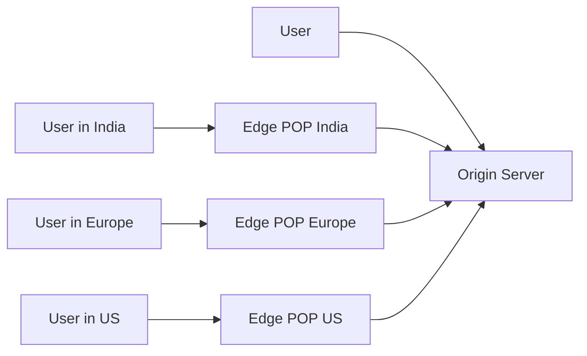

---

## 2. Core idea

The CDN keeps a **cached copy** of content in many distributed edge servers.

When a user requests a file:

1. the edge server checks if it already has the file
2. if yes, it serves it immediately
3. if no, it fetches it from origin, stores it, then serves it

This is called **cache hit** and **cache miss** behavior.

---

## 3. What problems CDN solves

### 3.1 Lower latency

Users get content from a nearby edge server instead of a faraway origin.

### 3.2 Higher throughput

Static assets are offloaded from the origin.

### 3.3 Better availability

If one region has issues, another edge can still serve cached content.

### 3.4 Cost reduction

Serving from cache is cheaper than serving every request from origin.

### 3.5 Better scalability

The origin does not need to handle every asset request.

---

## 4. High-level architecture

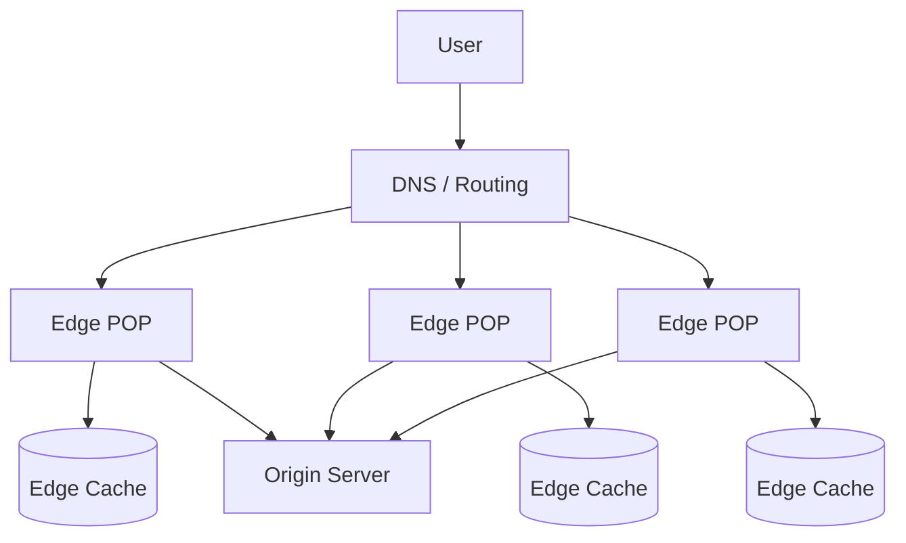

### Main components

* **User client**: browser, mobile app, TV app
* **DNS / routing layer**: directs the user to a nearby edge
* **Edge POP**: point of presence with one or more cache servers
* **Cache storage**: stores cached copies of content
* **Origin server**: source of truth for content
* **Control plane**: manages routing, invalidation, config, logs, and certificates

---

## 5. How a CDN request works

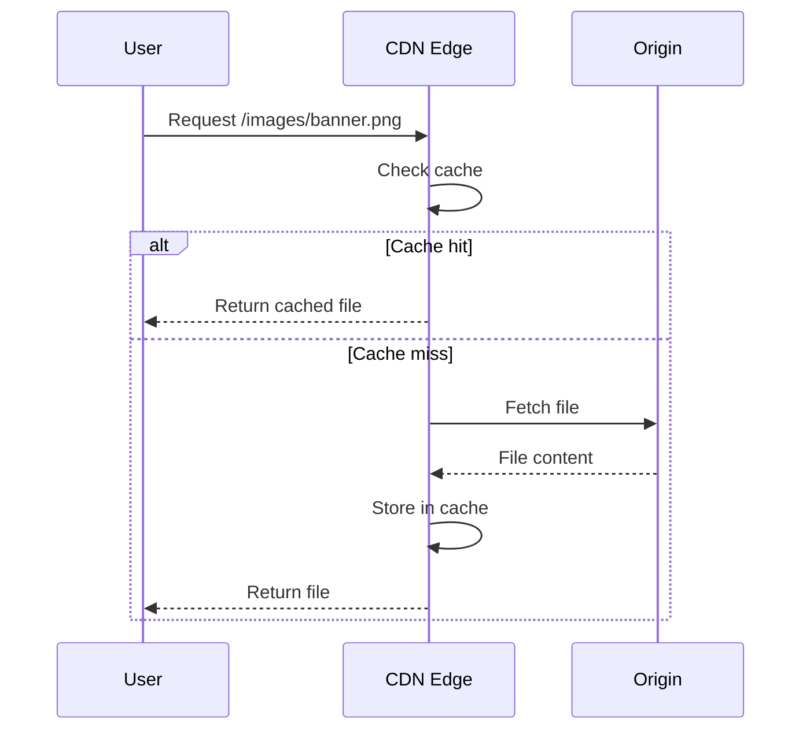

---

## 6. Cache hit and cache miss

### Cache hit

The edge server already has the content.

Benefits:

* very fast response
* no origin traffic
* lower latency

### Cache miss

The edge server does not have the content.

Then it must:

* fetch from origin
* store it
* serve the user

This is slower, but only happens once per edge per object, unless the object is evicted.

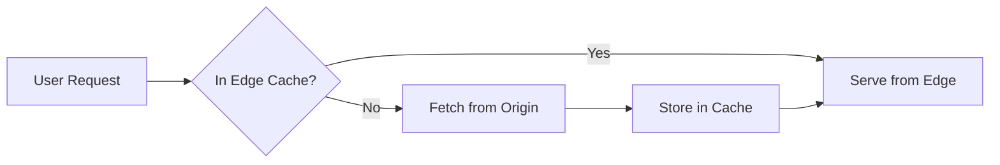

---

## 7. What content is cached

CDNs usually cache:

* images
* CSS
* JS bundles
* fonts
* video segments
* downloadable binaries
* thumbnails
* public API responses
* HTML pages that can be cached safely

Not all content should be cached:

* user-specific pages
* sensitive data
* personalized dashboards
* private API responses
* authenticated content unless carefully configured

---

## 8. CDN routing

A CDN has to decide which edge server should serve the user.

### Common routing methods

* DNS-based routing
* Anycast routing
* Geo-based routing
* latency-based routing
* load-aware routing

### DNS-based routing

The DNS returns an edge close to the user.

### Anycast routing

The same IP is announced in many regions, and the network routes the user to the nearest available edge.

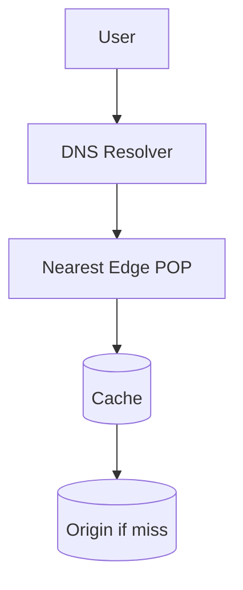

---

## 9. CDN request pipeline

A typical CDN request passes through several checks.

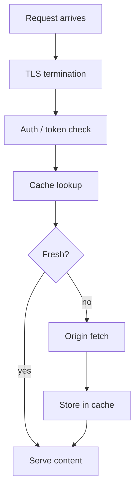

### Pipeline steps

#### TLS termination

The CDN often handles HTTPS at the edge.

#### Auth / token check

For protected content, the CDN verifies signed URLs, tokens, or cookies.

#### Cache lookup

The edge checks whether the object exists and is fresh.

#### Origin fetch

If missing, the edge fetches from origin.

#### Store in cache

The object is saved locally for future requests.

---

## 10. Cache freshness

Content cannot live forever unless it is meant to.

The CDN uses metadata like:

* `Cache-Control`
* `Expires`
* `ETag`
* `Last-Modified`

### Fresh vs stale

* **Fresh**: safe to serve directly
* **Stale**: may need revalidation
* **Expired**: must be refreshed from origin

---

## 11. TTL strategy

TTL or time-to-live controls how long cached content stays valid.

### Short TTL

* more fresh
* more origin requests
* safer for fast-changing content

### Long TTL

* fewer origin requests
* faster repeated delivery
* better for static assets

Typical examples:

* JS/CSS bundles: long TTL with versioned filenames
* images: long TTL
* HTML: short TTL
* API responses: depends on use case

---

## 12. Cache invalidation

Invalidation is one of the hardest parts of CDN design.

If origin content changes, the CDN must not keep serving the old version too long.

### Ways to invalidate

#### 1. Purge

Remove a specific object from edge caches.

#### 2. Soft purge

Mark content stale and revalidate on next request.

#### 3. Versioned URLs

Change filename or query version when content changes.

Example:

* `/app.js?v=123`
* `/app.9f8d1c.js`

Versioned URLs are often the safest strategy because new content gets a new URL and old cache entries can expire naturally.

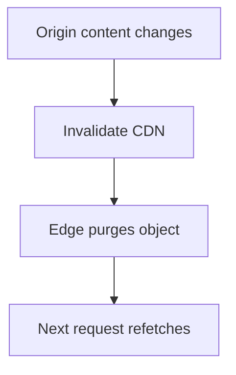

---

## 13. Stale-while-revalidate

This is a useful optimization.

The CDN can:

* serve stale content immediately
* refresh it in the background

This improves latency while keeping content reasonably fresh.

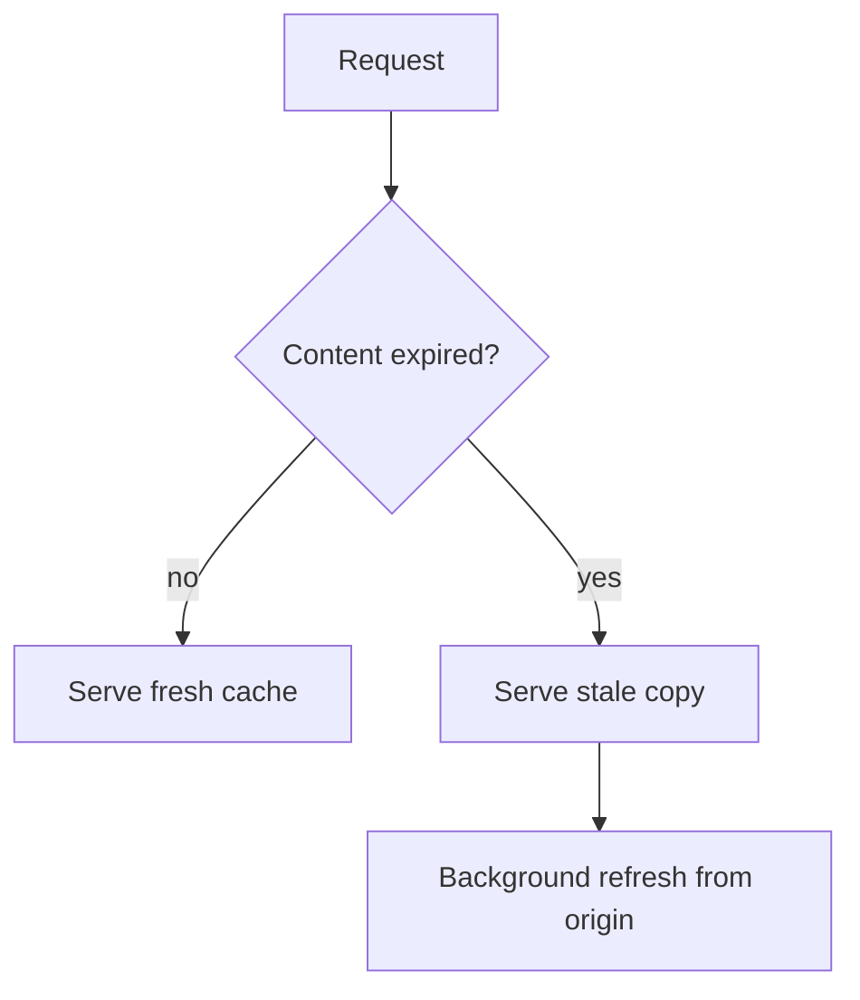

---

## 14. Origin shielding

If many edge servers all miss the same object, the origin can be overloaded.

Origin shielding solves this by adding a **mid-tier cache** or **regional shield** between edge and origin.

Benefits:

* fewer origin requests
* better cache reuse
* protection from thundering herd
* lower origin bandwidth

---

## 15. CDN and compression

CDNs often compress content before sending it.

### Common compression types

* gzip
* Brotli

This reduces bandwidth and improves load time.

### Example

A 1 MB JS file may compress down significantly before reaching the browser.

---

## 16. CDN and image optimization

CDNs often provide image transformation at the edge.

Examples:

* resize
* crop
* convert format
* compress
* adjust quality
* WebP / AVIF conversion

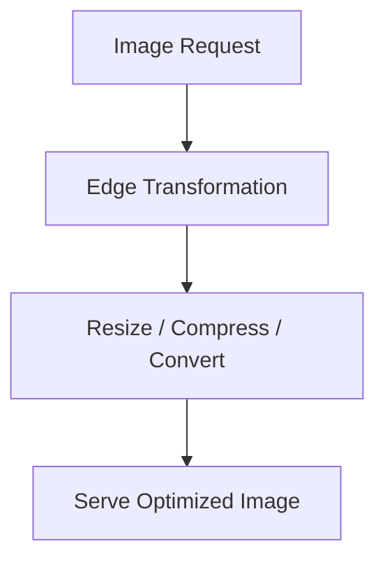

This helps websites load faster on mobile devices and slow networks.

---

## 17. CDN and video delivery

Video is often delivered through CDN because it is large and bandwidth-heavy.

Typical behavior:

* video is chunked into segments
* segments are cached at edge
* user gets nearby segment delivery
* adaptive bitrate streaming adjusts quality

This is important for:

* live streaming
* on-demand video
* sports broadcasts
* educational platforms

---

## 18. CDN and API acceleration

Some CDNs can cache API responses.

This is useful for:

* public data
* rate-limited endpoints
* read-heavy content
* geo-distributed APIs

But API caching must be done carefully because:

* data may be user-specific
* responses may be personalized
* authorization may be required
* cache poisoning must be prevented

---

## 19. CDN security

CDNs are also a security layer.

### 19.1 DDoS protection

Edge networks absorb and filter malicious traffic.

### 19.2 TLS / HTTPS termination

The CDN handles encrypted traffic at the edge.

### 19.3 WAF

A Web Application Firewall can block:

* SQL injection
* XSS
* bots
* bad requests
* exploit patterns

### 19.4 Signed URLs

For protected files, the URL can contain a short-lived signature.

### 19.5 Bot protection

CDNs can identify suspicious automation and reduce abuse.

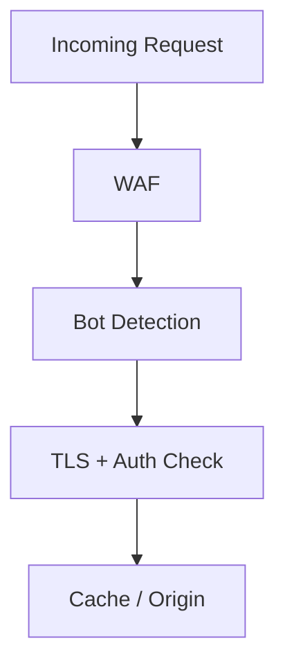

---

## 20. CDN with signed URLs

Signed URLs are used when access should be temporary.

Example:

* a file download link expires in 10 minutes
* only users with a valid signature can fetch it

### Flow

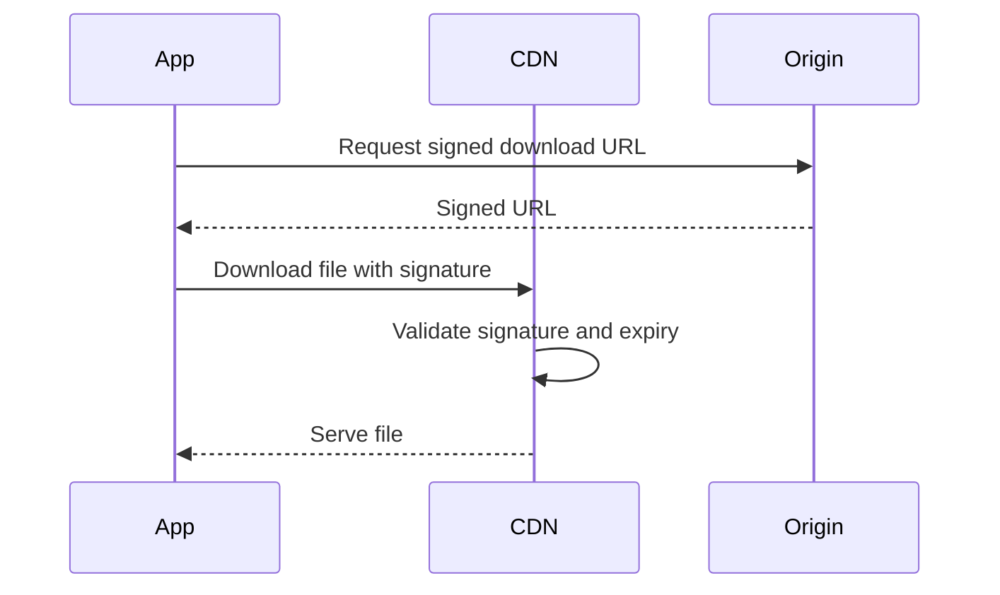

This is common for:

* private videos
* paid downloads
* software binaries
* restricted documents

---

## 21. CDN and cache key design

The cache key decides whether two requests map to the same cached object.

A cache key may include:

* URL path
* query parameters
* headers
* device type
* language
* compression support
* region
* authentication state

### Good key design

Keep it small and stable.

### Bad key design

Include too many varying headers and destroy cache hit rate.

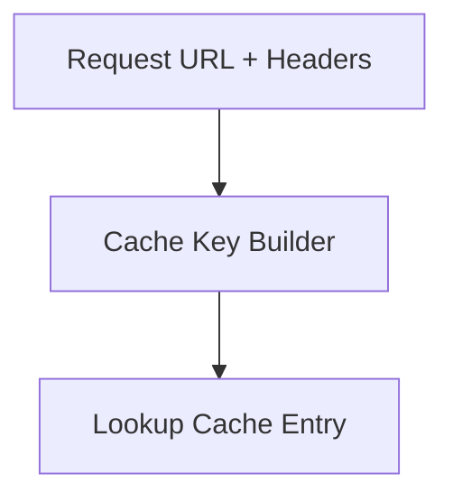

---

## 22. Cache poisoning risk

If cache keys or validation are not handled carefully, attackers may trick the CDN into caching unsafe content.

That is why CDNs often:

* validate headers
* normalize URLs
* ignore dangerous query params
* restrict private content caching
* enforce origin policies

---

## 23. Edge compute

Modern CDNs can run small functions at the edge.

This means logic can happen close to the user:

* redirect rules
* header rewriting
* geolocation routing
* A/B testing
* simple auth checks
* personalization of safe content

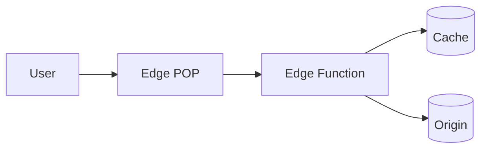

Edge compute reduces round trips and improves response time.

---

## 24. Multi-layer caching

CDN caching often exists in layers:

1. browser cache
2. service worker cache
3. CDN edge cache
4. regional shield cache
5. origin cache
6. database/object storage

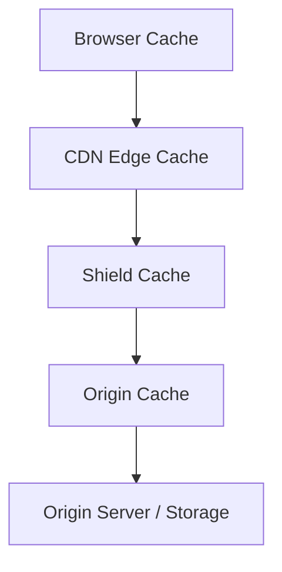

The closer the cache is to the user, the faster the response.

---

## 25. CDN performance metrics

Important metrics include:

* cache hit ratio
* origin offload percentage
* TTFB
* latency by region
* bandwidth served from edge
* miss rate
* purge latency
* error rate
* revalidation rate

### Cache hit ratio

The percentage of requests served from cache instead of origin.

A higher hit ratio usually means:

* lower latency
* lower origin load
* lower cost

---

## 26. Example system design: image-heavy website

Suppose a site serves product images, banners, and CSS/JS bundles.

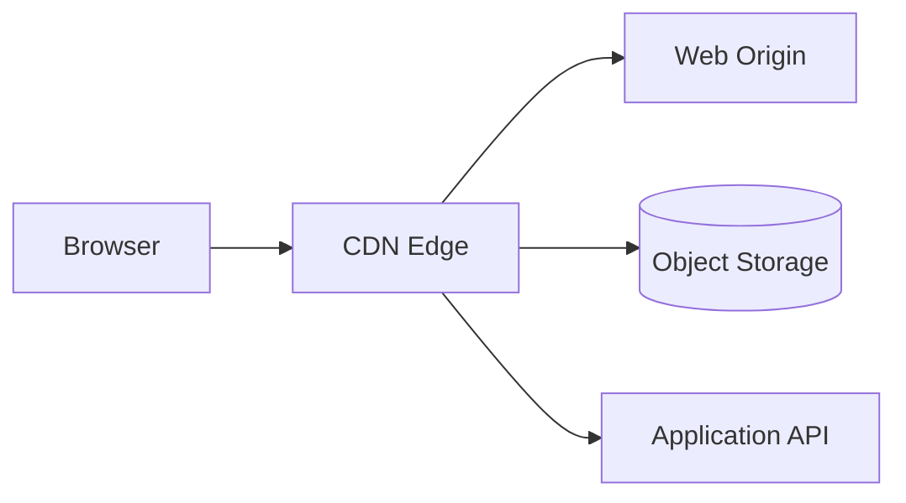

### What goes through CDN

* images
* JS
* CSS
* fonts
* product thumbnails

### What usually stays at origin

* checkout APIs
* authenticated user data
* payment operations
* private account info

---

## 27. CDN and dynamic content

Not everything should be fully cached, but some dynamic content can still benefit from CDN.

### Examples

* homepage with short TTL
* public news content
* product catalogs
* weather data
* anonymous API responses

With careful cache control, CDN can reduce origin load even for semi-dynamic content.

---

## 28. Edge eviction

Cache storage is limited, so old objects must be removed.

Common policies:

* LRU: least recently used
* LFU: least frequently used
* TTL-based expiration
* size-based eviction

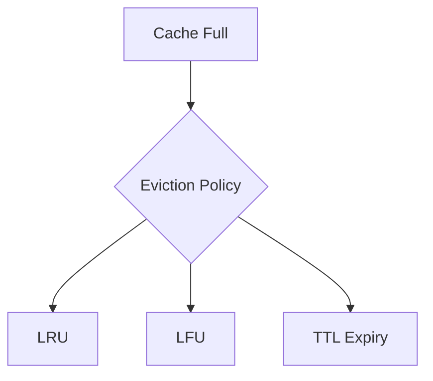

---

## 29. Consistency trade-offs

CDNs usually prefer performance over strict immediate consistency.

That means:

* content may be slightly stale
* invalidation may take time
* edge caches may differ briefly by region

This is acceptable for:

* images
* scripts
* public pages

It is dangerous for:

* user balances
* checkout states
* private account info

---

## 30. CDN failure handling

### If edge cache is down

Route to another edge or origin.

### If origin is down

Serve stale cached content if allowed.

### If network is partitioned

Use the nearest healthy cache or degrade gracefully.

### If purge fails

Retry invalidation and shorten TTL as fallback.

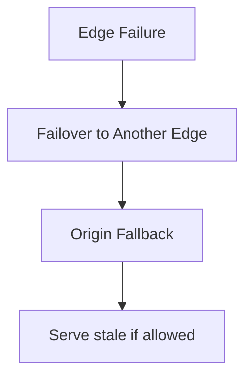

---

## 31. CDN observability

A production CDN needs deep observability.

### Logs

* request path
* cache status
* response code
* region
* latency
* origin fetch time

### Metrics

* cache hit ratio
* origin response time
* 4xx/5xx counts
* bandwidth by region
* purge success rate

### Traces

* edge lookup
* origin fetch
* security validation
* revalidation timing

---

## 32. Common CDN use cases

### Static websites

Serve HTML, JS, CSS, and images globally.

### E-commerce

Speed up product pages and media.

### Media platforms

Serve images, audio, and video.

### SaaS apps

Cache public assets and downloadable files.

### Global APIs

Reduce latency for read-heavy public data.

---

## 33. CDN trade-offs

| Advantage            | Disadvantage                                |
| -------------------- | ------------------------------------------- |
| Faster load times    | Extra architecture complexity               |
| Lower origin load    | Cache invalidation is hard                  |
| Better global reach  | Stale content risk                          |
| Better resilience    | Security misconfigurations can be dangerous |
| Lower bandwidth cost | Dynamic content needs careful handling      |

---

## 34. Best practices

* version static assets in filenames
* keep cache keys minimal
* use short TTLs for dynamic content
* use long TTLs for immutable assets
* purge carefully
* protect private content with signed URLs
* monitor cache hit ratio
* use origin shielding
* validate headers and normalize URLs
* do not cache personalized responses accidentally

---

## 35. Interview-style summary

A CDN is a distributed caching and delivery system that places content closer to users.

It works by:

* routing user requests to nearby edge servers
* serving cache hits directly
* fetching from origin on misses
* storing responses at edge
* invalidating or refreshing content when needed

It improves:

* latency
* scalability
* availability
* cost
* user experience

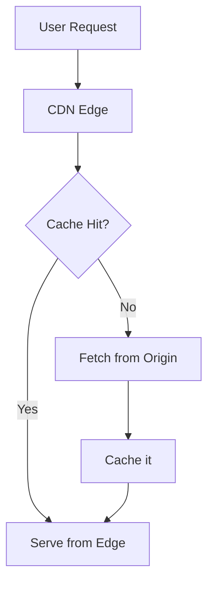

---

## 36. Final takeaway

CDN is one of the most important building blocks of modern internet systems.

It sits between users and origin servers, caching content and delivering it from locations physically closer to users. That simple idea unlocks huge performance gains, lower infrastructure cost, and better resilience.

In practice, a CDN is not just a cache. It is:

* a global routing layer
* a security layer
* a content optimization layer
* an availability layer
* and a major part of how fast modern apps feel
