# 📚 System Design Theorems

## Table of Contents

1. [CAP Theorem](#1-cap-theorem)
2. [PACELC Theorem](#2-pacelc-theorem)
3. [Little's Law](#3-littles-law)
4. [Amdahl's Law](#4-amdahls-law)
5. [FLP Impossibility Theorem](#5-flp-impossibility-theorem)
6. [Byzantine Generals Problem](#6-byzantine-generals-problem)
7. [Two Generals Problem](#7-two-generals-problem)
8. [Lamport Logical Clocks](#8-lamport-logical-clocks)
9. [Consistent Hashing](#9-consistent-hashing)
10. [Fallacies of Distributed Computing](#10-fallacies-of-distributed-computing)


# 1. CAP Theorem

## Overview

The **CAP Theorem**, also known as **Brewer's Theorem**, was proposed by **Eric Brewer**. It states that a distributed system can guarantee **at most two** of the following three properties when a **network partition** occurs:

### Consistency (C)

Every read receives the **most recent write** or an **error**.

> Also known as **linearizability**.

### Availability (A)

Every request to a **non-failing node** receives a **non-error response**, even if it may not contain the latest data.

### Partition Tolerance (P)

The system continues operating even when communication between nodes is interrupted due to dropped or delayed network messages.

---

## Key Idea

Since **network partitions are inevitable** in distributed systems, **Partition Tolerance (P)** is generally considered mandatory.

When a partition occurs, a system must choose between:

- **Consistency (CP)** — Prioritize correct and up-to-date data.
- **Availability (AP)** — Prioritize serving requests, even if data may be stale.

> **CAP is about trade-offs during network partitions, not normal operation.**

---

## Architecture Trade-offs

| Architecture | Behavior During Partition | Common Use Cases |
|--------------|---------------------------|------------------|
| **CP (Consistency + Partition Tolerance)** | Rejects reads or writes (or returns errors) on isolated nodes to prevent stale or conflicting data. | Banking, financial ledgers, inventory reservations, distributed locks, configuration management. |
| **AP (Availability + Partition Tolerance)** | Continues serving reads and writes using local data. Conflicts are resolved later using techniques like eventual consistency. | Social media feeds, shopping carts, messaging systems, DNS, recommendation systems. |

---

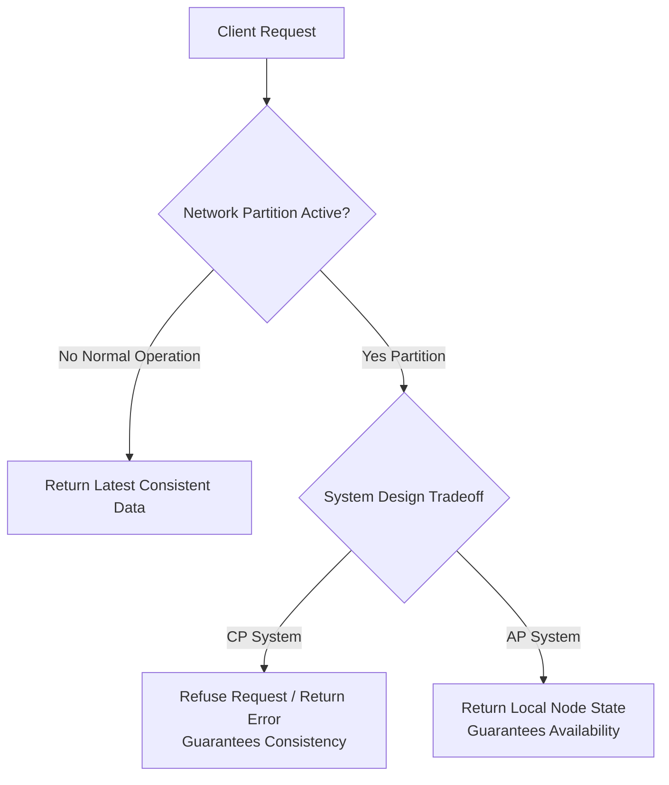

## Example Technologies

### CP Systems

- Google Spanner
- Apache ZooKeeper
- etcd
- HBase
- PostgreSQL High Availability

### AP Systems

- Apache Cassandra
- Amazon DynamoDB (default configuration)
- Riak
- CouchDB
- DNS

---

## Summary

- **C** → Always return the latest data.
- **A** → Always respond to requests.
- **P** → Continue operating despite network failures.

When a **network partition** happens:

- Choose **CP** if correctness is critical.
- Choose **AP** if availability is more important.

There is **no distributed system that can simultaneously guarantee Consistency, Availability, and Partition Tolerance during a partition.**


## Code Example

```python
from enum import Enum
from typing import Optional

class SystemMode(Enum):
    CP_MODE = "CP"
    AP_MODE = "AP"

class DistributedNode:
    def __init__(self, node_id: str, mode: SystemMode):
        self.node_id = node_id
        self.mode = mode
        self.data_store = {"value": "initial_state"}
        self.is_partitioned = False

    def write(self, key: str, value: str) -> bool:
        if self.is_partitioned:
            if self.mode == SystemMode.CP_MODE:
                # CP Choice: Refuse write because quorum / consensus cannot be reached
                raise ConnectionError(f"[{self.node_id}] CP Error: Cannot guarantee consistency across partition.")
            else:
                # AP Choice: Accept write locally, risk divergence
                self.data_store[key] = value
                print(f"[{self.node_id}] AP Write Accepted (Dirty/Diverged): {key}={value}")
                return True
        self.data_store[key] = value
        return True

    def read(self, key: str) -> Optional[str]:
        if self.is_partitioned and self.mode == SystemMode.CP_MODE:
            raise ConnectionError(f"[{self.node_id}] CP Error: Node isolated. Refusing potentially stale read.")
        return self.data_store.get(key)

# Execution Demo
cp_node = DistributedNode("Node-1", SystemMode.CP_MODE)
cp_node.is_partitioned = True

try:
    cp_node.write("balance", "100")
except ConnectionError as e:
    print(e)
```


----

# 2. PACELC Theorem

## Overview

The **PACELC Theorem**, proposed by **Daniel Abadi** in **2012**, extends the **CAP Theorem** by describing trade-offs that distributed systems make **both during network partitions and during normal operation**.

While CAP only explains what happens when a network partition occurs, PACELC answers an additional question:

> **What trade-off does the system make when there is no partition?**

PACELC states:

> **If there is a Partition (P), choose between Availability (A) and Consistency (C).**

> **Else (E), choose between Latency (L) and Consistency (C).**

In short:

- **PAC → During a Partition:** Availability vs Consistency
- **ELC → During Normal Operation:** Latency vs Consistency

---

# Why PACELC?

Network partitions are relatively rare.

However, databases spend almost all of their time operating under **healthy network conditions**.

Even when the network is healthy, distributed databases still face an important trade-off:

- Wait for multiple replicas to acknowledge a write (**Strong Consistency**)
- Respond immediately and replicate later (**Low Latency**)

PACELC explains this real-world decision.

---

# PACELC Decision Model

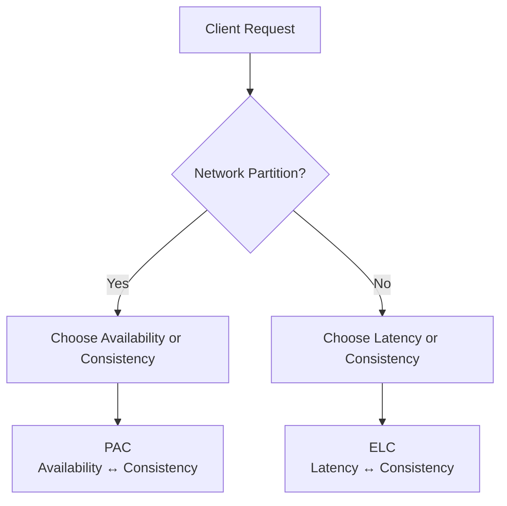

---

# Understanding the Trade-offs

## During a Partition (PAC)

A network failure prevents nodes from communicating.

The system must decide whether to:

- Continue serving requests (**Availability**)
- Reject requests to avoid inconsistent data (**Consistency**)

---

## During Normal Operation (ELC)

The network is healthy.

The system must decide whether to:

- Wait for multiple replicas before responding (**Consistency**)
- Respond immediately and replicate later (**Low Latency**)

---

# The Four PACELC Classifications

## PC / EC

### During Partition

Prioritize **Consistency**

### During Normal Operation

Prioritize **Consistency**

Characteristics

- Wait for replication acknowledgements
- Strong consistency
- Higher latency

Examples

- Google Spanner
- CockroachDB
- HBase

---

## PA / EL

### During Partition

Prioritize **Availability**

### During Normal Operation

Prioritize **Low Latency**

Characteristics

- Immediate responses
- Eventual consistency
- Fast user experience

Examples

- Apache Cassandra
- Amazon DynamoDB (default)

---

## PA / EC

### During Partition

Prioritize **Availability**

### During Normal Operation

Prioritize **Consistency**

Characteristics

- Available during failures
- Stronger consistency during normal operations

Example

- MongoDB (Majority Read/Write Concerns)

---

## PC / EL

### During Partition

Prioritize **Consistency**

### During Normal Operation

Prioritize **Low Latency**

Characteristics

- Reject conflicting writes during failures
- Optimize latency when network is healthy

Example

- Yahoo! PNUTS

---

# PACELC Classification Table

| Classification | During Partition | During Normal Operation | Example Systems |
|----------------|------------------|--------------------------|-----------------|
| **PC / EC** | Consistency | Consistency | Google Spanner, CockroachDB, HBase |
| **PA / EL** | Availability | Low Latency | Apache Cassandra, Amazon DynamoDB |
| **PA / EC** | Availability | Consistency | MongoDB (Majority Write Concern) |
| **PC / EL** | Consistency | Low Latency | Yahoo! PNUTS |

---

# CAP vs PACELC

| CAP Theorem | PACELC Theorem |
|-------------|----------------|
| Focuses only on network partitions | Covers partitions and normal operation |
| Consistency vs Availability | Availability vs Consistency during partitions |
| Doesn't explain normal operation | Explains Latency vs Consistency |
| Simpler model | More practical for modern distributed databases |

---

# Example Architecture

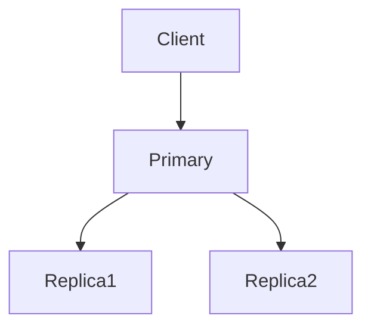

---

# Strong Consistency Example

The primary waits until replicas acknowledge the write before responding.

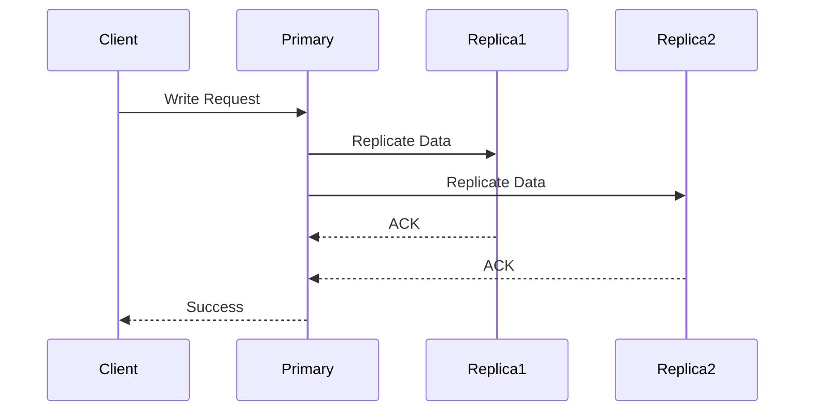

Advantages

- Strong consistency
- Latest data everywhere
- No stale reads

Disadvantages

- Higher latency
- Slower writes

---

# Low Latency Example

The primary immediately responds to the client.

Replication happens later.

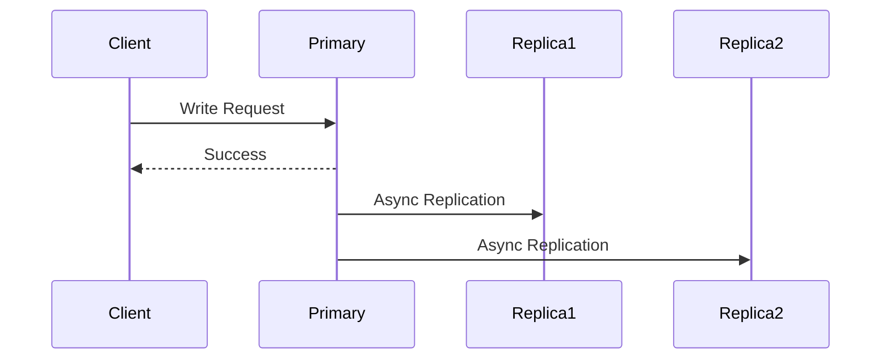

Advantages

- Very fast response
- Lower latency
- Better user experience

Disadvantages

- Temporary stale reads
- Eventual consistency

---

# Code Examples

## 1. Strong Consistency (PC / EC)

The client waits until replicas acknowledge the write.

```ts
async function write(data: Data) {
  await primary.save(data);

  // Wait for all replicas
  await Promise.all([
    replica1.save(data),
    replica2.save(data),
  ]);

  return {
    success: true,
  };
}
```

Characteristics

- Strong consistency
- Higher latency
- Latest data guaranteed

---

## 2. Low Latency (PA / EL)

The client receives success immediately.

Replication happens asynchronously.

```ts
async function write(data: Data) {
  await primary.save(data);

  // Background replication
  replica1.save(data);
  replica2.save(data);

  return {
    success: true,
  };
}
```

Characteristics

- Very low latency
- Faster writes
- Eventual consistency

---

## 3. Consistency During Partition (CP)

Reject writes when a majority of replicas cannot be reached.

```ts
async function write(data: Data) {
  if (!majorityAvailable()) {
    throw new Error("Network partition detected");
  }

  await replicateToMajority(data);

  return {
    success: true,
  };
}
```

Characteristics

- Prevents conflicting writes
- Prioritizes correctness
- Some requests fail during partitions

---

## 4. Availability During Partition (AP)

Accept writes locally and synchronize later.

```ts
async function write(data: Data) {
  await localReplica.save(data);

  syncInBackground(data);

  return {
    success: true,
  };
}
```

Characteristics

- Always responds
- Better availability
- Temporary inconsistency possible

---

# Strategy Comparison

| Strategy | Wait for Replicas | Available During Partition | Latency | Consistency |
|------------|-------------------|----------------------------|----------|--------------|
| **PC / EC** | ✅ Yes | ❌ No | High | Strong |
| **PA / EL** | ❌ No | ✅ Yes | Low | Eventual |
| **PA / EC** | Optional | ✅ Yes | Medium | Strong |
| **PC / EL** | Depends | ❌ No | Low | Strong |

---

# Real-World Examples

| Database | PACELC Classification | Why |
|-----------|-----------------------|-----|
| Google Spanner | PC / EC | Strong global consistency |
| CockroachDB | PC / EC | Synchronous replication |
| Apache Cassandra | PA / EL | Fast writes with eventual consistency |
| Amazon DynamoDB | PA / EL | Optimized for availability and latency |
| MongoDB (Majority Writes) | PA / EC | Strong consistency with majority acknowledgements |
| Yahoo! PNUTS | PC / EL | Consistency during failures with low latency otherwise |

---

# When to Choose Which?

Choose **Consistency** when:

- Banking
- Inventory
- Payments
- Distributed locks
- Financial systems

Choose **Low Latency** when:

- Social media
- Recommendation systems
- Analytics
- User feeds
- Product catalog

Choose **Availability** when:

- Messaging
- Shopping carts
- DNS
- Chat applications

---

# Interview Tips

### CAP asks

> What happens **during a network partition?**

### PACELC asks

> What happens **during a partition and when everything is working normally?**

Remember this shortcut:

- **CAP → Failure Mode**
- **PACELC → Failure + Normal Operation**

---

# Summary

PACELC extends CAP by introducing **Latency** as an additional design consideration.

It explains two separate trade-offs:

### During a Network Partition

Choose between:

- Availability
- Consistency

### During Normal Operation

Choose between:

- Low Latency
- Strong Consistency

The key takeaway is:

> **Modern distributed databases are designed not only for failures but also for everyday performance. PACELC captures both realities, making it a more complete model than CAP for understanding distributed database behavior.**


# 3. Little's Law

## Overview

**Little's Law** is one of the most fundamental principles in **Queueing Theory**, introduced by **John Little** in **1961**.

It establishes a simple relationship between **Concurrency**, **Throughput**, and **Latency** in any stable system.

The law states:

```text
L = λ × W
```

Where:

| Symbol | Meaning |
|--------|---------|
| **L** | Average number of requests currently in the system (Concurrency) |
| **λ (Lambda)** | Average throughput or arrival rate (Requests per second) |
| **W** | Average latency or response time per request (Seconds) |

> If you know any **two** of these values, you can always calculate the third.

---

# Why is Little's Law Important?

Little's Law is widely used in system design for:

- Capacity planning
- Thread pool sizing
- Database connection pool sizing
- Queue length estimation
- Autoscaling decisions
- Memory estimation
- Performance analysis

---

# Visual Representation

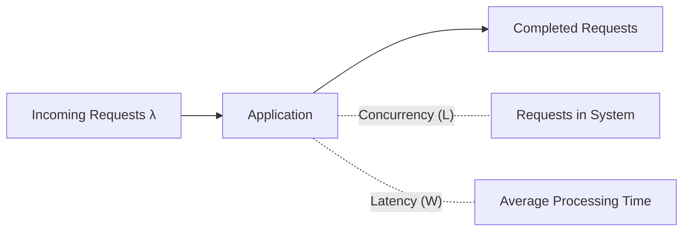

---

# The Formula

```text
L = λ × W
```

Where:

- **Concurrency = Throughput × Latency**

This means:

- Higher throughput increases concurrency.
- Higher latency also increases concurrency.

---

# Example 1 — Calculate Concurrency

A web server receives:

- Throughput = **100 requests/sec**
- Average latency = **200 ms (0.2 sec)**

Formula:

```text
L = λ × W

L = 100 × 0.2

L = 20
```

**Result**

The server is processing approximately **20 concurrent requests**.

---

# Example 2 — Calculate Latency

Given:

- Concurrency = **300 requests**
- Throughput = **150 requests/sec**

Formula:

```text
W = L / λ

W = 300 / 150

W = 2 seconds
```

**Result**

Average request latency is **2 seconds**.

---

# Example 3 — Calculate Throughput

Given:

- Concurrency = **500**
- Average latency = **5 seconds**

Formula:

```text
λ = L / W

λ = 500 / 5

λ = 100 requests/sec
```

**Result**

The system processes **100 requests every second**.

---

# Request Lifecycle

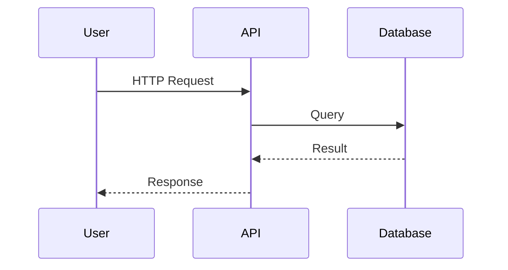

Every request enters the system, spends some time being processed, and eventually leaves.

- Total time inside = **W**
- Total concurrent requests = **L**

---

# How Little's Law Works

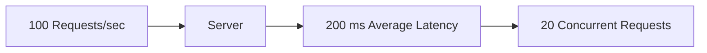

Notice:

- Increasing latency increases concurrency.
- Increasing throughput also increases concurrency.

---

# Capacity Planning Example

Suppose your API should support:

- **500 requests/sec**
- **100 ms average latency**

Formula:

```text
L = λ × W

L = 500 × 0.1

L = 50
```

The server should support approximately **50 concurrent requests**.

---

# Thread Pool Example

Suppose:

- Throughput = **800 requests/sec**
- Request processing time = **50 ms**

Formula:

```text
L = λ × W

L = 800 × 0.05

L = 40
```

A thread pool of about **40 worker threads** is required.

---

# Database Connection Pool Example

Suppose:

- Database handles **300 queries/sec**
- Each query takes **40 ms**

Formula:

```text
L = λ × W

L = 300 × 0.04

L = 12
```

A pool of approximately **12 active database connections** is needed.

---

# Code Example 1 — Calculate Concurrency

```ts
const throughput = 100; // requests/sec
const latency = 0.2;    // seconds

const concurrency = throughput * latency;

console.log(concurrency);
// 20
```

---

# Code Example 2 — Calculate Latency

```ts
const concurrency = 300;
const throughput = 150;

const latency = concurrency / throughput;

console.log(latency);
// 2 seconds
```

---

# Code Example 3 — Calculate Throughput

```ts
const concurrency = 500;
const latency = 5;

const throughput = concurrency / latency;

console.log(throughput);
// 100 requests/sec
```

---

# Utility Function

```ts
function calculateConcurrency(
  throughput: number,
  latency: number
): number {
  return throughput * latency;
}

const concurrentRequests = calculateConcurrency(800, 0.05);

console.log(concurrentRequests);
// 40
```

---

# Real-World Applications

Little's Law helps estimate:

- Thread pool size
- Worker pool size
- Database connection pools
- Queue size
- Kafka consumers
- Memory requirements
- Maximum concurrent users
- Autoscaling thresholds
- API server capacity

---

# System Design Example

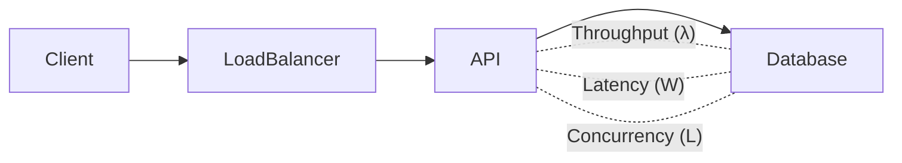

If database latency increases:

- More requests stay in memory.
- Concurrency increases.
- More threads are needed.
- Larger connection pools are required.
- Memory usage increases.

---

# Advantages

- Very simple formula
- Works for almost every stable queueing system
- Great for infrastructure planning
- Easy to estimate server capacity
- Useful during system design interviews
- Helps predict resource utilization

---

# Limitations

Little's Law assumes:

- Stable system
- Long-term averages
- Arrival rate ≈ Completion rate

It does **not** model:

- Traffic spikes
- Burst workloads
- Queue priority
- Tail latency (P99)
- System failures

---

# Interview Tips

If you're asked:

> "How many threads should this API server have?"

Start with:

```text
L = λ × W
```

If you're asked:

> "How many database connections are required?"

Again use:

```text
L = λ × W
```

If you're asked:

> "How much memory is needed for concurrent requests?"

Little's Law is often the first calculation.

---

# Quick Reference

| Known Values | Formula |
|--------------|---------|
| Throughput + Latency | **L = λ × W** |
| Concurrency + Throughput | **W = L / λ** |
| Concurrency + Latency | **λ = L / W** |

---

# Summary

Little's Law is one of the most practical formulas in system design.

It relates:

- **Concurrency (L)**
- **Throughput (λ)**
- **Latency (W)**

Using:

```text
L = λ × W
```

Engineers can estimate:

- Thread pool size
- Connection pool size
- Queue length
- Memory requirements
- API capacity
- Autoscaling thresholds
- Server sizing

> **Little's Law tells us that Concurrency = Throughput × Latency. Improve latency, and concurrency decreases. Increase throughput, and concurrency increases.**


# 4. Amdahl's Law

## Overview

**Amdahl's Law** is a fundamental principle in **parallel computing** and **system design**, proposed by **Gene Amdahl** in **1967**.

It explains the **maximum theoretical speedup** that can be achieved by adding more processors or parallel workers to a system.

The key insight is:

> **The sequential (non-parallelizable) part of a program ultimately limits the maximum performance improvement, regardless of how many processors are added.**

---

# The Formula

```text
                 1
S = --------------------------
    (1 - p) + (p / s)
```

Where:

| Symbol | Meaning |
|--------|---------|
| **S** | Overall theoretical speedup |
| **p** | Fraction of work that can be parallelized |
| **1 − p** | Sequential (non-parallelizable) portion |
| **s** | Number of processors (or speedup of parallel part) |

---

# What Does It Mean?

Suppose an application spends:

- **90%** of its execution time processing requests (parallelizable)
- **10%** doing setup and cleanup (sequential)

Even if you had **1,000 CPUs**, that remaining **10%** still runs on one processor.

Therefore, the application can never become infinitely fast.

---

# Visual Representation

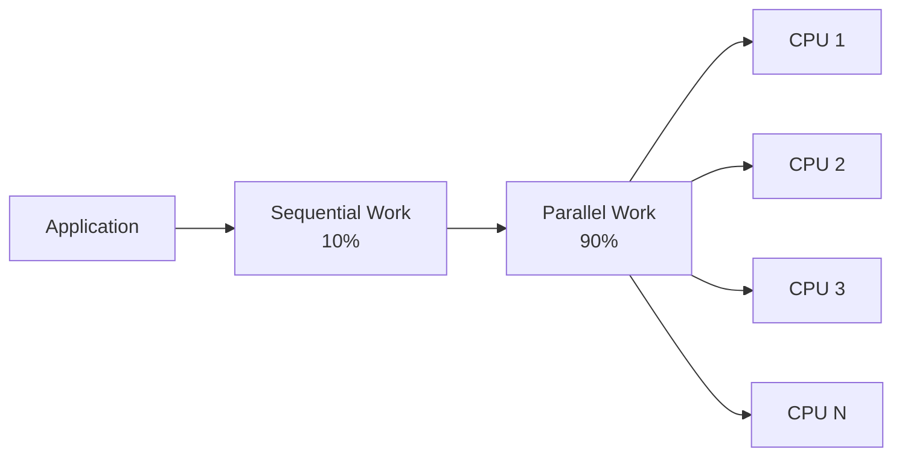

Only the **parallel portion** benefits from additional CPUs.

The sequential portion becomes the bottleneck.

---

# Example 1

Suppose:

- Parallelizable work = **90%**
- Sequential work = **10%**
- CPUs = **4**

Formula:

```text
S = 1 / ((1 - p) + (p / s))

S = 1 / (0.10 + (0.90 / 4))

S = 1 / (0.10 + 0.225)

S = 3.08x
```

Although we added **4 CPUs**, we only achieve about **3.08×** speedup.

---

# Example 2

Suppose:

- Parallelizable work = **95%**
- CPUs = **16**

```text
S = 1 / (0.05 + (0.95 / 16))

S = 9.14x
```

Even with **16 processors**, we only achieve approximately **9×** speedup.

---

# Infinite CPUs

What if we had **unlimited processors**?

As:

```text
s → ∞
```

The formula becomes:

```text
Maximum Speedup = 1 / (1 - p)
```

Example:

If **95%** of work is parallel:

```text
Maximum Speedup

= 1 / 0.05

= 20x
```

Even with **10,000 CPUs**, the program **can never exceed 20× speedup**.

---

# Speedup Visualization

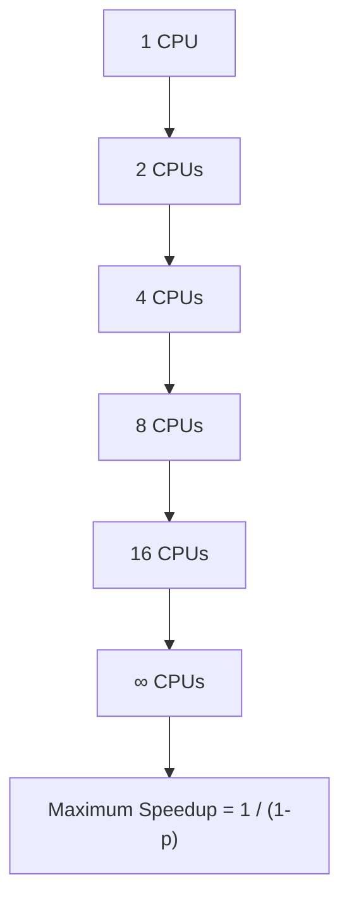

Performance eventually reaches a limit.

---

# Why This Happens

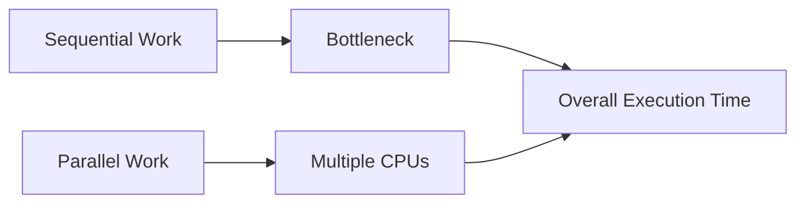

No matter how much parallel work improves, the sequential bottleneck remains.

---

# Code Example 1

Calculate theoretical speedup.

```ts
function amdahlSpeedup(
  parallelFraction: number,
  processors: number
) {
  return 1 / (
    (1 - parallelFraction) +
    (parallelFraction / processors)
  );
}

console.log(
  amdahlSpeedup(0.9, 4)
);

// 3.08
```

---

# Code Example 2

Maximum possible speedup.

```ts
function maxSpeedup(
  parallelFraction: number
) {
  return 1 / (1 - parallelFraction);
}

console.log(
  maxSpeedup(0.95)
);

// 20
```

---

# Code Example 3

Compare different CPU counts.

```ts
const p = 0.9;

for (const cpu of [1, 2, 4, 8, 16, 32]) {
  const speedup =
    1 / ((1 - p) + (p / cpu));

  console.log(cpu, speedup.toFixed(2));
}
```

Output

```text
1   1.00x
2   1.82x
4   3.08x
8   4.71x
16  6.40x
32  7.80x
```

Notice how adding more CPUs provides **diminishing returns**.

---

# System Design Example

Imagine an API server.

Request processing consists of:

- Authentication
- Database query
- Business logic
- Response generation

```mermaid
flowchart LR

Client

-->

API

-->

Authentication

-->

Database

-->

Business Logic

-->

Response
```

Suppose:

| Stage | Parallelizable |
|--------|----------------|
| Authentication | ❌ No |
| Database Query | ✅ Yes |
| Business Logic | ✅ Yes |
| Response Generation | ❌ No |

Adding more servers only speeds up the parallelizable stages.

Authentication and response generation remain bottlenecks.

---

# Scaling Example

Current server:

- 100 requests/sec

Parallelizable work:

- 80%

Sequential work:

- 20%

Adding:

- 8 CPUs

Theoretical speedup:

```text
S = 1 / (0.20 + (0.80 / 8))

S = 3.33x
```

New throughput:

```text
100 × 3.33

≈ 333 requests/sec
```

Not **800 requests/sec**.

---

# Trade-offs

| More CPUs | Result |
|------------|--------|
| ✅ Faster parallel processing | Better throughput |
| ✅ Better resource utilization | Handles more requests |
| ❌ Higher infrastructure cost | More machines required |
| ❌ Synchronization overhead | Increased communication |
| ❌ Context switching | CPU scheduling overhead |
| ❌ Diminishing returns | Less improvement after a point |

---

# Real-World Applications

Amdahl's Law is used when designing:

- Multi-threaded applications
- Distributed systems
- Load balancers
- Kubernetes workloads
- Parallel algorithms
- GPU computing
- MapReduce jobs
- Batch processing
- Data pipelines
- High-performance computing

---

# Advantages

- Predicts scalability limits
- Helps estimate ROI of adding hardware
- Identifies bottlenecks
- Encourages optimization of sequential code
- Useful for capacity planning
- Widely used in performance engineering

---

# Limitations

Amdahl's Law assumes:

- Fixed workload
- Constant sequential fraction
- No communication overhead
- No synchronization cost
- Perfect load balancing

Real systems often experience:

- Network latency
- Lock contention
- Cache misses
- Uneven workloads
- Scheduling overhead

Therefore, actual performance is usually lower than predicted.

---

# Interview Tips

If asked:

> "Will doubling CPUs double performance?"

Answer:

**No.**

Use **Amdahl's Law**.

If asked:

> "Why doesn't adding more servers keep improving throughput?"

Explain:

- Sequential bottlenecks
- Synchronization
- Diminishing returns

---

# Quick Reference

| Parallel Fraction | Maximum Speedup |
|------------------:|----------------:|
| 50% | 2× |
| 75% | 4× |
| 90% | 10× |
| 95% | 20× |
| 99% | 100× |

---

# Summary

Amdahl's Law teaches that **adding more processors does not produce unlimited performance gains**.

The sequential portion of a program eventually becomes the bottleneck.

Using:

```text
                 1
S = --------------------------
    (1 - p) + (p / s)
```

Engineers can estimate:

- Maximum throughput improvement
- CPU scaling efficiency
- Infrastructure ROI
- Parallel processing limits
- Performance bottlenecks

> **The more sequential your application is, the less benefit you'll gain from adding CPUs or servers. Optimizing the serial portion often delivers greater long-term performance than simply scaling hardware.**


# 5. FLP Impossibility Theorem

## Overview

The **FLP Impossibility Theorem**, published by **Michael Fischer**, **Nancy Lynch**, and **Michael Paterson** in **1985**, is one of the most important theoretical results in distributed systems.

It proves that:

> **In a completely asynchronous distributed system, no deterministic consensus algorithm can guarantee both Safety and Liveness if even one process may crash.**

In other words:

> **Perfect consensus is impossible in an asynchronous system with even a single crash failure.**

---

# The Problem

Distributed systems need multiple nodes to agree on a single value.

For example:

- Which transaction should be committed?
- Who is the leader?
- Which log entry should be applied?

Consensus algorithms attempt to solve this.

However, FLP proves that **perfect consensus cannot always be guaranteed.**

---

# Key Concepts

### Asynchronous Network

There is **no upper bound** on:

- Network latency
- Message delivery time
- Process execution speed

A delayed message might arrive:

- Immediately
- After 5 seconds
- After 5 minutes
- Never

The receiver cannot know which.

---

### Safety

Safety means:

> **Nodes never make conflicting decisions.**

Example:

```text
Node A → Commit Transaction

Node B → Abort Transaction
```

This violates safety.

Correct behavior:

```text
All nodes agree on Commit

OR

All nodes agree on Abort
```

---

### Liveness

Liveness means:

> **The system eventually reaches a decision.**

Even if the network is slow, the protocol should eventually complete.

---

### Crash Failure

A node unexpectedly stops responding.

The difficult part is:

The other nodes cannot determine whether:

- The node crashed
- The node is alive but extremely slow

Both situations appear identical.

---

# Why Consensus Becomes Impossible

Imagine three nodes.

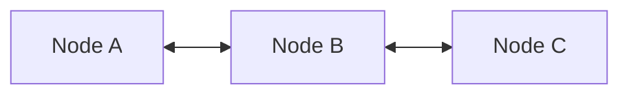

Suppose Node C suddenly stops responding.

Possible reasons:

- Node crashed
- Network is slow
- Message delayed
- CPU overloaded

The remaining nodes cannot distinguish these situations.

Waiting forever breaks **Liveness**.

Making a decision immediately may break **Safety**.

---

# FLP Decision

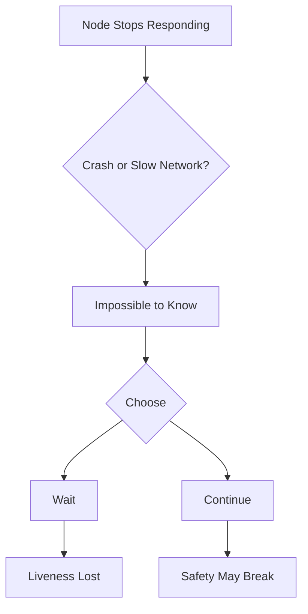

This is the central insight of FLP.

---

# Why Does This Happen?

In an asynchronous system:

- No clocks are synchronized.
- No timeout is guaranteed to be correct.
- Messages may be delayed indefinitely.

Therefore:

A delayed message and a crashed node are indistinguishable.

---

# Example

Suppose three replicas participate in leader election.

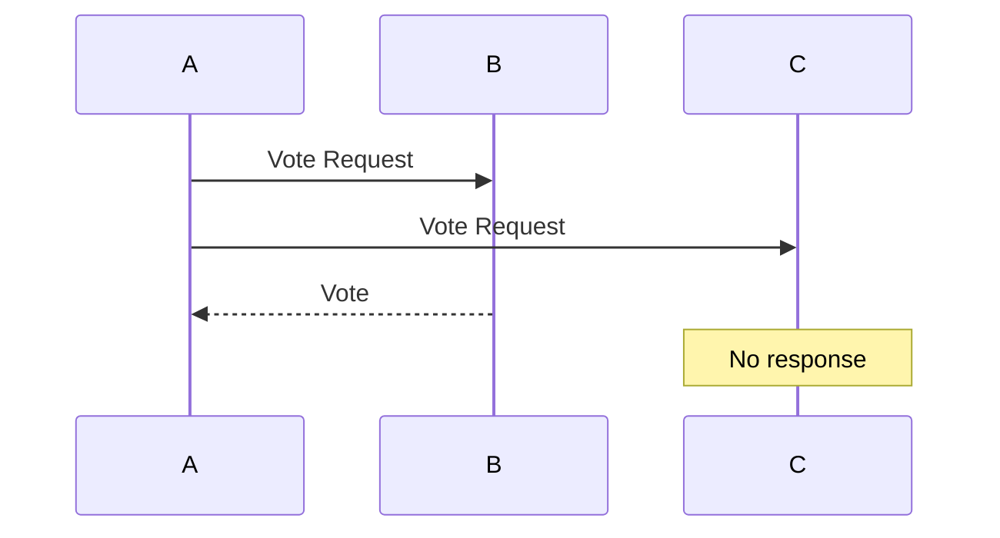

Question:

Did **C crash**?

Or

Is **C simply slow**?

The protocol cannot know.

---

# Code Example 1

Waiting forever preserves safety.

```ts
while (!allVotesReceived()) {
  // Wait forever
}
```

Advantages

- No conflicting decisions

Disadvantages

- System may never finish

Liveness is lost.

---

# Code Example 2

Proceed after a timeout.

```ts
setTimeout(() => {
  electLeader();
}, 5000);
```

Advantages

- Eventually makes progress

Disadvantages

- Slow nodes may still be alive

Safety could be compromised without additional protocol guarantees.

---

# Code Example 3

Randomized Election (Raft)

Instead of fixed timeouts, each node waits for a random duration.

```ts
const timeout =
  randomBetween(150, 300);

setTimeout(() => {
  startElection();
}, timeout);
```

Randomization reduces election collisions.

This is one practical workaround inspired by FLP.

---

# Practical Workarounds

Real-world consensus protocols avoid FLP's limitations by **relaxing the assumptions**.

Instead of assuming a perfectly asynchronous network, they assume **partial synchrony**.

Examples:

- Bounded delays most of the time
- Heartbeats
- Election timeouts
- Randomized retries

---

# How Modern Consensus Works

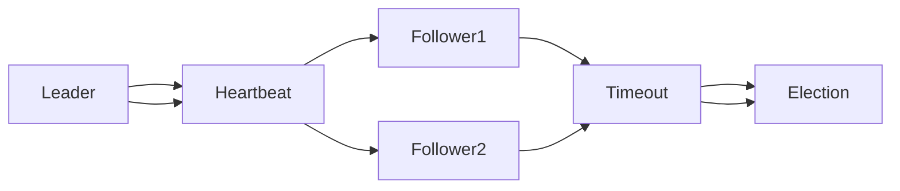

Followers wait for heartbeats.

If none arrive before a timeout, a new election begins.

---

# Consensus Algorithms That Work Around FLP

| Algorithm | Workaround |
|------------|------------|
| **Paxos** | Majority voting and partial synchrony |
| **Raft** | Randomized election timeouts |
| **Zab (ZooKeeper)** | Leader election with heartbeats |
| **Viewstamped Replication** | View changes and quorum |
| **Multi-Paxos** | Stable leader optimization |

None of these violate FLP.

Instead, they weaken its assumptions.

---

# Theoretical Constraint vs Practical Solution

| FLP Limitation | Practical Workaround |
|----------------|----------------------|
| No guaranteed consensus in a fully asynchronous system | Assume partial synchrony |
| Cannot distinguish crash from delay | Heartbeats + configurable timeouts |
| Deterministic protocols may never terminate | Randomized election timers |
| Waiting forever preserves safety | Timeout-based leader election |
| Immediate decisions risk inconsistency | Majority quorum protocols |

---

# Trade-offs

| Choice | Benefit | Drawback |
|---------|----------|----------|
| Wait indefinitely | Strong safety | No liveness |
| Use timeouts | Better liveness | Timeout may be inaccurate |
| Randomized elections | Reduces split votes | Slightly unpredictable |
| Majority quorum | Consistent decisions | Higher communication cost |
| Heartbeats | Detect failures quickly | Additional network overhead |

---

# Real-World Applications

FLP influences the design of:

- Raft
- Paxos
- ZooKeeper
- etcd
- Consul
- Kubernetes Control Plane
- Apache Kafka Controller
- CockroachDB
- Google Spanner

---

# Interview Tips

If asked:

> "Why can't distributed systems always reach consensus?"

Answer:

Because **FLP proves that deterministic consensus is impossible in a completely asynchronous system with even one crash failure.**

If asked:

> "How does Raft solve FLP?"

Answer:

It **doesn't solve FLP**.

It works around it by assuming **partial synchrony** and using **randomized election timeouts**.

---

# Key Takeaways

- FLP is a **proof of impossibility**, not an algorithm.
- It applies only to **fully asynchronous** systems.
- The impossibility arises because nodes cannot distinguish a **crashed node** from a **slow node**.
- Real-world systems avoid the limitation using:
  - Timeouts
  - Heartbeats
  - Quorums
  - Randomization
  - Partial synchrony

---

# Summary

The **FLP Impossibility Theorem** establishes a fundamental limit of distributed computing.

It states that:

- A **fully asynchronous** distributed system
- With **even one possible crash failure**
- Cannot guarantee both:
  - **Safety** (correct agreement)
  - **Liveness** (eventual progress)

Modern consensus algorithms such as **Raft**, **Paxos**, and **ZooKeeper's Zab** do not violate FLP. Instead, they introduce practical assumptions like **partial synchrony**, **timeouts**, **heartbeats**, and **randomized elections** to achieve reliable consensus in real-world systems.

> **FLP teaches us that consensus is not impossible in practice—it is impossible only under the strict assumptions of a perfectly asynchronous system with crash failures.**


# 6. Byzantine Generals Problem

## Overview

The **Byzantine Generals Problem** was introduced by **Leslie Lamport**, **Robert Shostak**, and **Marshall Pease** in **1982**.

It describes one of the most difficult challenges in distributed systems:

> **How can multiple nodes reach the same decision when some nodes may behave maliciously, send conflicting messages, or intentionally lie?**

Unlike a simple **crash failure**, a Byzantine node can:

- Send different messages to different nodes.
- Corrupt data.
- Pretend to be another node.
- Lie about system state.
- Behave unpredictably.

These are known as **Byzantine Faults**.

---

# The Story

Imagine several generals surrounding a city.

They must decide:

- **Attack**
- **Retreat**

Success requires **everyone making the same decision**.

However, one or more generals may be traitors.

A traitor can send:

- "Attack" to one general.
- "Retreat" to another.

The loyal generals must still reach the same decision.

---

# Visual Representation

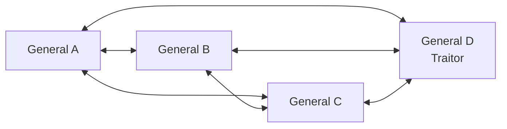

The traitorous general intentionally sends conflicting information.

---

# Byzantine Fault

A faulty node does more than stop responding.

It may:

- Send incorrect data.
- Send different data to different nodes.
- Replay old messages.
- Modify messages.
- Impersonate another node.

Example:

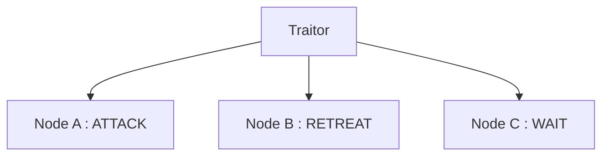

Every node receives different information.

---

# Why Is This Hard?

Suppose four generals exist.

One is a traitor.

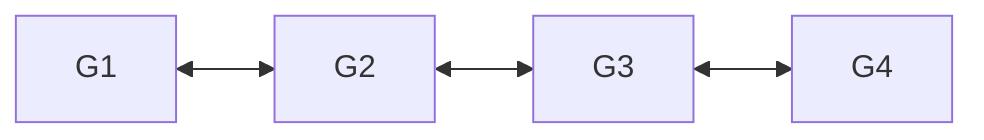

If G4 lies:

- G1 hears "Attack"
- G2 hears "Retreat"
- G3 hears "Attack"

Who is telling the truth?

No single node can determine.

---

# Byzantine Fault Tolerance

To tolerate **f Byzantine nodes**, the system must contain:

```text
N ≥ 3f + 1
```

Where:

| Symbol | Meaning |
|---------|---------|
| **N** | Total number of nodes |
| **f** | Maximum Byzantine (malicious) nodes |

This also means:

```text
f < N / 3
```

A system cannot tolerate Byzantine faults if one-third or more of its nodes are malicious.

---

# Example 1

Suppose:

```text
N = 4
```

Maximum Byzantine nodes:

```text
4 ≥ 3f + 1

3 ≥ 3f

f = 1
```

A four-node cluster tolerates **one malicious node**.

---

# Example 2

Suppose:

```text
N = 10
```

Maximum Byzantine failures:

```text
10 ≥ 3f + 1

9 ≥ 3f

f = 3
```

Ten nodes tolerate **three Byzantine failures**.

---

# Why 3f + 1?

```mermaid
flowchart LR

A[Loyal]

B[Loyal]

C[Loyal]

D[Traitor]
```

Three honest nodes outvote one malicious node.

Majority wins.

If there were only:

```mermaid
flowchart LR

A[Loyal]

B[Loyal]

C[Traitor]
```

The malicious node could confuse consensus much more easily.

---

# Message Exchange

```mermaid
sequenceDiagram

participant G1
participant G2
participant G3
participant G4

G1->>G2: Attack

G1->>G3: Attack

G1->>G4: Attack

G4-->>G2: Retreat

G4-->>G3: Wait

G4-->>G1: Attack
```

Each node receives different information from the traitor.

Consensus algorithms compare messages from multiple nodes to identify inconsistencies.

---

# Crash Fault vs Byzantine Fault

Crash fault:

```mermaid
flowchart TD

Node

-->

Crash

-->

No Response
```

Simple failure.

---

Byzantine fault:

```mermaid
flowchart TD

Node

-->

Corrupted Messages

-->

Different Replies

-->

Malicious Behavior
```

Much more difficult to detect.

---

# Code Example 1

Crash Fault Detection

```ts
if (!heartbeatReceived(node)) {
  markNodeOffline();
}
```

A crashed node simply stops responding.

---

# Code Example 2

Byzantine Validation

```ts
const votes = collectVotes();

if (majorityAgree(votes)) {
  commitTransaction();
} else {
  rejectConsensus();
}
```

Consensus requires agreement from the majority.

---

# Code Example 3

PBFT-Style Voting

```ts
const approvals = replicas.filter(
  node => node.vote === "COMMIT"
);

if (approvals.length >= (2 * f + 1)) {
  executeTransaction();
}
```

PBFT requires a supermajority before committing.

---

# Consensus Comparison

| Consensus | Fault Type | Minimum Nodes | Examples |
|------------|------------|---------------|-----------|
| **Crash Fault Tolerant (CFT)** | Crashes, delays | **N ≥ 2f + 1** | Raft, Paxos, ZooKeeper, etcd |
| **Byzantine Fault Tolerant (BFT)** | Malicious or arbitrary behavior | **N ≥ 3f + 1** | PBFT, Tendermint, HotStuff |

---

# CFT vs BFT

```mermaid
flowchart LR

A[CFT]

-->

B[Crash Failures]

B -->

C[Raft]

B -->

D[Paxos]

A2[BFT]

-->

E[Malicious Failures]

E -->

F[PBFT]

E -->

G[Tendermint]

E -->

H[Blockchain]
```

---

# Trade-offs

| Crash Fault Tolerance | Byzantine Fault Tolerance |
|------------------------|---------------------------|
| Simpler algorithms | Much more complex |
| Lower communication cost | Higher network overhead |
| Faster consensus | Slower consensus |
| Handles crashes | Handles malicious nodes |
| Suitable for trusted environments | Suitable for untrusted environments |

---

# Real-World Applications

Crash Fault Tolerant Systems

- etcd
- ZooKeeper
- Consul
- Raft
- Paxos
- Kubernetes Control Plane

Byzantine Fault Tolerant Systems

- PBFT
- Tendermint
- HotStuff
- Hyperledger Fabric
- Diem
- Blockchain networks

---

# Advantages

- Enables consensus in hostile environments
- Detects malicious behavior
- Improves system integrity
- Foundation of blockchain consensus
- Provides fault tolerance beyond crashes

---

# Limitations

- Requires more nodes
- Higher communication overhead
- More complex implementation
- Slower consensus
- Increased CPU and network usage

---

# Interview Tips

If asked:

> "Why do blockchains use Byzantine Fault Tolerance?"

Answer:

Because nodes may behave maliciously, not just crash.

---

If asked:

> "What's the difference between Raft and PBFT?"

Answer:

- **Raft** assumes nodes only crash.
- **PBFT** assumes nodes may lie or act maliciously.

---

If asked:

> "Why does BFT require 3f + 1 nodes?"

Answer:

To ensure honest nodes always outnumber malicious ones and can reach a trustworthy majority.

---

# Quick Reference

| System Size | Byzantine Nodes Tolerated |
|-------------|--------------------------:|
| 4 | 1 |
| 7 | 2 |
| 10 | 3 |
| 13 | 4 |
| 16 | 5 |

---

# Summary

The **Byzantine Generals Problem** demonstrates that achieving consensus becomes significantly harder when nodes may behave maliciously instead of simply crashing.

To tolerate **f Byzantine faults**, a distributed system must satisfy:

```text
N ≥ 3f + 1
```

This requirement forms the foundation of **Byzantine Fault Tolerant (BFT)** consensus algorithms such as **PBFT**, **Tendermint**, and **HotStuff**.

Unlike **Crash Fault Tolerant (CFT)** algorithms like **Raft** and **Paxos**, BFT systems are designed to operate correctly even when some participants intentionally send incorrect or conflicting information.

> **Crash faults stop communicating. Byzantine faults keep communicating—but they may lie.**


# 7. Two Generals Problem

## Overview

The **Two Generals Problem** is a classic thought experiment in distributed computing.

It demonstrates that:

> **Two distributed processes cannot guarantee agreement over an unreliable communication channel.**

The problem highlights a fundamental limitation of distributed systems:

> **No finite number of acknowledgments (ACKs) can provide absolute certainty that both parties have agreed.**

---

# The Story

Two armies are positioned on opposite sides of a fortified city.

Each army is led by a general.

To win, **both generals must attack at exactly the same time**.

If only one attacks:

- That army loses.
- The battle fails.

The only way to communicate is by sending messengers through enemy territory.

Unfortunately, messengers may be:

- Captured
- Delayed
- Lost

---

# Visual Representation

```mermaid
flowchart LR

A[General A]

<-->

B[Enemy Territory]

<-->

C[General B]
```

Messages must travel through an unreliable network.

---

# First Message

General A sends:

> **Attack at dawn**

```mermaid
sequenceDiagram

participant A as General A
participant B as General B

A->>B: Attack at Dawn
```

Question:

Did the message arrive?

General A doesn't know.

---

# First Acknowledgment

General B receives the message and replies:

> **ACK**

```mermaid
sequenceDiagram

participant A
participant B

A->>B: Attack at Dawn

B-->>A: ACK
```

Now General B knows the message arrived.

But...

Did **ACK** reach General A?

General B doesn't know.

---

# Second Acknowledgment

General A sends:

> **ACK₂**

```mermaid
sequenceDiagram

participant A
participant B

A->>B: Attack

B-->>A: ACK

A->>B: ACK₂
```

Now General A knows.

But...

Did **ACK₂** arrive?

General B doesn't know.

---

# Infinite Regression

The acknowledgments never end.

```mermaid
flowchart LR

Attack

-->

ACK

-->

ACK₂

-->

ACK₃

-->

ACK₄

-->

ACK₅

-->

...
```

Every acknowledgment requires another acknowledgment.

This creates an **infinite chain**.

---

# Why Is Consensus Impossible?

Suppose the last acknowledgment is lost.

```mermaid
flowchart TD

A[ACK₄ Sent]

-->

B{Delivered?}

B -->|Yes| C[Agreement]

B -->|No| D[Sender Unsure]
```

The sender never knows whether the last message arrived.

Absolute certainty is impossible.

---

# Core Insight

The problem is **not** about message delivery.

The problem is **certainty**.

Both parties must know that:

- The message arrived.
- The acknowledgment arrived.
- The acknowledgment of the acknowledgment arrived.
- ...

This never ends.

---

# Code Example 1

Naive protocol.

```ts
send("ATTACK");

waitForAck();

attack();
```

Problem:

If ACK is lost,

the sender waits forever.

---

# Code Example 2

Retry mechanism.

```ts
while (!ackReceived()) {
  send("ATTACK");
}
```

Better,

but still impossible to know whether the **last ACK** was delivered.

---

# Code Example 3

Timeout with retries.

```ts
const MAX_RETRIES = 5;

for (let i = 0; i < MAX_RETRIES; i++) {
  send("ATTACK");

  if (waitForAck()) {
    break;
  }
}
```

This increases confidence,

but **does not guarantee certainty**.

---

# Practical Engineering Solution

Modern systems don't attempt **perfect certainty**.

Instead they use:

- Timeouts
- Retries
- Sequence numbers
- Checksums
- Idempotent requests
- Connection state
- Majority quorum
- Probabilistic guarantees

---

# TCP Handshake

TCP does not solve the Two Generals Problem.

Instead, it provides **practical reliability**.

```mermaid
sequenceDiagram

participant Client
participant Server

Client->>Server: SYN

Server-->>Client: SYN + ACK

Client->>Server: ACK
```

The connection begins after the three-way handshake,

but absolute certainty is still impossible if the final ACK is lost.

TCP simply defines practical recovery behavior.

---

# Retry Architecture

```mermaid
flowchart LR

Client

-->

Network

-->

Server

Server

-->

ACK

-->

Client

Client

-->

Timeout

-->

Retry
```

Retries improve reliability,

not certainty.

---

# Distributed Systems Example

Imagine placing an online order.

Client sends:

```text
Create Order
```

The server creates the order.

The response is lost.

Should the client retry?

If yes,

the order could be created twice.

Modern systems avoid this using **idempotency keys**.

---

# Idempotent Request Example

```ts
POST /payments

Headers:
Idempotency-Key: abc123
```

If the request is retried,

the server recognizes the same key

and returns the previous result instead of creating another payment.

---

# Trade-offs

| Goal | Reality |
|------|---------|
| 100% certainty | Impossible over unreliable networks |
| Reliable communication | Achieved using retries and acknowledgments |
| Duplicate prevention | Idempotency keys |
| Faster recovery | Timeouts |
| Fault tolerance | Retries with exponential backoff |

---

# Theoretical Model vs Practical Engineering

| Theory | Practical Solution |
|---------|--------------------|
| Perfect agreement | Impossible |
| Infinite acknowledgments | Not practical |
| Lost messages | Retries |
| Lost acknowledgments | Timeouts |
| Duplicate requests | Idempotent operations |
| Network failures | TCP + retry logic |

---

# Real-World Applications

Concepts inspired by the Two Generals Problem appear in:

- TCP
- HTTP retries
- Payment gateways
- Distributed databases
- Kafka producers
- Message queues
- REST APIs
- gRPC
- Cloud storage
- Consensus protocols

---

# Advantages

Understanding this problem helps engineers:

- Design reliable retry logic
- Build idempotent APIs
- Handle packet loss
- Improve fault tolerance
- Understand distributed consensus limits

---

# Limitations

The Two Generals Problem proves that:

- Perfect certainty is impossible.
- Acknowledgments alone cannot guarantee agreement.
- Lost messages always introduce uncertainty.

No protocol can eliminate this limitation over an unreliable communication channel.

---

# Interview Tips

If asked:

> "Can TCP guarantee both sides know a message was delivered?"

Answer:

**No.**

TCP provides high reliability,

not absolute certainty.

---

If asked:

> "Why do payment APIs use idempotency keys?"

Answer:

Because retries are unavoidable,

and duplicate requests must not create duplicate operations.

---

If asked:

> "Does the Three-Way Handshake solve the Two Generals Problem?"

Answer:

No.

It provides practical connection establishment,

not mathematical certainty.

---

# Key Takeaways

- Communication channels can lose messages.
- Every acknowledgment requires another acknowledgment.
- This creates an infinite chain.
- Absolute certainty is impossible.
- Real systems rely on probability instead of certainty.

---

# Summary

The **Two Generals Problem** proves that **deterministic agreement cannot be guaranteed over an unreliable communication channel**.

Every acknowledgment introduces the need for another acknowledgment, leading to an **infinite regression**.

Instead of seeking perfect certainty, modern distributed systems embrace practical engineering techniques such as:

- Timeouts
- Retries
- TCP handshakes
- Idempotent operations
- Exponential backoff
- Consensus protocols

> **Distributed systems don't guarantee certainty—they maximize confidence while remaining resilient to failures.**


# 8. Lamport Logical Clocks

## Overview

**Lamport Logical Clocks**, introduced by **Leslie Lamport** in **1978**, provide a way to order events in a distributed system **without relying on synchronized physical clocks**.

Instead of using wall-clock time, every process maintains a **logical counter**.

The goal is to determine the **causal ordering** of events.

> If one event could have influenced another, Lamport Clocks ensure they receive timestamps reflecting that relationship.

---

# Why Do We Need Logical Clocks?

Imagine three servers located in different data centers.

Each machine has its own clock.

Even with NTP synchronization:

- Clocks drift.
- Network latency varies.
- Messages arrive at different times.

Therefore:

> **Physical timestamps cannot reliably determine which event happened first.**

Lamport Clocks solve this problem using **logical time**.

---

# Basic Idea

Every process maintains a local counter.

Before every event:

```text
C = C + 1
```

When sending a message:

- Increment the counter.
- Attach the current timestamp.

When receiving a message:

```text
C = max(C_local, C_message) + 1
```

This guarantees logical time always moves forward.

---

# Clock Update Rules

## Rule 1 — Local Event

Before executing any local event:

```text
C = C + 1
```

---

## Rule 2 — Send Message

Before sending:

```text
C = C + 1
```

Attach the timestamp to the message.

---

## Rule 3 — Receive Message

Upon receiving a message:

```text
C = max(C_local, C_message) + 1
```

---

# Visual Representation

```mermaid
sequenceDiagram

participant P1
participant P2
participant P3

Note over P1: C = 1

P1->>P2: Message (C = 2)

Note over P2: max(1,2)+1 = 3

P2->>P3: Message (C = 4)

Note over P3: max(2,4)+1 = 5
```

Each process updates its logical clock independently.

---

# Example

Initially:

```text
P1 = 0

P2 = 0

P3 = 0
```

Event sequence:

```mermaid
sequenceDiagram

participant P1
participant P2
participant P3

Note over P1: C=1

P1->>P2: Message (2)

Note over P2: C=max(0,2)+1=3

P2->>P3: Message (4)

Note over P3: C=max(0,4)+1=5
```

Final clocks:

```text
P1 = 2

P2 = 4

P3 = 5
```

---

# Local Events

Not every event is communication.

Local computation also advances time.

```mermaid
flowchart LR

A["Clock = 3"]

-->

B["Local Event"]

-->

C["Clock = 4"]

-->

D["Another Event"]

-->

E["Clock = 5"]
```

Every event increases the logical clock.

---

# Happens-Before Relationship

Lamport introduced the **Happens-Before Relation**.

```text
a → b
```

Meaning:

> Event **a** causally happened before **b**.

Lamport Clocks guarantee:

```text
If

a → b

Then

Clock(a) < Clock(b)
```

This is the most important property.

---

# What Lamport Cannot Do

Suppose:

```text
Clock(A) = 5

Clock(B) = 10
```

Does this mean:

```text
A caused B?
```

**No.**

Lamport Clocks only guarantee one direction.

```text
a → b

⇒

Clock(a) < Clock(b)
```

But:

```text
Clock(a) < Clock(b)

≠

a → b
```

Two completely independent events may still receive different timestamps.

---

# Concurrent Events

```mermaid
flowchart LR

P1["Process 1"]

-->

A["Event A"]

P2["Process 2"]

-->

B["Event B"]
```

No messages are exchanged.

Events occur independently.

Lamport Clocks cannot determine they are concurrent.

---

# Code Example 1

Local event.

```ts
let clock = 0;

function localEvent() {
  clock++;

  console.log(clock);
}
```

---

# Code Example 2

Sending a message.

```ts
let clock = 5;

function sendMessage() {
  clock++;

  return {
    timestamp: clock
  };
}
```

---

# Code Example 3

Receiving a message.

```ts
let localClock = 4;

const messageClock = 8;

localClock =
  Math.max(
    localClock,
    messageClock
  ) + 1;

console.log(localClock);

// 9
```

---

# Complete Example

```ts
class Process {

  clock = 0;

  localEvent() {
    this.clock++;
  }

  send() {
    this.clock++;

    return this.clock;
  }

  receive(timestamp: number) {
    this.clock =
      Math.max(
        this.clock,
        timestamp
      ) + 1;
  }

}
```

---

# System Design Example

Imagine three microservices.

```mermaid
flowchart LR

User

-->

Auth Service

-->

Order Service

-->

Payment Service
```

Every request carries a Lamport timestamp.

Each service updates its logical clock before processing.

This allows logs to be ordered consistently across machines.

---

# Applications

Lamport Clocks are used in:

- Distributed databases
- Event ordering
- Replicated logs
- Distributed transactions
- Event sourcing
- Message queues
- Distributed debugging
- Consensus algorithms
- Version histories

---

# Advantages

- Very simple
- Low memory usage
- No synchronized clocks required
- Preserves causal ordering
- Easy to implement
- Fast comparisons

---

# Limitations

Lamport Clocks cannot:

- Detect concurrent events
- Determine exact event timing
- Replace physical timestamps
- Infer causality from timestamp order alone

For detecting concurrency,

**Vector Clocks** are required.

---

# Lamport vs Vector Clocks

| Lamport Clock | Vector Clock |
|---------------|--------------|
| Single integer | One counter per process |
| Low memory | Higher memory |
| Preserves causal order | Detects concurrent events |
| Easy implementation | More complex |
| Cannot detect concurrency | Can detect concurrency |

---

# Trade-offs

| Feature | Limitation |
|----------|------------|
| Maintains causal ordering | Cannot detect concurrent events |
| Simple scalar counter | Timestamp order does not always imply causality |
| Very low overhead | Less information than Vector Clocks |
| Easy comparison | Cannot reconstruct complete event history |

---

# Interview Tips

If asked:

> "Can Lamport Clocks replace physical clocks?"

Answer:

**No.**

They only provide **logical ordering**, not actual timestamps.

---

If asked:

> "Can Lamport Clocks detect concurrent events?"

Answer:

**No.**

Only **Vector Clocks** can determine whether two events are concurrent.

---

If asked:

> "What does Lamport guarantee?"

Answer:

```text
If

a → b

Then

Clock(a) < Clock(b)
```

The reverse is **not** guaranteed.

---

# Key Takeaways

- Every process maintains a logical counter.
- Every event increments the counter.
- Messages carry timestamps.
- Receivers synchronize using the maximum timestamp.
- Logical clocks establish **causal ordering**, not real time.

---

# Summary

Lamport Logical Clocks provide a lightweight mechanism for ordering events across distributed systems without requiring synchronized physical clocks.

Clock updates follow three simple rules:

1. Increment before every local event.
2. Attach the current timestamp when sending a message.
3. On receiving a message, update the clock using:

```text
C = max(C_local, C_message) + 1
```

Lamport Clocks guarantee:

```text
If

a → b

Then

Clock(a) < Clock(b)
```

However, the reverse is **not** true.

When detecting true concurrency is important, **Vector Clocks** should be used instead.

> **Lamport Clocks tell us what could have happened before another event—not whether two events happened independently.**


# 9. Consistent Hashing

## Overview

**Consistent Hashing** is a partitioning technique used in distributed systems to distribute data across multiple servers while minimizing data movement when servers are added or removed.

Unlike traditional hashing, where adding or removing a server causes almost every key to be remapped, **Consistent Hashing only moves a small subset of keys**.

It is widely used in:

- Distributed caches
- NoSQL databases
- Load balancers
- Distributed storage systems
- Content Delivery Networks (CDNs)

---

# The Problem with Traditional Hashing

Traditional hashing assigns keys using:

```text
Node = Hash(Key) % NumberOfNodes
```

Suppose there are **4 servers**.

```text
Hash("user123") % 4

= Server 2
```

Everything works fine.

Now add another server.

```text
Hash("user123") % 5
```

The result changes.

Almost every key moves to a different server.

This causes:

- Massive cache misses
- Large-scale data migration
- Increased network traffic

---

# Traditional Hashing Example

```mermaid
flowchart LR

A["Hash(Key)"]

-->

B["Modulo N"]

-->

C["Server"]
```

Adding one server changes **N**, causing nearly all keys to move.

---

# Consistent Hashing

Instead of using modulo arithmetic,

both **servers** and **keys** are placed on a circular hash space called a **Hash Ring**.

A key is assigned to the **first server encountered while moving clockwise around the ring**.

---

# Hash Ring

```mermaid
flowchart LR

K1((Key A))

-->

N1((Server A))

-->

K2((Key B))

-->

N2((Server B))

-->

K3((Key C))

-->

N3((Server C))

-->

K4((Key D))

-->

N4((Server D))

-->

K1
```

Keys always move clockwise until they reach a server.

---

# Key Lookup

Suppose:

```text
Hash(User42)

↓

Position on Ring

↓

Move Clockwise

↓

Nearest Server
```

```mermaid
flowchart TD

A[Hash Key]

-->

B[Find Position]

-->

C[Move Clockwise]

-->

D[Store on First Server]
```

---

# Node Addition

Initially:

```mermaid
flowchart LR

A((Server A))

-->

B((Server B))

-->

C((Server C))

-->

A
```

Now add:

```text
Server D
```

```mermaid
flowchart LR

A((Server A))

-->

B((Server B))

-->

D((Server D))

-->

C((Server C))

-->

A
```

Only the keys between **Server B** and **Server D** move.

All other keys remain unchanged.

---

# Node Removal

Suppose Server B fails.

```mermaid
flowchart LR

A((Server A))

-->

C((Server C))

-->

D((Server D))

-->

A
```

Only the keys previously owned by Server B are reassigned.

The rest of the cluster is unaffected.

---

# Why Is It Better?

Traditional hashing:

```text
Add 1 Server

↓

Almost Every Key Moves
```

Consistent Hashing:

```text
Add 1 Server

↓

Only Nearby Keys Move
```

Average remapped keys:

```text
K / N
```

Where:

| Symbol | Meaning |
|---------|---------|
| **K** | Total number of keys |
| **N** | Number of active servers |

---

# Example

Suppose:

```text
1,000,000 Keys

10 Servers
```

Adding one server moves approximately:

```text
1,000,000 / 10

=

100,000 Keys
```

Instead of moving all one million keys.

---

# Virtual Nodes (VNodes)

Real servers may not distribute evenly around the ring.

One server might receive much more traffic than others.

To solve this,

each physical server is assigned **multiple virtual nodes**.

---

# Without Virtual Nodes

```mermaid
flowchart LR

A((Server A))

-->

B((Server B))

-->

C((Server C))

-->

A
```

Traffic may become uneven.

---

# With Virtual Nodes

```mermaid
flowchart LR

A1((A1))

-->

B1((B1))

-->

A2((A2))

-->

C1((C1))

-->

B2((B2))

-->

A3((A3))

-->

C2((C2))

-->

A1
```

Each physical server owns several positions.

Benefits:

- Better load balancing
- More even memory usage
- Reduced hotspots

---

# Code Example 1

Traditional hashing.

```ts
const server =
  hash(key) % servers.length;
```

Adding one server changes nearly every mapping.

---

# Code Example 2

Consistent hashing lookup.

```ts
function findServer(key) {

  const position = hash(key);

  return ring.findClockwise(position);

}
```

The key is assigned to the next server on the ring.

---

# Code Example 3

Adding a new server.

```ts
ring.addServer("Server-D");

rebalanceNearbyKeys();
```

Only neighboring keys are migrated.

---

# Simplified Implementation

```ts
class HashRing {

  addServer(server) {
    this.ring.push(server);
    this.sort();
  }

  findServer(key) {

    const hashValue = hash(key);

    return this.findClockwise(hashValue);

  }

}
```

---

# System Design Example

```mermaid
flowchart LR

Client

-->

Hash Ring

-->

Cache A

Hash Ring

-->

Cache B

Hash Ring

-->

Cache C

Hash Ring

-->

Cache D
```

Clients use the hash ring to determine which cache node stores a particular key.

---

# Real-World Applications

Consistent Hashing is used in:

- Amazon DynamoDB
- Apache Cassandra
- Riak
- Redis Cluster
- Memcached
- Akamai CDN
- Envoy Proxy
- NGINX Upstream Hashing
- Distributed Object Storage
- Service Discovery Systems

---

# Advantages

- Minimal key movement
- Excellent scalability
- Easy horizontal scaling
- Better fault tolerance
- Fast lookup
- Reduced cache misses
- Efficient node replacement

---

# Limitations

- More complex than modulo hashing
- Ring metadata consumes memory
- Virtual node management adds complexity
- Rebalancing still requires data movement
- Uneven key distributions may still require tuning

---

# Trade-offs

| Advantages | Disadvantages |
|------------|---------------|
| Minimal key remapping | More complex implementation |
| Excellent horizontal scalability | Requires ring maintenance |
| Virtual nodes improve balance | Additional memory overhead |
| Handles node failures gracefully | Periodic rebalancing may be needed |
| Better cache hit rates | Slightly slower lookup than modulo hashing |

---

# Traditional Hashing vs Consistent Hashing

| Traditional Hashing | Consistent Hashing |
|---------------------|-------------------|
| Uses `Hash(Key) % N` | Uses a circular hash ring |
| Adding a server remaps almost all keys | Only nearby keys move |
| Poor scalability | Excellent scalability |
| Frequent cache invalidation | Minimal cache disruption |
| Simple implementation | Slightly more complex |

---

# Interview Tips

If asked:

> "Why doesn't Redis Cluster use modulo hashing?"

Answer:

Because adding or removing nodes would require remapping nearly every key.

Consistent Hashing minimizes data movement.

---

If asked:

> "Why are Virtual Nodes needed?"

Answer:

To evenly distribute data and traffic across physical servers, preventing hotspots.

---

If asked:

> "How many keys move when a new server joins?"

Answer:

Approximately:

```text
K / N
```

Where:

- **K** = Total keys
- **N** = Number of servers

---

# Key Takeaways

- Servers and keys share the same circular hash space.
- Keys are assigned to the next server in clockwise order.
- Adding or removing servers affects only nearby keys.
- Virtual Nodes improve load balancing.
- Consistent Hashing is ideal for scalable distributed systems.

---

# Summary

Consistent Hashing is a distributed partitioning strategy that minimizes key movement when the cluster changes.

Instead of using:

```text
Hash(Key) % N
```

it places both **keys** and **servers** on a **hash ring**, assigning each key to the nearest server in the clockwise direction.

This approach dramatically reduces data migration during scaling or failures, moving only about:

```text
K / N
```

keys on average.

By introducing **Virtual Nodes (VNodes)**, modern systems achieve balanced data distribution, improved fault tolerance, and smoother horizontal scaling.

> **Consistent Hashing enables distributed systems to scale efficiently without reshuffling the entire dataset whenever the cluster changes.**


# 10. Fallacies of Distributed Computing

## Overview

The **Fallacies of Distributed Computing** are a collection of **eight incorrect assumptions** that developers often make when designing distributed systems.

They were originally identified by **L. Peter Deutsch** and later expanded by engineers at **Sun Microsystems**.

These assumptions appear reasonable at first, but they frequently lead to:

- System outages
- Performance bottlenecks
- Poor scalability
- Security vulnerabilities
- Difficult debugging

> **Most production issues in distributed systems can be traced back to violating one or more of these fallacies.**

---

# The 8 Classical Fallacies

1. The network is reliable.
2. Latency is zero.
3. Bandwidth is infinite.
4. The network is secure.
5. Topology doesn't change.
6. There is one administrator.
7. Transport cost is zero.
8. The network is homogeneous.

---

# Big Picture

```mermaid
flowchart TD

Application

-->

Distributed Network

Distributed Network -->

Failures

Distributed Network -->

Latency

Distributed Network -->

Bandwidth Limits

Distributed Network -->

Security Risks

Distributed Network -->

Topology Changes

Distributed Network -->

Multiple Administrators

Distributed Network -->

Transport Costs

Distributed Network -->

Different Platforms
```

Distributed systems must assume that **everything can fail**.

---

# 1. The Network is Reliable

### False Assumption

> Messages always arrive successfully.

Reality:

- Packets are dropped.
- Routers fail.
- DNS outages occur.
- Connections timeout.
- Cloud regions become unavailable.

---

### Example

```mermaid
flowchart LR

Client

-->

Router

-->

Server

Router -. Packet Lost .-> X(( ))
```

The request never reaches the server.

---

### Code Example

Naive implementation

```ts
await fetch("/payment");
```

Better implementation

```ts
retry(
  () => fetch("/payment"),
  {
    retries: 3
  }
);
```

---

### Mitigation

- Retries
- Exponential Backoff
- Circuit Breaker
- Idempotency Keys

---

# 2. Latency is Zero

### False Assumption

> Network calls are instant.

Reality

Memory access:

```text
~100 nanoseconds
```

Network request:

```text
10–500 milliseconds
```

Thousands of times slower.

---

### Example

```mermaid
flowchart LR

Client

-->

API

-->

Database
```

Every network hop increases latency.

---

### Code Example

Bad

```ts
for (const id of ids) {
  await fetch(`/user/${id}`);
}
```

Better

```ts
await fetch("/users?ids=1,2,3");
```

---

### Mitigation

- Batch requests
- Edge caching
- Async messaging
- CDN

---

# 3. Bandwidth is Infinite

### False Assumption

> Large payloads don't matter.

Reality

Bandwidth is limited.

Large payloads increase:

- Transfer time
- Cloud costs
- CPU usage
- Serialization overhead

---

### Example

```mermaid
flowchart LR

Large Payload

-->

Slow Network

-->

Higher Latency
```

---

### Code Example

Bad

```ts
GET /products

// Returns 500 MB
```

Better

```ts
GET /products?page=1&limit=20
```

---

### Mitigation

- Pagination
- Streaming
- Compression
- Protobuf
- gRPC

---

# 4. The Network is Secure

### False Assumption

> Internal traffic is safe.

Reality

Internal traffic can be:

- Intercepted
- Modified
- Spoofed

---

### Example

```mermaid
flowchart LR

Service A

-->

Network

-->

Service B

Hacker -.Intercepts.-> Network
```

---

### Code Example

Bad

```ts
http://api.internal
```

Better

```ts
https://api.internal
```

Using:

- mTLS
- Certificates
- Authentication

---

### Mitigation

- Zero Trust
- mTLS
- Service Mesh
- Authentication
- Encryption

---

# 5. Topology Doesn't Change

### False Assumption

> Servers always exist.

Reality

Servers constantly:

- Scale
- Restart
- Crash
- Move
- Receive new IPs

---

### Example

```mermaid
flowchart TD

Kubernetes

-->

Pod A

Kubernetes

-->

Pod B

Kubernetes -.Restart.-> Pod B
```

---

### Code Example

Bad

```ts
const api =
  "10.0.0.15";
```

Better

```ts
const api =
  "api-service";
```

Using service discovery.

---

### Mitigation

- DNS
- Service Discovery
- Kubernetes Services
- Consul
- Envoy

---

# 6. There is One Administrator

### False Assumption

> Everyone controls the same infrastructure.

Reality

Modern systems involve:

- Multiple teams
- Different cloud providers
- Third-party APIs
- Security teams

---

### Example

```mermaid
flowchart LR

Company A

-->

API

-->

Company B

-->

Payment Gateway
```

Different organizations own different services.

---

### Mitigation

- API Contracts
- Versioning
- SLAs
- Monitoring

---

# 7. Transport Cost is Zero

### False Assumption

> Sending data is free.

Reality

Every request costs:

- CPU
- Memory
- Serialization
- Network
- Cloud egress

---

### Example

```mermaid
flowchart LR

Object

-->

JSON

-->

Network

-->

Deserialize

-->

Application
```

Serialization itself consumes resources.

---

### Code Example

Bad

```ts
return user;
```

Returns 500 fields.

Better

```ts
return {
  id,
  name
};
```

---

### Mitigation

- DTOs
- Compression
- Smaller payloads
- Caching

---

# 8. The Network is Homogeneous

### False Assumption

> Every machine behaves the same.

Reality

Distributed systems contain:

- Linux
- Windows
- ARM
- x86
- Different JVM versions
- Different kernels

---

### Example

```mermaid
flowchart LR

Linux

-->

API

Windows

-->

API

MacOS

-->

API
```

Different environments produce different behavior.

---

### Mitigation

- Containers
- Kubernetes
- Standard APIs
- Cross-platform protocols

---

# Architectural Safeguards

| Fallacy | Recommended Pattern |
|----------|---------------------|
| Network is reliable | Retries, Circuit Breaker, Idempotency |
| Latency is zero | Edge Cache, Async Queue, Batching |
| Bandwidth is infinite | Pagination, Streaming, Compression |
| Network is secure | Zero Trust, mTLS, Authentication |
| Topology doesn't change | Service Discovery, DNS |
| One administrator | API Contracts, SLAs |
| Transport cost is zero | DTOs, Compression, Caching |
| Network is homogeneous | Containers, Kubernetes |

---

# System Design Example

```mermaid
flowchart LR

Client

-->

Load Balancer

-->

API Gateway

-->

Service A

-->

Message Queue

-->

Service B

-->

Database

Service A -.Retries.-> Service B

API Gateway -.Authentication.-> Service A

Message Queue -.Async Processing.-> Service B

Service B -.Circuit Breaker.-> Database
```

Modern architectures include safeguards against every fallacy.

---

# Code Example

Resilient API call.

```ts
await retry(async () => {

  return circuitBreaker.execute(
    () => fetch(url)
  );

});
```

A production system combines:

- Retries
- Circuit Breakers
- Timeouts
- Monitoring

---

# Advantages

Following these principles leads to:

- Better fault tolerance
- Higher availability
- Improved scalability
- Stronger security
- Easier maintenance
- Better resilience

---

# Common Mistakes

- Assuming network requests never fail.
- Ignoring retries.
- Returning huge payloads.
- Hardcoding IP addresses.
- Trusting internal traffic.
- Ignoring serialization cost.
- Assuming identical environments.
- Designing synchronous communication everywhere.

---

# Interview Tips

If asked:

> "What are the Fallacies of Distributed Computing?"

Mention all eight assumptions.

---

If asked:

> "Which one causes the most production issues?"

A common answer is:

> **The network is reliable.**

Most distributed failures begin with network instability.

---

If asked:

> "How do modern microservices avoid these fallacies?"

Answer:

Using:

- Retries
- Circuit Breakers
- Timeouts
- Service Discovery
- mTLS
- Caching
- Async Messaging
- Monitoring

---

# Quick Reference

| Fallacy | Reality |
|----------|---------|
| Reliable Network | Networks fail |
| Zero Latency | Every hop adds delay |
| Infinite Bandwidth | Bandwidth is limited |
| Secure Network | Always authenticate |
| Fixed Topology | Servers constantly change |
| One Administrator | Multiple teams manage systems |
| Free Transport | Data transfer has real costs |
| Homogeneous Network | Machines differ |

---

# Summary

The **Fallacies of Distributed Computing** remind engineers that distributed systems are fundamentally different from single-machine applications.

The eight assumptions are **false**, and designing software around them inevitably leads to fragile systems.

Modern distributed architectures overcome these challenges using proven patterns such as:

- Retries
- Timeouts
- Circuit Breakers
- Service Discovery
- Zero Trust Security
- Async Messaging
- Caching
- Compression

> **The best distributed systems are designed with the expectation that networks will fail, latency will exist, bandwidth is limited, and infrastructure will constantly change.**
