# Blue-Green Deployment

Blue-Green Deployment is a release strategy that keeps **two identical production environments** live at the same time:

* **Blue** = current stable version
* **Green** = new version being prepared

At any point, only one environment serves real user traffic. When the new version is ready and verified, traffic is switched from Blue to Green in one controlled move.

This approach reduces downtime, makes rollback fast, and allows safer releases.

---

## 1. Problem Statement

When shipping a new version of an application, teams want to:

* avoid downtime
* reduce release risk
* test the new version in a production-like setup
* roll back quickly if something breaks
* release with minimal user impact

Blue-Green Deployment solves this by maintaining two parallel environments and switching traffic only when the new version is proven healthy.

---

## 2. Core Idea

Instead of upgrading the live environment in place, you:

1. keep **Blue** serving production traffic
2. deploy the new version to **Green**
3. test Green thoroughly
4. shift traffic from Blue to Green
5. keep Blue intact for rollback
6. if Green works well, Blue can later become the next release target

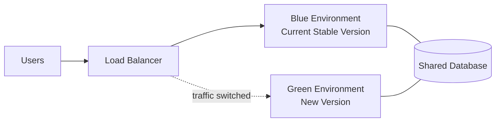

---

## 3. Why It Exists

Traditional in-place deployment can be risky because:

* the app may crash during rollout
* partial updates can break consistency
* rollback may take time
* users may hit mixed versions
* schema changes may fail midway

Blue-Green Deployment reduces these risks by separating the old and new versions completely.

---

## 4. Main Components

### 4.1 Blue Environment

This is the currently active production environment.

It includes:

* app servers
* API services
* background workers if needed
* environment variables
* config files
* runtime dependencies

### 4.2 Green Environment

This is the new version of the application.

It is deployed in parallel and usually remains isolated until validation is complete.

### 4.3 Load Balancer / Router

This decides where user traffic goes.

It can be switched by:

* DNS update
* load balancer target group change
* ingress route change
* service mesh route update

### 4.4 Shared or Replicated Data Layer

Both environments often talk to the same database, cache, message bus, or object storage.

This is the most sensitive part of the design because both versions must remain compatible with the data model.

---

## 5. High-Level Architecture

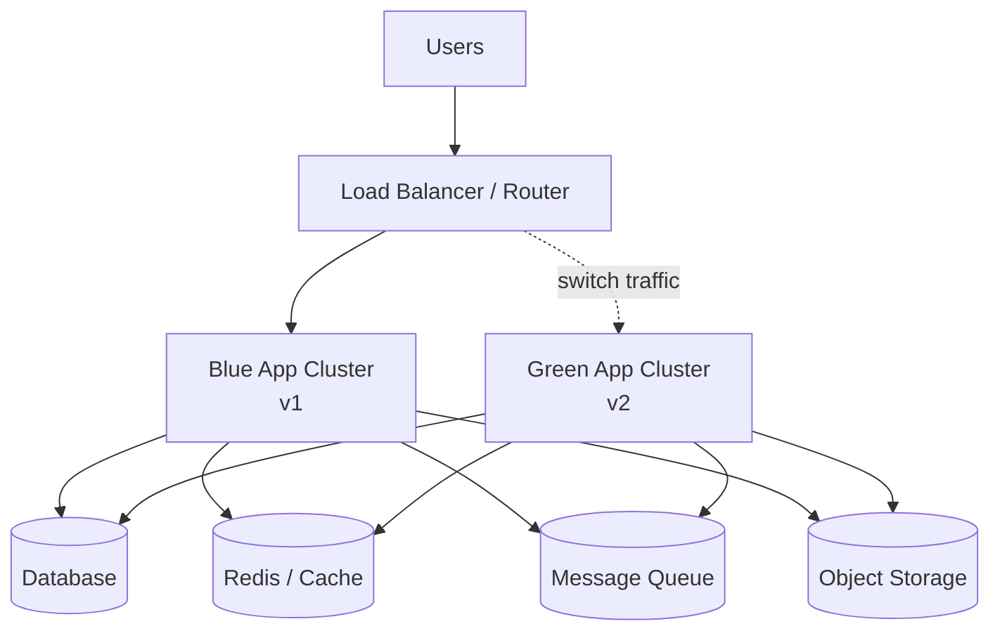

---

## 6. Deployment Flow

### 6.1 Normal Release Flow

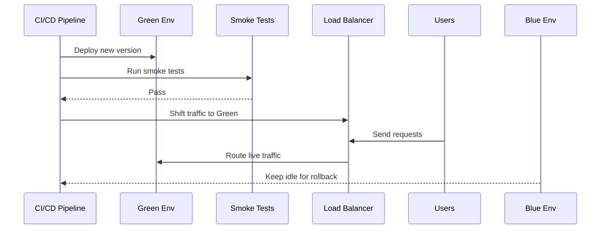

### 6.2 Rollback Flow

If Green misbehaves after traffic shift:

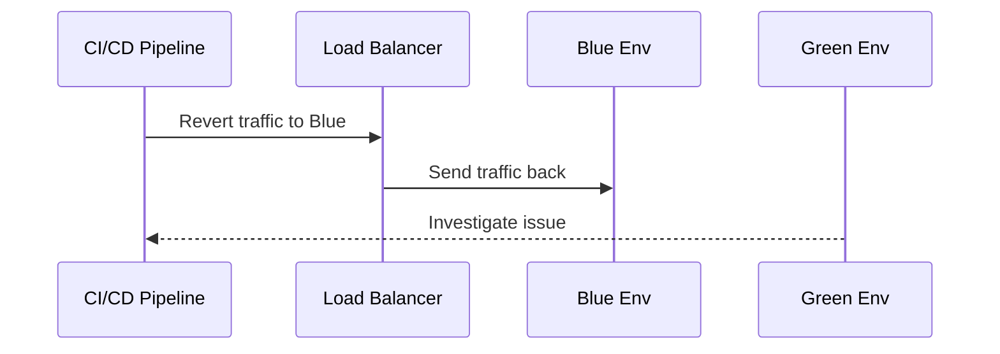

Rollback is fast because Blue is still intact and already warm.

---

## 7. Step-by-Step Release Process

### Step 1: Prepare Green

Deploy the new build to Green without touching Blue.

### Step 2: Validate Green

Run:

* unit tests
* integration tests
* smoke tests
* health checks
* API contract checks
* synthetic user flows

### Step 3: Verify Compatibility

Check that Green works with:

* current DB schema
* current cache keys
* current message formats
* existing user sessions if applicable

### Step 4: Switch Traffic

Redirect production traffic from Blue to Green.

### Step 5: Monitor

Watch:

* error rate
* latency
* CPU/memory usage
* request success rate
* queue lag
* business metrics

### Step 6: Retire Blue or Keep as Fallback

If everything is healthy, Blue can be:

* kept for rollback for a while
* recycled for the next release
* scaled down to save cost

---

## 8. Traffic Switching Methods

### 8.1 Load Balancer Target Switching

The load balancer points to either Blue or Green target groups.

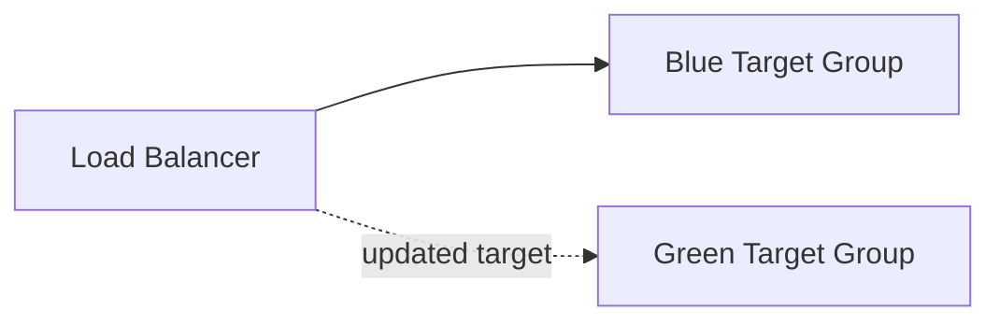

### 8.2 DNS Switching

DNS record points to Blue, then gets updated to Green.

This is simple but slower because of caching and TTL behavior.

### 8.3 Service Mesh Routing

A service mesh can shift traffic based on:

* percentage
* headers
* region
* user segment

This gives more control than simple DNS switching.

---

## 9. Database Considerations

This is where Blue-Green gets tricky.

If both environments use the same DB, you must ensure the new code is compatible with the existing schema.

### Common rules

* add columns before using them
* avoid breaking schema changes during rollout
* keep old and new code backward compatible
* do not remove old fields until the old version is fully drained

### Safer migration pattern

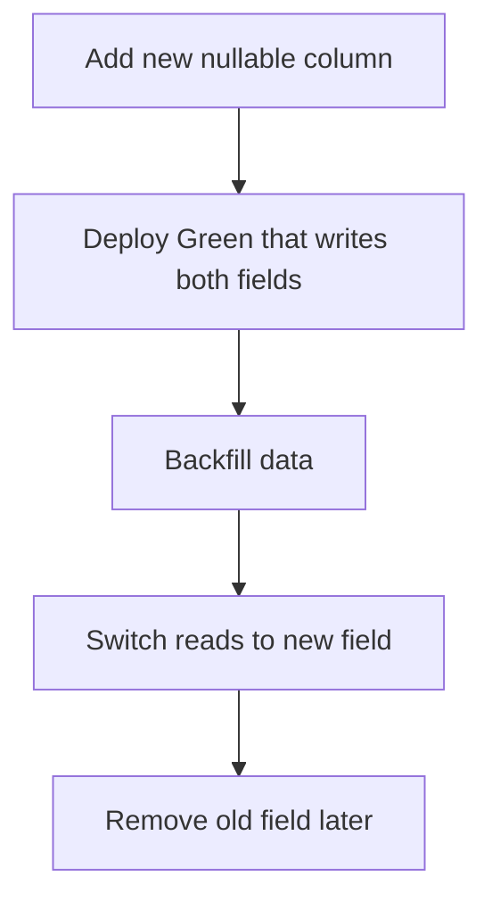

### Why this matters

If Green expects a new DB structure that Blue does not understand, rollback becomes dangerous.

---

## 10. Session and State Handling

If the application stores session state in memory, switching environments can log out users or break sessions.

Better designs use:

* Redis session store
* JWTs
* centralized auth
* stateless services

### Session-safe Blue-Green

* session data is shared
* both versions understand session format
* sticky sessions are minimized

---

## 11. Caching Considerations

Both Blue and Green may use the same cache.

That means cache keys should remain compatible across versions.

### Safe caching rules

* keep cache key format stable
* avoid version-specific serialization unless isolated
* set TTLs carefully
* invalidate carefully during schema or response changes

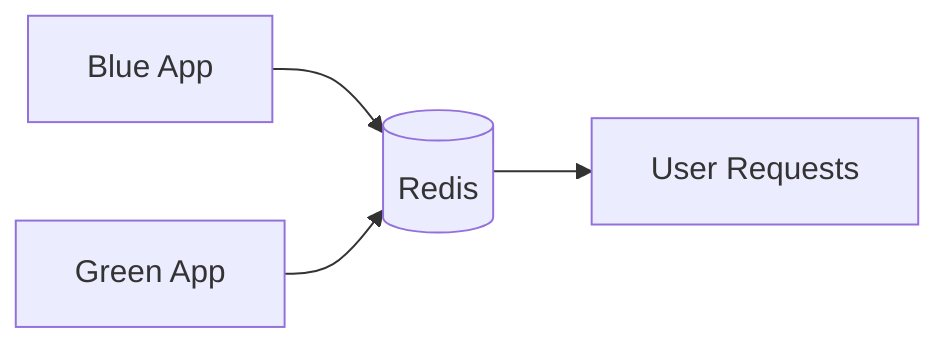

---

## 12. Messaging and Background Jobs

If both environments consume messages from the same queue, then message format compatibility matters.

### Risks

* Green emits messages Blue cannot parse
* Blue emits events Green no longer understands
* duplicate consumers process the same event twice

### Safer approach

* version event schemas
* keep backward compatibility
* deploy consumers carefully
* ensure only one active consumer group handles a given job type

---

## 13. Monitoring During Cutover

After traffic moves to Green, watch:

* p50, p95, p99 latency
* HTTP 4xx and 5xx rates
* app-level exceptions
* DB connection pool saturation
* cache hit ratio
* queue backlog
* login success rate
* payment or checkout conversion
* business KPIs

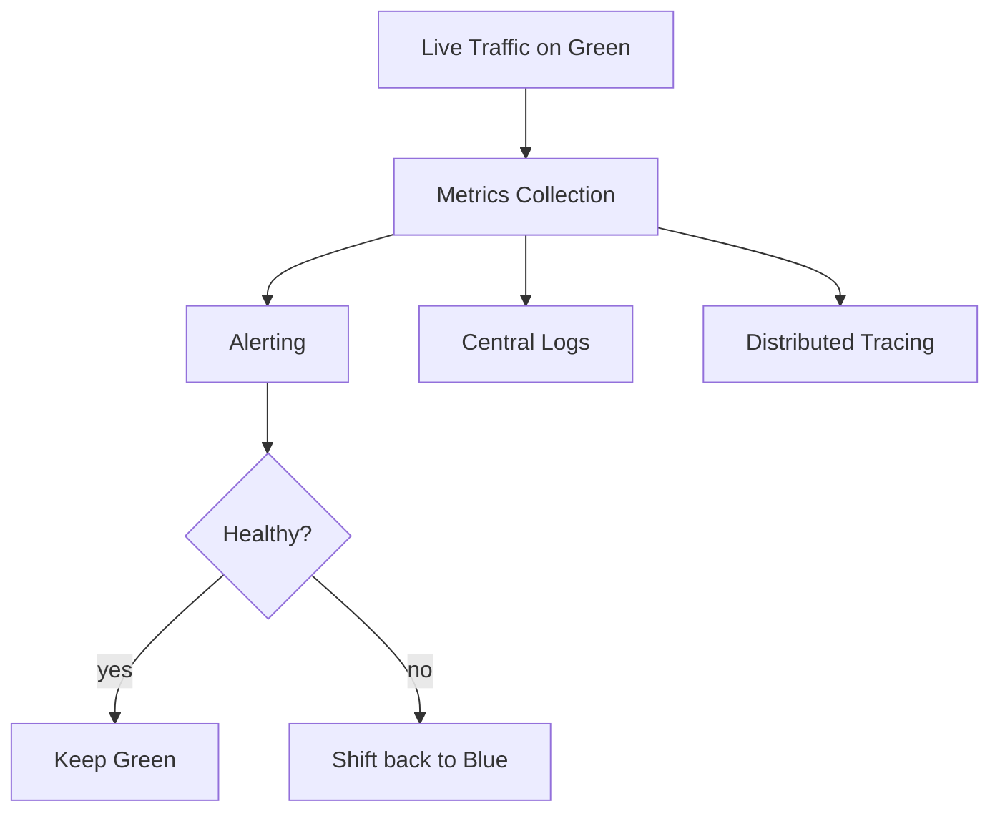

---

## 14. Health Checks

Before shifting traffic, Green should pass health checks.

### Examples

* `/health`
* `/ready`
* DB connectivity check
* cache connectivity check
* dependency checks
* app boot status

### Deep health check

A basic HTTP 200 is not enough. The system should verify:

* app started successfully
* essential migrations are compatible
* critical dependencies are reachable
* request path can execute end-to-end

---

## 15. Advantages

### 15.1 Near-zero downtime

Traffic is only switched when the new version is ready.

### 15.2 Fast rollback

If Green fails, traffic goes back to Blue almost immediately.

### 15.3 Safer releases

The new version is tested in a production-like environment before exposure.

### 15.4 Clear separation

Old and new versions do not run mixed in the same runtime.

### 15.5 Easy verification

You can test Green using real infra before it receives full traffic.

---

## 16. Disadvantages

### 16.1 Higher cost

You run two environments at once.

### 16.2 Data compatibility complexity

Database and schema evolution must be designed carefully.

### 16.3 Duplicate infrastructure

Compute, networking, and sometimes cache layers are doubled during release.

### 16.4 Harder for stateful systems

Systems with in-memory sessions or non-shared state are harder to migrate safely.

---

## 17. Blue-Green vs Canary

These two strategies are often compared.

| Aspect           | Blue-Green         | Canary                 |
| ---------------- | ------------------ | ---------------------- |
| Traffic exposure | All at once        | Gradual                |
| Rollback speed   | Very fast          | Fast but more complex  |
| Risk control     | Medium             | High                   |
| Infra cost       | Higher             | Moderate               |
| Complexity       | Lower              | Higher                 |
| Best for         | Fast safe releases | Progressive validation |

### Blue-Green

Good when you want:

* instant cutover
* quick rollback
* simple operations

### Canary

Good when you want:

* gradual confidence
* small exposure first
* deep validation on live traffic

---

## 18. Blue-Green vs Rolling Deployment

| Aspect                    | Blue-Green | Rolling            |
| ------------------------- | ---------- | ------------------ |
| Version mix in production | No         | Yes                |
| Rollback                  | Very easy  | More complex       |
| Resource cost             | Higher     | Lower              |
| Deployment risk           | Lower      | Medium             |
| User impact               | Minimal    | Depends on rollout |

Rolling deployments update servers gradually, which saves resources but can temporarily expose users to mixed versions.

---

## 19. Blue-Green with Feature Flags

Blue-Green can be combined with feature flags.

This is useful when:

* the code is deployed
* but a feature should remain hidden until enabled

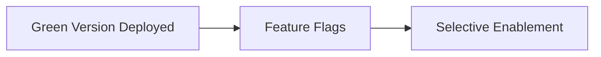

This gives even more control:

* deploy code safely
* enable feature for internal users first
* then gradually open it

---

## 20. Handling Database Migrations Safely

The biggest failure mode in Blue-Green is a breaking schema change.

### Safe migration pattern

1. deploy schema change that is backward compatible
2. deploy Green using new schema support
3. verify traffic
4. switch traffic
5. after old version is gone, remove obsolete columns or logic

### Unsafe pattern

1. change DB schema in a breaking way
2. deploy Green
3. discover Blue can no longer run
4. rollback fails

This is why schema-first planning is critical.

---

## 21. File Upload / Download Style Systems

For systems with files, releases must be especially careful because:

* file metadata schema may change
* upload flows may depend on signed URLs
* background processors may read old and new formats simultaneously

Blue-Green works well here only if:

* blob formats remain backward compatible
* metadata migrations are safe
* processors are version-aware

---

## 22. Real-World Release Flow Example

Suppose version `v2.3.0` is being released.

### Before release

* Blue runs `v2.2.8`
* Green is empty or running the last idle version
* all user traffic goes to Blue

### Deployment

* CI builds `v2.3.0`
* deploys it to Green
* runs smoke tests
* validates DB and dependency health

### Cutover

* load balancer switches 100% traffic to Green

### Post-cutover

* monitor for errors
* keep Blue live as fallback
* after confidence window, recycle Blue

---

## 23. Example Infrastructure Layout

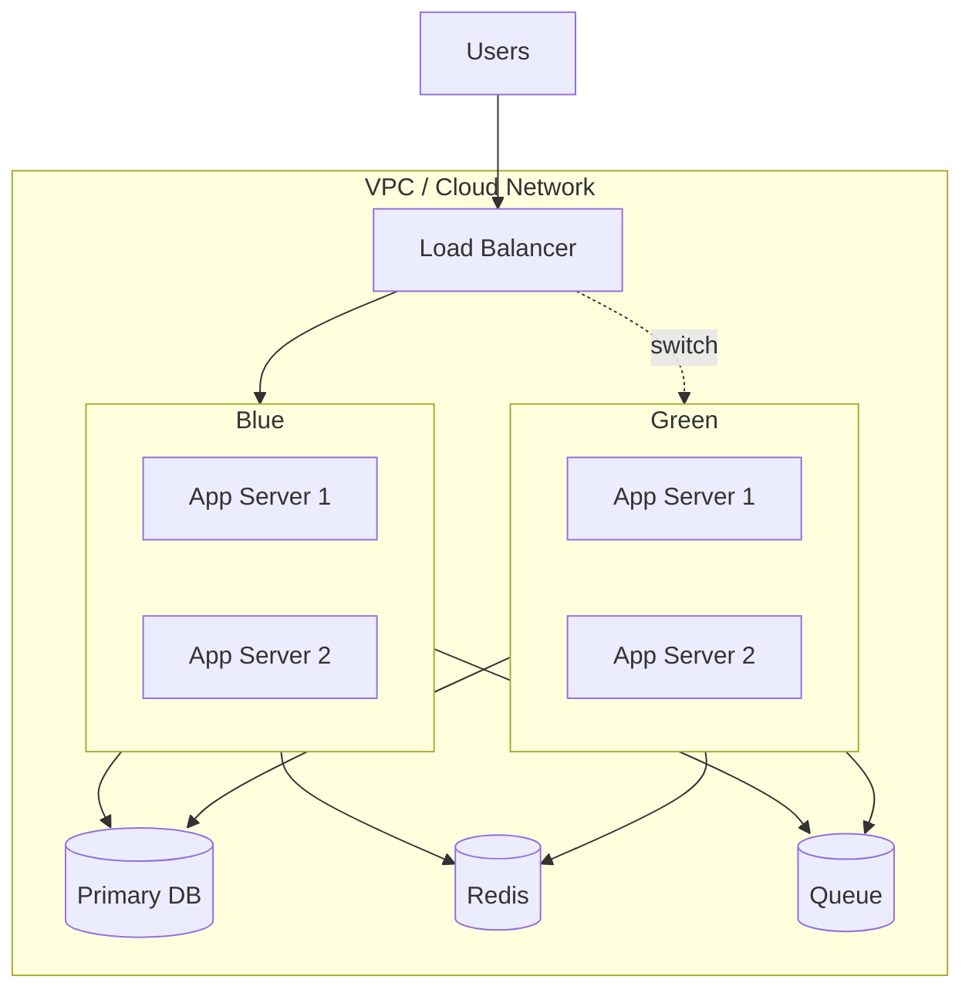

---

## 24. Rollback Strategy

Rollback should be planned before the release starts.

### When to rollback

* high 5xx rate
* abnormal latency
* broken critical path
* failed payment/login/search flow
* data corruption risk
* dependency failures

### Rollback checklist

* switch traffic back to Blue
* stop new write paths if needed
* freeze jobs that may create incompatible data
* inspect logs and traces
* confirm user experience stabilized

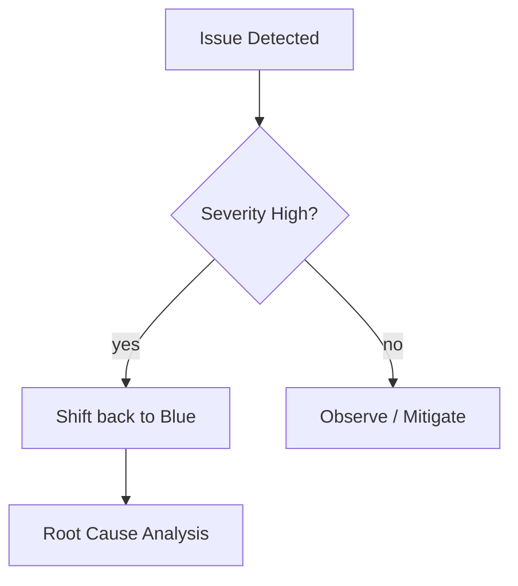

---

## 25. Common Failure Scenarios

### 25.1 Green passes health checks but fails under real load

Smoke tests are not enough. Load and concurrency behavior may differ.

### 25.2 Schema mismatch

New code expects new columns; old code still running cannot operate safely.

### 25.3 Cache incompatibility

New code changes key format or serialization and causes misses or parse failures.

### 25.4 Background jobs conflict

Workers from both versions process the same queue with different assumptions.

### 25.5 Sticky session issues

Some users stay pinned to one environment while others move, causing inconsistent behavior.

---

## 26. Best Practices

* keep Blue and Green as identical as possible
* automate deployment and health checks
* use backward-compatible schema changes
* avoid in-memory state for critical features
* use shared auth and session systems
* version APIs and events
* monitor heavily after cutover
* keep rollback simple and tested
* rehearse deployments in staging first

---

## 27. When to Use Blue-Green Deployment

Use it when:

* downtime must be minimized
* rollback speed is important
* infra cost is acceptable
* the app can be made backward compatible
* release risk is high enough to justify duplication

Good candidates:

* SaaS applications
* e-commerce frontends
* APIs with stable schemas
* internal tools with critical uptime needs

---

## 28. When Not to Use It

Avoid it when:

* infrastructure budget is tight
* the system is deeply stateful and hard to duplicate
* release changes are tiny and low risk
* the team cannot manage schema compatibility well
* the app requires large non-shareable runtime state

In those cases, rolling or canary deployment may be better.

---

## 29. Interview Summary

Blue-Green Deployment is a release strategy where two identical environments exist in parallel.

* **Blue** serves current production traffic.
* **Green** hosts the new version.
* After validation, traffic switches from Blue to Green.
* If something breaks, rollback is fast because Blue is still ready.

The main challenge is not the traffic switch itself. The real challenge is making sure the **database, cache, sessions, queues, and APIs remain compatible across both versions**.

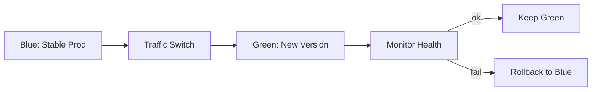

---

## 30. Final Takeaway

Blue-Green Deployment is one of the cleanest ways to ship software safely.

It gives you:

* a safe staging-like production environment
* instant cutover
* quick rollback
* low downtime

Its trade-off is cost and the need for careful compatibility planning.

For mature systems, it is often one of the most reliable deployment strategies available.
