# Database Replication

Database replication is the process of copying data from one database server to one or more other database servers so the same data exists in multiple places.

The main reasons to replicate a database are:

* **high availability**
* **better read performance**
* **disaster recovery**
* **geographic distribution**
* **backup and failover**
* **reduced latency for users in different regions**

Replication is one of the most important building blocks in scalable systems.

---

## 1. Why replication is needed

If a system uses only one database server, it has serious limitations:

* a single machine can become a bottleneck
* if that machine fails, the app may go down
* read traffic may overload the primary
* distant users may experience high latency
* maintenance can require downtime

Replication solves many of these problems by making copies of the data.

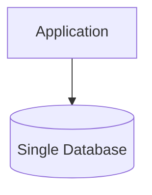

With replication:

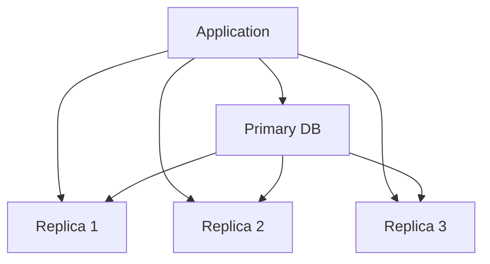

---

## 2. What replication actually means

Replication does **not** usually mean that every database is independent.

Instead:

* one database accepts writes or coordinates writes
* other databases copy the data
* replicas may be used for reads, failover, analytics, or standby

Replication can be:

* **synchronous**
* **asynchronous**
* **semi-synchronous**
* **single-leader**
* **multi-leader**
* **leaderless**
* **physical**
* **logical**

---

## 3. Core idea

A change made in one database is propagated to another database.

Example:

* user updates profile
* order is inserted
* payment status changes
* inventory quantity decreases

That change is then copied to replicas.

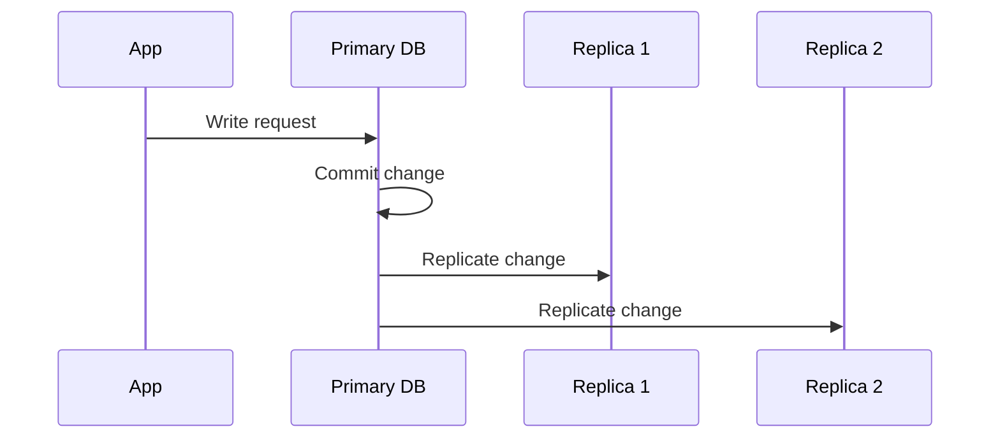

---

## 4. Main goals of replication

### 4.1 High availability

If one database fails, another replica can take over.

### 4.2 Read scaling

Read queries can be distributed across replicas.

### 4.3 Disaster recovery

If the main region goes down, replicas in another region can help restore service.

### 4.4 Lower latency

Users can read data from a replica closer to them.

### 4.5 Operational safety

Replicas can help with backups, maintenance, and migration.

---

## 5. Common replication architecture

The most common design is **primary-replica replication**.

The primary handles writes, and replicas copy data from it.

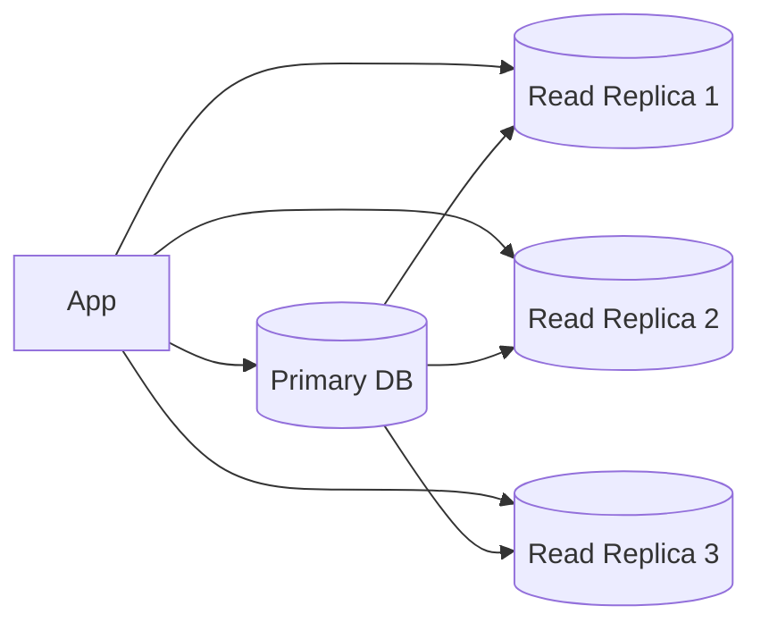

This is often called:

* master-slave
* leader-follower
* primary-replica

The industry increasingly prefers **primary-replica** or **leader-follower** terminology.

---

## 6. Primary-replica replication

### How it works

* writes go to the primary
* the primary records the change in its log
* replicas read that log and apply the same change

### Benefits

* simple conceptual model
* easy to reason about writes
* good for read-heavy systems
* easy failover in many setups

### Drawbacks

* all writes go to one node
* replicas may lag behind
* failover must be handled carefully

---

## 7. Synchronous replication

In synchronous replication, the primary waits until the replica confirms the write before returning success.

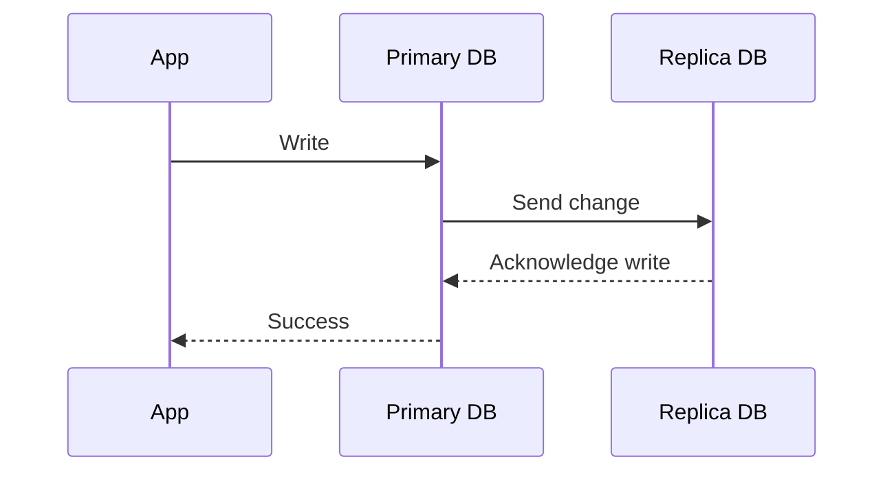

### Advantages

* strong durability
* replicas are always up to date
* lower risk of data loss

### Disadvantages

* higher latency
* slower writes
* if replica is slow, primary is slower too

### Best for

* financial systems
* critical transactional data
* cases where consistency matters more than speed

---

## 8. Asynchronous replication

In asynchronous replication, the primary returns success immediately and sends changes to replicas later.

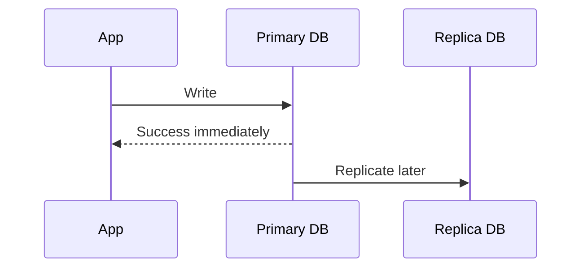

### Advantages

* very fast writes
* lower user-perceived latency
* better throughput

### Disadvantages

* replicas can lag
* if primary fails too soon, data may be lost
* readers may see stale data

### Best for

* read-heavy systems
* content platforms
* large-scale web apps
* analytics pipelines

---

## 9. Semi-synchronous replication

Semi-synchronous replication is a middle ground.

The primary waits for at least one replica to confirm, but not necessarily all replicas.

### Advantages

* better durability than async
* lower latency than full sync

### Disadvantages

* more complex than either extreme
* still not fully strong consistency in all cases

---

## 10. Replication topologies

---

### 10.1 Single-leader topology

One primary, many replicas.

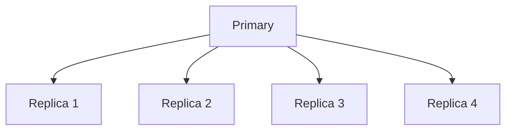

This is the most common model.

---

### 10.2 Multi-leader topology

Multiple nodes can accept writes.

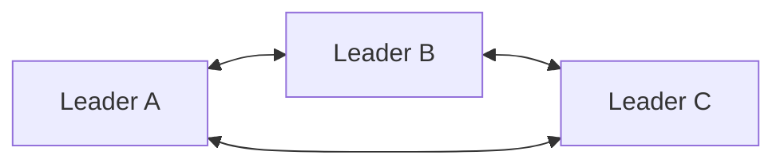

### Benefits

* can support writes in multiple regions
* lower latency for distributed users

### Challenges

* conflict resolution
* write conflicts
* harder consistency model

---

### 10.3 Leaderless topology

No single leader.

Clients write to multiple nodes, and the system uses quorum or reconciliation to resolve state.

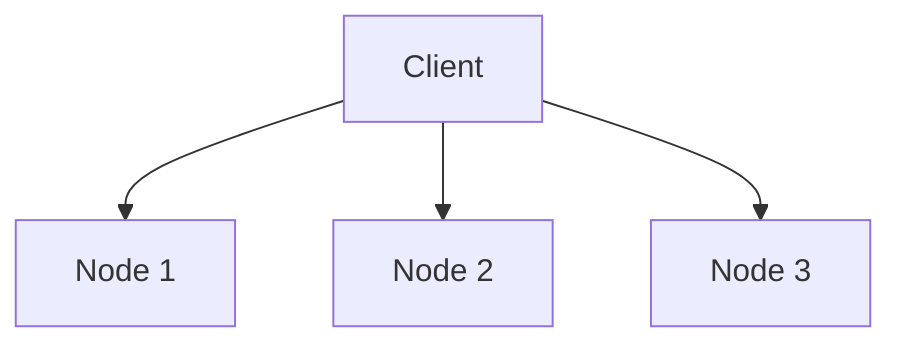

This is often seen in distributed NoSQL databases.

---

## 11. Replication strategies by data level

Replication can happen at different levels.

### 11.1 Physical replication

Copies the actual storage pages or binary log at a low level.

### 11.2 Logical replication

Copies database changes as rows, statements, or logical events.

### 11.3 Statement-based replication

Replicates SQL statements.

### 11.4 Row-based replication

Replicates row changes.

### 11.5 WAL / binlog shipping

Replicates the write-ahead log or binary log.

---

## 12. Physical replication

Physical replication copies the storage-level changes.

### Advantages

* fast
* efficient
* exact copy
* good for failover replicas

### Disadvantages

* less flexible
* replica usually must match primary version and storage format

### Best for

* database failover
* standby nodes
* disaster recovery

---

## 13. Logical replication

Logical replication copies data changes in a structured way.

Example:

* `INSERT INTO users ...`
* `UPDATE orders SET status = 'paid' ...`

### Advantages

* flexible
* can replicate selected tables
* useful for data migration
* can feed downstream systems

### Disadvantages

* more processing overhead
* may be slower than physical replication

### Best for

* partial replication
* migrations
* analytics pipelines
* integrating heterogeneous systems

---

## 14. Statement-based replication

The exact SQL statement is replayed on replicas.

Example:

```sql id="jz7h2m"
UPDATE inventory SET stock = stock - 1 WHERE product_id = 42;
```

### Advantages

* compact
* easy to log

### Disadvantages

* nondeterministic statements can cause issues
* time-based functions and random functions may behave differently
* not always safe across environments

---

## 15. Row-based replication

The changed rows are sent to replicas.

Example:

* before row
* after row

### Advantages

* deterministic
* accurate
* safer than statement-based replication

### Disadvantages

* larger replication logs
* more storage/network overhead

---

## 16. Write-Ahead Log / Binlog replication

Many databases replicate by shipping logs.

The primary writes changes into a log:

* WAL in PostgreSQL-like systems
* binlog in MySQL-like systems

Replicas read the log and apply the changes in order.

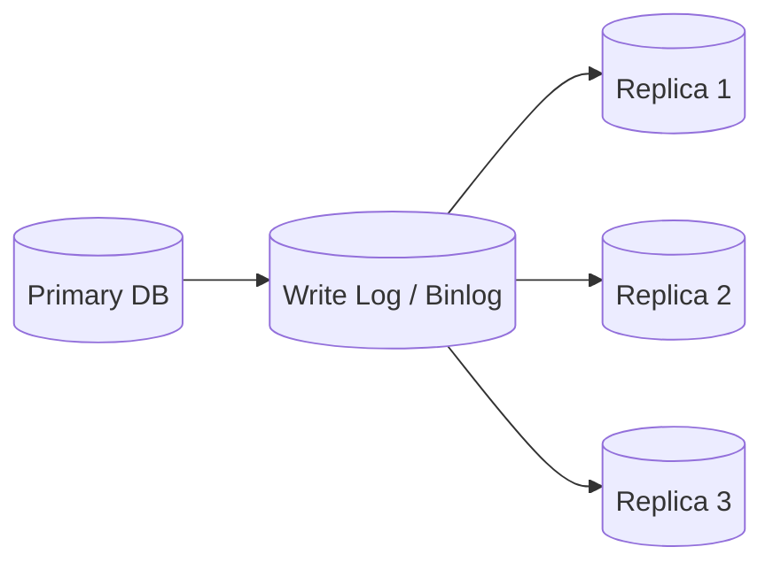

This is a very common and efficient design.

---

## 17. How replication lag happens

Replication lag is the delay between a change on the primary and the moment replicas receive and apply it.

### Why lag happens

* network delay
* replica CPU shortage
* disk slowdown
* heavy write load
* large transactions
* slow apply process

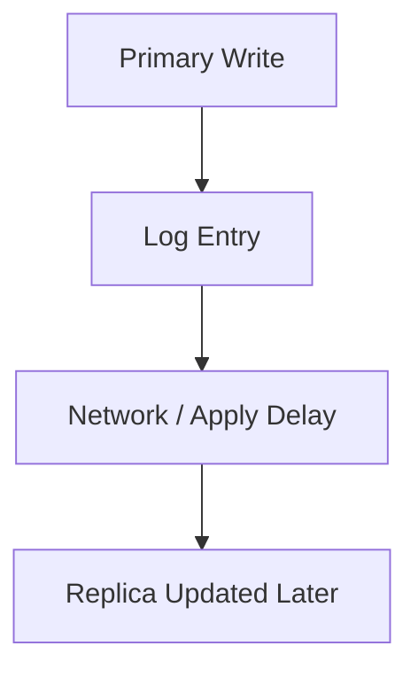

### Why lag matters

* users may read stale data
* read-after-write consistency becomes hard
* failover to a lagging replica may lose recent changes

---

## 18. Read-after-write consistency problem

If a user writes data and immediately reads from a replica, they might not see the latest update.

Example:

* user updates profile picture
* app sends read request to replica
* replica is 2 seconds behind
* old profile picture is shown

This is a classic replication issue.

### Common fixes

* read from primary after write
* use session stickiness to route user to same node
* wait until replica catches up
* use monotonic read logic
* use “read your writes” strategy

---

## 19. Failover

Failover means switching from a failed primary to a replica.

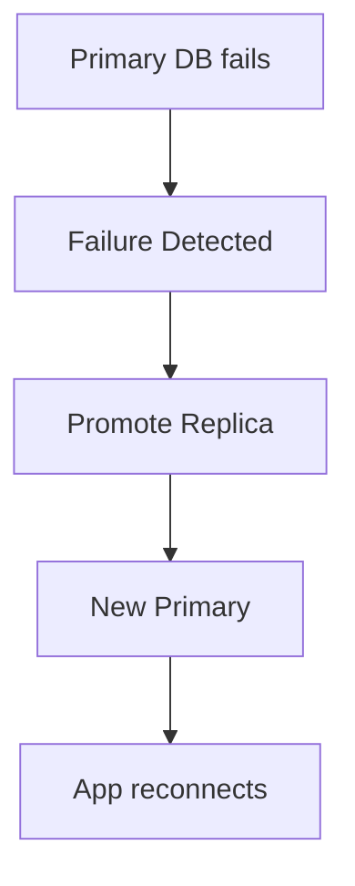

### Failover steps

1. detect primary failure
2. choose the best replica
3. promote it to primary
4. update connection routing
5. reconfigure old primary if it returns
6. prevent split-brain

---

## 20. Split-brain problem

Split brain happens when two nodes both think they are primary.

This is dangerous because:

* both may accept writes
* data diverges
* conflict resolution becomes hard

### Preventing split brain

* leader election
* quorum
* fencing tokens
* consensus systems
* coordination services

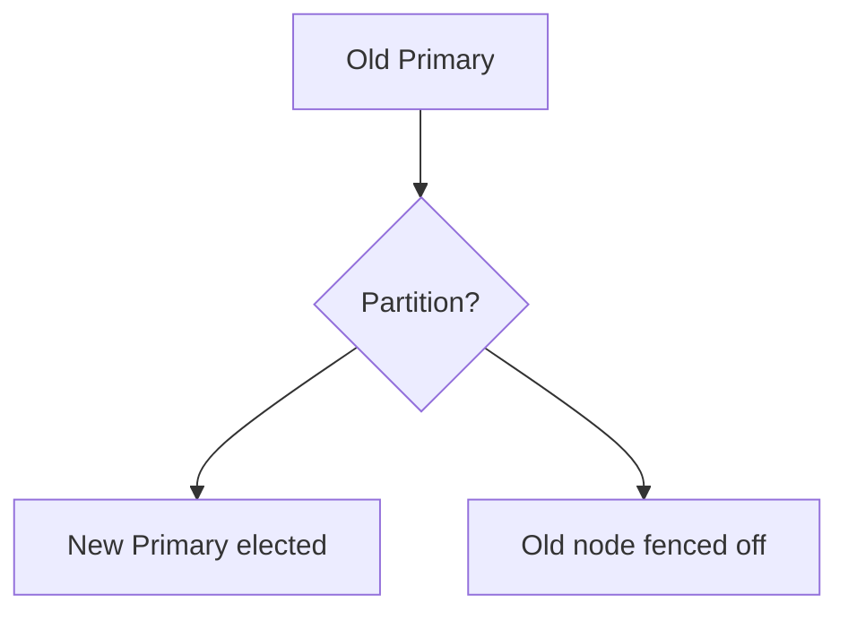

---

## 21. Replication and consistency

Replication affects consistency.

### Strong consistency

Every read sees the latest write.

### Eventual consistency

Replicas eventually converge, but not immediately.

### Trade-off

* stronger consistency usually means higher latency or lower availability
* weaker consistency improves performance and resilience

This is one of the core distributed systems trade-offs.

---

## 22. CAP perspective

Replication is deeply connected to the CAP trade-off.

Under network partitions, a system usually has to choose between:

* **consistency**
* **availability**

Replication helps availability, but the exact replication strategy determines how much consistency is preserved.

---

## 23. Read replicas

Read replicas are replicas used mostly for read traffic.

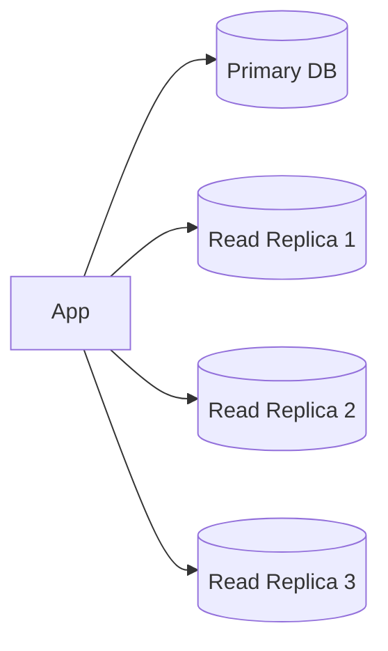

### Benefits

* offload reads from primary
* improve read throughput
* support analytics and reporting
* improve regional access

### Risks

* stale reads
* failover complexity
* replica drift if lag becomes large

---

## 24. Primary-replica load patterns

A common production setup is:

* writes to primary
* reads to replicas

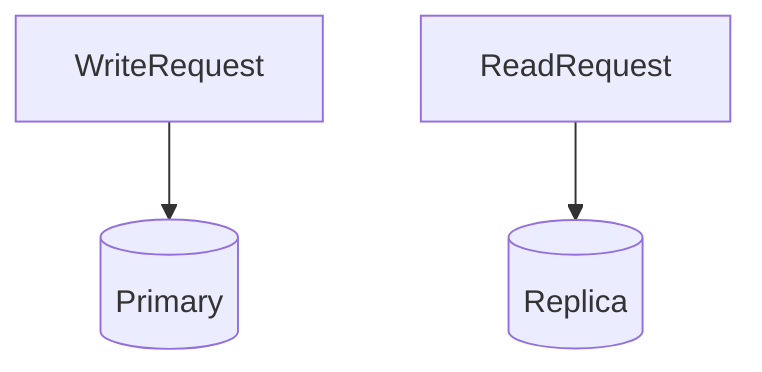

This works well when the workload is read heavy.

Examples:

* social feed
* product catalog
* content delivery metadata
* dashboards
* user profile lookups

---

## 25. Replication in analytics

Analytics often uses replicas or log-based pipelines.

Example:

* OLTP primary handles transactions
* replica or change stream feeds analytics warehouse

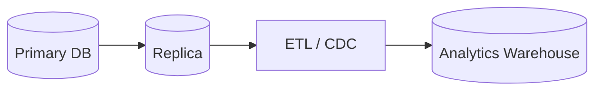

This avoids overloading the transactional database.

---

## 26. Change Data Capture (CDC)

CDC reads database changes and streams them to other systems.

This is often built on top of replication logs.

Use cases:

* search indexing
* cache invalidation
* audit logs
* data pipelines
* event-driven architecture

---

## 27. Replication and backups

Replication is not the same as backup.

### Replication

* copies data to another live server
* helps availability and failover

### Backup

* point-in-time saved copy
* helps recovery from human error, corruption, ransomware, bad deploys

A replicated deletion can also be replicated to replicas, so replication alone does **not** protect you from bad writes.

---

## 28. Geo-replication

Geo-replication copies data across regions.

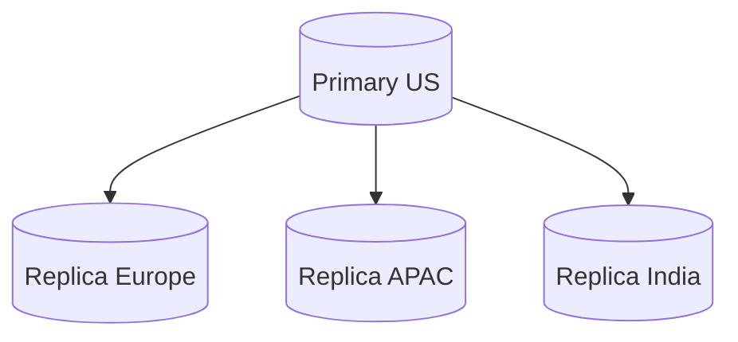

### Benefits

* disaster recovery
* lower read latency in other regions
* global availability

### Challenges

* higher latency for writes
* larger lag
* regional failover complexity
* data residency issues

---

## 29. Multi-region replication

In global systems, replication strategy becomes more complex.

### Options

* one global primary
* regional primaries
* leaderless writes
* active-active replication

Each has trade-offs in:

* latency
* consistency
* failover
* conflict resolution

---

## 30. Conflict resolution in multi-leader systems

If two leaders accept writes, the same data may be modified in two places at once.

Example:

* user changes address in region A
* user changes address in region B
* both changes replicate later

### Resolution strategies

* last write wins
* vector clocks
* application-level merge
* custom reconciliation
* manual resolution

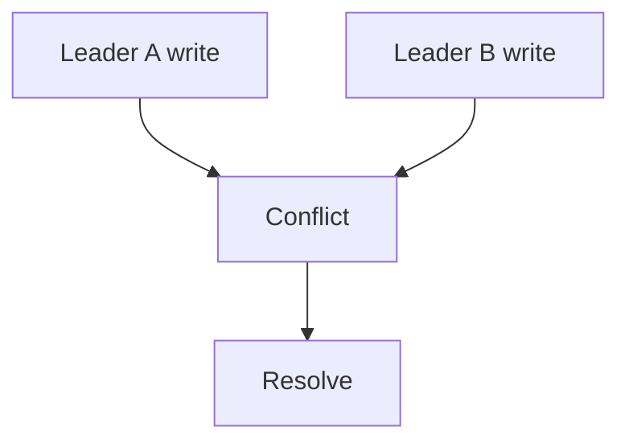

---

## 31. Monitoring replication

Important replication metrics:

* replication lag
* replica health
* replication throughput
* apply latency
* failover count
* log backlog
* disk usage
* connection status

### Why monitoring matters

If lag grows silently, the system can look healthy while serving stale data.

---

## 32. Common failure scenarios

### Primary goes down

Promote a replica.

### Replica lags too much

Delay read routing or repair replication pipeline.

### Network partition

Risk of split brain or stale reads.

### Replica corruption

Reseed from a known-good source.

### Log shipping stops

Catch up or rebuild replica.

---

## 33. Replication and scaling

Replication is one of the first scaling techniques most systems use.

### Scale reads

Add replicas.

### Improve availability

Add standby replicas.

### Improve global reach

Add regional replicas.

### Improve resiliency

Keep multiple copies.

Replication is often the bridge between a single-node database and a larger distributed architecture.

---

## 34. Good practices

* keep primary and replicas monitored
* test failover regularly
* keep replication lag visible
* design read-after-write behavior carefully
* use backups in addition to replication
* prevent split brain with fencing or consensus
* use logical replication for data migration
* use replicas for reads, not only failover
* avoid large unbounded transactions
* ensure schema changes work with replication

---

## 35. When replication is enough

Replication may be enough when:

* writes are moderate
* read traffic is heavy
* one primary can still handle writes
* failover and read scaling are the main goals

---

## 36. When replication is not enough

Replication alone is not enough when:

* write throughput exceeds one primary
* data must be partitioned
* global low-latency writes are required
* conflict-heavy multi-region writes exist

At that point, you may need:

* sharding
* multi-primary systems
* distributed consensus
* leaderless databases
* event sourcing
* application-level reconciliation

---

## 37. Interview-style summary

Database replication is the process of copying database changes from one node to one or more other nodes.

### Main purposes

* high availability
* read scaling
* failover
* disaster recovery
* geo distribution

### Main models

* primary-replica
* multi-leader
* leaderless

### Main consistency styles

* synchronous
* asynchronous
* semi-synchronous

### Key risks

* replication lag
* stale reads
* failover complexity
* split brain
* conflicts in multi-writer systems

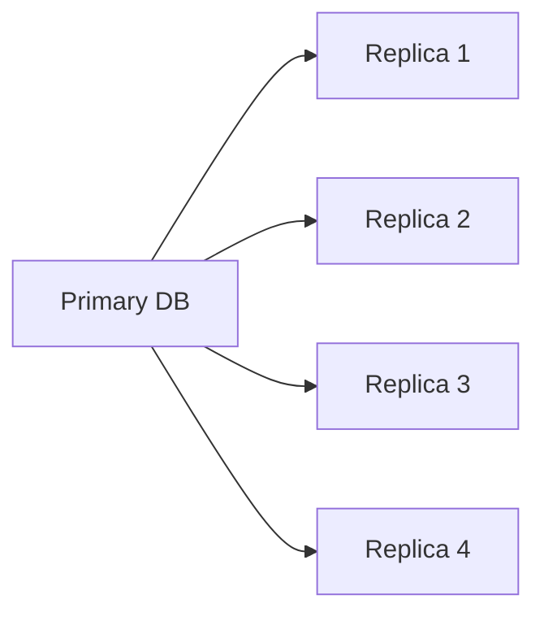

---

## 38. Final takeaway

Database replication is one of the foundational techniques in system design.

It lets you:

* keep data available
* scale reads
* recover from failures
* serve users closer to their region

But replication also introduces:

* lag
* consistency trade-offs
* failover complexity
* conflict handling

The real skill is not just setting up replication. It is choosing the right replication model for your consistency, availability, and latency needs.

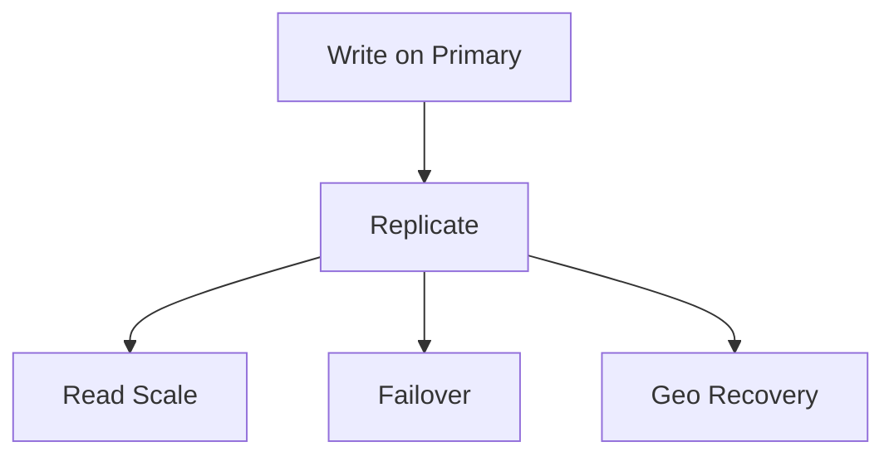
