# Event Bus Architecture

Event Bus Architecture is a way for different parts of a system to communicate by **publishing events** and **subscribing to them**, instead of calling each other directly.

It is widely used in distributed systems because it helps systems stay:

* loosely coupled
* scalable
* resilient
* easier to extend

Instead of saying:

> “Service A must call Service B, then Service B calls Service C”

you say:

> “Service A publishes an event, and any interested service reacts to it.”

That small change makes a big difference in large systems.

---

## 1. What is an Event Bus?

An **event bus** is a communication layer that transports events from producers to consumers.

An **event** is a fact that something happened.

Examples:

* `OrderPlaced`
* `UserSignedUp`
* `PaymentCompleted`
* `FileUploaded`
* `RideStarted`
* `EmailVerified`

An event bus does not usually care **who** produced the event or **who** consumes it.
It just moves the event to interested listeners.

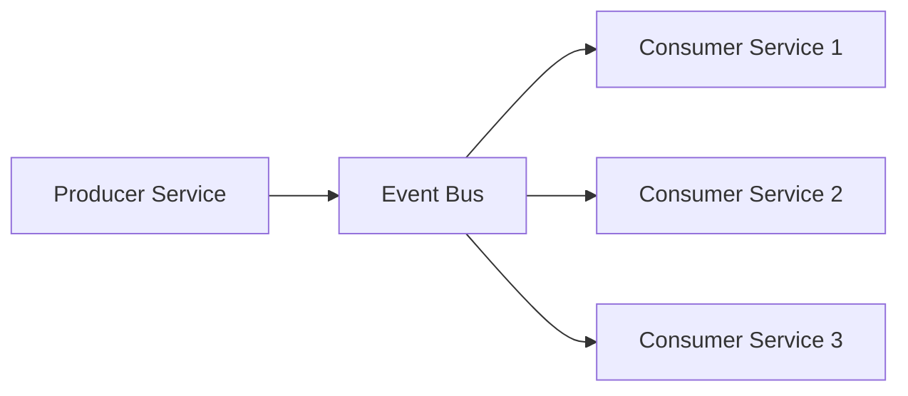

---

## 2. Why Event Bus Exists

Without an event bus, services often become tightly connected.

Example of tight coupling:

* Order Service calls Inventory Service
* Inventory Service calls Notification Service
* Notification Service calls Analytics Service

This creates:

* slow request chains
* hard dependencies
* brittle failure behavior
* difficult scaling
* painful feature additions

With an event bus:

* Order Service emits `OrderPlaced`
* Inventory Service consumes it
* Notification Service consumes it
* Analytics Service consumes it

No service needs to know the others directly.

---

## 3. Core Idea

The event bus changes the system from **request-response** to **publish-subscribe**.

### Request-response

* synchronous
* caller waits
* tightly coupled
* failure in downstream affects upstream

### Publish-subscribe

* asynchronous
* producer does not wait for consumers
* loosely coupled
* new consumers can be added without changing producers

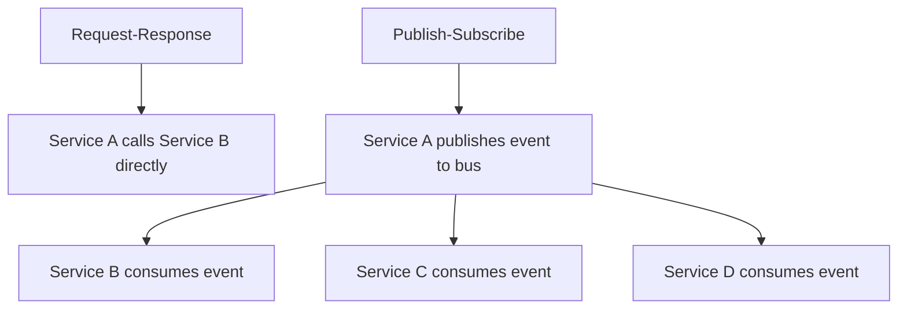

---

## 4. Main Components

An event bus architecture usually has these components:

### 4.1 Event Producer

The service that creates and publishes events.

Examples:

* User Service
* Order Service
* Payment Service
* Ride Service

### 4.2 Event Bus

The middleware that carries events from producers to consumers.

Examples in real systems:

* Kafka
* RabbitMQ
* NATS
* AWS EventBridge
* Google Pub/Sub
* Azure Service Bus

### 4.3 Event Consumer

The service that subscribes to events and reacts to them.

Examples:

* Notification Service
* Billing Service
* Analytics Service
* Search Indexer
* Fraud Detection Service

### 4.4 Schema Registry / Contract

Defines the structure of events so producers and consumers agree on payload format.

### 4.5 Dead Letter Queue

Stores messages that cannot be processed successfully after retries.

### 4.6 Monitoring / Observability

Tracks lag, failures, retry counts, throughput, and delivery delays.

---

## 5. High-Level Architecture

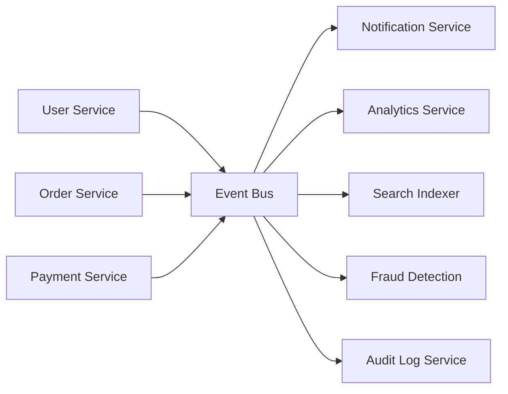

---

## 6. How It Works

### Step 1: Something happens

A business action occurs.

Example:

* user signs up
* order is placed
* payment succeeds

### Step 2: Producer creates event

The service creates a message that represents that fact.

Example:

```json
{
  "eventId": "evt_123",
  "eventType": "UserSignedUp",
  "timestamp": "2026-06-19T10:15:00Z",
  "version": 1,
  "payload": {
    "userId": "u_101",
    "email": "ayaan@example.com"
  }
}
```

### Step 3: Event is published

The producer sends the event to the event bus.

### Step 4: Bus routes event

The bus delivers the event to all matching consumers.

### Step 5: Consumers react

Each consumer processes the event independently.

Examples:

* Notification Service sends welcome email
* Analytics Service records user growth
* Fraud Service checks signup patterns

---

## 7. Event Bus vs Message Queue

These terms are related, but not identical.

| Aspect           | Event Bus                              | Message Queue                           |
| ---------------- | -------------------------------------- | --------------------------------------- |
| Main purpose     | Broadcast events to multiple consumers | Deliver tasks/messages to consumers     |
| Consumer pattern | One-to-many, pub-sub                   | Often one-to-one or competing consumers |
| Coupling         | Loose                                  | Moderate                                |
| Typical use      | Domain events, system integration      | Background jobs, work distribution      |
| Fanout           | Common                                 | Less common                             |

An event bus is often used for **events**.
A message queue is often used for **work**.

That said, many platforms can support both patterns.

---

## 8. Event-Driven Architecture vs Event Bus Architecture

Event-driven architecture is the broader style.
Event bus is one of the main tools used to implement it.

### Event-driven architecture

A whole system reacts to events.

### Event bus architecture

The bus is the central backbone that transports those events.

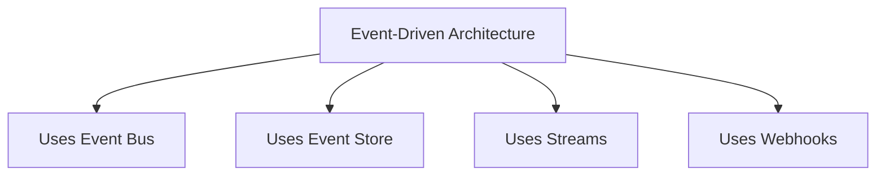

---

## 9. Types of Events

### 9.1 Domain Events

Events from business logic.

Examples:

* `OrderPlaced`
* `InvoicePaid`
* `UserVerified`

### 9.2 Integration Events

Used to notify other services.

Example:

* Billing Service emits `PaymentCaptured` for Notification Service and Reporting Service

### 9.3 System Events

Operational events.

Examples:

* `CacheMissHigh`
* `NodeDown`
* `TopicLagDetected`

---

## 10. Event Structure

A good event should contain enough information for consumers to act safely.

```json
{
  "eventId": "evt_901",
  "eventType": "OrderPlaced",
  "version": 2,
  "source": "order-service",
  "timestamp": "2026-06-19T10:20:00Z",
  "correlationId": "corr_333",
  "causationId": "evt_777",
  "payload": {
    "orderId": "ord_456",
    "userId": "u_101",
    "amount": 1499,
    "currency": "INR"
  }
}
```

### Important fields

* `eventId` — unique ID for deduplication
* `eventType` — event name
* `version` — schema version
* `source` — emitting service
* `timestamp` — when the event happened
* `correlationId` — ties many events to one business flow
* `causationId` — links this event to the event that caused it
* `payload` — business data

---

## 11. Example Use Case: E-commerce Order Flow

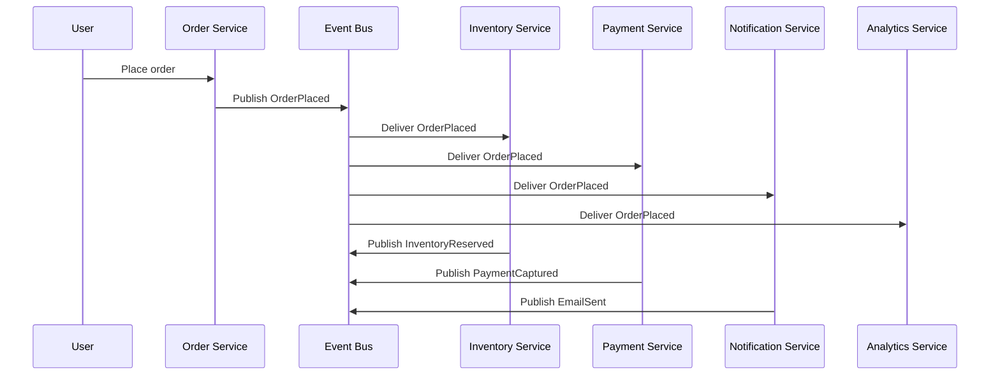

### Why this is good

* Order Service does not need to call all other services directly
* Services can fail or retry independently
* New consumers can be added later without changing the Order Service

---

## 12. Example Use Case: Ride Booking Platform

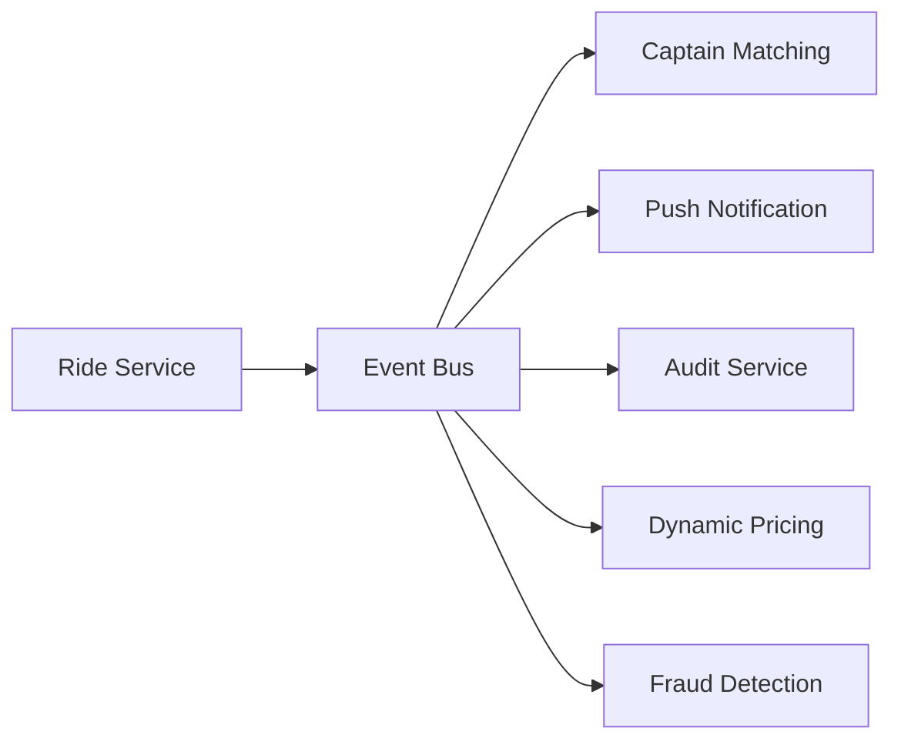

Events:

* `RideRequested`
* `CaptainAssigned`
* `RideStarted`
* `RideCompleted`
* `PaymentCollected`

This architecture is extremely useful when different teams own different parts of the product.

---

## 13. Fanout Pattern

One event can trigger many actions.

Example: `PaymentSuccess`

* send receipt
* update ledger
* update dashboard
* trigger rewards
* notify finance
* emit analytics event

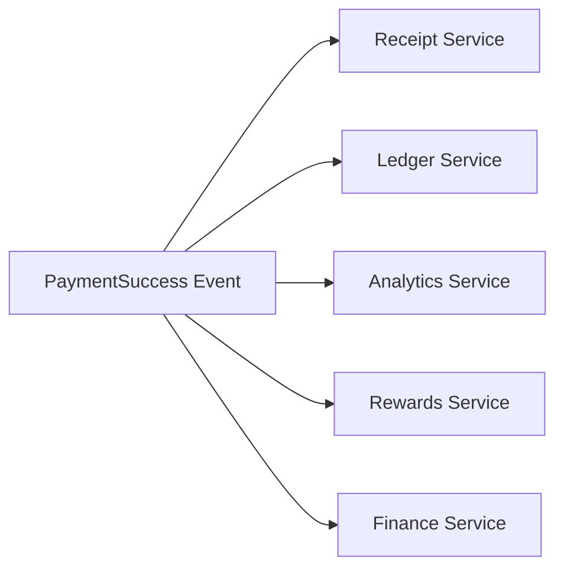

This is one of the biggest strengths of an event bus.

---

## 14. Ordering

Sometimes events must be processed in order.

Example:

* `OrderPlaced`
* `OrderPacked`
* `OrderShipped`
* `OrderDelivered`

If delivery happens before shipping, the system breaks logically.

### Ordering approaches

* partition by `orderId`
* keep ordered logs per key
* use sequence numbers
* enforce consumer-side checks

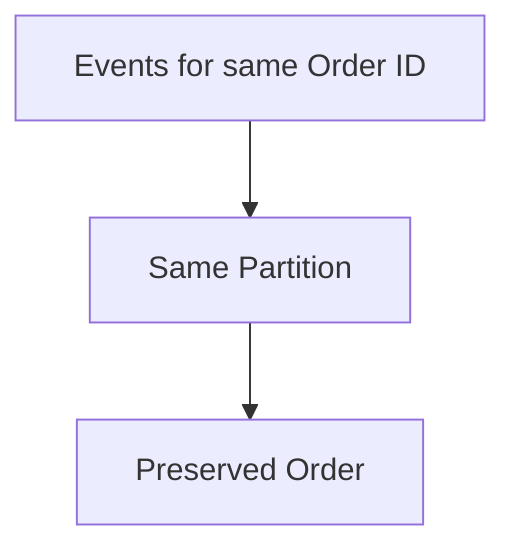

---

## 15. Delivery Guarantees

Event buses usually provide one of these:

### 15.1 At-most-once

Event may be lost, but never duplicated.

### 15.2 At-least-once

Event will be delivered, but may be duplicated.

### 15.3 Exactly-once

Event is delivered once and only once.

In real systems, **at-least-once** is common.
That means consumers must be **idempotent**.

---

## 16. Idempotency

If a consumer receives the same event twice, the result should still be correct.

Example:

* send one welcome email only once
* do not reserve inventory twice
* do not charge payment twice

### Idempotent consumer example

* store processed `eventId`
* ignore duplicates
* use unique constraints
* compare state before applying changes

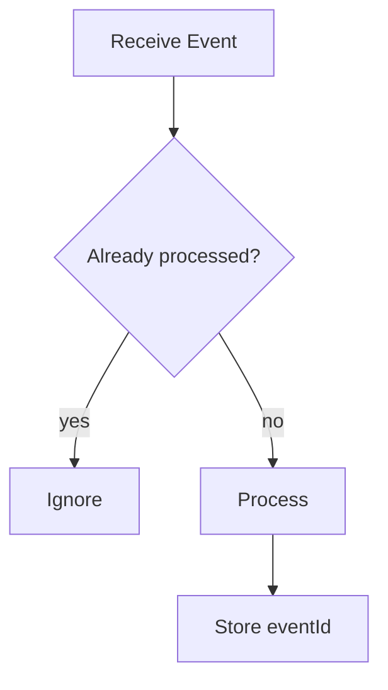

---

## 17. Event Bus Topics and Subscriptions

Many event buses organize traffic using:

* topics
* channels
* streams
* subjects
* exchanges and queues

### Example topic setup

* `user.events`
* `order.events`
* `payment.events`
* `audit.events`

Consumers subscribe to the topics they need.

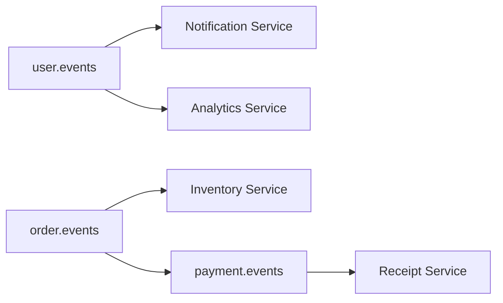

---

## 18. Filtering

Consumers should not receive every event in the system.

Filtering can happen by:

* event type
* routing key
* subject
* payload rules
* tenant
* region

This reduces noise and improves performance.

---

## 19. Event Schema Evolution

Events change over time.

Example:

* v1: `userId`, `email`
* v2: adds `locale`
* v3: renames `email` to `primaryEmail`

### Safe schema evolution rules

* add optional fields instead of breaking existing ones
* avoid removing fields too early
* version events explicitly
* keep consumers backward compatible

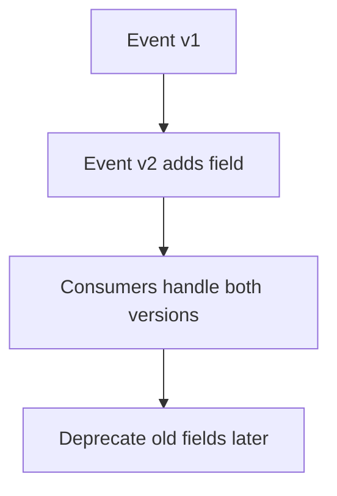

---

## 20. Producer Responsibilities

A producer should:

* publish correct event data
* use stable schema
* attach IDs and timestamps
* retry on transient failures
* avoid duplicating side effects
* use outbox pattern where needed

### Outbox pattern

A service writes business data and event data in the same local transaction, then a relay publishes the event later.

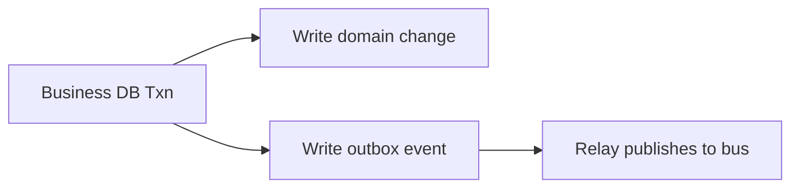

This prevents losing events when the database commit succeeds but the publish step fails.

---

## 21. Consumer Responsibilities

A consumer should:

* process events safely
* be idempotent
* retry transient failures
* send bad events to DLQ if needed
* avoid blocking the entire pipeline
* maintain observability

Consumers should never assume:

* they will see only one delivery
* they will always receive events in real time
* the event format will never evolve

---

## 22. Retries and Dead Letter Queue

A consumer may fail because:

* downstream dependency is down
* schema is invalid
* business rule rejects the event
* temporary timeout occurs

### Retry strategy

* retry with exponential backoff
* limit retry count
* send permanently failing messages to DLQ

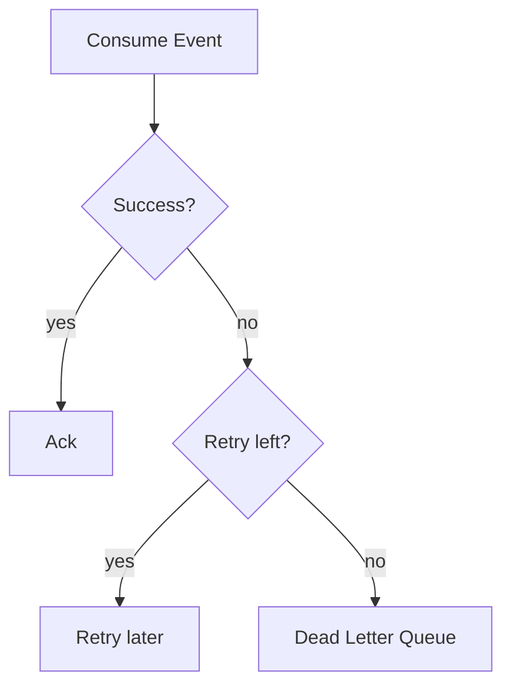

---

## 23. Event Bus Architecture with DLQ

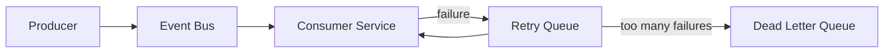

DLQ is essential for:

* debugging poison messages
* replay after fixes
* alerting on malformed data

---

## 24. Backpressure

If consumers are slower than producers, the bus can accumulate lag.

### Symptoms

* increasing queue length
* delayed notifications
* stale search index
* slow fraud checks

### Solutions

* scale consumers horizontally
* batch processing
* partitioning
* rate limiting producers
* throttle non-critical event emission
* prioritize important topics

---

## 25. Partitioning

Partitioning improves throughput and can preserve ordering.

Common partition keys:

* `userId`
* `orderId`
* `tenantId`
* `rideId`

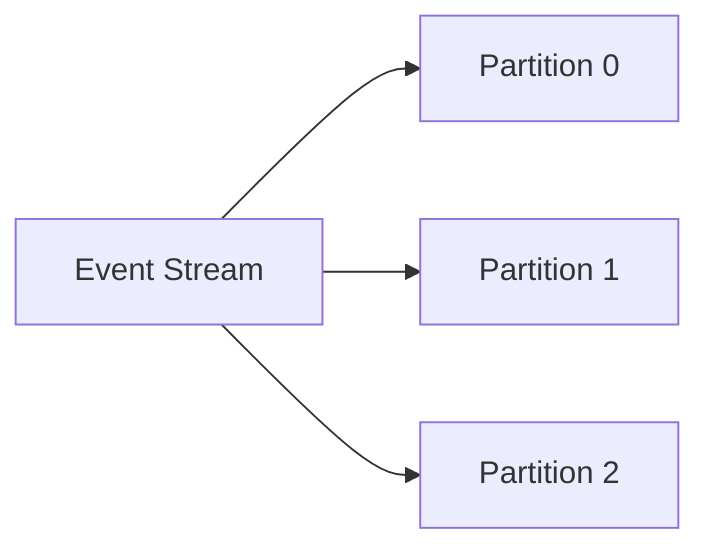

The right key depends on the business requirement:

* same order must stay ordered
* same user events may need sequence
* same tenant may need isolation

---

## 26. Event Bus vs Webhooks

### Event bus

* internal asynchronous communication
* many consumers
* scalable and centralized

### Webhooks

* external callback to another system
* often point-to-point
* useful for partner integrations

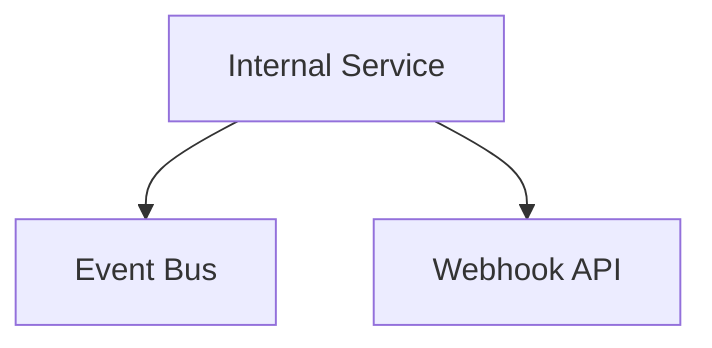

A platform might use both:

* event bus inside the system
* webhooks for external customers or partners

---

## 27. Event Bus vs Synchronous APIs

| Aspect         | Event Bus                 | Sync API                 |
| -------------- | ------------------------- | ------------------------ |
| Coupling       | Loose                     | Tight                    |
| Latency        | Asynchronous              | Immediate response       |
| Failure impact | Isolated                  | Can cascade              |
| Scalability    | High                      | Limited by request chain |
| Best for       | Side effects, integration | Direct user interactions |

Synchronous APIs are still needed for:

* login
* immediate validation
* read-after-write response
* interactive UI flows

Event buses are best for:

* side effects
* fanout
* integration
* background processing

---

## 28. Observability

A good event bus system needs strong observability.

### Metrics

* publish rate
* consume rate
* consumer lag
* retry count
* DLQ count
* delivery latency
* partition hot spots

### Logs

* eventId
* correlationId
* causationId
* consumer result
* error details

### Tracing

Trace a full business flow across services using correlation IDs.

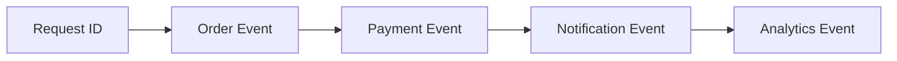

---

## 29. Security

Events can carry sensitive data, so security matters.

### Security rules

* authenticate producers
* authorize subscriptions
* encrypt in transit
* restrict topic access
* mask PII in event payloads
* log access
* rotate credentials

### Avoid putting in events

* raw passwords
* secret keys
* full card data
* sensitive personal data unless absolutely required

A good event design sends only what consumers need.

---

## 30. Multi-Tenant Event Bus

For SaaS systems, tenants may share the same event bus.

You must isolate:

* routing
* access
* rate limits
* observability
* data retention

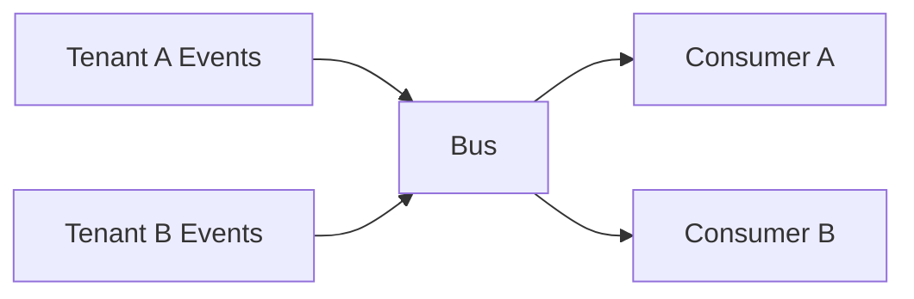

Tenant-aware partitioning and authorization are important to prevent noisy-neighbor problems.

---

## 31. Common Failure Scenarios

### Producer publishes but local DB write fails

Use the outbox pattern.

### Consumer crashes mid-processing

Use retries and idempotency.

### Event schema changes break consumers

Use versioning and compatibility rules.

### Bus backlog grows too large

Scale consumers or reduce event volume.

### Poison message keeps failing

Send to DLQ.

### Duplicate delivery

Deduplicate by event ID.

---

## 32. Best Practices

* keep events small and focused
* make events descriptive and business-oriented
* include version numbers
* design consumers to be idempotent
* use the outbox pattern for reliability
* maintain DLQ and replay tooling
* monitor lag aggressively
* separate critical and non-critical topics
* avoid putting huge blobs in events
* document event contracts

---

## 33. When to Use Event Bus Architecture

Use it when:

* many services react to one business event
* you want loose coupling
* you need asynchronous processing
* side effects should not block user requests
* the system is growing and direct service calls are becoming hard to manage

Good examples:

* e-commerce platforms
* fintech systems
* ride-hailing platforms
* SaaS backends
* content platforms
* analytics pipelines

---

## 34. When Not to Use It

Avoid it when:

* the flow is simple and synchronous
* you need immediate user-visible confirmation
* the team cannot maintain event contracts
* the domain is tiny and event overhead is unnecessary

Not everything should become event-driven.
Sometimes a direct API call is better.

---

## 35. Final Summary

Event Bus Architecture is a communication pattern where services publish events and other services subscribe to them.

It works well because it:

* reduces coupling
* scales well
* supports fanout
* isolates failures
* enables asynchronous workflows
* makes large systems easier to evolve

The trade-offs are:

* more operational complexity
* eventual consistency
* event versioning
* debugging across services
* duplicate delivery handling

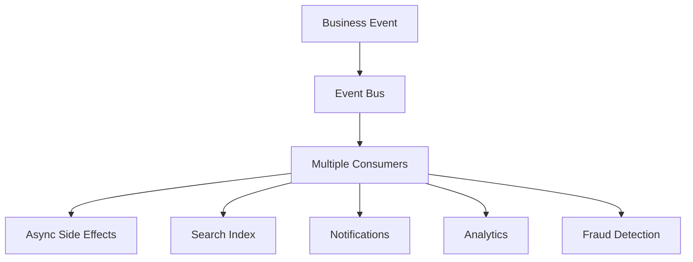

In short, an event bus is the backbone of many modern distributed systems because it lets services react to what happened, instead of depending on each other in real time.
