# Feature Flag Pattern

Feature flags allow you to **deploy code independently from releasing a feature to users**.

Instead of:

```text
Develop → Build → Deploy → Feature Live
```

you can separate deployment from release:

```text
Develop → Build → Deploy
                    ↓
              Feature Flag
                    ↓
             Gradual Rollout
                    ↓
             Feature Live
```

---

## 1. What Is a Feature Flag?

A feature flag is a configuration value that controls whether a piece of functionality is enabled.

```ts
if (featureFlags.newPaymentFlow) {
  return newPaymentFlow();
}

return legacyPaymentFlow();
```

The code is deployed to production, but the feature can remain disabled.

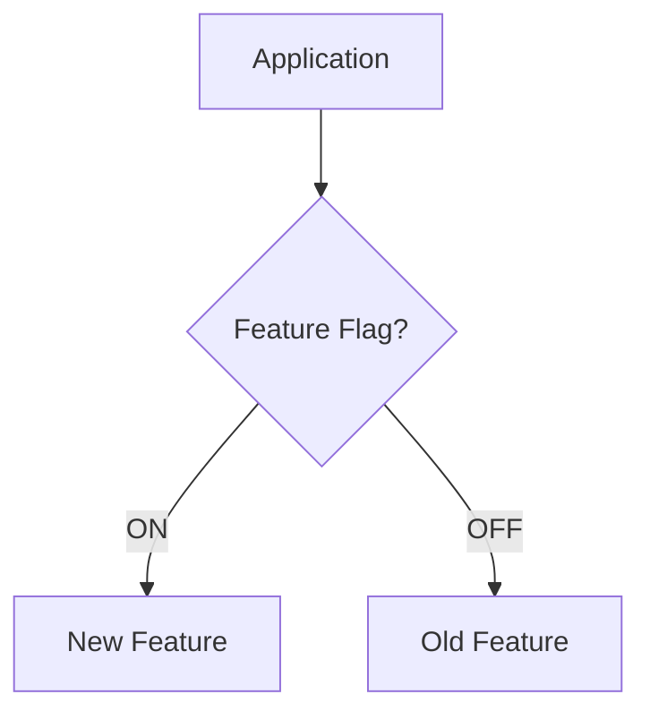

---

# 2. Basic Feature Flag Architecture

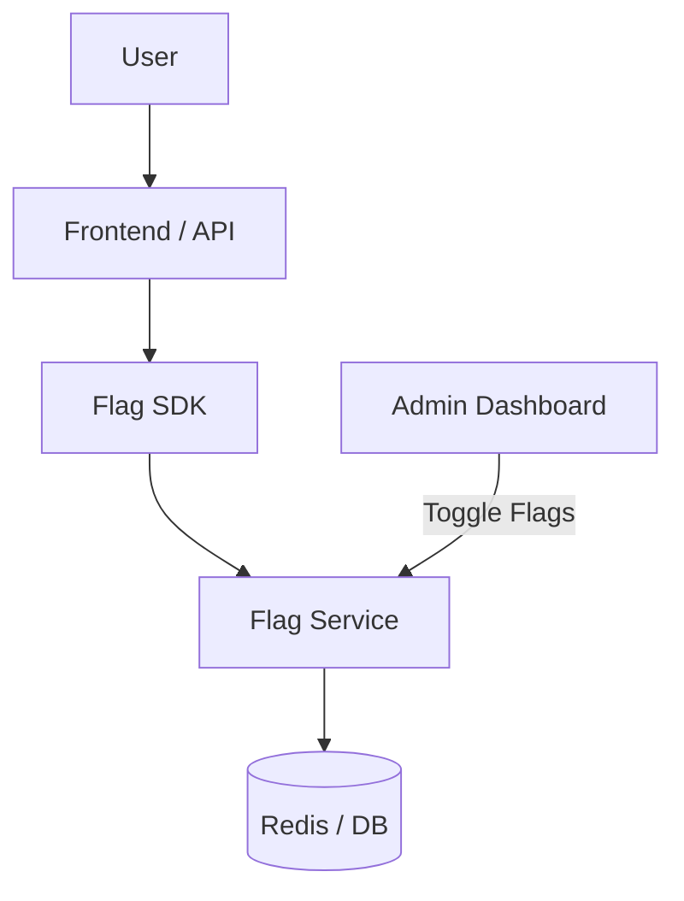

### Components

| Component | Responsibility |
|---|---|
| User | Uses the application |
| Frontend / API | Handles the user request |
| Flag SDK | Evaluates feature flags |
| Flag Service | Stores and evaluates flag configuration |
| Redis / DB | Persists flag state |
| Admin Dashboard | Allows teams to change flags |

---

# 3. Feature Flag Request Flow

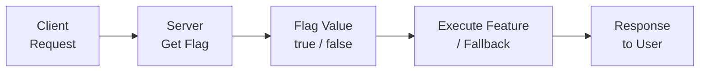

### Flow

```text
Client
  ↓
Request
  ↓
Server
  ↓
Get Feature Flag
  ↓
true / false
  ↓
Execute Feature / Fallback
  ↓
Response to User
```

---

# 4. Phase 1 — Deploy

## Goal

Deploy the new feature code to production without exposing it to users.

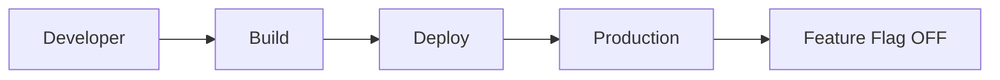

### Example

Suppose we are introducing a new payment flow.

```ts
function checkout(user: User) {
  if (featureFlags.newPaymentFlow) {
    return newPaymentFlow(user);
  }

  return legacyPaymentFlow(user);
}
```

The code is deployed with the flag disabled:

```ts
const featureFlags = {
  newPaymentFlow: false,
};
```

### Result

```text
New Payment Code
       ↓
     Build
       ↓
     Deploy
       ↓
   Production
       ↓
 Flag = false
       ↓
All Users → Old Payment Flow
```

### Why?

The new code is already running in production, but users are not exposed to it yet.

This separates:

```text
Deployment ≠ Release
```

### Trade-offs

| Benefits | Trade-offs |
|---|---|
| Deploy before releasing | Old and new code coexist |
| No immediate user impact | More code paths to test |
| Easy to control release | Flags need maintenance |
| Easier rollback | More operational complexity |

---

# 5. Phase 2 — Toggle OFF

## Goal

Keep the new code deployed while controlling which code path users execute.

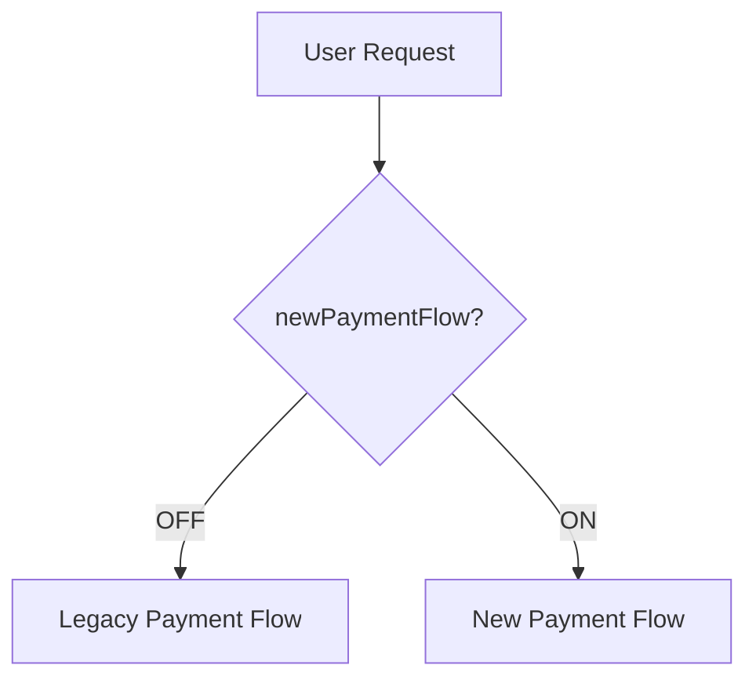

### Code Example

```ts
const enabled = await flagService.getBoolean(
  "newPaymentFlow",
  false
);

if (enabled) {
  return newPaymentFlow(user);
}

return legacyPaymentFlow(user);
```

Flag configuration:

```json
{
  "newPaymentFlow": false
}
```

### Flow

```text
Application Already Deployed
             ↓
       Flag = OFF
             ↓
      Old Payment Flow
```

No new deployment is required to change the feature state.

### Toggle ON

Later, the administrator can change:

```json
{
  "newPaymentFlow": true
}
```

Now:

```text
User Request
     ↓
Feature Flag = ON
     ↓
New Payment Flow
```

### Trade-offs

| Benefits | Trade-offs |
|---|---|
| Deployment and release are separate | Flag becomes operational state |
| No redeployment required | Flag service must be reliable |
| Fast rollback | Stale flags can accumulate |
| Easy to control production behavior | Requires access control |

---

# 6. Phase 3 — Gradual Rollout

## Goal

Instead of releasing the feature to every user, gradually increase exposure.

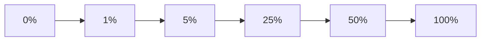

### Recommended Flow

```text
1%
 ↓
Monitor
 ↓
5%
 ↓
Monitor
 ↓
25%
 ↓
Monitor
 ↓
50%
 ↓
Monitor
 ↓
100%
```

The team can monitor:

- Error rate
- Latency
- Conversion rate
- Payment failures
- Application logs
- Business metrics

before increasing the rollout percentage.

---

## Stable User Rollout

A common approach is to consistently assign users using a stable hash.

```ts
function isEnabledForUser(
  userId: string,
  rollout: number
) {
  const hash = stableHash(userId);

  return hash % 100 < rollout;
}
```

Then:

```ts
const rollout = await flagService.getNumber(
  "newPaymentFlow",
  25
);

if (isEnabledForUser(user.id, rollout)) {
  return newPaymentFlow(user);
}

return legacyPaymentFlow(user);
```

Configuration:

```json
{
  "newPaymentFlow": 25
}
```

Approximately 25% of eligible users receive the new feature.

---

## Why Stable Hashing?

You don't want the same user to randomly switch between the old and new experience.

```text
User A → Hash → 17
User B → Hash → 82
User C → Hash → 42

Rollout = 25%

User A → New Feature
User B → Old Feature
User C → Old Feature
```

The same user should continue receiving the same experience while the rollout remains at 25%.

### Trade-offs

| Benefits | Trade-offs |
|---|---|
| Smaller blast radius | More complex targeting |
| Detect problems early | Requires monitoring |
| Safer production releases | Users may see different behavior |
| Gradual confidence | More testing scenarios |
| Easy to increase exposure | Rollout logic adds complexity |

---

# 7. Phase 4 — Issue Found

## Goal

If something goes wrong, disable the feature immediately without rebuilding or redeploying.

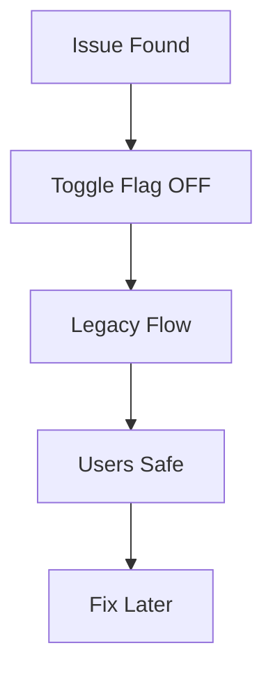

### Example

Suppose the feature is currently at:

```text
25% rollout
```

and production monitoring detects payment failures.

Instead of:

```text
Issue
 ↓
Fix Code
 ↓
Build
 ↓
Deploy
 ↓
Wait
```

we can do:

```text
Issue Found
     ↓
Toggle Flag OFF
     ↓
Legacy Payment Flow
     ↓
Users Back to Stable Flow
```

### Code

```ts
const enabled = await flagService.getBoolean(
  "newPaymentFlow",
  false
);

return enabled
  ? newPaymentFlow(user)
  : legacyPaymentFlow(user);
```

Emergency configuration:

```json
{
  "newPaymentFlow": false
}
```

### Result

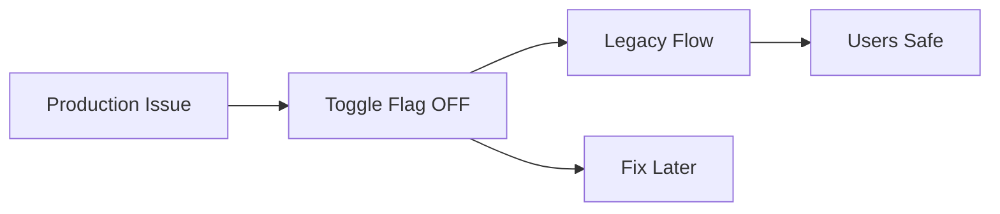

### Important

The rollback is a **configuration change**, not a code deployment.

```text
Rollback = Change Flag
```

rather than:

```text
Rollback = Redeploy Application
```

### Trade-offs

| Benefits | Trade-offs |
|---|---|
| Very fast rollback | Old path must remain functional |
| No redeployment | Flag service becomes important |
| Reduces blast radius | Does not fix the underlying bug |
| Useful during incidents | Creates operational dependency |
| Easy emergency control | Requires proper permissions |

---

# 8. Complete Feature Flag Lifecycle

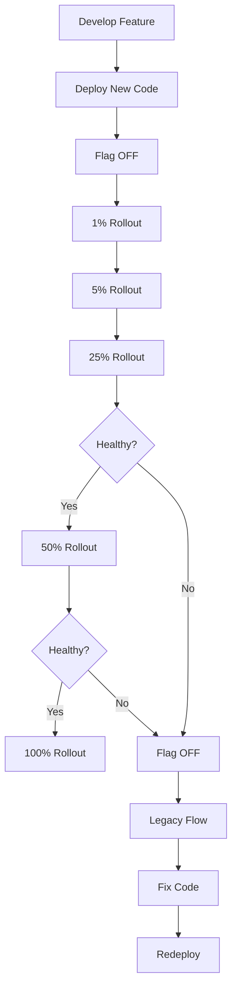

---

# 9. Admin Dashboard

Feature flags should normally be controlled through an administrative interface.

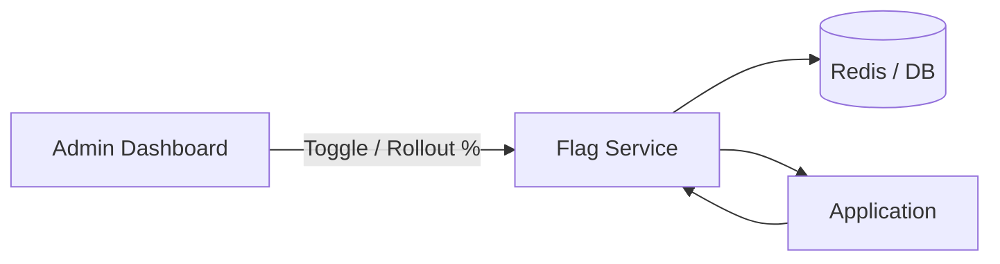

Example dashboard:

```text
┌─────────────────────────────────────┐
│ Feature Flags                       │
├─────────────────────────────────────┤
│                                     │
│ newPaymentFlow       [ ON ]         │
│ Rollout              25%            │
│                                     │
│ newCheckout          [ OFF ]        │
│ Rollout              0%             │
│                                     │
└─────────────────────────────────────┘
```

---

# 10. Feature Flag Data Model

A simple flag could look like:

```ts
type FeatureFlag = {
  key: string;
  enabled: boolean;
  rolloutPercentage?: number;
};
```

Example:

```json
{
  "key": "newPaymentFlow",
  "enabled": true,
  "rolloutPercentage": 25
}
```

For more advanced systems:

```ts
type FeatureFlag = {
  key: string;
  enabled: boolean;
  rolloutPercentage: number;

  targeting?: {
    userIds?: string[];
    countries?: string[];
    environments?: string[];
  };
};
```

---

# 11. Simple Flag Evaluation

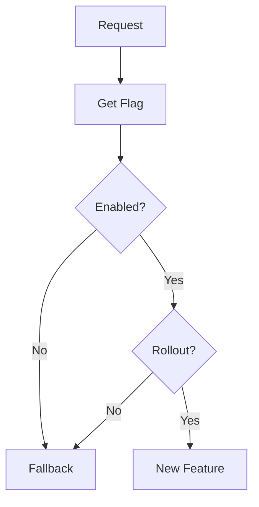

Example:

```ts
function evaluateFlag(
  flag: FeatureFlag,
  userId: string
) {
  if (!flag.enabled) {
    return false;
  }

  if (!flag.rolloutPercentage) {
    return true;
  }

  return stableHash(userId) % 100 <
    flag.rolloutPercentage;
}
```

---

# 12. Client-Side vs Server-Side Flags

## Client-Side

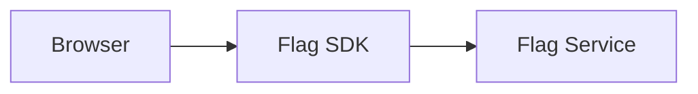

### Advantages

- Fast UI decisions
- Useful for frontend experiments
- Can avoid repeated API requests with caching

### Trade-offs

- Flag values may be visible to users
- Not suitable for secrets
- Client can potentially manipulate the decision

---

## Server-Side

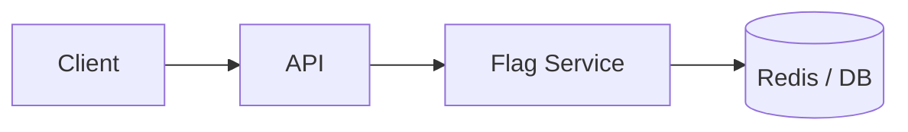

### Advantages

- Better control
- Useful for backend behavior
- Flag values can remain private
- Easier to enforce business rules

### Trade-offs

- Adds server-side evaluation
- Flag service availability matters
- Network latency may become relevant

---

# 13. Caching Flags

A flag should not necessarily require a database request for every user request.

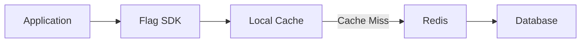

Example:

```ts
const flag = await flagCache.get("newPaymentFlow");

if (flag !== undefined) {
  return flag;
}

const value = await flagService.get("newPaymentFlow");

await flagCache.set(
  "newPaymentFlow",
  value,
  60
);

return value;
```

### Trade-off

Caching improves performance but introduces **eventual consistency**.

```text
Admin changes flag
       ↓
Cache still has old value
       ↓
Application temporarily sees old flag
```

---

# 14. Fail-Safe Behavior

What happens if the Feature Flag Service is unavailable?

A safe default should usually be defined.

```ts
const enabled = await flagService
  .getBoolean("newPaymentFlow", false)
  .catch(() => false);
```

This gives:

```text
Flag Service Down
       ↓
Fallback = false
       ↓
Legacy Feature
```

### Why?

For a risky feature, failing closed is often safer:

```text
Service unavailable
       ↓
New Feature OFF
```

However, the correct behavior depends on the feature.

For some features, failing open may be acceptable.

---

# 15. Feature Flag Types

### Release Flags

Used to control a new feature during deployment.

```ts
newPaymentFlow = true;
```

### Experiment Flags

Used for A/B testing.

```ts
checkoutExperiment = "variant-b";
```

### Operational Flags

Used to enable or disable system behavior.

```ts
enableBackgroundJobs = false;
```

### Permission Flags

Used for specific users or groups.

```ts
advancedDashboard = isAdmin;
```

### Kill Switches

Used for emergency rollback.

```ts
disablePayments = true;
```

---

# 16. Feature Flag Example — Payment System

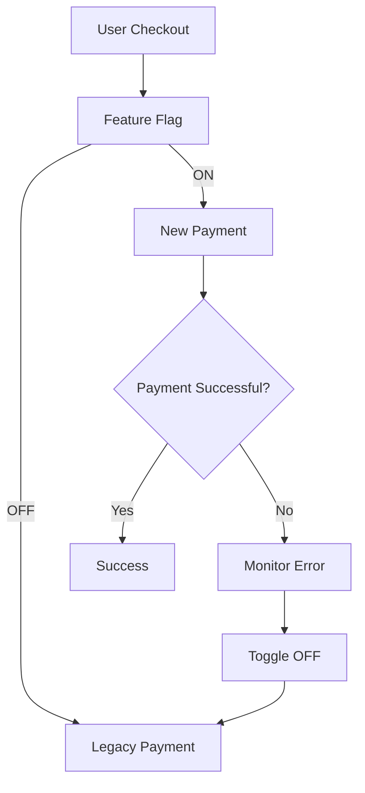

Code:

```ts
async function checkout(user: User) {
  const enabled = await flagService.getBoolean(
    "newPaymentFlow",
    false
  );

  if (!enabled) {
    return legacyPaymentFlow(user);
  }

  return newPaymentFlow(user);
}
```

---

# 17. Gradual Rollout Example

```ts
const rollout = await flagService.getNumber(
  "newPaymentFlow",
  5
);

const enabled = isEnabledForUser(
  user.id,
  rollout
);

if (enabled) {
  return newPaymentFlow(user);
}

return legacyPaymentFlow(user);
```

Rollout configuration:

```text
Day 1 → 1%
Day 2 → 5%
Day 3 → 25%
Day 4 → 50%
Day 5 → 100%
```

Only increase the percentage when the system remains healthy.

---

# 18. Observability

Feature flags become much more useful when combined with monitoring.

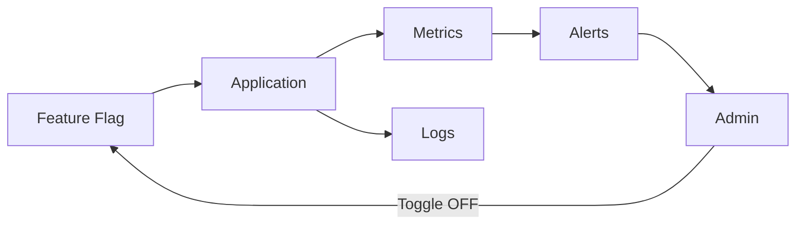

Monitor things such as:

```text
Error Rate
Latency
Conversion
Payment Success
Crash Rate
API Failures
```

Example:

```text
25% Rollout
     ↓
Error Rate ↑
     ↓
Alert
     ↓
Admin Dashboard
     ↓
Flag OFF
     ↓
Legacy Flow
```

---

# 19. Feature Flag Lifecycle

A feature flag should not live forever.

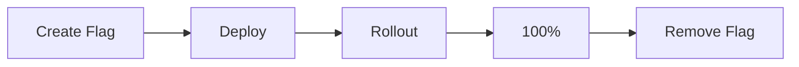

Once the feature is permanently enabled:

```ts
if (featureFlags.newPaymentFlow) {
  return newPaymentFlow();
}

return legacyPaymentFlow();
```

can eventually become:

```ts
return newPaymentFlow();
```

Then remove:

- Feature flag
- Flag configuration
- Old code path
- Flag SDK dependency if no longer required

---

# 20. Stale Flags

A stale flag is a flag that is no longer needed but remains in the codebase.

Example:

```ts
if (flags.newPaymentFlow) {
  return newPaymentFlow();
}

return legacyPaymentFlow();
```

After the feature is stable:

```ts
return newPaymentFlow();
```

Remove the old branch.

### Why remove flags?

Too many flags create:

```text
More Flags
   ↓
More Code Paths
   ↓
More Testing
   ↓
More Complexity
   ↓
More Maintenance
```

---

# 21. Main Trade-offs

| Feature Flags | Trade-off |
|---|---|
| Faster releases | More operational complexity |
| Instant rollback | Requires reliable flag infrastructure |
| Gradual rollout | Requires monitoring |
| A/B testing | More code paths |
| No redeployment for release | Configuration becomes critical |
| Smaller blast radius | Users can have different experiences |
| Safer deployments | Stale flags can accumulate |

---

# 22. Complete Architecture

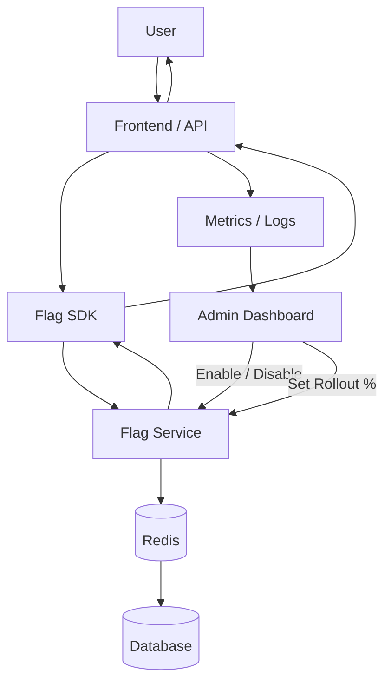

---

# 23. Complete Rollout Strategy

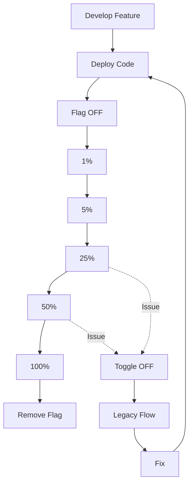

---

# Key things to understand.!

1. **Deploy first, release later.**
2. Keep risky features **OFF by default**.
3. Separate deployment from feature activation.
4. Use gradual rollout to reduce blast radius.
5. Use stable user targeting for consistent experiences.
6. Monitor each rollout stage.
7. Keep a safe fallback path.
8. Use a kill switch for emergency rollback.
9. Cache flag values when appropriate.
10. Remove temporary flags after the feature becomes permanent.

> **Feature flags turn deployment into a controlled, reversible release process.**
