# UPI Payment

UPI, or Unified Payments Interface, is an instant payment system developed by NPCI, an RBI-regulated entity, and it is built over the IMPS infrastructure. It lets users instantly transfer money between bank accounts and is designed to work 24/7, independent of banking hours. The explanations below combine official NPCI material with a system-design style architecture that is inferred from how UPI works publicly.

---

## 1. What problem UPI solves

Before UPI, digital bank transfers were often slower, more fragmented, and harder to use at merchant checkout. UPI solves this by giving users a single mobile-based interface for sending money, receiving money, paying merchants, approving collect requests, and managing recurring mandates. NPCI explicitly describes UPI as adding P2P pull functionality, simpler merchant payments, a single app for money transfer, and single-click two-factor authentication. 

From a product point of view, UPI removes the need for the payer to remember beneficiary bank details every time. NPCI’s FAQ says money can be transferred using a Virtual ID/VPA, or account number plus IFSC, and that beneficiary registration is not required before transfer. 

---

## 2. The main actors in a UPI ecosystem

A UPI transaction usually involves:

* **Payer**: the person sending money
* **Payee**: the person or merchant receiving money
* **UPI app / PSP app / TPAP app**: the app used by the user
* **Issuer bank**: the bank where the payer holds the account
* **Acquirer bank**: the bank or partner that enables merchant acceptance
* **NPCI UPI rail**: the interbank switching and settlement layer
* **Settlement and dispute systems**: the back-office infrastructure for money movement and reconciliation. NPCI’s merchant FAQ says a merchant needs to partner with an acquirer bank, and the acquirer provides the UPI infrastructure for acceptance. 

---

## 3. High-level architecture

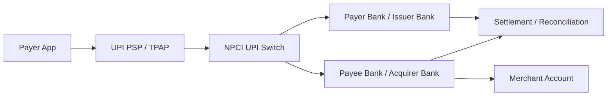

At a system-design level, UPI is best understood as a fast orchestration layer between banks, with the user experience exposed through apps that sit on top of the rail. The public NPCI docs confirm that UPI is instant, bank-account based, and built over IMPS. 

---

## 4. Core requirements

### Functional requirements

* Send money to another person
* Pay merchants online and offline
* Handle collect requests
* Support QR, intent, app-based, and collect modes for merchants
* Allow recurring mandates / autopay use cases
* Support transaction history and status tracking
* Support PIN-based authorization
* Support grievance and failure handling. NPCI’s FAQs and product pages explicitly mention merchant QR/intent/app/collect modes, collect requests, transaction history, and UPI autopay / mandates. 

### Non-functional requirements

* Instant processing
* 24/7 availability
* Strong authentication
* High reliability
* Low latency
* Safe handling of failures and reversals
* Scalable settlement and reconciliation. NPCI states that UPI payments are instant and 24/7, and that failed transactions are generally refunded back to the account, with pending cases settling later according to the bank workflow. 

---

## 5. Identity model: VPA, account, and mobile number

UPI abstracts bank account details behind a payment address called a **VPA** or Virtual Payment Address. NPCI’s FAQ says beneficiaries do not need to be registered by bank details before transfer if the payer uses VPA, account+IFSC, or Aadhaar number, depending on what the app and bank support. It also notes that the platform fetches linked accounts in masked form using the mobile number linked to the bank account. 

A typical VPA looks like:

```text
ayaan@upi
shopname@bankhandle
merchant123@psp
```

This lets users pay without exposing full account numbers every time. That is one of the main user-experience advantages of UPI. 

---

## 6. UPI PIN

UPI-PIN is the authorization factor for UPI bank transactions. NPCI says the UPI-PIN is a 4–6 digit passcode created during first-time registration, and the same UPI-PIN can be used across multiple UPI apps. NPCI also states that the UPI app does not store or read the PIN details, and that bank customer support will never ask for it. 

If a user enters the wrong PIN, the transaction fails. NPCI says repeated wrong attempts may cause the bank to temporarily block sending money via UPI, depending on the bank’s policy. NPCI also says that if the PIN is forgotten, it can be regenerated using debit-card details such as the last six digits and expiry date. 

---

## 7. Main transaction types

### 7.1 P2P push payment

This is the simplest flow: one person sends money to another using a VPA or bank details.

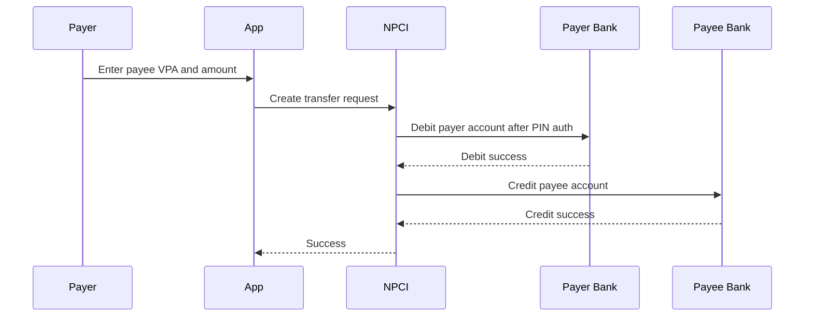

NPCI’s FAQ describes UPI as instant money transfer between bank accounts and says the payer authorizes bank transactions using the UPI-PIN. 

### 7.2 P2P pull / collect request

UPI also supports a “collect” or pull flow. NPCI says UPI provides P2P pull functionality, and in its FAQ, a merchant or sender can create a collect request that the user approves with their UPI-PIN. 

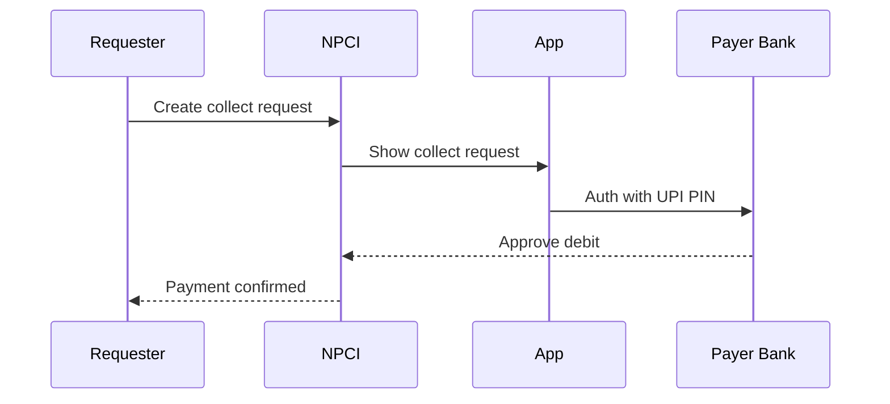

This is used in merchant collection flows and some bill/payment use cases. NPCI’s FAQ explicitly says that online merchant checkout can generate a collect request on the payer’s app after the user enters the payment address. 

### 7.3 Merchant QR payment

For offline merchant payments, the user scans a QR code and pays from the app. NPCI says merchants can integrate UPI through QR, intent, application-based, and collect modes, and that merchant funds are received immediately after the customer confirms payment into the merchant pool or merchant bank account, depending on the arrangement. 

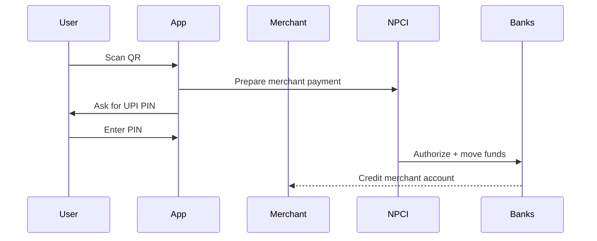

### 7.4 Intent-based merchant payment

Intent flows are used when the checkout app launches the UPI app or hands off the payment request directly. NPCI lists intent as one of the supported merchant integration modes. 

### 7.5 Recurring mandates / UPI Autopay

NPCI introduced UPI AutoPay for recurring payments, allowing users to create e-mandates for recurring use cases such as bills, EMIs, OTT subscriptions, insurance, mutual funds, and similar payments. NPCI’s press release describes UPI AutoPay as part of UPI 2.0 for recurring payments. 

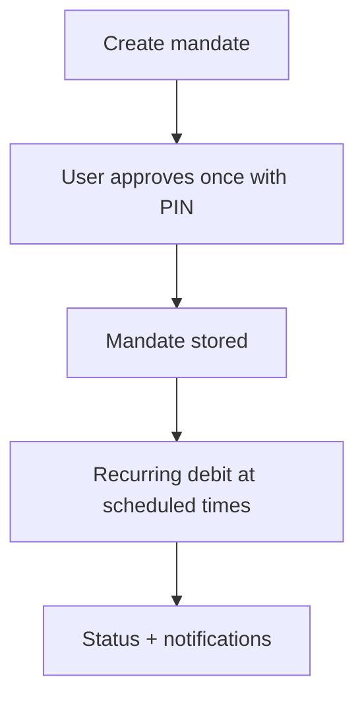

---

## 8. Detailed end-to-end payment flow

The simplest UPI debit flow looks like this:

1. User opens UPI app.
2. User chooses payee by VPA, scan, or contact.
3. App fetches payee details.
4. App shows amount and payment summary.
5. User enters UPI-PIN.
6. Issuer bank authenticates and debits the account.
7. NPCI routes the transaction.
8. Payee side bank credits the recipient.
9. App shows success or pending status. NPCI’s FAQ and product page confirm the payee can be identified by VPA/account+IFSC and that successful payments are instant and 24/7. 

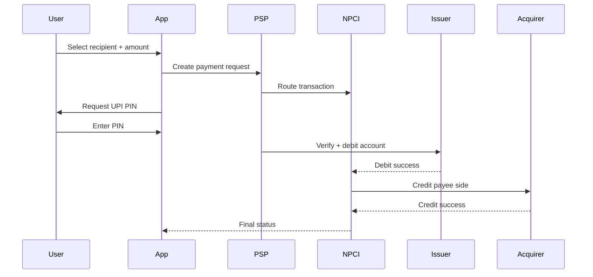

---

## 9. Transaction states

A UPI transaction usually moves through these states:

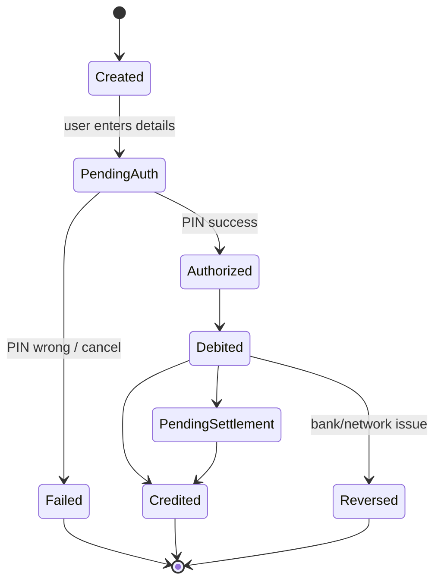

NPCI’s FAQ says that if a transaction fails after debit, the amount is refunded back to the account, and if a payment is pending, it may be credited later, with some cases reaching the beneficiary within 48 hours after daily settlement processing. 

---

## 10. System components in a UPI-style platform

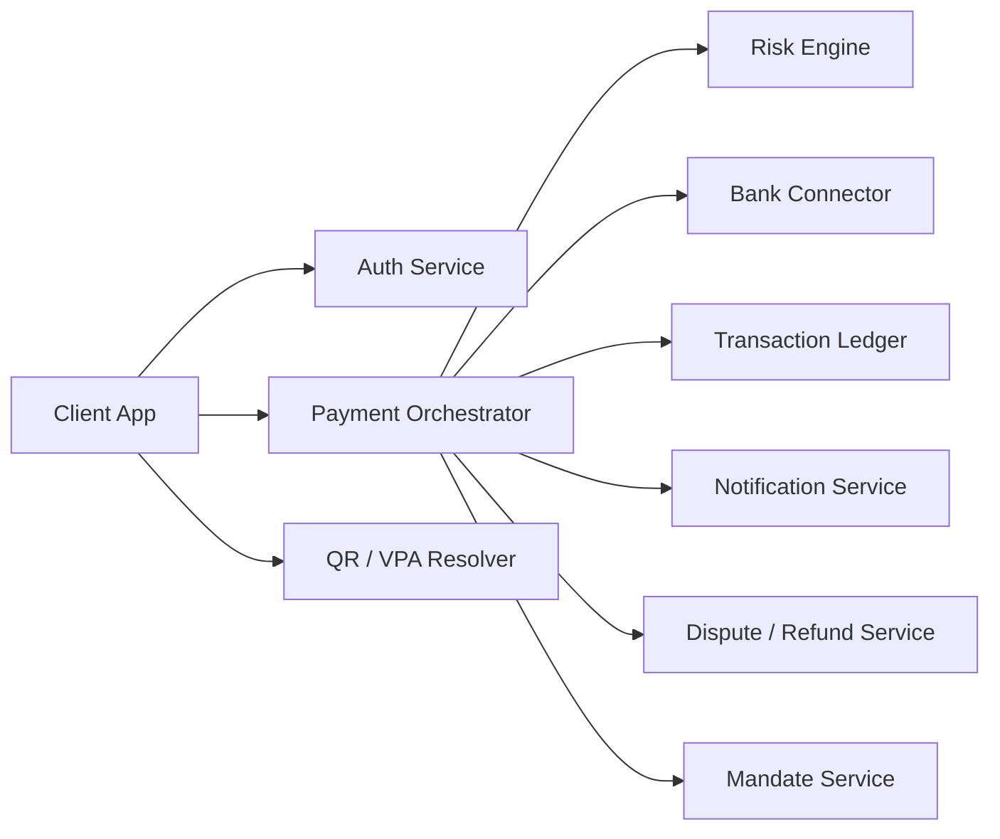

### 10.1 Auth service

Handles login, device binding, mobile verification, and session validity.

### 10.2 Payment orchestrator

Coordinates the whole transaction and keeps the transaction state machine consistent.

### 10.3 VPA / QR resolver

Resolves a payment address or scanned QR into the correct payee identity and bank endpoint.

### 10.4 Risk engine

Detects fraud, unusual behavior, repeated PIN failures, suspicious velocity, and abnormal device patterns.

### 10.5 Bank connector

Talks to issuer/acquirer banks and handles authorization, debit, credit, and callback/retry flows.

### 10.6 Transaction ledger

Stores transaction attempts, final status, timestamps, reversals, and reconciliation references.

### 10.7 Dispute / refund service

Manages failed-debit cases, pending settlements, refunds, and complaint workflows.

### 10.8 Mandate service

Stores recurring autopay mandates, statuses, and scheduled debit permissions.

---

## 11. Data model

A UPI platform typically needs these entities:

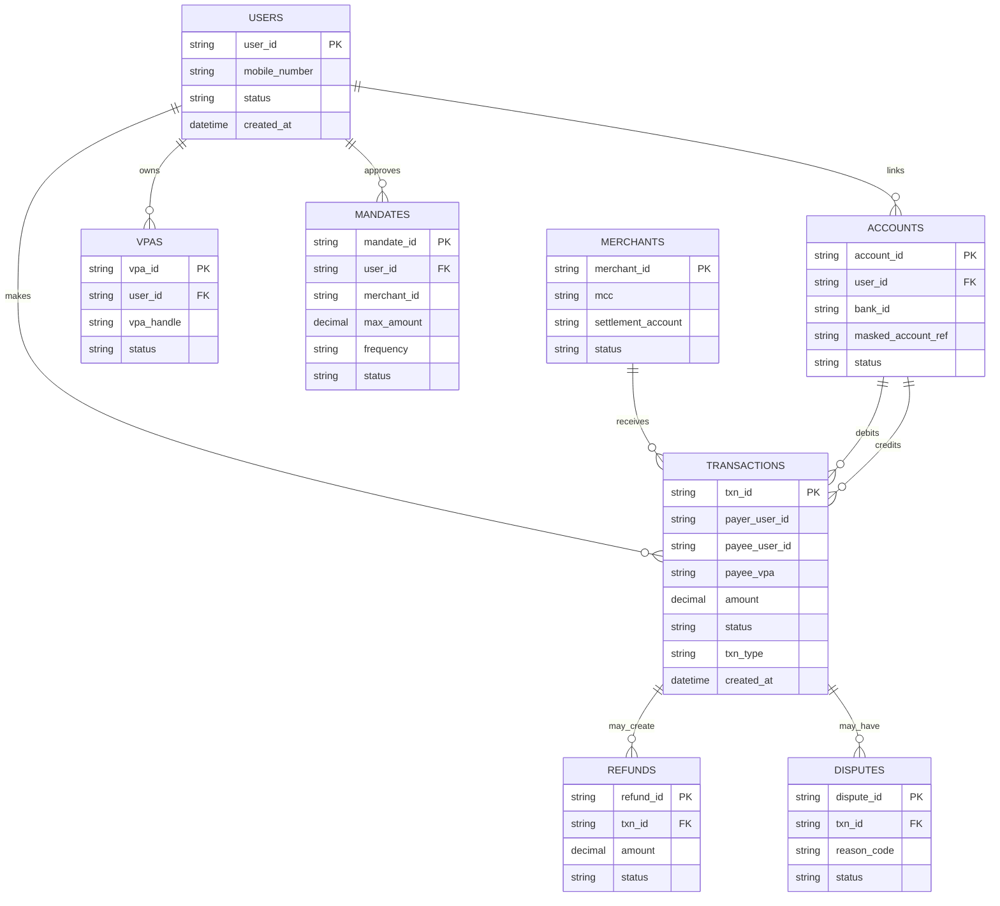

---

## 12. API design

A UPI-style platform may expose APIs like these:

```http
POST /v1/payments
```

```json
{
  "payer_vpa": "ayaan@upi",
  "payee_vpa": "shop@bank",
  "amount": 249.00,
  "remarks": "Lunch"
}
```

```http
POST /v1/payments/{txn_id}/authorize
```

```json
{
  "upi_pin": "1234"
}
```

```http
POST /v1/collect-requests
```

```json
{
  "payer_vpa": "ayaan@upi",
  "amount": 500.00,
  "expires_in_seconds": 900,
  "note": "Rent"
}
```

```http
POST /v1/mandates
```

```json
{
  "merchant_id": "m_123",
  "amount": 999.00,
  "frequency": "MONTHLY",
  "start_date": "2026-07-01"
}
```

```http
GET /v1/transactions/{txn_id}
```

These API shapes are an engineering inference, but they align with the transaction types and flows described by NPCI’s public documentation. 

---

## 13. Merchant acceptance

NPCI says merchants can accept UPI through QR, intent, application-based, and collect modes. It also says the merchant receives money immediately after the customer confirms the payment into the merchant’s settlement account or pool account, depending on the merchant arrangement. 


That makes UPI useful for:

* retail checkout
* e-commerce
* food delivery
* utility payments
* ride-hailing
* subscriptions through mandates. 

---

## 14. Limits and operational rules

NPCI’s FAQ states that normal UPI transactions have a limit of up to ₹1 lakh per transaction, while specific categories such as capital markets, collections, insurance, and foreign inward remittances can go up to ₹2 lakh, and IPO and Retail Direct Scheme can go up to ₹5 lakh per transaction. Because limits are policy-sensitive, apps and banks should always rely on the latest NPCI and bank-side rules at runtime. 

NPCI also says UPI is available on Android and iOS, that users need to register with their PSP and link accounts, and that changing the UPI app or mobile/SIM generally requires re-registration. 

---

## 15. Security model

UPI uses the UPI-PIN as the transaction authorization factor, and NPCI says this PIN is not stored or read by the UPI app. Wrong PIN entries fail the transaction, and repeated failures can trigger temporary sending blocks depending on the bank. NPCI also states that users should never share their UPI-PIN and that bank support will never ask for it. 

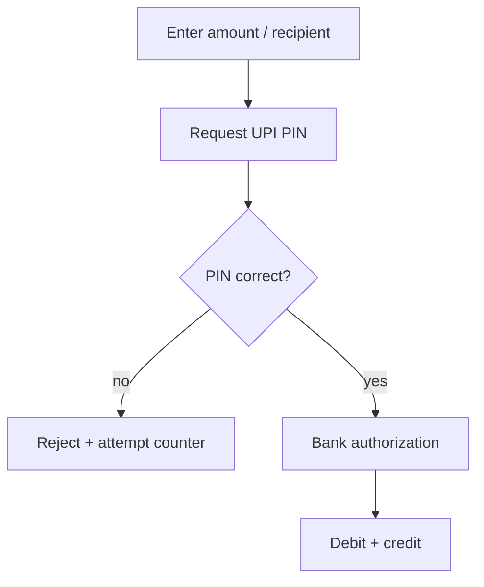

A secure UPI implementation also needs:

* device binding,
* velocity checks,
* fraud scoring,
* transaction replay protection,
* secure transport,
* and strong audit logging. Those are system-design inferences, but they are natural requirements for a rail that moves money instantly and at scale. 

---

## 16. Caching and performance

A UPI platform must be fast because the user expects an almost immediate response. The most cacheable items are:

* user profile and linked accounts,
* VPA resolution,
* merchant metadata,
* bank capability data,
* recent transaction state,
* and mandate lookup results.

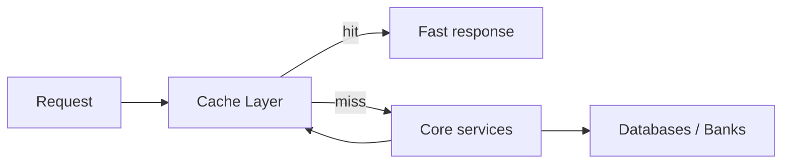

This is an engineering inference, but it is consistent with the 24/7 instant nature of UPI and the need to reduce latency at the payment edge. 

---

## 17. Failure handling and reversals

NPCI’s FAQ says that if a UPI transaction fails, the money is refunded back to the account, and if the transaction is pending due to a beneficiary-bank issue, the amount may reach the beneficiary after settlement, sometimes within 48 hours. It also says that if a successful confirmation is not received within an hour, the user should contact bank support. 

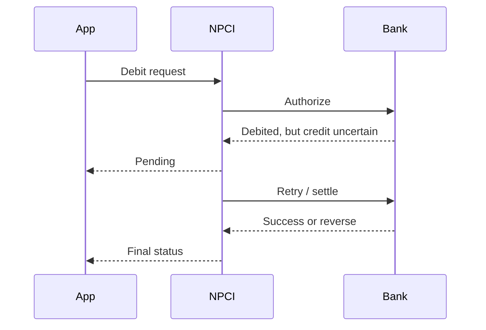

A robust UPI backend must therefore support:

* idempotency keys,
* retries,
* callback reconciliation,
* reversal processing,
* and delayed settlement completion. Those are inferred backend requirements from the public failure modes NPCI describes. 

---

## 18. Reconciliation and settlement

Even though the user sees a near-instant success or failure, the platform still has to reconcile interbank movement afterward. NPCI’s materials indicate that some pending cases complete during daily settlements, which implies a back-office settlement and reconciliation layer behind the real-time authorization path. 

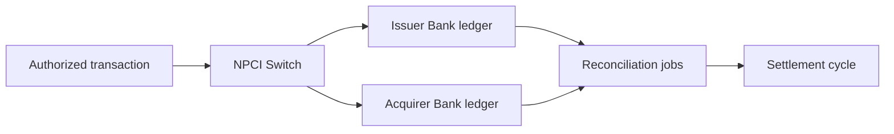

---

## 19. Common edge cases

### Wrong UPI PIN

Transaction fails and repeated failures may block sending money temporarily. 

### Lost phone

NPCI says the UPI-PIN is needed to authorize transactions, so a lost phone does not automatically expose funds, but the user should contact bank support. 

### Changed SIM or mobile

NPCI says re-registration is required after changing SIM/mobile/application of the PSP. 

### Changed UPI app

NPCI says a new app generally requires re-registration and a new VPA with that PSP handle. 

### Merchant payment without beneficiary registration

NPCI says beneficiary registration is not required for UPI transfer because the transfer can be done using VPA, account+IFSC, or Aadhaar, depending on support. 

---

## 20. How UPI differs from IMPS

NPCI says UPI is built over IMPS but adds P2P pull functionality, simpler merchant payments, a single app for money transfer, and single-click two-factor authentication. In other words, IMPS is the rail beneath, while UPI is the user-facing orchestration and authentication layer on top. 

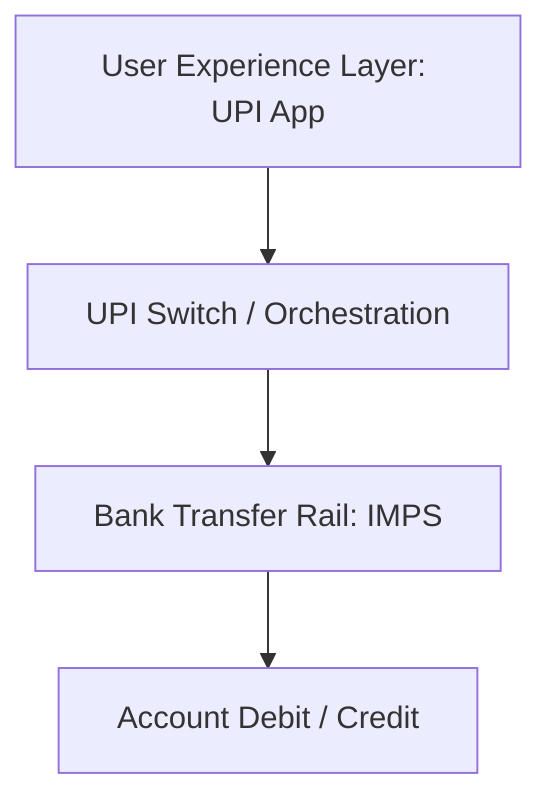

---

## 21. Why UPI scales so well

UPI scales because it pushes complexity into a shared network rail and standardizes user-facing interactions:

* VPA-based addressing
* standardized PIN authorization
* shared merchant acceptance modes
* bank-to-bank settlement through a common switch
* simple transaction states
* and immediate mobile-friendly flows. NPCI’s public documentation emphasizes interoperability, instant transfers, merchant acceptance, and broad app support across Android and iOS. 

---

## 22. Interview-style summary

UPI Payment is a real-time bank payment system built by NPCI on top of IMPS. It lets users pay through VPA, QR, collect requests, intent flows, and mandates. A UPI app authenticates the user with UPI-PIN, the issuer bank authorizes the debit, NPCI routes the transaction, and the beneficiary side receives the credit. UPI is instant and 24/7, supports merchant acceptance in multiple modes, and handles failure, reversal, and settlement through the bank and NPCI back-office layers. 

---

## 23. Final architecture snapshot

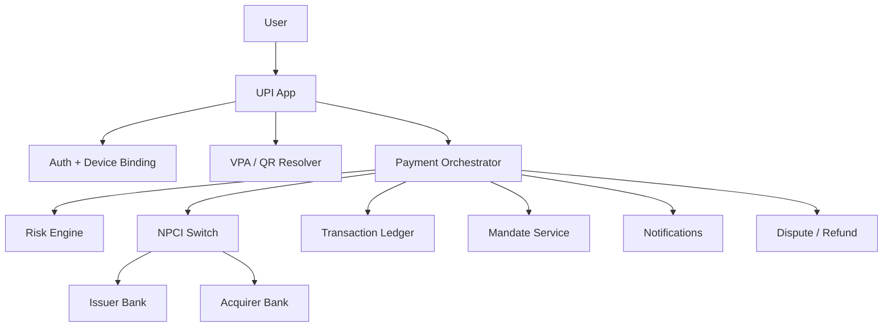

UPI is essentially a fast, secure, interoperable payment orchestration layer that connects users, merchants, and banks with a single mobile-first experience. Official NPCI documentation confirms the key product behavior: instant 24/7 transfers, UPI-PIN authorization, collect requests, merchant acceptance modes, transaction limits, and recurring mandates. 

[1]: https://www.npci.org.in/product/upi?utm_source=chatgpt.com "UPI: Unified Payments Interface - Instant Mobile Payments | NPCI"
[2]: https://www.npci.org.in/what-we-do/upi/faqs?utm_source=chatgpt.com "UPI - Frequently Asked Questions | NPCI"
[3]: https://www.npci.org.in/PDF/npci/press-releases/2020/NPCI_Press_Release-NPCI_introduces_AutoPay_facility_on_UPI_for_recurring_payments.pdf?utm_source=chatgpt.com "Press Release                                                                                 22-07-2020"
