# How Google Drive Works

Google Drive is a cloud file storage, sync, search, and collaboration system.

At a high level, it solves four problems at once:

1. Store files safely in the cloud.
2. Keep files synced across devices.
3. Allow sharing and collaboration with fine-grained permissions.
4. Make files searchable, versioned, and recoverable.

This document explains how a Google Drive-like system works end to end, including upload, download, sync, versioning, permissions, indexing, collaboration, and scaling.

---

## 1. Problem Statement

Design a system that lets users:

* upload files and folders
* access them from web, mobile, and desktop
* sync changes across devices
* share files with individuals, groups, or public links
* collaborate on documents in real time
* search by name or content
* restore old versions
* handle billions of files and millions of active users

---

## 2. Core Requirements

### Functional Requirements

* Upload and download files
* Create folders and nested directory structures
* Sync changes across multiple devices
* Share files or folders with permissions
* Support version history
* Support search by filename and file content
* Support collaborative editing for documents, sheets, and slides
* Handle deletions and recovery from trash
* Support offline editing and later sync

### Non-Functional Requirements

* High availability
* Low latency for metadata operations
* Durable storage for files
* Strong permission checks
* Conflict handling for concurrent edits
* Scalable search indexing
* Efficient bandwidth usage
* Eventual consistency where acceptable
* Real-time collaboration for editable docs

---

## 3. High-Level Architecture

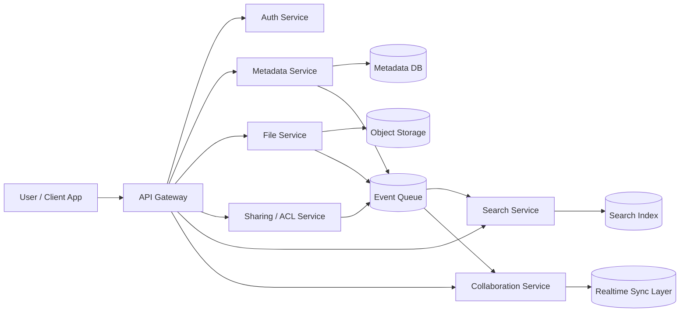

### Main building blocks

* **API Gateway**: entry point for all requests
* **Auth Service**: login, token validation, session management
* **Metadata Service**: stores file names, folders, owners, versions, timestamps
* **File Service**: stores and retrieves file blobs
* **Sharing / ACL Service**: manages permissions
* **Search Service**: indexes file names and content
* **Collaboration Service**: handles live editing, cursors, and deltas
* **Object Storage**: stores actual file bytes
* **Metadata DB**: stores structured records
* **Event Queue**: connects services asynchronously
* **Realtime Layer**: WebSocket / pub-sub layer for live sync

---

## 4. What Gets Stored Where

A Drive-like system splits data into two categories:

### 4.1 Metadata

Examples:

* file name
* owner
* parent folder
* permissions
* mime type
* size
* version count
* timestamps
* trash state

This belongs in a relational or strongly consistent metadata store.

### 4.2 File Content

Examples:

* the actual bytes of PDF, image, video, doc, zip, etc.

This belongs in object storage or distributed blob storage.

This separation is crucial because metadata is queried constantly, while file content is large and transferred less frequently.

---

## 5. Why Metadata and Blob Storage Are Separate

If file bytes were stored directly in the metadata DB, the system would suffer from:

* huge database size
* slow backups
* expensive replication
* poor scaling for large uploads
* inefficient range downloads

Instead:

* metadata DB stores references
* object storage stores chunks or blobs
* search index stores searchable text
* cache stores hot metadata and permission checks

---

## 6. Data Model

### 6.1 Files

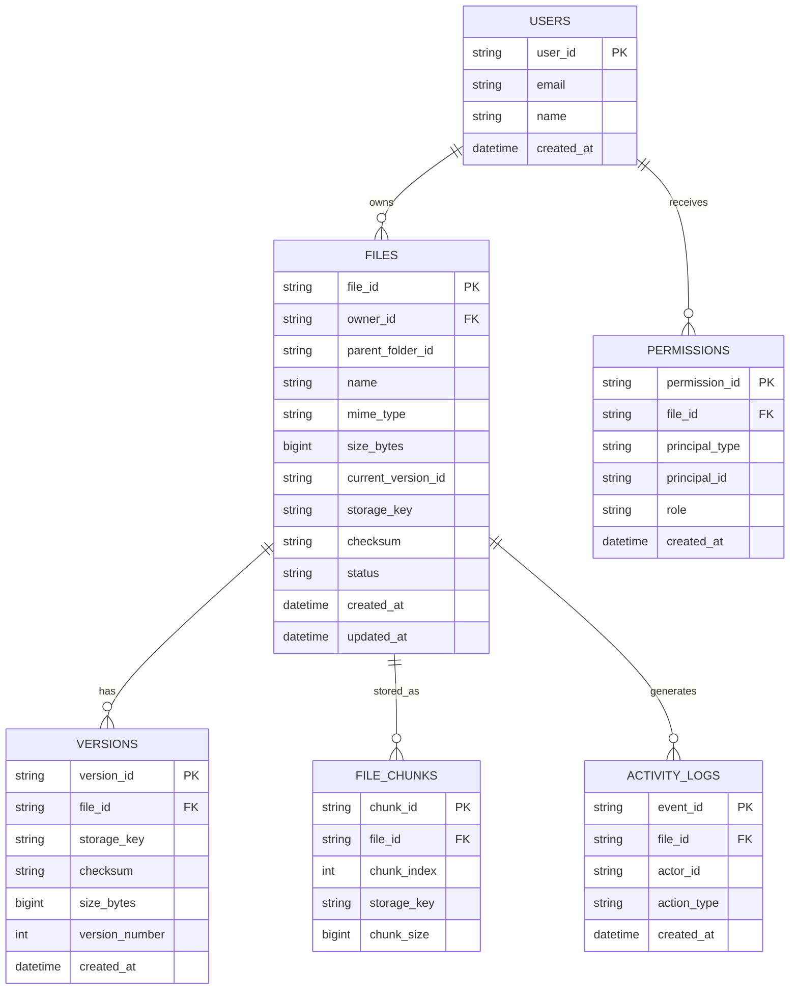

### 6.2 Folder hierarchy

Folders are usually implemented as files with a special type, or as separate folder records.

A simple model:

* each file has `parent_folder_id`
* root folder belongs to a user
* folder contents are resolved by querying children with that parent

For scale, many systems also maintain path indexes or materialized views to speed up folder listing.

---

## 7. Upload Flow

Uploads are one of the most important flows.

### 7.1 Simple upload flow

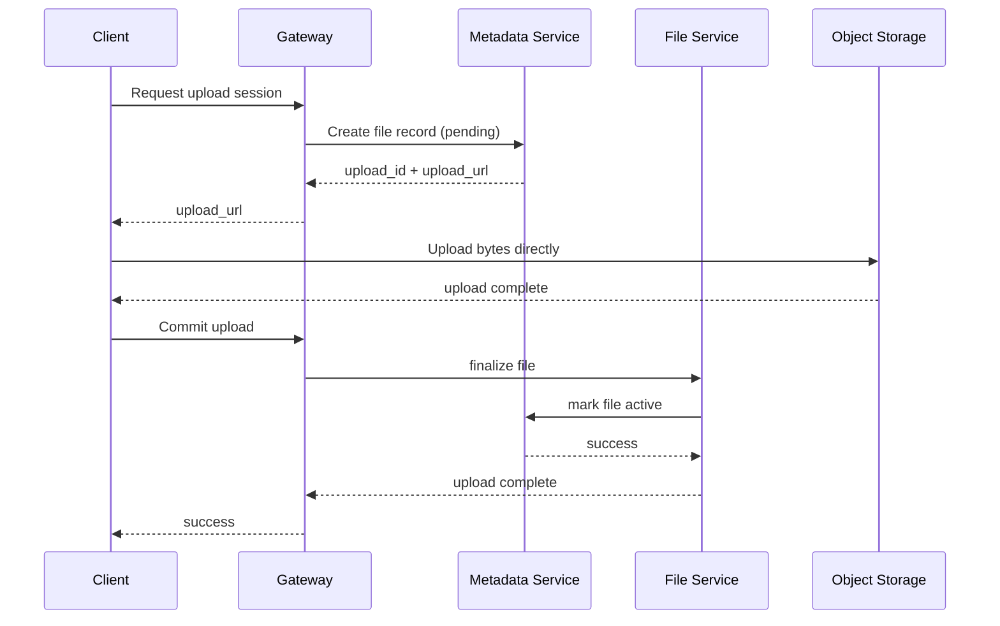

### 7.2 Why direct-to-storage upload matters

If every file passed through the app servers, bandwidth would become a bottleneck.

Better design:

* app server creates upload session
* client uploads directly to object storage using signed URL
* backend only validates and finalizes metadata

This reduces:

* server CPU load
* network egress cost
* latency
* failure probability

---

## 8. Large File Uploads

For large files, chunking is needed.

### Chunked upload flow

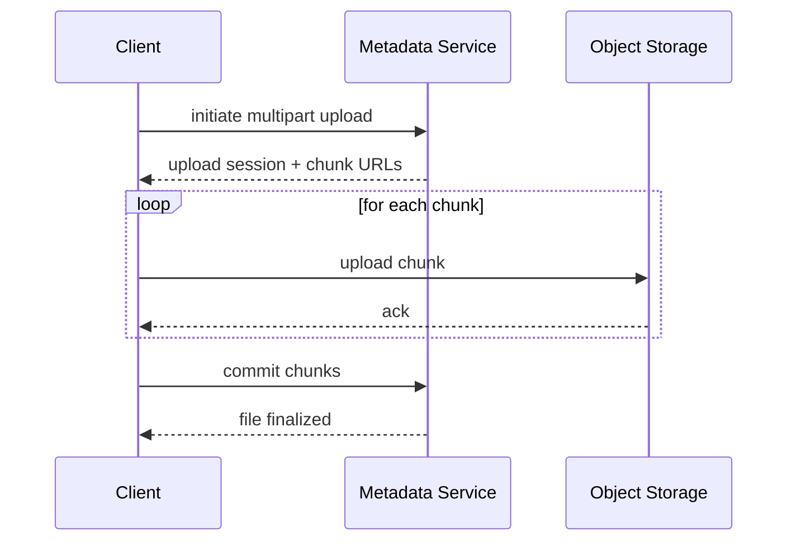

### Benefits

* retry only failed chunks
* resume interrupted uploads
* parallel chunk upload
* checksum validation per chunk
* better mobile network tolerance

---

## 9. Download Flow

Downloads should be fast and safe.

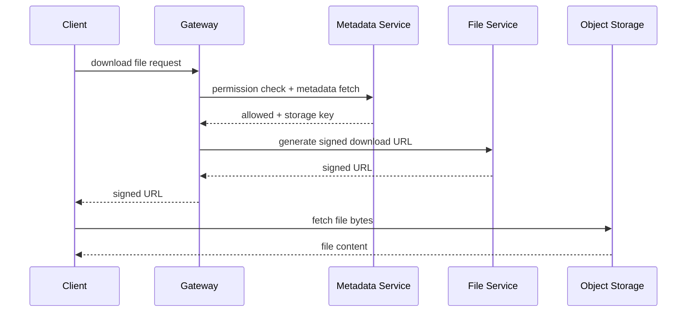

### Why signed URLs are used

* backend does not stream every download
* object storage serves the bytes
* access is time-limited
* permissions are checked before issuing the URL

---

## 10. File Sync Across Devices

Google Drive-like sync is one of the most complex parts.

A user might:

* create a file on laptop
* edit on phone
* rename folder on web
* delete a file on another device

The system must propagate changes safely.

### 10.1 Sync model

Each client maintains:

* local file cache
* sync cursor / checkpoint
* change journal
* conflict state

### 10.2 Sync architecture

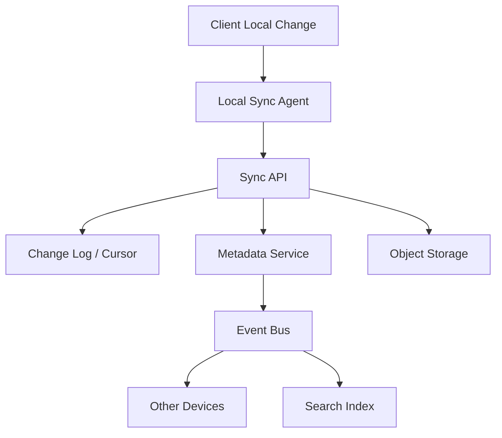

### 10.3 Push and pull sync

* **Push**: client uploads local changes
* **Pull**: client asks server for changes since last cursor

The sync agent usually stores a cursor like:

```text
last_seen_change_id = 1938201
```

Then it requests only changes after that point.

---

## 11. Change Log Design

A change log is essential for efficient sync.

Example events:

* FILE_CREATED
* FILE_UPDATED
* FILE_MOVED
* FILE_DELETED
* PERMISSION_CHANGED
* VERSION_CREATED

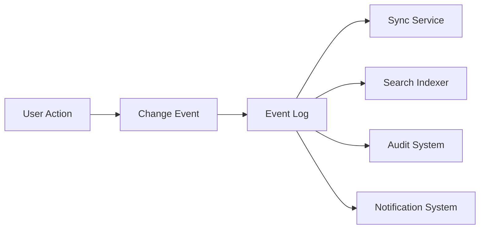

The sync service can replay changes to:

* other devices
* offline clients
* folder watchers
* collaboration sessions

---

## 12. Versioning

Users expect version history.

Every meaningful update creates a new version record.

### Version lifecycle

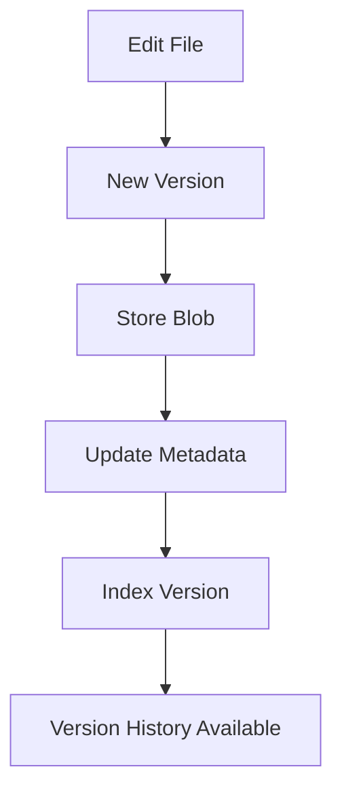

### Why versioning matters

* recover accidental edits
* compare changes
* rollback
* compliance and audit
* collaborative safety

### Storage optimization

Instead of duplicating the entire file for every version, the system may use:

* full snapshots for small files
* delta encoding for document formats
* chunk-level deduplication for large binary files

---

## 13. Collaboration on Docs, Sheets, Slides

This is different from ordinary file sync.

For documents, multiple users may edit at the same time.

### Core collaboration goals

* real-time cursors
* live text insertion/deletion
* low-latency updates
* conflict-free merges
* offline edits later merged safely

### Collaboration architecture

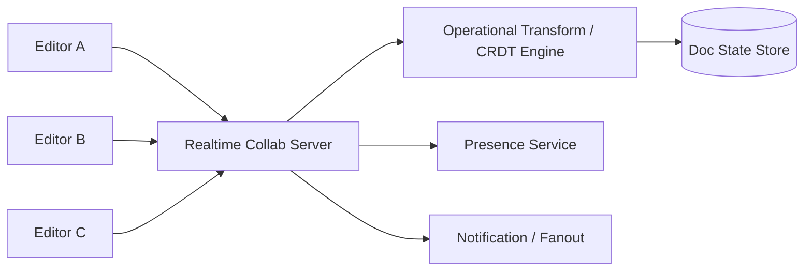

### Two common approaches

#### 1. Operational Transformation (OT)

* transforms operations so concurrent edits can be merged
* widely used in collaborative editors

#### 2. CRDTs

* conflict-free replicated data types
* easier eventual consistency in distributed environments
* useful for offline-first collaboration

A Google Drive-like product may use one or a mix depending on document type.

---

## 14. Permission and Sharing Model

Sharing is central to Drive.

### Common permission types

* owner
* editor
* commenter
* viewer
* link-sharing access
* domain-wide access
* group access

### Sharing examples

* share with a person by email
* share with a Google Group
* share with “anyone with the link”
* restrict to organization only

### ACL service

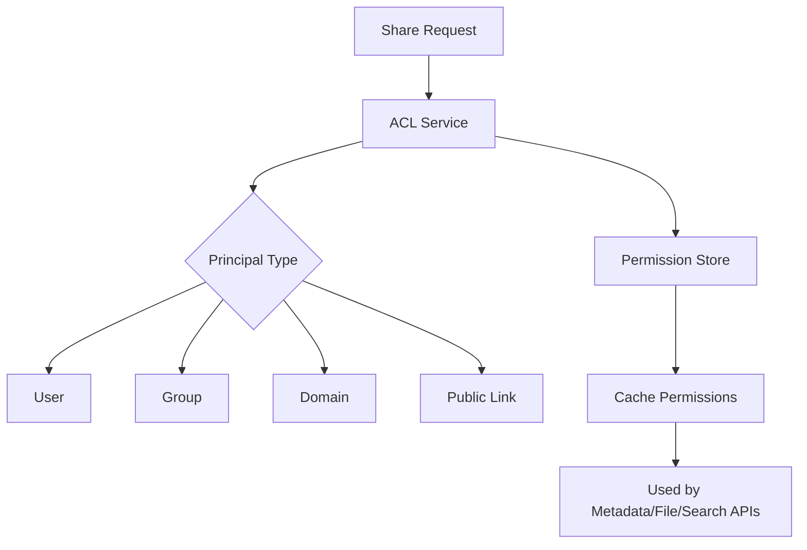

### Permission checks

Before any read/write:

* verify user identity
* resolve shared group membership
* check folder inheritance
* evaluate explicit deny/override rules
* return allowed role

### Inheritance

Folder permissions often propagate to children.

This means the system must compute effective permission from:

* file-level ACL
* parent folder ACL
* group membership
* organization policy
* public link settings

---

## 15. Search

Search in Drive usually has two layers:

1. **Metadata search** — file name, owner, type, folder
2. **Content search** — text inside docs, PDFs, OCR, etc.

### Search pipeline

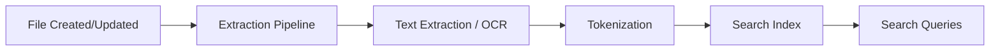

### What gets indexed

* file name
* MIME type
* owner
* folder path
* modified time
* extracted text
* tags and labels
* shared-with entities

### Content extraction

Different formats need different extractors:

* PDF text parser
* DOCX parser
* spreadsheet cell extractor
* image OCR
* archive inspection for supported formats

### Index freshness

Search is often eventually consistent:

* upload completes
* extraction happens asynchronously
* index updates shortly after

That is acceptable because users care more about availability and scale than instant indexing for every file byte.

---

## 16. Trash and Recovery

Deleted files are usually not removed immediately.

### Typical deletion flow

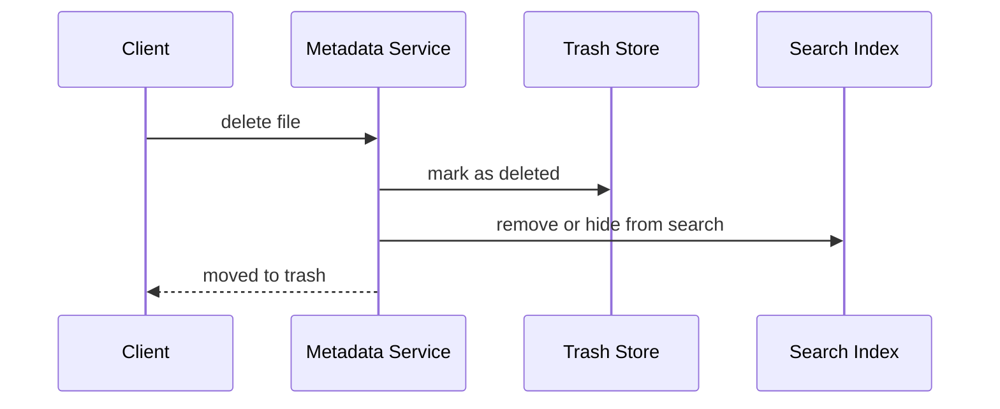

### Benefits

* undo accidental deletion
* retention policy support
* compliance recovery
* delayed permanent purge

After a retention window:

* file metadata is permanently removed
* blobs may be garbage collected
* search index entries are deleted

---

## 17. Conflict Handling

Conflicts happen when multiple devices edit simultaneously.

### Examples

* same file updated on two devices offline
* folder moved while file renamed
* permission changed while file is being downloaded

### Resolution strategies

#### For binary files

* last-write-wins is common
* or show conflict copies

#### For collaborative docs

* OT/CRDT merges
* user-visible merge cursor
* strong state convergence

#### For metadata

* use version numbers or ETags
* reject stale updates
* require client to re-read and retry

---

## 18. Caching Strategy

Caching is everywhere in a Drive system.

### Cache layers

* auth/session cache
* permission cache
* folder listing cache
* hot metadata cache
* download URL cache
* content thumbnail cache
* collaboration presence cache

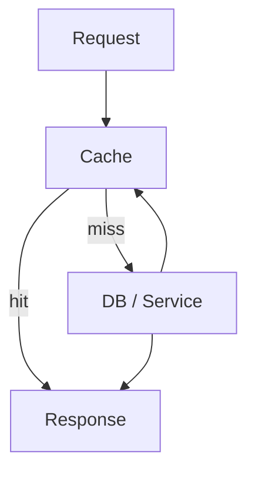

### What to cache carefully

* permissions with short TTL
* frequently opened folders
* recent files
* user home directory listing

### What not to cache too long

* ACL changes
* deletion state
* active collaboration state
* signed URLs

---

## 19. Scaling the Metadata Layer

Metadata is often the bottleneck.

### Scaling techniques

* shard by `user_id`
* shard by `file_id`
* use read replicas
* cache hot folders
* partition by tenant/org
* denormalize folder listings
* asynchronous secondary indexes

### Folder listing problem

Listing a folder with millions of files is expensive.

Common solutions:

* store children in ordered indexes
* paginate heavily
* precompute folder summaries
* use cursor-based pagination
* cache recent folder views

---

## 20. Scaling the Storage Layer

File bytes are usually stored in distributed blob/object storage.

### Requirements

* durability
* replication
* multipart upload
* low-cost storage tiers
* lifecycle management
* checksum validation

### Storage tiers

* hot storage for recent files
* warm storage for infrequently accessed data
* cold archive for long-term retention

### Deduplication

To save space, the system may:

* deduplicate identical chunks
* store one blob reference for multiple files
* hash content before upload commit

---

## 21. Asynchronous Processing Pipeline

Many tasks should not block upload or download.

### Good async jobs

* virus scan
* OCR
* text extraction
* thumbnail generation
* indexing
* analytics
* notification fanout
* audit logging

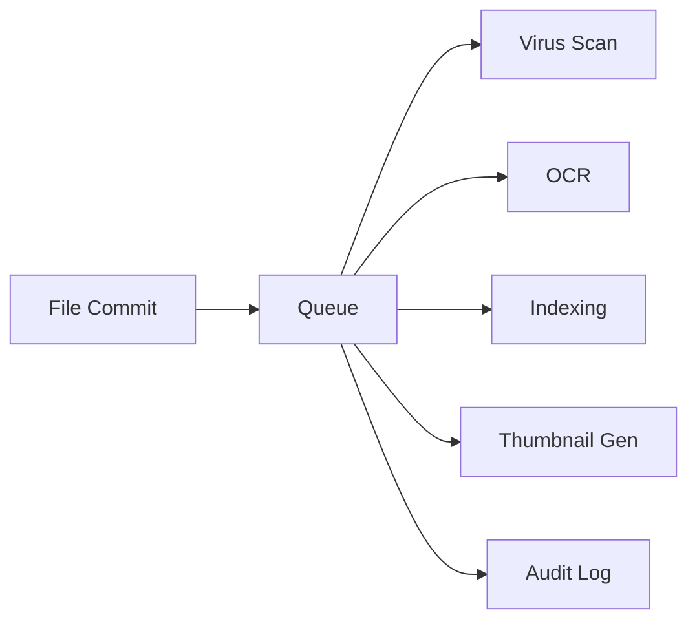

### Why async is important

* faster user-visible completion
* better scaling
* independent retry on failure
* isolation from transient downstream issues

---

## 22. Security Model

Drive-like systems must be secure by design.

### Main security concerns

* unauthorized access
* link leakage
* stale permission caches
* malware uploads
* exfiltration through shared links
* account takeover
* data corruption

### Security measures

* OAuth/session-based authentication
* encrypted transport (TLS)
* encryption at rest
* signed URLs with short TTL
* malware scanning
* permission checks on every API
* audit logs
* device/session reputation
* two-factor auth for sensitive accounts

### Encryption

Usually:

* data in transit: TLS
* data at rest: encrypted storage volumes / object encryption
* sensitive metadata: protected by access controls
* keys: managed by a KMS

---

## 23. Mobile and Desktop Sync Clients

The sync client is a local agent that watches file changes.

### Responsibilities

* detect local edits
* queue uploads
* download remote changes
* resolve conflicts
* maintain offline cache
* show sync status
* retry failed operations

### Client state machine

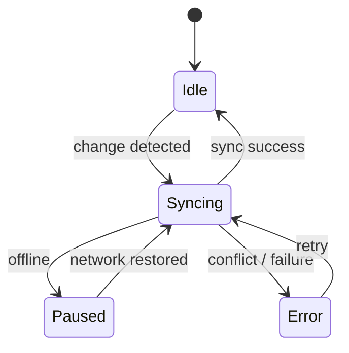

### Local indexing

Desktop clients often keep a lightweight local index so that:

* search feels instant
* file changes are detected quickly
* offline access works well

---

## 24. Real-Time Presence and Notifications

In collaborative files, users need to know who is active.

### Presence information

* user online/offline
* cursor location
* currently editing file
* last active time

### Notification use cases

* file shared with you
* comment added
* version restored
* permission changed
* upload completed
* collaborator joined

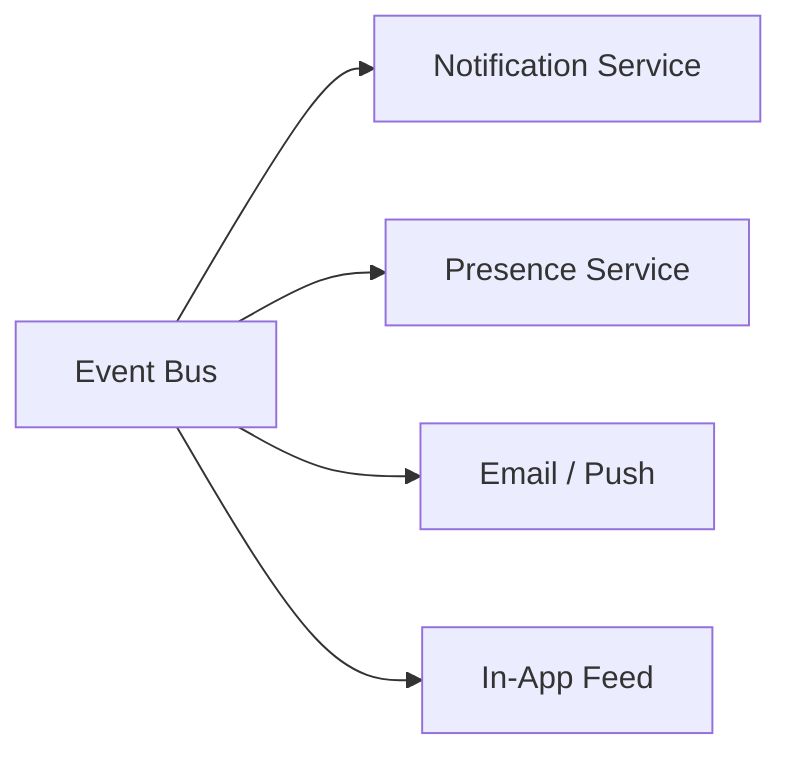

---

## 25. Observability

A system at Google Drive scale needs strong observability.

### Metrics

* upload latency
* download latency
* permission check latency
* sync backlog
* indexing lag
* collaboration server load
* error rate
* cache hit rate
* storage write amplification

### Logs

* request logs
* audit logs
* security logs
* sync conflict logs
* admin actions

### Traces

Useful for:

* upload commit path
* permission lookup chain
* search query execution
* cross-service collaboration events

---

## 26. Failure Handling

A robust design must handle failures gracefully.

### If object storage is unavailable

* queue upload retries
* show upload pending
* keep multipart upload session alive

### If metadata DB is slow

* serve stale cache if allowed
* degrade non-critical listing paths
* reject write operations safely

### If search is down

* file upload still succeeds
* search results may be delayed
* indexer catches up later

### If collaboration service is down

* fall back to offline edit mode
* queue changes locally
* reconcile after reconnect

### If ACL cache is stale

* re-check authoritative source for sensitive actions
* shorten TTLs
* invalidate aggressively on permission changes

---

## 27. API Design

### Create upload session

```http
POST /v1/files/upload-session
```

### Commit upload

```http
POST /v1/files/{fileId}/commit
```

### Download file

```http
GET /v1/files/{fileId}/download
```

### List folder

```http
GET /v1/folders/{folderId}/children?cursor=...
```

### Share file

```http
POST /v1/files/{fileId}/permissions
```

### Get change cursor

```http
GET /v1/sync/changes?cursor=...
```

### Restore version

```http
POST /v1/files/{fileId}/restore/{versionId}
```

---

## 28. Example End-to-End Flow

### User uploads a PDF

1. Client asks for upload session.
2. Metadata service creates a pending file record.
3. Client uploads file directly to object storage.
4. Commit request finalizes the file.
5. File service emits an event.
6. Search indexer extracts text asynchronously.
7. Thumbnail service generates preview.
8. Sync service notifies other devices.
9. File becomes visible in folder listing.

### User opens the same file on another device

1. Client requests latest metadata.
2. Permission check passes.
3. Signed download URL is generated.
4. File downloads from object storage.
5. Client opens file locally.
6. Sync cursor updates.

---

## 29. Trade-offs

### Strong consistency vs performance

Metadata should be strongly consistent for writes, but some derived views can be eventually consistent.

### One DB vs multiple stores

A single database is simpler but does not scale well for file bytes, search, and collaboration state.

### Immediate indexing vs delayed indexing

Immediate indexing gives better freshness but increases latency and operational complexity.

### Full file version copies vs delta storage

Full copies are simple; delta storage saves space but increases complexity.

### Last-write-wins vs merge

Last-write-wins is easy for binary files; merge is required for collaborative docs.

---

## 30. What Makes Google Drive Hard

The difficulty is not just storage.

It is the combination of:

* sync
* sharing
* collaboration
* search
* versioning
* access control
* offline support
* large file handling
* conflict resolution
* and global scale

That is why Google Drive is best viewed as a platform made of many specialized services rather than a single “file server.”

---

## 31. Final Summary

A Google Drive-like system works by splitting responsibilities cleanly:

* **Metadata service** stores file structure and ownership.
* **Object storage** stores the actual file content.
* **Sync service** propagates changes across devices.
* **ACL service** enforces permissions.
* **Search service** indexes names and content.
* **Collaboration service** handles real-time editing.
* **Event-driven workers** handle OCR, thumbnails, notifications, and indexing asynchronously.

The design is optimized for:

* reliability
* scalability
* collaboration
* low-latency access
* and safe sharing

In short, Google Drive is not just cloud storage. It is a distributed file system, a sync engine, a permission system, a search engine, and a collaboration platform working together.

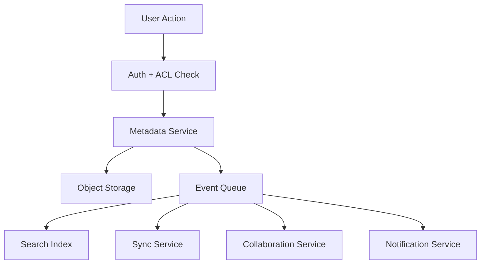
