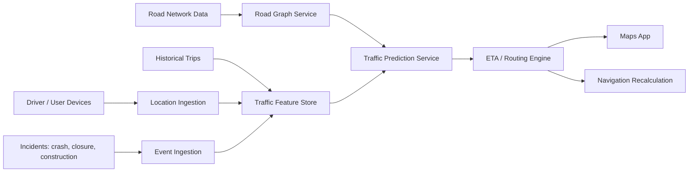
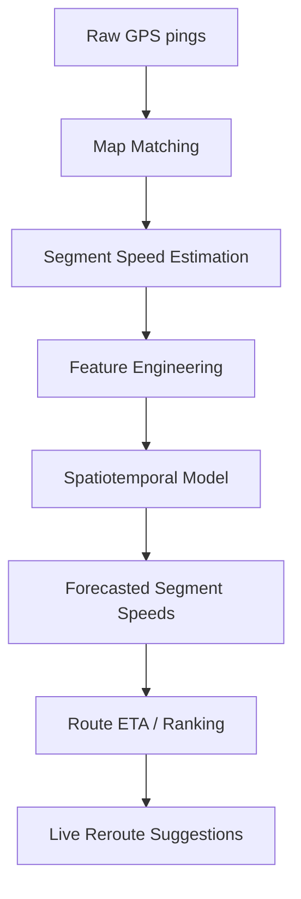
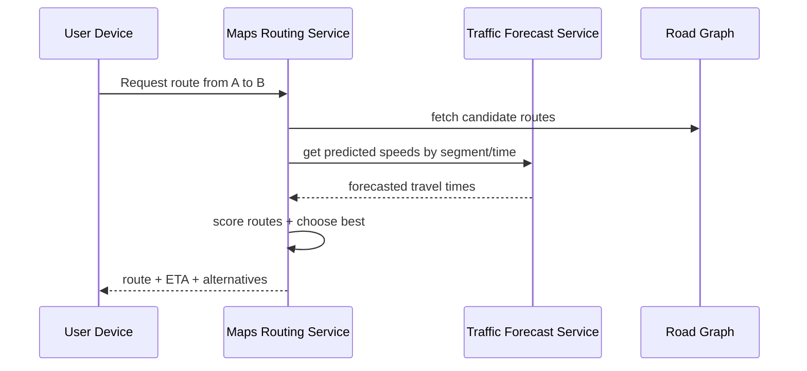
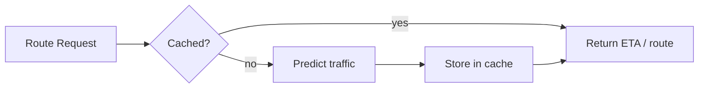
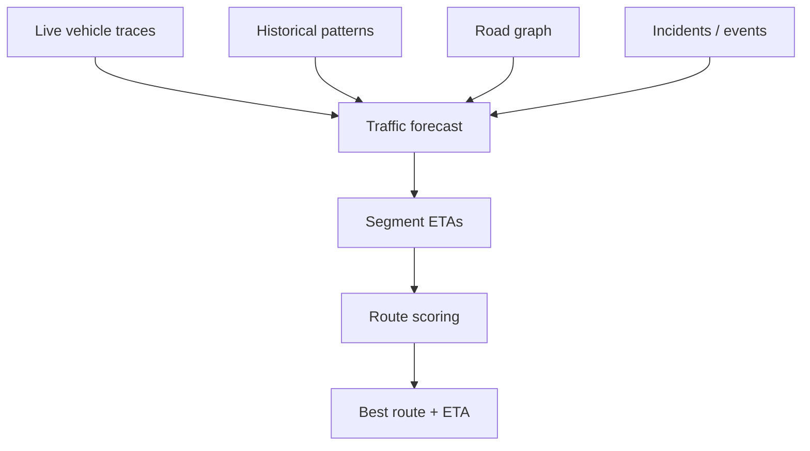

# How Google Maps Predicts Traffic Before It Happens

Google Maps does not just show traffic that is happening right now. It also estimates what traffic is likely to look like by the time you reach each road segment, then uses that forecast to rank routes and compute ETA. Google has publicly said that Maps uses aggregate location data from drivers, along with current and historical traffic trends, to understand traffic conditions and determine routes. Google Maps also surfaces real-time traffic, crashes, construction, road closures, and route updates in navigation and traffic layers. ([blog.google][1])

The exact internal model is not fully public, so the design below is an **inferred system design** based on Google’s public statements and Google Research papers about traffic estimation, OD demand estimation, and ETA prediction.

---

## 1) The core problem

Traffic is not static. If a road is free now, it may still be slow 15 minutes later because of:

* rush hour buildup,
* nearby events,
* signal timing,
* lane restrictions,
* accidents,
* weather,
* construction,
* or spillover from other congested roads. ([Google Help][2])

So Maps has to answer a harder question than “what is traffic now?”

It has to answer:

> “What will traffic likely be on this route at the exact time the user reaches each segment?”

That is a **time-dependent routing** problem, not just a shortest-path problem.

---

## 2) What Google Maps is trying to predict

A route is made of many road segments. For each segment, the system estimates:

* expected speed,
* delay,
* travel time,
* confidence level,
* and possible disruption risk. ([blog.google][1])

Then it combines those segment estimates to produce:

* route ETAs,
* alternate route ETAs,
* traffic colors on the map,
* and reroute suggestions while navigation is active. ([Google Help][3])

---

## 3) High-level architecture

### Main subsystems

**Location ingestion** collects anonymized, aggregated movement data from devices that are actively navigating or contributing traffic signals. Google says it uses aggregate location data from drivers to understand traffic conditions. ([blog.google][1])

**Road graph service** represents the street network as nodes and edges with attributes such as speed limits, turn restrictions, directionality, and historical travel behavior. This is a standard requirement for traffic-aware routing; Google Research also works on route selection and dynamic traffic assignment on road networks. ([Google Research][4])

**Event ingestion** captures incidents such as crashes, construction, road closures, and event-related congestion. Google Maps Help explicitly mentions crashes, construction, road closures, parades, concerts, marathons, and sporting events as traffic-relevant inputs. ([Google Help][3])

**Traffic prediction service** forecasts speed and travel time for each road segment over time.

**ETA / routing engine** uses those predictions to choose the route with the best expected travel time, not just the shortest geometric distance. Google describes Maps as using real-time traffic information to find the best route and update it if a better route becomes available. ([Google Help][5])

---

## 4) Data sources that make prediction possible

## 4.1 Live location traces

The biggest signal is motion data from users who are already on the road. Google’s traffic blog says aggregate location data from drivers helps understand traffic conditions on roads around the world. ([blog.google][1])

These traces let the system infer:

* current road speed,
* acceleration/deceleration patterns,
* queueing near intersections,
* slowdown propagation,
* and segment-level congestion.

## 4.2 Historical traffic patterns

Traffic repeats in patterns:

* weekday rush hour,
* weekend shopping traffic,
* commute direction asymmetry,
* school opening/closing times,
* holiday flow changes,
* seasonal effects. ([blog.google][1])

Google Research’s OD travel demand work explicitly says Maps traffic trends are aggregated and anonymized, and can be used for large-scale travel demand estimation. That indicates historical traffic behavior is a core input, not just live GPS points. ([Google Research][6])

## 4.3 Road network structure

Traffic is not independent per road. Congestion spreads through connected roads. Google Research’s traffic-forecasting work models traffic as a graph problem because the road network has spatial dependency and temporal dynamics. ([Google Research][7])

## 4.4 Road incidents and disruptions

Google Maps surfaces delays from crashes, construction, roadwork, closures, and events. That means incidents directly affect routing and prediction. ([Google Help][3])

## 4.5 Specialized lane and route behavior

Google Research has also published work on HOV-specific ETAs, showing that lane type and route context can change travel time prediction quality. That is strong evidence that Maps predicts more than a plain average speed. ([Google Research][8])

---

## 5) How traffic prediction likely works

Google does not publish every internal detail, but a modern traffic prediction system usually works like this:

## 5.1 Map matching

Raw GPS points are noisy. The system first matches each point to the most likely road segment.

This is needed because:

* GPS jitter can shift a point off the road,
* tall buildings can distort signals,
* moving vehicles may report at different intervals,
* and the same road may have multiple parallel lanes or ramps.

## 5.2 Segment speed estimation

After map matching, the system estimates speed per road segment from aggregated device movement.

## 5.3 Feature engineering

The model uses features such as:

* current speed,
* previous speed trends,
* time of day,
* day of week,
* road class,
* weather proxies,
* nearby incidents,
* nearby event density,
* historical averages,
* and known lane restrictions.

## 5.4 Forecasting

The model predicts future speed for each segment over a time horizon.

The key point is time dependence:

* a road that is free now may be jammed when the user arrives,
* so the system predicts conditions at arrival time, not just now. ([blog.google][1])

## 5.5 Route scoring

Each candidate route is scored by summing predicted segment travel times, then the best route is selected.

---

## 6) Why historical data is so important

Live data alone is not enough.

A road with few current cars may still be predicted to slow down soon because:

* it is 6:45 PM on a weekday,
* a nearby office district is emptying,
* a stadium event is ending,
* or a known rush-hour bottleneck is about to begin. ([blog.google][1])

Historical data lets the model learn:

* recurring congestion patterns,
* typical event-day delays,
* morning versus evening asymmetry,
* how traffic builds and decays,
* and how long delays usually last.

Google Research’s traffic-demand estimation and traffic-simulation work show that large-scale road predictions are built from travel times and traffic trend data rather than only sensor snapshots. ([Google Research][6])

---

## 7) Real-time plus forecast: the important combination

Google Maps is not doing pure forecasting in isolation.

It mixes:

* **current traffic state**
* **historical traffic trends**
* **road context**
* **incident data**
* **route alternatives**
* **live feedback from navigation updates** ([blog.google][1])

That is why the app can:

* show traffic colors,
* tell you a route is slower than another,
* update your ETA,
* and reroute during navigation if conditions change. ([Google Help][5])

---

## 8) ETA prediction pipeline

A traffic forecast becomes useful only when it is converted into an ETA.

### ETA is computed from:

* predicted segment travel times,
* intersection delays,
* turn penalties,
* waiting time at congested junctions,
* and route-specific constraints.

Google’s help pages make clear that Maps shows traffic-informed ETA and route updates, not just static directions. ([Google Help][5])

---

## 9) Why traffic prediction is a graph problem

Roads are connected. Congestion propagates along connected edges.

For example:

* a jam on a highway exit can back up the main road,
* a blocked bridge can cause detours,
* an event venue can overload surrounding intersections.

That is why Google Research and the broader research community model traffic as a spatiotemporal graph forecasting problem. Google Research’s DCRNN paper describes traffic forecasting as challenging because of spatial dependency on road networks and nonlinear temporal dynamics. ([Google Research][7])

---

## 10) What kinds of models are used conceptually

Google does not disclose its exact production model, but public research in this area typically uses:

* graph-based forecasting,
* recurrent or sequence models,
* attention over road context,
* historical aggregation,
* and calibration from real-world travel times. ([Google Research][7])

For Google Maps specifically, Google Research has published work showing the use of aggregated anonymized traffic trends for worldwide OD estimation, and a separate 2025 paper on HOV-specific ETA estimation using inferred travel times from traffic trends. Those papers show that Google is actively improving traffic ETA by learning from traffic trend data and route context. ([Google Research][6])

---

## 11) Why the system can predict “before it happens”

This phrase usually means prediction ahead of visible congestion.

The system can do that because it knows:

* where the car is now,
* how fast it is moving,
* which road it is on,
* how much traffic historically builds up there,
* what time it is,
* what nearby roads are doing,
* and whether an event or incident is likely to change flow soon. ([blog.google][1])

So even if the road looks fine now, the model may forecast:

* a red traffic segment in 10 minutes,
* a 6-minute delay by the time you arrive,
* or a better alternate route before the jam fully develops.

---

## 12) The routing engine does not just choose the shortest path

It chooses the **lowest expected travel time path**.

That means the best route may be:

* longer in distance,
* but faster in time,
* because it avoids a future bottleneck.

This is why Google Maps can recommend a route that seems longer on the map but arrives sooner in practice. Google’s navigation help explicitly says it uses real-time traffic information to find the best route and can switch to a better route if one becomes available. ([Google Help][5])

---

## 13) How Google Maps handles special traffic cases

### 13.1 Incidents

Crashes, lane closures, roadworks, and object-on-road events can instantly alter route quality. Maps surfaces these events and may reroute navigation accordingly. ([Google Help][3])

### 13.2 Large events

Concerts, parades, marathons, and sporting events can change traffic patterns for hours. Google Maps Help specifically lists event-driven traffic disruptions and alternate routes. ([Google Help][2])

### 13.3 Lane-specific behavior

Some lanes move differently from others. Google Research’s HOV ETA work shows that lane-aware prediction improves accuracy and that HOV routes have distinct travel-time behavior. ([Google Research][8])

---

## 14) Caching and scale

Traffic prediction has to work at global scale, so the system almost certainly caches aggressively.

Likely cache layers:

* recent segment speed forecasts,
* popular route ETAs,
* commute-time results,
* event-area congestion forecasts,
* map tile overlays.

This is important because the same route can be requested thousands of times in a short time window.

---

## 15) Freshness versus stability

A traffic system has to balance:

* **freshness**: reflect new incidents quickly
* **stability**: avoid thrashing routes every few seconds

If traffic predictions changed too aggressively, users would see unstable ETAs and route switching.

So the system usually uses:

* smoothing over short-term noise,
* confidence thresholds,
* delayed reroutes unless the benefit is real,
* and time-windowed forecasts.

That is consistent with the way Maps offers route updates only when a better route becomes available. ([Google Help][3])

---

## 16) Privacy and aggregation

Google’s public research describes aggregated, anonymized traffic trends. That matters because individual device traces should not be used as direct user tracking. ([Google Research][6])

In practice, a traffic system like this typically:

* aggregates many traces before using them,
* removes personal identity from route estimation,
* avoids showing raw device-level data,
* and uses privacy-preserving summaries for traffic prediction.

The public sources support the aggregation and anonymization part; the exact privacy pipeline is not fully public. ([Google Research][6])

---

## 17) Failure handling

A production traffic prediction system must continue working even if some inputs fail.

### If live data is delayed

Use historical fallback speeds.

### If incident feeds are incomplete

Keep route prediction but reduce confidence.

### If one city has sparse coverage

Blend in model priors and historical baselines.

### If a road is newly closed

Surface it through event/incident ingestion and update routes quickly.

This kind of hybrid fallback is necessary because traffic data can be noisy, sparse, or delayed.

---

## 18) A simple mental model

You can think of Google Maps traffic prediction like this:

The system predicts each road segment, then stitches those predictions into a route-level ETA.

---

## 19) Why Google Maps can be so accurate

Its accuracy comes from three things working together:

1. **Scale**
   Google has massive global coverage and very large traffic samples. The Google Maps team said in 2020 that people drive more than 1 billion kilometers with Google Maps every day in more than 220 countries and territories. ([blog.google][1])

2. **Context**
   The system uses live traffic, historical trends, and incident/event context. ([blog.google][1])

3. **Routing intelligence**
   It does not only predict speed; it chooses the route that minimizes expected time and updates it during navigation. ([Google Help][5])
