# How Rapido Uses the Same PIN Across Every Ride

Rapido is publicly described as a platform that connects users with third-party Captains/drivers rather than a traditional single-operator fleet model. Public write-ups also describe a stable 4-digit PIN that stays the same across rides, tied to the user/account rather than regenerated for each trip. The exact internal implementation is not publicly documented, so the architecture below is an inferred backend design based on the observed behavior and Rapido’s published platform model. ([Rapido][1])

---

## 1) What the user actually experiences

A rider installs Rapido, signs up, and gets a fixed 4-digit PIN. On every future ride, the Captain asks for that same PIN at pickup. The rider does **not** receive a fresh OTP for each trip, which is the key difference from many other ride apps. Public descriptions of this behavior consistently describe the PIN as stable and account-scoped rather than ride-scoped. ([Medium][2])

In product terms, Rapido is optimizing for:

* faster pickup verification,
* fewer SMS/notification dependencies,
* lower operational overhead,
* better reliability in weak-network situations,
* and a simpler “start ride” interaction. ([Medium][2])

---

## 2) The core idea

The PIN is **not** used as a globally unique secret and it is **not** the only authorization factor.

Instead, it is best understood as:

* a **user-level pickup token**
* valid only inside the context of a specific ride
* checked together with the ride ID, Captain ID, ride status, and timing
* meant to confirm “this passenger is physically present at pickup” rather than to authenticate a remote login. ([Medium][2])

That distinction matters. The PIN is closer to a **pickup verification code** than a traditional security OTP.

---

## 3) Why a permanent PIN makes sense

### 3.1 OTP per ride has real friction

A fresh OTP flow creates extra steps every time:

1. generate code,
2. send SMS,
3. wait for delivery,
4. read code,
5. enter code,
6. verify code,
7. expire the code.

That is acceptable in some products, but it adds latency and dependence on telecom delivery. Public discussions around Rapido’s static PIN explicitly point to these friction and reliability trade-offs. ([Medium][2])

### 3.2 Ride pickup is a physical-world problem

At pickup time, the main question is not “is the user logged in?”
It is “is the correct passenger physically at the pickup point and ready to board?”

A stable PIN helps the Captain quickly verify the rider without requiring a new message for every trip. That is especially useful when:

* network is poor,
* the rider’s phone battery is low,
* SMS delivery is delayed,
* or the app is already open but notifications are not. ([Medium][2])

### 3.3 It reduces operational load

A static PIN removes the need for per-trip OTP generation and SMS delivery. That means fewer moving parts in the ride-start path and less dependency on external messaging reliability. This is an inference from the observed behavior; Rapido does not publicly publish its full internal architecture. ([Medium][2])

---

## 4) High-level architecture

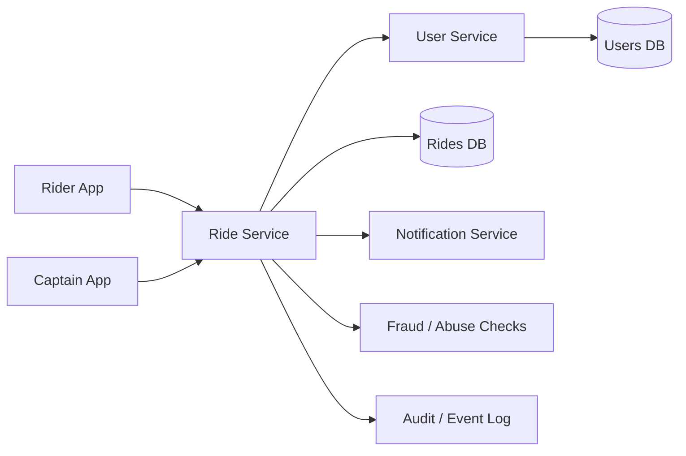

### What each part does

**Rider App**

* stores login session
* shows booking status
* can show the user’s PIN if needed
* lets the rider see ride details

**Captain App**

* receives assigned rides
* displays pickup details
* asks rider for PIN
* submits entered PIN to backend

**Ride Service**

* owns ride lifecycle
* validates ride-start requests
* checks current ride state
* coordinates with user data

**User Service**

* stores user profile
* stores the permanent PIN
* handles user identity and account state

**Trips DB**

* stores each ride as a separate transaction

**Users DB**

* stores the stable PIN against the user account

**Fraud / Abuse Checks**

* rate limits failed attempts
* detects abnormal reuse or guessing behavior
* blocks suspicious ride-start patterns

**Audit / Event Log**

* records who started the ride, when, and from which app/device

---

## 5) Data model

A stable PIN system is usually built with two different layers of identity:

1. **User identity**
2. **Ride transaction identity**

The PIN belongs to the user, not to the ride.

### 5.1 Users table

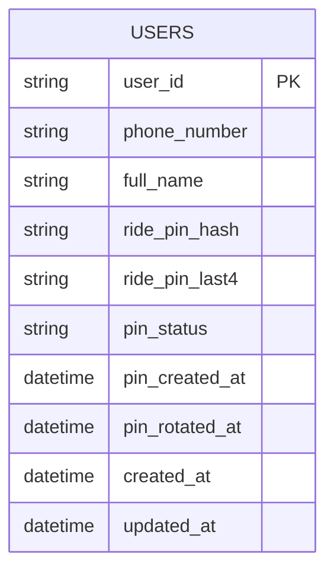

Suggested fields:

* `user_id` — primary account identifier
* `phone_number` — login/contact number
* `ride_pin_hash` — hashed PIN, not plain text
* `ride_pin_last4` — optional masked display field
* `pin_status` — active, blocked, rotated, pending
* `pin_created_at` — when the PIN was first generated
* `pin_rotated_at` — if PIN changes due to recovery or security action

### 5.2 Rides table

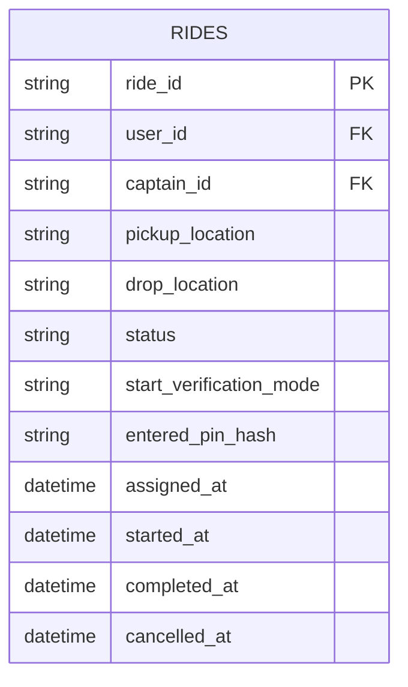

Suggested fields:

* `ride_id` — unique trip ID
* `user_id` — rider taking the trip
* `captain_id` — assigned driver
* `status` — requested, assigned, arriving, start_pending, started, completed, cancelled
* `start_verification_mode` — pin, QR, geo, support override
* `entered_pin_hash` — optional record of what was checked, if needed for audits
* `started_at` — timestamp of ride start

### 5.3 Audit events table

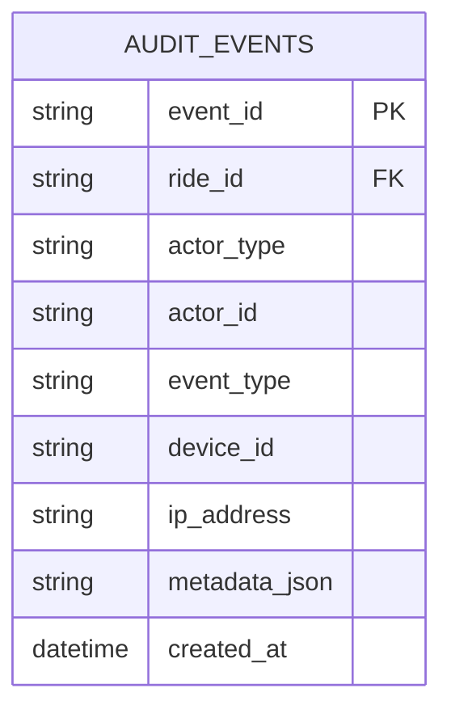

This helps answer questions like:

* who entered the PIN,
* from which device,
* how many failed attempts happened,
* and whether a support override was used.

---

## 6) PIN generation and storage

The important part is that the PIN is generated **once** and then reused.

### 6.1 Generation flow

When a user account is created:

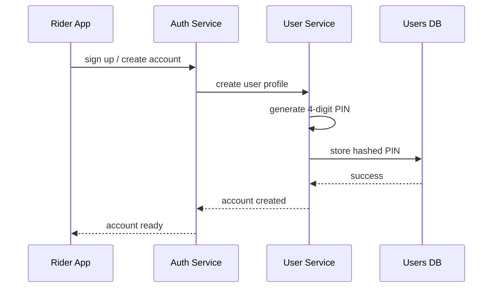

### 6.2 Why the PIN is stored, not regenerated

A per-ride OTP is disposable.
A per-user PIN must persist.

That means the system needs:

* a secure random PIN generator,
* a uniqueness policy at least per active user scope,
* hashing before storage,
* and recovery/rotation mechanisms.

A safe implementation would **never** store the PIN in plain text.

### 6.3 PIN format

A 4-digit numeric PIN gives 10,000 possible combinations (`0000` to `9999`). Public discussions of this behavior note that the code is contextual, not globally unique. ([Medium][3])

Because 10,000 values are small, the system must rely on:

* ride context,
* rate limits,
* and anti-abuse rules,
  not just the PIN alone.

---

## 7) End-to-end ride start flow

This is the most important part.

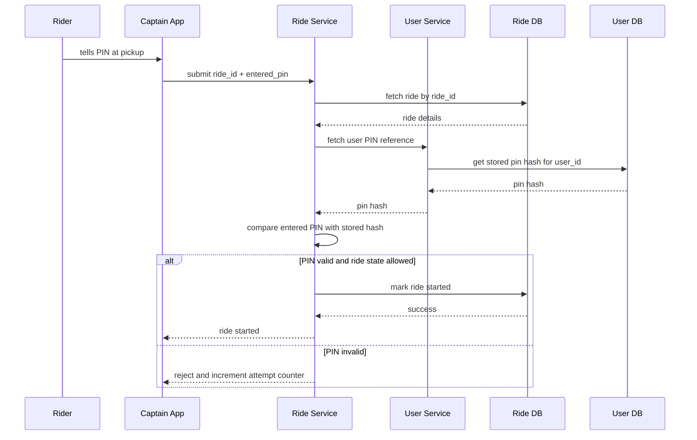

### Step-by-step breakdown

#### Step 1: Ride is assigned

The backend assigns a Captain to the trip and changes the ride state to something like `ASSIGNED` or `ARRIVING`.

#### Step 2: Captain reaches pickup

The Captain app displays the rider’s pickup information and prompts for verification.

#### Step 3: Rider gives the same PIN

The rider tells the same 4-digit PIN they have used before.

#### Step 4: Captain submits the PIN

The Captain app sends:

* `ride_id`
* `captain_id`
* `entered_pin`
* `device_id`
* `timestamp`

#### Step 5: Backend validates

The Ride Service checks:

* does this ride exist?
* is this Captain assigned to it?
* is the ride still startable?
* does the entered PIN match the user’s stored PIN?
* are there too many failed attempts already?
* does GPS/location look reasonable?

#### Step 6: Ride starts

If all checks pass, the ride transitions to `STARTED`.

---

## 8) What the backend likely checks before allowing start

The PIN should **never** be the only check. A secure ride-start system usually validates multiple conditions.

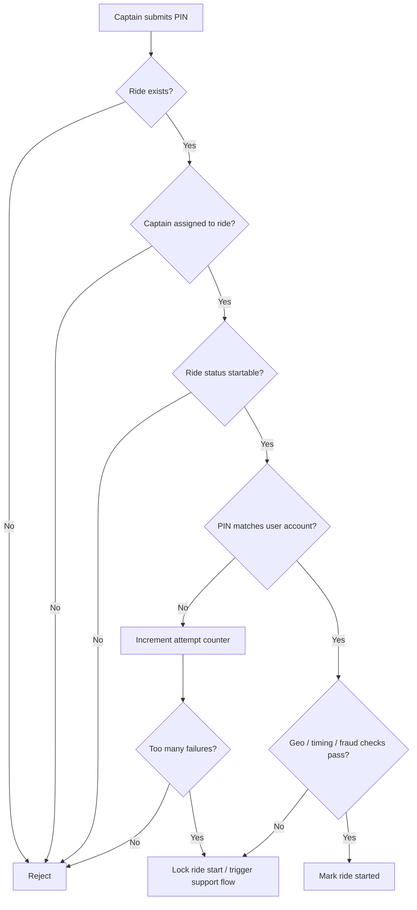

### Typical validations

* **Ride ownership**: the Captain must be assigned to that ride.
* **Status check**: only a ride in the correct state can be started.
* **PIN match**: entered PIN must match the rider’s stored PIN.
* **Attempt limit**: repeated failures should be throttled.
* **Geo sanity check**: start location should be near pickup.
* **Device sanity check**: suspicious device behavior should be flagged.
* **Time window check**: ride should only be startable around pickup time.

---

## 9) Why the PIN stays the same across all rides

This is the product choice.

A stable PIN is useful because it becomes a **memorable identity marker** for the rider. Public write-ups explicitly describe the code as tied to the user profile and reused across trips, not regenerated per ride. ([Medium][2])

From an engineering point of view, the PIN may be:

* generated once during onboarding,
* stored against the user profile,
* and simply re-read whenever a ride needs start verification.

That design avoids:

* OTP delivery latency,
* per-ride generation overhead,
* and code expiration problems. ([Medium][2])

---

## 10) Why this is not “just an OTP”

People often call it an OTP because it is numeric and used once in the ride flow.

But operationally, it is different:

| OTP per ride                 | Rapido-style stable PIN    |
| ---------------------------- | -------------------------- |
| generated per trip           | generated once per account |
| expires quickly              | persists across trips      |
| usually delivered by SMS/app | already known to the user  |
| tied to a ride instance      | tied to the user account   |
| higher delivery dependency   | lower delivery dependency  |

This is why many riders notice the same code again and again. Public descriptions of Rapido’s behavior call it a PIN and emphasize that it stays stable per user. ([Medium][2])

---

## 11) Security model

A stable PIN sounds risky until you look at the full system.

### 11.1 What the PIN protects

It protects the pickup handoff:

* “the right passenger is at the pickup point”
* “the Captain is starting the correct ride”

### 11.2 What the PIN does **not** protect

It should not be used for:

* account login,
* payment authorization,
* profile changes,
* or support-sensitive actions.

### 11.3 Why the risk is manageable

A 4-digit PIN has low entropy on its own, so the backend must protect it with:

* per-ride scope,
* short acceptance windows,
* failed-attempt throttling,
* abuse detection,
* and Captain assignment checks.

### 11.4 Recommended secure storage

The system should store:

* hashed PIN,
* salt,
* rotation metadata,
* and an attempt counter.

Never store:

* raw PIN in logs,
* raw PIN in analytics,
* raw PIN in crash reports.

---

## 12) Fraud and abuse prevention

A permanent PIN can be abused if treated too casually. The platform should use guardrails.

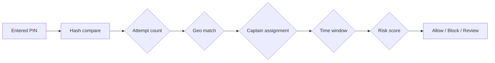

### Common abuse cases

* Captain tries random PINs.
* Someone overhears a PIN and attempts misuse later.
* A replay attempt is made on another ride.
* A compromised device reuses stale ride-start data.

### Mitigations

* max 3–5 failures per ride,
* temporary lockout,
* device reputation scoring,
* location sanity checks,
* and support escalation for suspicious starts.

---

## 13) Recovery and PIN rotation

A production system still needs a way to recover or rotate the PIN.

### Common triggers for rotation

* user requests reset,
* security incident,
* account recovery,
* fraud suspicion,
* phone number migration.

### Recovery flow

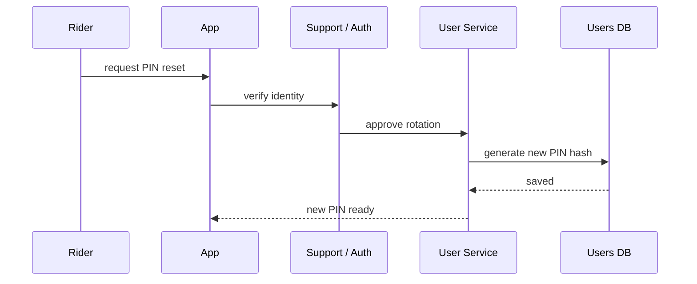

A clean implementation would then:

* invalidate the old PIN,
* notify the user,
* and update any cached PIN references.

---

## 14) Caching and performance

Because the PIN belongs to the user profile, the system may cache the user profile or PIN hash close to the ride-start path.

### Why cache?

* fewer DB reads,
* faster ride start,
* lower latency during pickup.

### What can be cached?

* user profile summary,
* masked PIN metadata,
* ride assignment state.

### What should **not** be cached loosely?

* raw PIN,
* long-lived verification secrets,
* stale ride state.

### Safe cache pattern

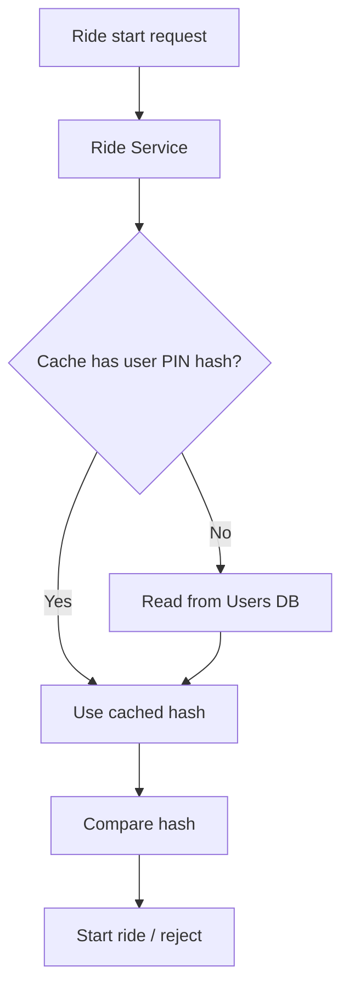

---

## 15) Event-driven design around ride start

In a larger system, starting a ride should emit events so other services can react.

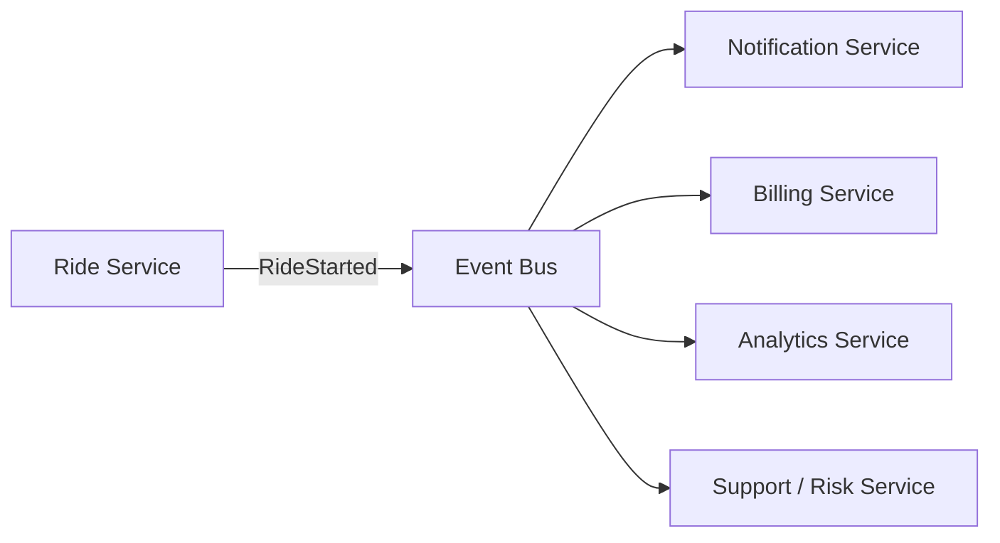

### Why events matter

After ride start, many downstream actions may happen:

* trip timer starts,
* fare meter begins,
* analytics records the event,
* commissions are calculated later,
* risk engine logs the pickup confirmation.

---

## 16) Likely API shape

A clean ride-start API could look like this:

```http
POST /rides/{rideId}/start
```

Request body:

```json
{
  "captainId": "cap_456",
  "enteredPin": "4827",
  "deviceId": "device_abc",
  "location": {
    "lat": 26.8467,
    "lng": 80.9462
  }
}
```

Possible responses:

```json
{
  "status": "started",
  "rideId": "ride_98324",
  "startedAt": "2026-06-19T10:15:20Z"
}
```

or

```json
{
  "status": "rejected",
  "reason": "invalid_pin"
}
```

or

```json
{
  "status": "rejected",
  "reason": "ride_not_startable"
}
```

---

## 17) Why the system is good product design

This is the product trade-off:

### Advantages

* less waiting at pickup,
* less SMS dependency,
* lower cost,
* simpler rider experience,
* easier memory for repeat users.

### Disadvantages

* smaller secret space than random OTPs,
* PIN can be observed or remembered,
* requires strict backend context checks,
* needs good abuse prevention.

In other words, the design chooses **pickup reliability** over **fresh-code purity**. Public descriptions of Rapido’s behavior reflect exactly this trade-off. ([Medium][2])

---

## 18) Sequence of the full ride lifecycle

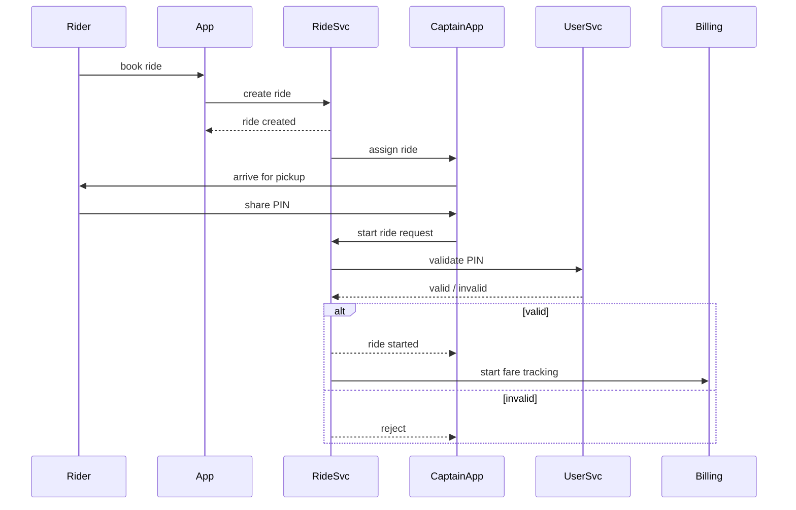

---

## 19) What to remember in one line

Rapido’s stable PIN is best understood as a **persistent account-level pickup verification code** that the backend validates in the context of a specific ride, not as a per-ride OTP. Publicly available descriptions of the behavior and Rapido’s platform model support that interpretation.
