# Load Balancer

A **load balancer** is a system that distributes incoming traffic across multiple backend servers so no single server becomes overloaded.

It sits between clients and application servers, then decides:

* which server should receive each request
* when to stop sending traffic to a broken server
* how to spread traffic fairly or efficiently
* how to keep sessions sticky if needed

Load balancers are one of the most important building blocks in scalable systems.

---

## 1. Why a Load Balancer is Needed

If all traffic goes to one server, that server becomes a bottleneck.

Problems without a load balancer:

* high latency
* server overload
* single point of failure
* difficult scaling
* poor availability
* downtime during maintenance

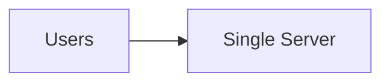

With a load balancer:

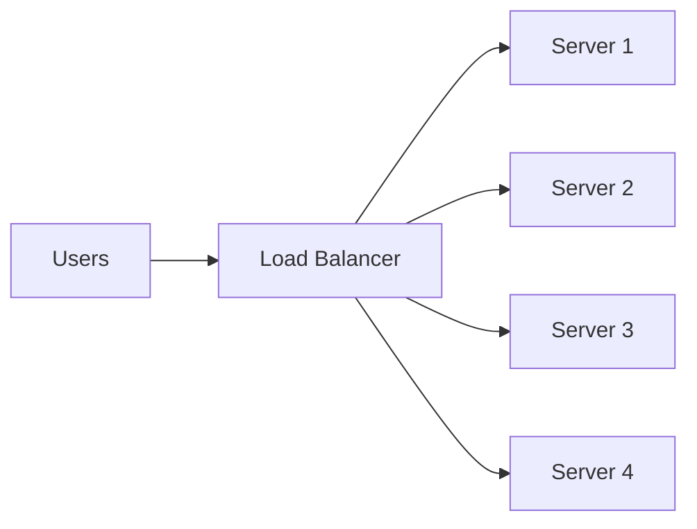

Now traffic is shared, and if one server fails, the others can keep serving.

---

## 2. What a Load Balancer Actually Does

A load balancer usually performs these tasks:

* receives client requests
* chooses a healthy backend
* forwards the request
* tracks server health
* retries or fails over when needed
* optionally terminates TLS
* optionally caches or rewrites headers
* optionally keeps sticky sessions

---

## 3. Types of Load Balancers

### 3.1 Layer 4 Load Balancer

Works at the transport layer.

It routes based on:

* IP address
* TCP/UDP port
* connection state

It does **not** inspect HTTP details deeply.

Use cases:

* TCP services
* databases
* raw sockets
* high-throughput routing

### 3.2 Layer 7 Load Balancer

Works at the application layer.

It can inspect:

* URL path
* headers
* cookies
* query params
* hostnames
* methods

Use cases:

* web apps
* microservices
* API gateways
* content-based routing

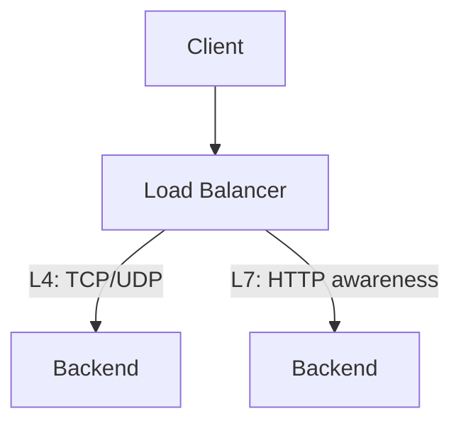

---

## 4. Core Architecture

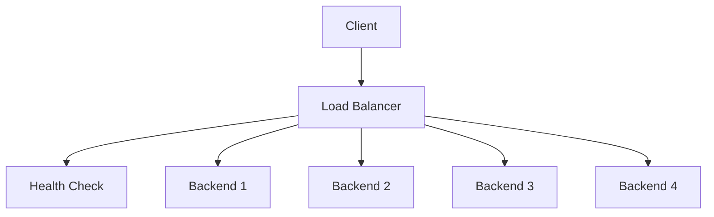

### Main pieces

* **Client**: browser, app, device, service
* **Load balancer**: the routing decision point
* **Health checker**: monitors backend status
* **Backends**: app servers, API servers, workers, gateways

---

## 5. Requirements of a Good Load Balancer

A good load balancer should:

* distribute traffic fairly
* avoid hot spots
* remove unhealthy nodes quickly
* handle scale
* support failover
* be fast
* be observable
* support configuration updates safely

---

## 6. Load Balancing Algorithms

Now the main part.

---

# 6.1 Round Robin

Requests are sent to servers in order, one by one.

Example:

* request 1 → server A
* request 2 → server B
* request 3 → server C
* request 4 → server A again

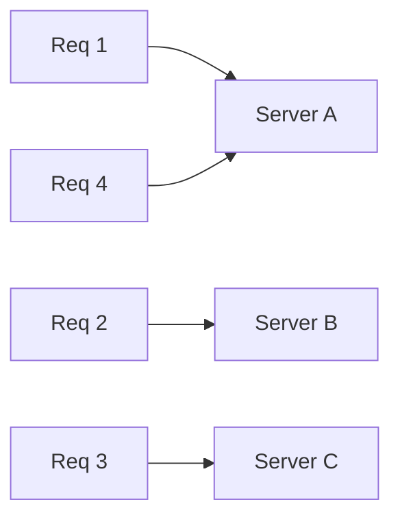

### Advantages

* very simple
* easy to implement
* fair when all servers are equal

### Disadvantages

* ignores server load
* bad when servers have different capacities
* can overload slower nodes

### Best for

* identical stateless servers
* homogeneous environments

---

# 6.2 Weighted Round Robin

Like round robin, but some servers get more traffic based on capacity.

Example:

* Server A weight = 5
* Server B weight = 3
* Server C weight = 2

That means A gets more requests than B, and B more than C.

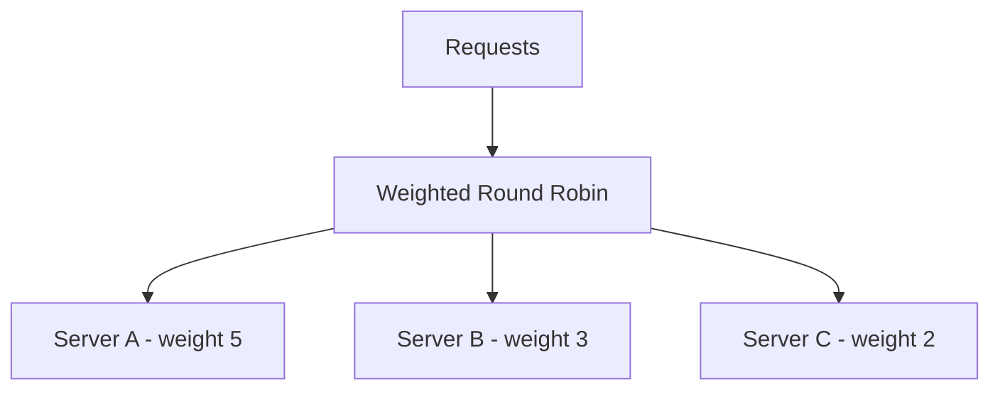

### Advantages

* handles unequal server capacity
* simple to understand
* useful in mixed hardware environments

### Disadvantages

* still does not react to live CPU/memory usage
* static weights can become stale

### Best for

* clusters with different instance sizes
* gradual migrations
* traffic split by capacity

---

# 6.3 Random

A backend is selected randomly.

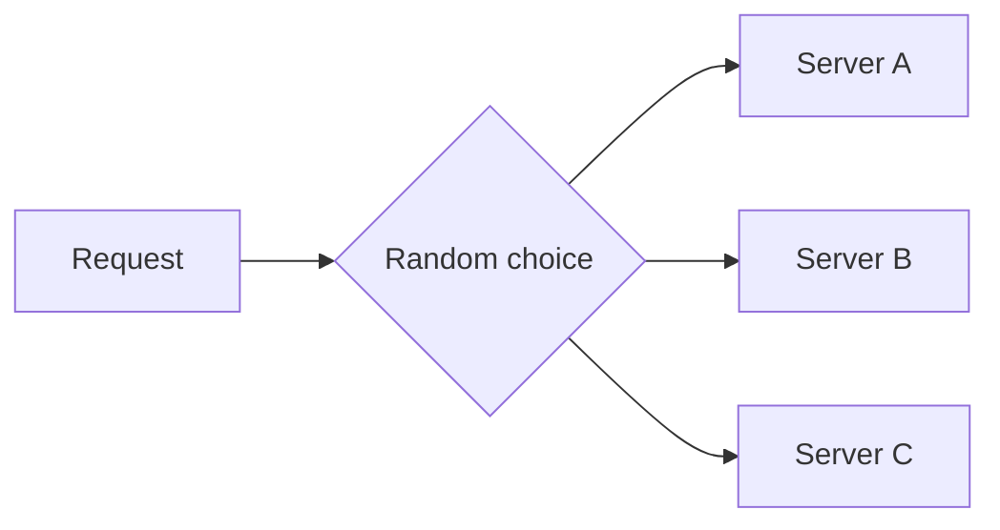

### Advantages

* simple
* often good enough
* avoids predictable patterns

### Disadvantages

* can be uneven
* not ideal if traffic is small
* no awareness of load

### Best for

* simple distributed systems
* when rough balancing is acceptable

---

# 6.4 Weighted Random

Servers are chosen randomly, but with probabilities based on weight.

Example:

* A: 50%
* B: 30%
* C: 20%

### Advantages

* respects capacity
* avoids strict rotation patterns
* good for gradual traffic shifts

### Disadvantages

* may still be uneven in short windows
* needs careful weight tuning

### Best for

* traffic splitting
* canary releases
* heterogeneous clusters

---

# 6.5 Least Connections

Requests go to the server with the fewest active connections.

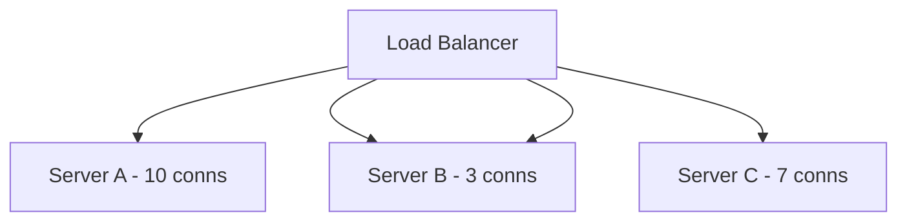

The balancer chooses Server B because it is least loaded by connection count.

### Advantages

* good when request duration varies
* better than round robin for long-lived connections
* helps with uneven traffic duration

### Disadvantages

* connection count may not reflect real CPU load
* a server with few but expensive requests can still be overloaded
* slightly more bookkeeping

### Best for

* long-running HTTP requests
* WebSocket gateways
* chat systems
* streaming connections

---

# 6.6 Weighted Least Connections

A weighted version of least connections.

It considers:

* number of active connections
* server weight/capacity

Example idea:

* a server with 100 connections but 4x capacity may still be a better choice than a small server with 20 connections

### Advantages

* smarter for mixed hardware
* balances based on both capacity and current load

### Disadvantages

* more complex than plain least connections
* weights must be maintained accurately

### Best for

* large production clusters
* mixed instance sizes
* systems with long connections

---

# 6.7 Least Response Time

Traffic goes to the server that currently responds fastest.

This can use:

* active connections
* average response time
* recent latency samples

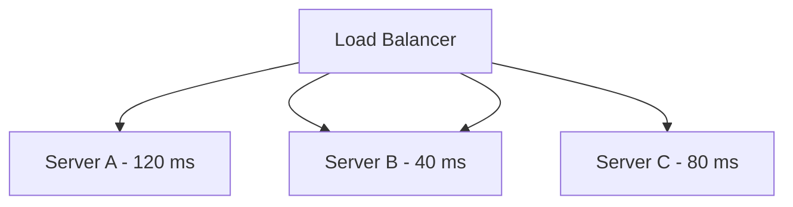

### Advantages

* optimizes user-visible latency
* reacts to slow servers
* useful for latency-sensitive systems

### Disadvantages

* response time can be noisy
* a server can look fast until it becomes saturated
* requires continuous measurement

### Best for

* latency-critical APIs
* interactive apps
* low-latency services

---

# 6.8 Least Bandwidth

Chooses the server currently handling the least network traffic.

### Advantages

* useful when payload sizes vary greatly
* helps avoid network hot spots

### Disadvantages

* bandwidth alone may not reflect CPU or memory load
* harder to tune

### Best for

* large downloads
* media services
* file distribution systems

---

# 6.9 Least CPU / Resource-Based Routing

Chooses the backend with the lowest CPU, memory, or custom resource metric.

### Advantages

* load-aware
* practical for expensive requests

### Disadvantages

* depends on fresh metrics
* metrics collection itself adds overhead
* can oscillate under bursty traffic

### Best for

* AI inference
* image processing
* compute-heavy services

---

# 6.10 Power of Two Choices

Pick two random servers, then choose the less loaded one.

This is a very powerful and practical strategy.

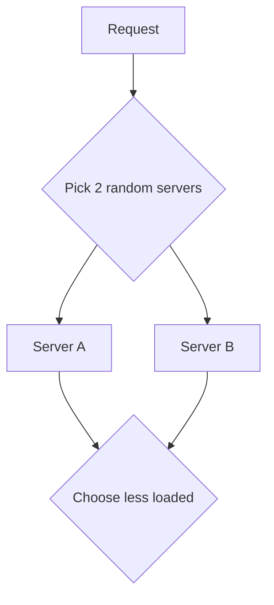

### Why it works well

It gives near-best balancing with very low overhead.

### Advantages

* simple
* scalable
* better than pure random
* less coordination needed

### Disadvantages

* still only approximate
* depends on accurate load signal

### Best for

* large distributed systems
* modern load balancers
* high-scale request routing

---

# 6.11 IP Hash

The client IP is hashed to pick a backend.

Same IP usually goes to the same server.

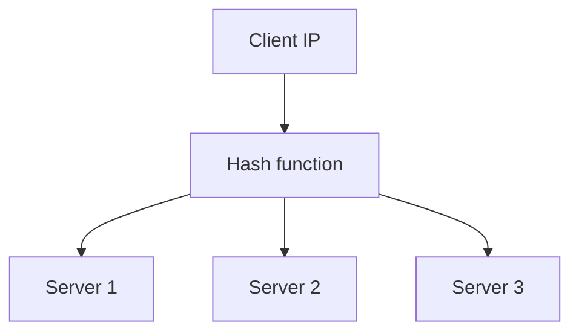

### Advantages

* simple sticky behavior
* no extra session store needed in some cases

### Disadvantages

* uneven distribution if many users share the same IP
* NAT can distort balancing
* bad for mobile networks
* users may move between IPs

### Best for

* lightweight sticky routing
* simple session affinity

---

# 6.12 Hash-Based Routing

A key such as:

* user ID
* session ID
* order ID
* tenant ID

is hashed to decide the backend.

### Advantages

* stable routing for the same entity
* good for partitioned systems
* helpful for cache locality

### Disadvantages

* rebalancing is harder
* hot keys can overload one server
* key distribution must be well designed

### Best for

* sharded systems
* tenant-based routing
* session-aware routing

---

# 6.13 Consistent Hashing

A hashing strategy that reduces movement when servers are added or removed.

This is widely used in:

* caches
* distributed storage
* sharded systems

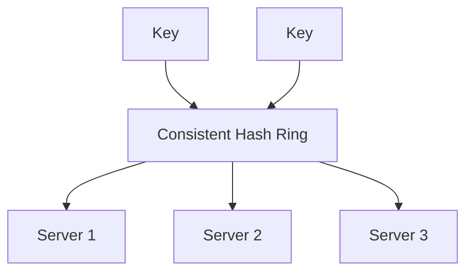

### Why it matters

If a new server joins, only part of the key space moves instead of all keys being reshuffled.

### Advantages

* less data movement
* better cache stability
* useful for distributed systems

### Disadvantages

* more complex
* needs virtual nodes for balance
* still has hot-key issues

### Best for

* distributed cache
* sharded storage
* session routing
* object partitioning

---

# 6.14 URI / Path-Based Routing

Used mainly in Layer 7 load balancing.

Examples:

* `/api/*` → API service
* `/images/*` → image service
* `/auth/*` → auth service

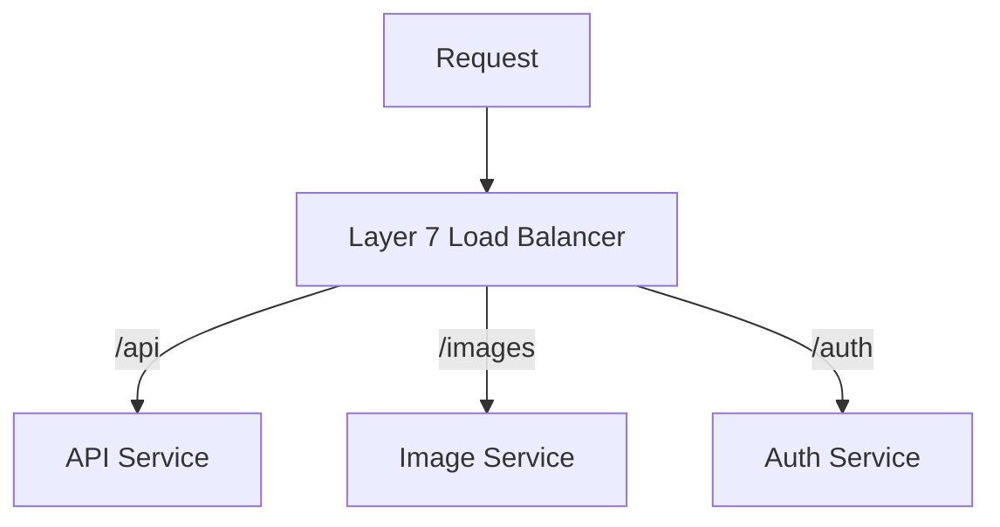

### Advantages

* easy service separation
* useful for microservices
* supports clean routing

### Disadvantages

* only works at HTTP layer
* routing rules can get messy

---

# 6.15 Host-Based Routing

Routes based on hostname.

Examples:

* `api.example.com`
* `www.example.com`
* `admin.example.com`

### Advantages

* clean domain separation
* common in modern web infrastructure

### Disadvantages

* requires L7 awareness

---

# 6.16 Header-Based Routing

Routes based on request headers.

Example:

* `x-region: india`
* `x-canary: true`
* `x-user-tier: premium`

### Advantages

* very flexible
* useful for A/B testing
* useful for canary releases

### Disadvantages

* more configuration
* easy to misconfigure

---

# 6.17 Cookie-Based Sticky Routing

Routes a user based on a cookie so the same user keeps hitting the same backend.

### Advantages

* good for session affinity
* useful when app state lives on one node

### Disadvantages

* reduces balancing efficiency
* bad if one server dies
* sticky sessions are often a scalability anti-pattern if used too much

---

## 7. Health Checks

A load balancer must know whether a server is healthy.

### Common health check types

* TCP check
* HTTP `/health`
* HTTP `/ready`
* custom application checks

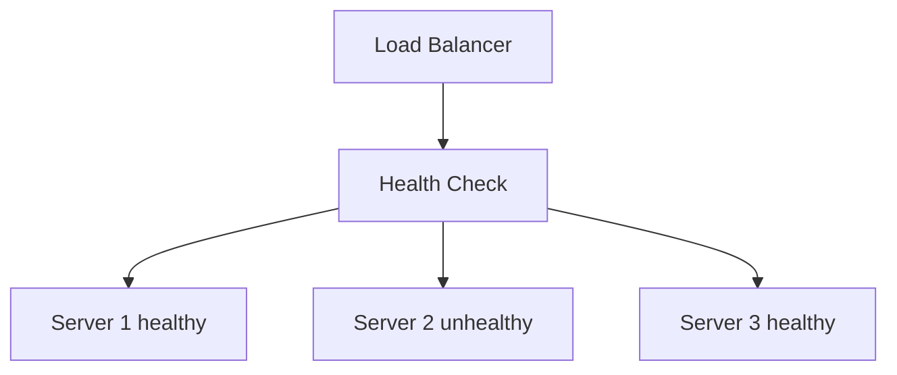

### Healthy server rules

* server is reachable
* app process is alive
* dependencies are okay
* response time is acceptable
* no critical errors

---

## 8. Session Persistence / Sticky Sessions

Sometimes you want the same user to always go to the same server.

Reasons:

* in-memory session data
* legacy apps
* temporary user state

### Methods

* IP hash
* cookie-based stickiness
* header-based affinity

### Problem

Sticky sessions make scaling harder because:

* traffic is not evenly spread
* failed nodes cause session loss
* servers become stateful

Best practice:

* externalize sessions to Redis or DB
* keep app servers stateless

---

## 9. TLS Termination

Many load balancers terminate TLS/HTTPS.

That means:

* client connects securely to the balancer
* balancer decrypts the request
* balancer forwards plain or re-encrypted traffic to backend

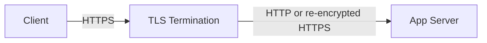

### Advantages

* offloads encryption work from backend
* central certificate management
* easier observability

---

## 10. Failover

If a server fails, the load balancer should stop sending traffic to it.

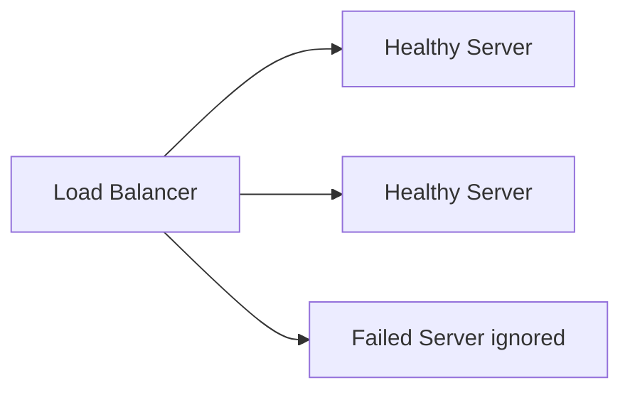

Failover should be:

* automatic
* fast
* observable
* reversible

---

## 11. Blue-Green and Canary with Load Balancer

Load balancers are critical for deployments.

### Blue-Green

Switch all traffic from old version to new version.

### Canary

Send a small percentage of traffic to the new version first.

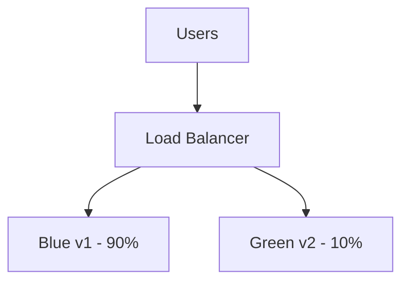

This is one reason load balancers are so important in modern release engineering.

---

## 12. Algorithm Comparison

| Algorithm                  | Best For                | Pros                      | Cons                         |
| -------------------------- | ----------------------- | ------------------------- | ---------------------------- |
| Round Robin                | Equal servers           | Simple                    | Ignores load                 |
| Weighted Round Robin       | Unequal servers         | Capacity aware            | Static                       |
| Random                     | Simple setups           | Easy                      | Can be uneven                |
| Weighted Random            | Traffic splitting       | Flexible                  | Not always stable            |
| Least Connections          | Long requests           | Load-aware                | Connection count may mislead |
| Weighted Least Connections | Mixed capacity          | Smarter                   | More complex                 |
| Least Response Time        | Latency-sensitive apps  | Fastest servers preferred | Needs good metrics           |
| Least Bandwidth            | Large transfers         | Network-aware             | Limited use                  |
| IP Hash                    | Sticky routing          | Stable mapping            | Uneven with NAT              |
| Hash Routing               | Session/entity locality | Stable and predictable    | Rebalancing is hard          |
| Consistent Hashing         | Cache/shards            | Minimal movement          | More complex                 |
| Power of Two Choices       | Large systems           | Very effective and cheap  | Still approximate            |
| URI/Host/Header Routing    | L7 microservices        | Very flexible             | Config complexity            |

---

## 13. Choosing the Right Algorithm

### Use Round Robin if:

* servers are identical
* requests are similar
* simplicity matters most

### Use Least Connections if:

* requests are long-lived
* connection count matters

### Use Least Response Time if:

* low latency is the priority
* server performance varies

### Use Hashing or Consistent Hashing if:

* routing must be stable
* cache locality matters
* sessions or partitions must stay together

### Use Weighted Algorithms if:

* servers have different capacities

### Use L7 routing if:

* you need path, host, or header-based rules

---

## 14. Layer 4 vs Layer 7

| Feature              | L4 Load Balancer | L7 Load Balancer |
| -------------------- | ---------------- | ---------------- |
| Works on             | TCP/UDP          | HTTP/HTTPS       |
| Sees request path    | No               | Yes              |
| Sees headers/cookies | No               | Yes              |
| Performance          | Faster           | Slightly slower  |
| Flexibility          | Lower            | Higher           |
| Best for             | Raw connections  | Web/API traffic  |

---

## 15. Real-World Example

Suppose a SaaS app has:

* login service
* dashboard service
* file upload service
* chat service

A practical setup might be:

* **L7 load balancer** routes:

  * `/login` → auth service
  * `/dashboard` → app service
  * `/files` → file service
  * `/chat` → websocket gateway

* **Least Connections** for chat gateways

* **Round Robin** for stateless APIs

* **Consistent Hashing** for cache or session locality

* **Weighted Round Robin** during instance migration

---

## 16. Load Balancer Architecture in Production

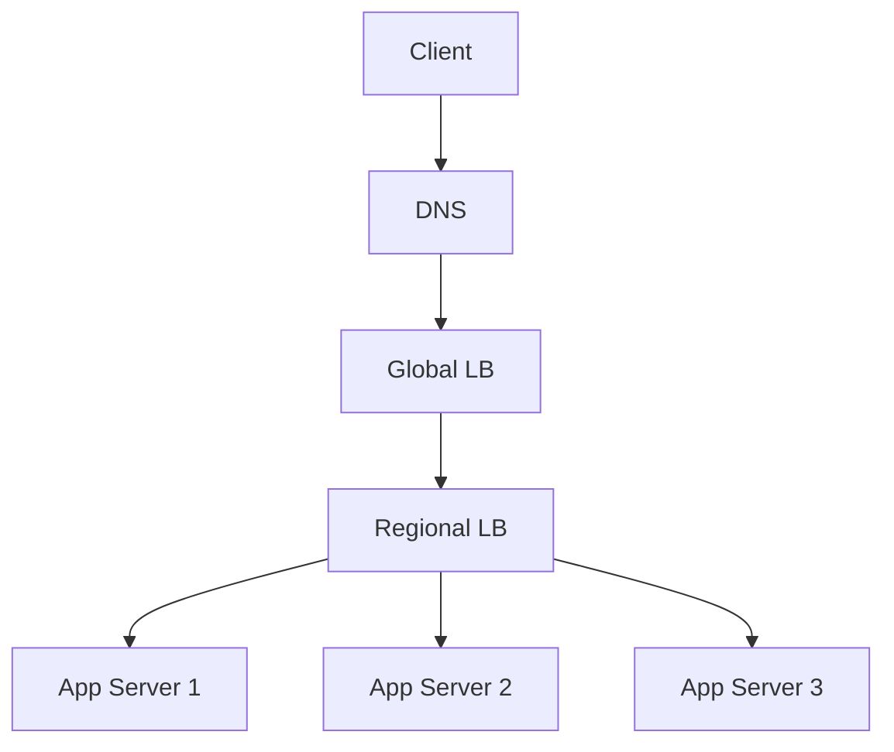

Large systems often have:

* global routing
* regional routing
* local service routing

This gives better performance and failover.

---

## 17. Common Failure Scenarios

### Backend is unhealthy

Remove it from rotation.

### Health checks are too weak

A server may be “up” but still broken.

### Sticky sessions cause imbalance

One server gets overloaded.

### Cache or shard key is bad

Traffic piles onto one node.

### Metric-based routing lags

The balancer makes decisions from stale data.

---

## 18. Best Practices

* keep backends stateless when possible
* use health checks that reflect real app readiness
* prefer weighted or latency-aware algorithms when servers differ
* use consistent hashing for cache and shard locality
* avoid sticky sessions unless necessary
* monitor p95/p99 latency, not just averages
* deploy with canary or blue-green support
* keep routing rules simple and observable

---

## 19. Load Balancer Metrics to Monitor

Important metrics:

* request rate
* active connections
* backend latency
* 4xx / 5xx rates
* health check failures
* failover count
* cache hit ratio if applicable
* connection resets
* queueing delay
* routing imbalance

---

## 20. Interview Summary

A load balancer distributes traffic across multiple servers to improve scalability, performance, and availability.

### Main algorithm families

* **Round Robin**
* **Weighted Round Robin**
* **Random**
* **Weighted Random**
* **Least Connections**
* **Weighted Least Connections**
* **Least Response Time**
* **Least Bandwidth**
* **Least CPU**
* **IP Hash**
* **Hash-Based Routing**
* **Consistent Hashing**
* **Power of Two Choices**
* **URI / Host / Header Based Routing**

### Key idea

The best algorithm depends on the workload:

* simple equal servers → Round Robin
* long-lived connections → Least Connections
* latency-sensitive systems → Least Response Time
* session or cache locality → Hashing / Consistent Hashing
* mixed capacity servers → Weighted algorithms
* web routing → L7 path/host/header based routing

---

## 21. Final Takeaway

A load balancer is not just a traffic splitter. It is a control point for:

* performance
* reliability
* scaling
* failover
* routing
* deployment
* and sometimes security

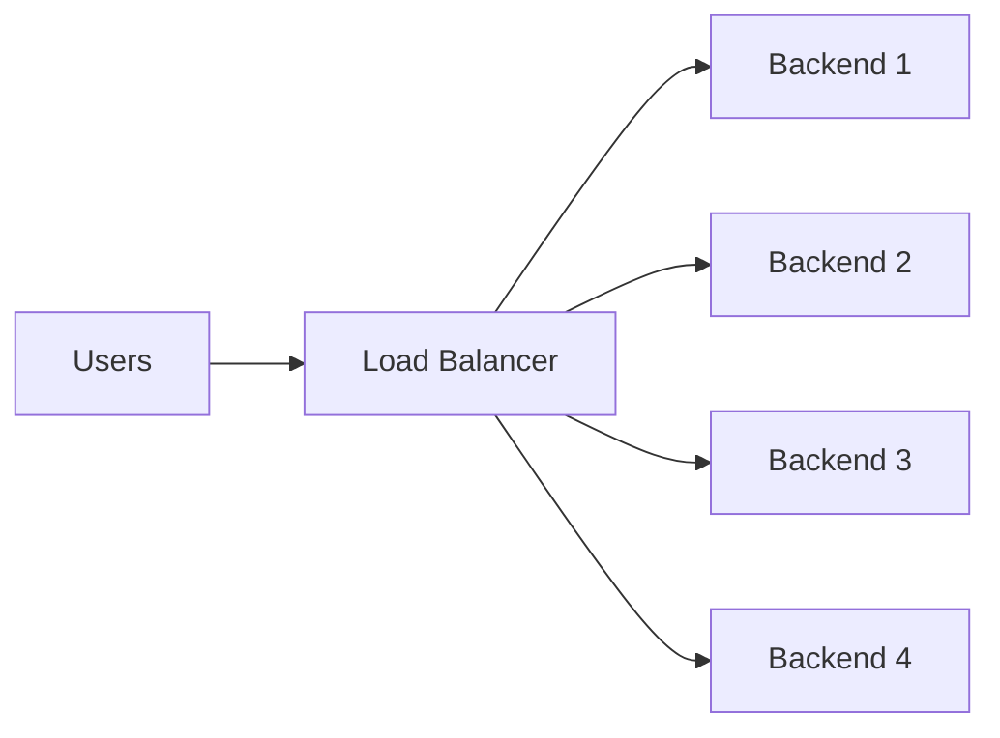

The core job is simple: **send each request to the best possible server**.

The hard part is choosing what “best” means for your system.
