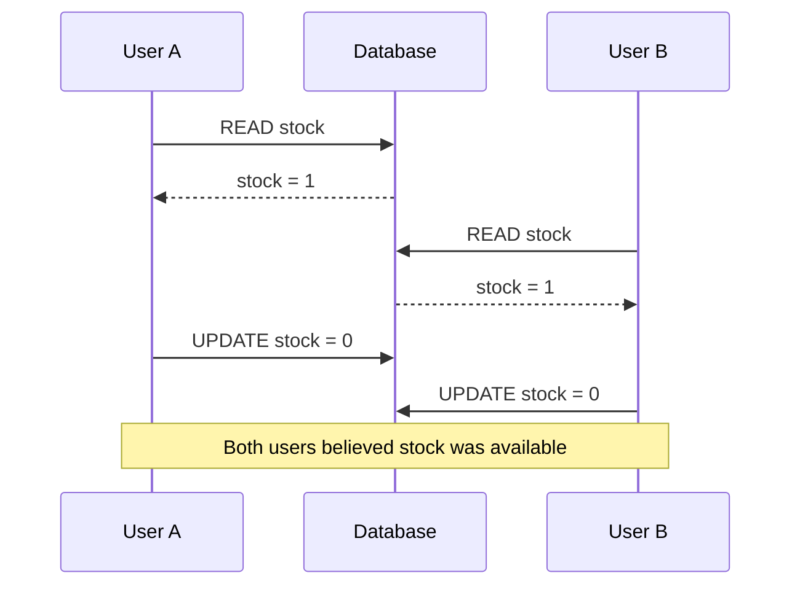
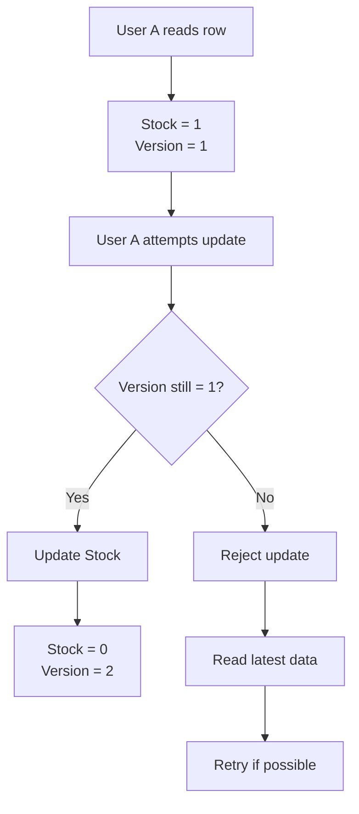
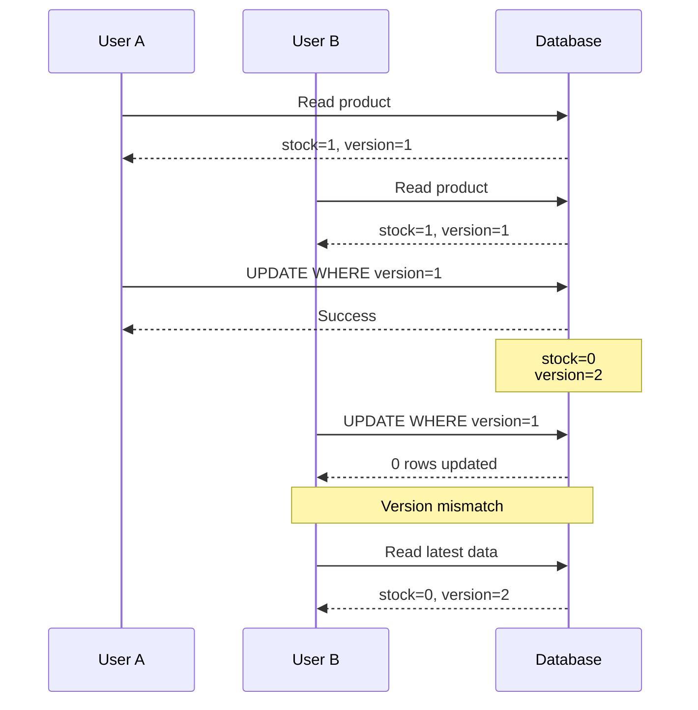
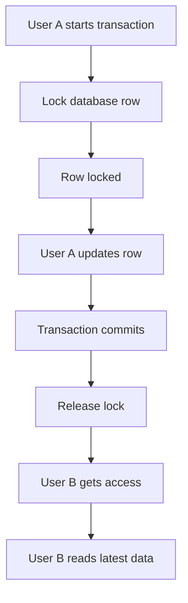
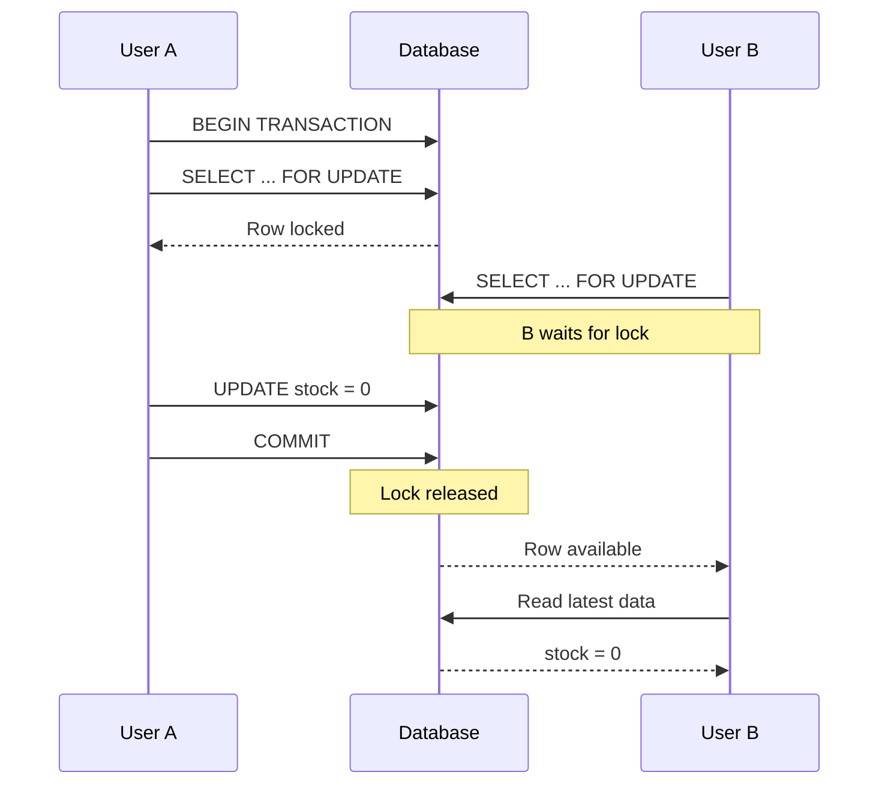
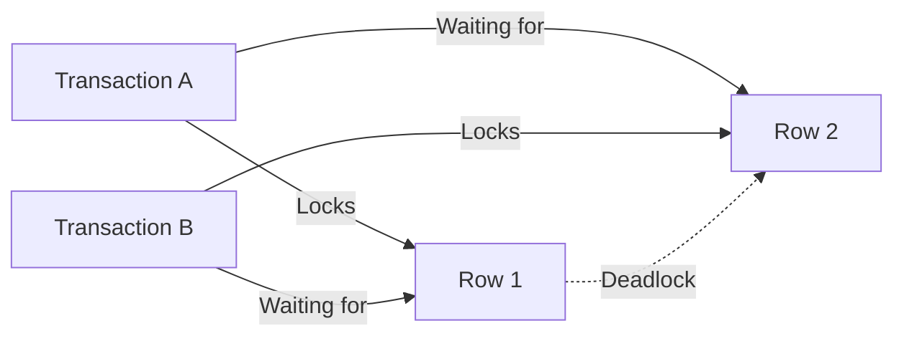
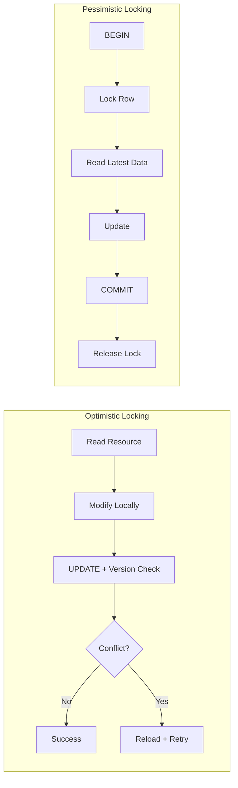

# Optimistic Locking vs Pessimistic Locking

When multiple users try to update the **same database record at the same time**, we need a way to prevent inconsistent or lost updates.

Two common approaches are:

```text
OPTIMISTIC                         PESSIMISTIC

Try → Check → Retry                Lock → Update → Release
```

---

# 1. The Problem: Concurrent Updates

Imagine an iPhone has:

```text
Stock = 1
```

Two users, A and B, try to buy it at almost the same time.

Both initially read:

```text
Stock = 1
```



The problem is:

> **Both users are working with the same old state.**

This is where locking/concurrency control comes in.

---

# 2. Optimistic Locking

## Core Idea

Optimistic locking assumes:

> **"Conflicts usually won't happen, so don't block anyone upfront."**

Instead of locking the row when reading it, we attach a **version number** to the record.

Example:

```text
Stock = 1
Version = 1
```

User A reads:

```text
Stock = 1
Version = 1
```

User B also reads:

```text
Stock = 1
Version = 1
```

Now A tries to update.

---

# 3. Optimistic Locking Flow



The important part is the **version check**.

---

# 4. How Optimistic Locking Works

Suppose the database contains:

```text
id       stock       version
--------------------------------
iphone   1           1
```

User A reads:

```text
stock = 1
version = 1
```

When A updates, we don't simply do:

```sql
UPDATE products
SET stock = 0;
```

Instead:

```sql
UPDATE products
SET
    stock = 0,
    version = version + 1
WHERE
    id = 'iphone'
    AND version = 1;
```

The important part is:

```sql
AND version = 1
```

---

# 5. User A — Successful Update

Initially:

```text
Stock   = 1
Version = 1
```

A executes:

```sql
UPDATE products
SET
    stock = 0,
    version = version + 1
WHERE id = 'iphone'
AND version = 1;
```

Database finds:

```text
Current Version = 1
Expected Version = 1
```

✅ Match.

So the update succeeds:

```text
Stock   = 0
Version = 2
```

---

# 6. User B — Stale Data

But B still has:

```text
Stock   = 1
Version = 1
```

B tries:

```sql
UPDATE products
SET
    stock = 0,
    version = version + 1
WHERE id = 'iphone'
AND version = 1;
```

But the database now contains:

```text
Stock   = 0
Version = 2
```

So:

```text
Expected Version = 1
Actual Version   = 2

             ↓

        MISMATCH
```

The query updates **0 rows**.

```text
UPDATE rejected
```

---

# 7. Optimistic Locking Diagram



---

# 8. Retry Mechanism

Optimistic locking doesn't necessarily mean:

```text
Conflict → Error → Done
```

Often it means:

```text
Try
 ↓
Check
 ↓
Conflict?
 ↓
Read latest state
 ↓
Retry
```

For example:

```javascript
async function updateProduct(productId) {
  const product = await getProduct(productId);

  const result = await db.query(`
    UPDATE products
    SET
      stock = stock - 1,
      version = version + 1
    WHERE id = $1
      AND version = $2
      AND stock > 0
  `, [productId, product.version]);

  if (result.rowCount === 0) {
    // Someone changed the record.
    // Fetch latest state and retry if appropriate.
    return retry();
  }

  return "success";
}
```

---

# 9. Optimistic Locking — Mental Model

Think:

```text
"I'll try my update."

        ↓

"Before updating,
let me check whether
someone changed it."

        ↓

Same version?
     /     \
   YES      NO
    ↓        ↓
 UPDATE    REJECT
```

So the core mechanism is:

```text
VERSION CHECK
```

---

# 10. Pessimistic Locking

Now let's look at the opposite approach.

Pessimistic locking assumes:

> **"There is a good chance someone else will modify this row, so lock it before modifying it."**

Instead of:

```text
Try → Check → Retry
```

we do:

```text
Lock → Update → Release
```

---

# 11. Pessimistic Locking Flow



---

# 12. SQL Example

In PostgreSQL/MySQL-style relational databases, a common approach is:

```sql
BEGIN;

SELECT *
FROM products
WHERE id = 'iphone'
FOR UPDATE;
```

The database locks the selected row for the transaction.

Now A can safely modify it:

```sql
UPDATE products
SET stock = stock - 1
WHERE id = 'iphone';
```

Then:

```sql
COMMIT;
```

The lock is released.

---

# 13. What Happens to User B?

Suppose A has the row locked:

```text
Product
----------------
Stock = 1
🔒 LOCKED BY A
```

B tries:

```sql
SELECT *
FROM products
WHERE id = 'iphone'
FOR UPDATE;
```

B cannot immediately proceed.

It waits.

```text
User A
   │
   │ LOCK
   ↓
[ DATABASE ROW ]
   🔒
   ↑
   │ WAIT
User B
```

Once A commits:

```text
User A
   ↓
UPDATE
   ↓
COMMIT
   ↓
RELEASE LOCK
   ↓
User B
   ↓
GET ACCESS
```

---

# 14. Pessimistic Locking Diagram



---

# 15. Optimistic vs Pessimistic

The easiest way to remember:

```text
OPTIMISTIC

Try
 ↓
Check
 ↓
Conflict?
 ↓
Retry


PESSIMISTIC

Lock
 ↓
Update
 ↓
Commit
 ↓
Release
```

---

# 16. Main Difference

|                   | Optimistic Locking            | Pessimistic Locking             |
| ----------------- | ----------------------------- | ------------------------------- |
| Strategy          | Don't lock initially          | Lock before modification        |
| Conflict handling | Detect conflict               | Prevent concurrent modification |
| Blocking          | Usually no                    | Yes                             |
| Version column    | Usually required              | Not necessarily                 |
| Retry             | Often required                | Usually less retry              |
| Concurrency       | High when conflicts are rare  | Lower when contention is high   |
| Complexity        | Application handles conflicts | Database handles waiting        |
| Risk              | More failed/retried updates   | Lock contention/deadlocks       |
| Best for          | Low-conflict workloads        | High-conflict workloads         |

---

# 17. Optimistic Locking — Best Use Cases

Optimistic locking works well when **multiple users rarely edit the same record simultaneously**.

### Good examples

#### 1. CMS

```text
Editor A → edits article
Editor B → edits another article
```

Most edits don't collide.

---

#### 2. User Profile

```text
User updates profile
```

Usually only one request is modifying it.

---

#### 3. Admin Configuration

```text
Admin A → updates configuration
Admin B → rarely touches same configuration
```

Optimistic locking is a good fit.

---

#### 4. APIs with occasional conflicts

For normal CRUD APIs:

```text
GET resource
    ↓
modify locally
    ↓
PUT resource
    ↓
version check
```

This is a common pattern.

---

# 18. Pessimistic Locking — Best Use Cases

Pessimistic locking makes more sense when **concurrent modifications are frequent or the operation must be serialized**.

### Good examples

#### 1. Inventory

```text
Stock = 1
```

Many users may attempt to purchase the same item.

```text
User A
User B
User C
User D
   ↓
Same inventory row
```

A lock can serialize access.

---

#### 2. Bank Account

Suppose:

```text
Balance = ₹10,000
```

Two transactions modify the same balance.

```text
Transaction A → -₹7,000
Transaction B → -₹5,000
```

We don't want both transactions working from the same balance.

---

#### 3. Seat Booking

Imagine:

```text
Seat A12 = AVAILABLE
```

Two people try to book it.

Pessimistic locking can ensure only one transaction modifies the seat at a time.

---

#### 4. Financial Transactions

When correctness is more important than throughput:

```text
Account
Balance
Ledger
Payment state
```

locking can be useful when multiple operations contend for the same rows.

---

# 19. Trade-offs

## Optimistic Locking

### Pros

* No long-held database locks
* High concurrency
* Good throughput
* Less lock contention
* Scales well for read-heavy systems
* Simple database model using `version`

### Cons

* Conflicts can cause failed requests
* Retry logic may be required
* Wasted work if conflicts are frequent
* Application needs to handle stale data
* Bad choice if the same rows are constantly contested

---

## Pessimistic Locking

### Pros

* Prevents concurrent modification
* Database controls access
* Fewer application-level retries
* Strong consistency for contested resources
* Good for critical transactions

### Cons

* Transactions can block
* Lock contention
* Deadlocks are possible
* Long transactions are dangerous
* Can reduce throughput
* Requires careful transaction management

---

# 20. Deadlock Example

Pessimistic locking introduces another problem: **deadlocks**.

Imagine:

```text
Transaction A
    ↓
Locks Row 1
    ↓
Wants Row 2
```

At the same time:

```text
Transaction B
    ↓
Locks Row 2
    ↓
Wants Row 1
```

Now:



Both are waiting for each other.

The database must detect and abort one transaction.

---

# 21. Important: Lock Duration Matters

With pessimistic locking:

```text
BEGIN
  ↓
LOCK
  ↓
business logic
  ↓
API calls
  ↓
calculations
  ↓
UPDATE
  ↓
COMMIT
  ↓
RELEASE
```

The longer the transaction remains open, the longer other requests may wait.

So avoid:

```text
BEGIN
 ↓
LOCK ROW
 ↓
Call external API ❌
 ↓
Wait 5 seconds ❌
 ↓
Do complex processing ❌
 ↓
COMMIT
```

Prefer:

```text
Do preparation
 ↓
BEGIN
 ↓
LOCK
 ↓
Validate
 ↓
UPDATE
 ↓
COMMIT
 ↓
Release
```

Keep critical sections short.

---

# 22. Optimistic Locking with a Version Column

A typical table might look like:

```sql
CREATE TABLE products (
    id BIGINT PRIMARY KEY,
    name VARCHAR(255),
    stock INT NOT NULL,
    version INT NOT NULL DEFAULT 1
);
```

Initial state:

```text
id      stock      version
--------------------------
101       1           1
```

Update:

```sql
UPDATE products
SET
    stock = stock - 1,
    version = version + 1
WHERE
    id = 101
    AND version = 1
    AND stock > 0;
```

If:

```text
rows affected = 1
```

✅ Success.

If:

```text
rows affected = 0
```

❌ Conflict or insufficient stock.

---

# 23. Pessimistic Locking with `FOR UPDATE`

Typical transaction:

```sql
BEGIN;

SELECT stock
FROM products
WHERE id = 101
FOR UPDATE;

-- Validate stock

UPDATE products
SET stock = stock - 1
WHERE id = 101;

COMMIT;
```

The important part:

```sql
FOR UPDATE
```

It tells the database:

> "I intend to update this row. Don't allow another conflicting transaction to modify it until I'm done."

---

# 24. Side-by-Side Architecture



---

# 25. Decision Guide

Use **Optimistic Locking** when:

```text
Conflict rate      → Low
Reads              → High
Writes             → Moderate
Same-row contention → Low
Retry acceptable   → Yes
Throughput         → Important
```

Use **Pessimistic Locking** when:

```text
Conflict rate      → High
Same-row contention → High
Critical operation → Yes
Waiting acceptable → Yes
Retry expensive    → Yes
Strong serialization → Needed
```

---

# 26. Real-World Decision Examples

| Scenario               | Recommended                                  | Why                         |
| ---------------------- | -------------------------------------------- | --------------------------- |
| Blog editing           | Optimistic                                   | Conflicts are uncommon      |
| User profile           | Optimistic                                   | Usually one editor          |
| Product inventory      | Pessimistic / atomic update                  | High contention             |
| Seat booking           | Pessimistic                                  | Same seat can be contested  |
| Bank balance           | Pessimistic / transactional                  | Strong consistency          |
| CMS                    | Optimistic                                   | Many independent edits      |
| Document collaboration | Optimistic / specialized conflict resolution | Frequent concurrent editing |
| Admin settings         | Optimistic                                   | Low contention              |
| Payment processing     | Transactional + appropriate locking          | Correctness is critical     |
| High-volume API CRUD   | Optimistic                                   | Better concurrency          |

---

# 27. One Important Nuance

**Optimistic locking does NOT necessarily mean you need a separate `resource_locks` table.**

Usually, the version can simply live on the resource itself:

```text
products
-----------------------
id
name
stock
version
```

For example:

```text
products
─────────────────────
id        101
stock     0
version   2
```

Whereas pessimistic locking is commonly implemented using the database's native row-locking mechanisms:

```sql
SELECT ...
FOR UPDATE;
```

A separate lock table can still be useful for **application-level/distributed locks**, but that is a different concept from ordinary database row locking.

---

# 28. Final Mental Model

```text
                 CONCURRENT UPDATE
                        │
             ┌──────────┴──────────┐
             │                     │
             ▼                     ▼
       OPTIMISTIC              PESSIMISTIC
             │                     │
       Don't block             Block access
             │                     │
          Try first              Lock first
             │                     │
       Check version             Update
             │                     │
        Conflict?                Commit
        /      \                   │
      No       Yes              Release
      │         │
   Success    Retry
```

### The simplest way to remember it:

> **Optimistic:** *"I'll try it, and if someone changed it, I'll deal with the conflict."*

> **Pessimistic:** *"I'll lock it first, so nobody else can interfere while I'm working."*

And for your Reel, the perfect one-line comparison is:

```text
OPTIMISTIC                  PESSIMISTIC

Try → Check → Retry         Lock → Update → Release
```

That distinction is the **core concept**. Everything else—version columns, retries, `FOR UPDATE`, waiting, deadlocks, and trade-offs—follows from that.
