<p align="center">
  <a href="https://topmate.io/codewithayaan/new/wMSkSWH5su">
    
  </a>
</p>


# How to Implement Rate Limiting

Rate limiting controls how many requests a client can make within a defined period.

It protects APIs and distributed systems from:

- Traffic spikes
- API abuse
- Brute-force attacks
- Accidental request floods
- Resource exhaustion
- Noisy clients
- Unfair resource consumption

A typical response when a client exceeds its limit is:

```http
HTTP/1.1 429 Too Many Requests
```

A production-grade rate limiter is more than a counter. You need to decide:

```text
Who is being limited?
What is being limited?
How many requests are allowed?
Over what period?
Where is the limiter running?
Where is the shared state stored?
What happens when the limiter fails?
```

---

# 1. Start With the Requirement

Before selecting an algorithm, define the policy.

For example:

```text
100 requests / minute / user
```

or:

```text
10 requests / second / IP
```

or:

```text
5 login attempts / minute / account
```

A useful way to define a policy is:

```text
Identity + Endpoint + Limit + Window
```

Example:

```text
Identity → authenticated user
Endpoint → POST /api/orders
Limit    → 20 requests
Window   → 1 minute
```

Different endpoints should usually have different limits because they have different costs and abuse risks.

For example:

```text
GET /products       → 1000/minute
POST /orders        → 100/minute
POST /login         → 5/minute
POST /reports       → 10/hour
```

---

# 2. Why Rate Limiting Is Needed

Without rate limiting:

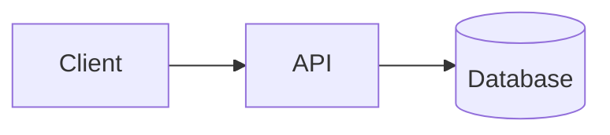

A single client could generate a huge number of requests and consume resources needed by other users.

With rate limiting:

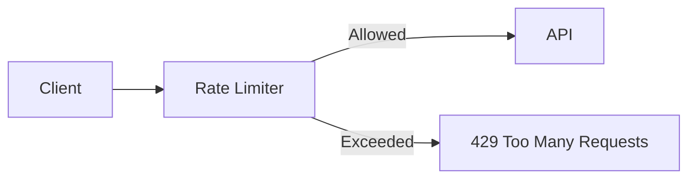

The limiter creates a control point before expensive application work happens.

---

# 3. Rate Limiting vs DDoS Protection

Rate limiting and DDoS protection are related but not identical.

## Rate Limiting

Usually protects application resources from excessive requests.

Examples:

```text
100 requests/minute/user
1000 requests/minute/API key
5 login attempts/minute
```

## DDoS Protection

Designed to handle large-scale malicious traffic before it reaches the application infrastructure.

Typical layers:

```text
Internet
   ↓
CDN / WAF / DDoS Protection
   ↓
Load Balancer
   ↓
API Gateway
   ↓
Application Rate Limiter
   ↓
Application
```

Do not expect an application-level Redis rate limiter to absorb a massive network-level attack.

---

# 4. Where Should Rate Limiting Live?

Rate limiting can be implemented at several layers.

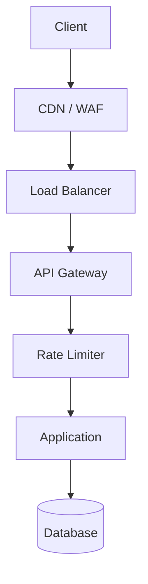

## 4.1 CDN / WAF

Useful for:

- IP-based protection
- Blocking obvious abuse
- DDoS mitigation
- Global edge-level controls

The advantage is that unwanted traffic can be stopped before reaching your application.

## 4.2 API Gateway

A gateway is often a good centralized location.

Advantages:

- One place for policies
- Protects multiple services
- Consistent behavior
- Easier monitoring
- Less duplicated middleware

## 4.3 Application Middleware

Application-level limiting is useful when the policy depends on application data.

Examples:

```text
user_id
tenant_id
subscription plan
API key
endpoint
account status
```

Example:

```text
Request
   ↓
Authentication
   ↓
Rate Limit Middleware
   ↓
Controller
   ↓
Database
```

## 4.4 Redis

When multiple application servers exist, shared state is usually required.

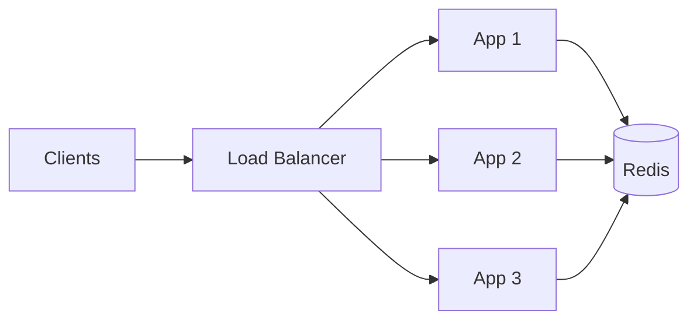

If each application server keeps its own counter:

```text
Limit = 100/minute

Server A → 100 requests
Server B → 100 requests
Server C → 100 requests

Total allowed = 300
```

The intended global limit was 100, so local in-memory counters are not enough for a distributed global policy.

---

# 5. The Four Common Algorithms

The most common approaches are:

1. Fixed Window
2. Sliding Window
3. Token Bucket
4. Leaky Bucket

They differ in how they treat time, bursts, storage, and traffic smoothing.

---

# 6. Fixed Window

Fixed Window divides time into fixed intervals.

Example:

```text
Limit = 100 requests
Window = 1 minute
```

The counter resets at:

```text
12:00:00
12:01:00
12:02:00
...
```

## 6.1 How It Works

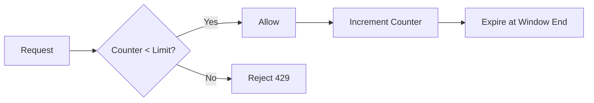

Example:

```text
12:00:30 → 90 requests
12:00:59 → 10 requests
12:01:00 → Counter resets
12:01:01 → 100 new requests
```

This creates a boundary problem.

A client can potentially send:

```text
100 requests at 12:00:59
100 requests at 12:01:00
```

That is:

```text
200 requests
in approximately 2 seconds
```

even though the configured limit is:

```text
100 requests/minute
```

## 6.2 Advantages

- Very simple
- Fast
- Low memory usage
- Easy to understand
- Easy to implement with Redis counters

## 6.3 Problems

- Boundary bursts
- Less precise traffic control
- Can allow uneven traffic distribution

## 6.4 Redis Concept

A simple implementation can use:

```text
INCR rate:user:123:minute
EXPIRE rate:user:123:minute 60
```

However, incrementing and expiration should be designed carefully so concurrent requests cannot create incorrect state.

## 6.5 When to Use

Use Fixed Window when:

- Simplicity matters
- Approximate limiting is acceptable
- Boundary bursts are not a major concern
- Low overhead is important

---

# 7. Sliding Window

Sliding Window considers requests within the most recent period rather than a fixed calendar interval.

Example:

```text
Limit = 100 requests
Window = previous 60 seconds
```

For every request:

> Count requests made during the last 60 seconds.

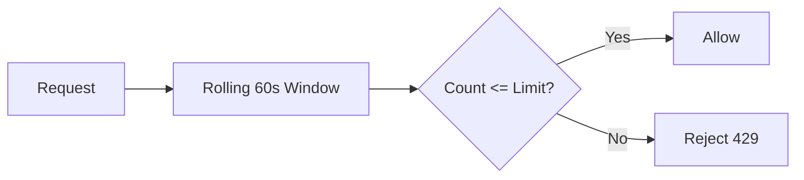

## 7.1 Sliding Window Log

Store timestamps of requests:

```text
12:00:10
12:00:20
12:00:31
12:00:45
12:00:55
```

At `12:01:00`, remove timestamps older than:

```text
12:00:00
```

Then count the remaining requests.

## 7.2 Redis Sorted Set

Redis Sorted Sets are useful for timestamp-based implementations.

Conceptually:

```text
Key:
rate:user:123

Score:
request timestamp

Value:
request identifier
```

Operations can look conceptually like:

```text
ZADD
ZREMRANGEBYSCORE
ZCARD
```

The process is:

```text
1. Remove expired timestamps
2. Add current request
3. Count remaining requests
4. Compare with limit
5. Allow or reject
```

## 7.3 Advantages

- More accurate than Fixed Window
- Prevents boundary bursts
- Smoother traffic control
- Fairer distribution

## 7.4 Problems

- More memory usage
- More Redis operations
- Timestamp storage
- More implementation complexity

## 7.5 When to Use

Good for:

- Public APIs
- Authentication endpoints
- User-facing APIs
- Fair traffic distribution
- APIs where boundary bursts are undesirable

---

# 8. Token Bucket

Token Bucket is one of the most useful general-purpose algorithms.

Imagine a bucket containing tokens.

```text
Bucket Capacity = 10 tokens
Refill Rate     = 5 tokens/sec
```

Each request consumes one token.

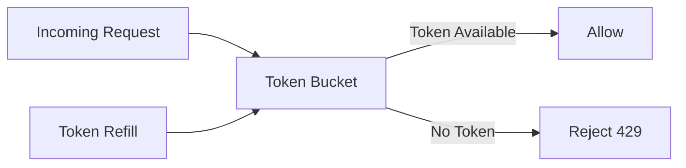

## 8.1 How It Works

Suppose:

```text
Capacity = 10
Refill = 2 tokens/sec
```

Initial state:

```text
10 tokens
```

Ten requests arrive:

```text
10 requests
↓
10 tokens consumed
↓
0 tokens remaining
```

New requests are rejected until tokens are refilled.

After one second:

```text
2 tokens
```

After another second:

```text
4 tokens
```

up to the maximum bucket capacity.

## 8.2 Burst Handling

One major advantage is controlled bursts.

If the bucket contains 10 tokens, the client can potentially make 10 requests immediately.

After that, requests are constrained by the refill rate.

So:

```text
Burst capacity → 10
Average refill → 2 requests/sec
```

This is often a better fit for APIs than a strict fixed-window limit.

## 8.3 Advantages

- Supports controlled bursts
- Provides an average rate
- Flexible
- Efficient
- Works well with distributed systems

## 8.4 Problems

- Requires maintaining bucket state
- Capacity requires tuning
- Refill rate requires tuning
- Slightly more complex than Fixed Window
- Poor configuration can allow excessive bursts

## 8.5 When to Use

Good for:

- APIs
- Microservices
- Public endpoints
- Variable traffic
- Systems where short bursts are acceptable

---

# 9. Leaky Bucket

Leaky Bucket focuses on controlling the rate at which requests leave the system.

Think of it as:

```text
Requests enter
      ↓
Queue / Bucket
      ↓
Requests leave at controlled rate
```


## 9.1 Example

Incoming traffic:

```text
100 requests/sec
```

Processing capacity:

```text
20 requests/sec
```

The system queues requests and processes them at the controlled rate.

If the queue becomes full, new requests may be rejected.

## 9.2 Advantages

- Smooths traffic
- Protects downstream services
- Useful for background processing
- Provides predictable processing rate

## 9.3 Problems

- Queued requests consume resources
- Latency can increase
- Queue overflow needs handling
- Less suitable when requests require immediate responses

## 9.4 When to Use

Useful for:

- Job processing
- Background tasks
- Traffic smoothing
- Workloads where controlled processing matters more than immediate response

---

# 10. Algorithm Comparison

| Algorithm | Burst Handling | Accuracy | Memory | Complexity | Good For |
|---|---|---|---|---|---|
| Fixed Window | High at boundaries | Low | Low | Low | Simple APIs |
| Sliding Window | Low boundary burst | High | Medium/High | Medium | Fair API limiting |
| Token Bucket | Controlled bursts | High | Low/Medium | Medium | General APIs |
| Leaky Bucket | Limited | High | Medium | Medium | Traffic smoothing |

A practical decision:

```text
Need simplest implementation?
        ↓
Fixed Window

Need accurate rolling limits?
        ↓
Sliding Window

Need controlled bursts?
        ↓
Token Bucket

Need smooth downstream processing?
        ↓
Leaky Bucket
```

---

# 11. Choose the Client Identity

Rate limiting needs a key that identifies the client.

Common options:

- IP
- User ID
- API key
- Tenant ID
- Session ID
- Endpoint
- Combination of several values

---

# 12. IP-Based Rate Limiting

Example:

```text
rate:ip:203.0.113.10
```

Useful for:

- Anonymous APIs
- Login protection
- Public endpoints

Problem:

Many legitimate users can share one IP.

Examples:

```text
Office network
University
Mobile carrier
NAT gateway
```

Therefore, IP alone is often not enough for authenticated applications.

---

# 13. User-Based Rate Limiting

Example:

```text
rate:user:12345
```

Useful when users are authenticated.

Example:

```text
Free User:
100 requests/minute

Pro User:
1000 requests/minute
```

This allows limits to reflect account-level plans.

---

# 14. API-Key Rate Limiting

For developer APIs:

```text
rate:key:abc123
```

Useful when clients authenticate with API keys.

Example:

```text
API Key A → 1000/min
API Key B → 10000/min
```

---

# 15. Tenant-Based Rate Limiting

Multi-tenant SaaS applications can limit entire organizations.

```text
rate:tenant:company_123
```

Example:

```text
Free Tenant:
1,000 requests/hour

Business:
50,000 requests/hour

Enterprise:
Custom
```

This prevents one tenant from consuming an unreasonable amount of shared infrastructure.

---

# 16. Endpoint-Based Rate Limiting

Different endpoints have different costs.

For example:

```text
GET /products
→ 1000/min

POST /orders
→ 100/min

POST /login
→ 5/min

POST /reports
→ 10/hour
```

An expensive database report should not necessarily have the same limit as a cheap cached GET request.

---

# 17. Layered Rate Limiting

Production APIs often use multiple layers.

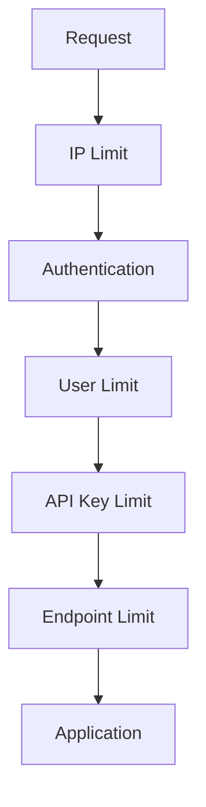

Example:

```text
IP:
1000 requests/minute

User:
500 requests/minute

API Key:
10,000 requests/hour

Login:
5 attempts/minute
```

This protects against different abuse patterns.

---

# 18. Distributed Rate Limiting With Redis

For multiple application instances, shared state is important.

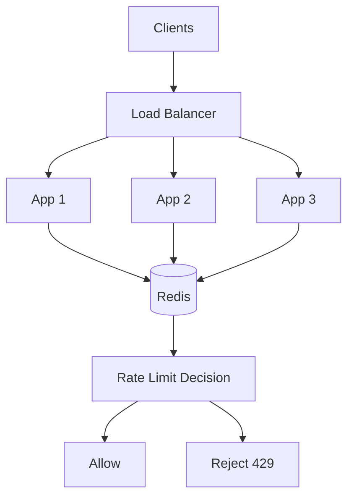

Redis is commonly used because it provides:

- Low latency
- Atomic operations
- TTL
- Counters
- Sorted Sets
- Lua scripting
- High throughput

---

# 19. Race Conditions

A naive counter implementation can fail under concurrent requests.

Imagine the limit is:

```text
100 requests
```

Two requests arrive simultaneously.

```text
Request A → GET counter = 99
Request B → GET counter = 99

Request A → allowed
Request B → allowed

Request A → INCR = 100
Request B → INCR = 101
```

Both requests were allowed based on the same old value.

For distributed rate limiting, operations that form one decision should be atomic.

Possible approaches:

- Redis atomic commands
- Lua scripts
- Transactions where appropriate
- Specialized rate-limiting primitives

---

# 20. Redis Lua Example

A simplified Fixed Window script:

```lua
local current = redis.call("INCR", KEYS[1])

if current == 1 then
    redis.call("EXPIRE", KEYS[1], ARGV[1])
end

if current > tonumber(ARGV[2]) then
    return 0
end

return 1
```

Application logic:

```javascript
const allowed = await redis.eval(
  script,
  1,
  key,
  windowSeconds,
  limit
);

if (!allowed) {
  return res.status(429).json({
    error: "rate_limit_exceeded",
    message: "Too many requests"
  });
}
```

The exact implementation should be adapted to the selected algorithm.

---

# 21. HTTP 429 Response

When the client exceeds its limit:

```http
HTTP/1.1 429 Too Many Requests
```

Example:

```json
{
  "error": "rate_limit_exceeded",
  "message": "Too many requests. Try again later."
}
```

A useful header is:

```http
Retry-After: 30
```

This tells clients approximately when they should retry.

You may also expose:

```http
RateLimit-Limit: 100
RateLimit-Remaining: 12
RateLimit-Reset: 30
```

Keep the format consistent across your API.

---

# 22. Retry Strategy

Clients should not immediately retry a rejected request in a tight loop.

Bad:

```text
429
 ↓
retry immediately
 ↓
429
 ↓
retry immediately
 ↓
429
```

This can create even more traffic.

Use:

- Retry-After
- Exponential backoff
- Jitter

Example:

```text
Attempt 1 → wait 1 second
Attempt 2 → wait 2 seconds
Attempt 3 → wait 4 seconds
Attempt 4 → wait 8 seconds
```

Jitter adds randomness so thousands of clients do not retry at exactly the same time.

---

# 23. Fail-Open vs Fail-Closed

What happens if Redis becomes unavailable?

You need an explicit policy.

## Fail Open

If the rate limiter fails:

```text
Allow request
```

Advantages:

- Better application availability
- Less chance of blocking legitimate traffic

Risk:

- Rate-limit protection temporarily disappears

## Fail Closed

If the limiter fails:

```text
Reject request
```

Advantages:

- Stronger protection

Risk:

- A Redis outage can become an application outage

The correct strategy depends on the endpoint.

For example:

```text
Public read API
→ May prefer fail-open

Password reset
→ May prefer stricter protection
```

---

# 24. Sensitive Endpoint Limits

Sensitive endpoints usually need stricter policies.

## Login

```text
5 attempts/minute/account
```

## OTP

```text
5 requests/10 minutes/phone
```

## Password Reset

```text
5 requests/hour/account
```

## Public API

```text
1000 requests/minute/API key
```

## Expensive Reports

```text
10 requests/hour/user
```

The limit should reflect the cost and abuse potential of the operation.

---

# 25. Rate Limiting and Authentication

The limiter may run before or after authentication.

For anonymous traffic:

```text
IP limit
   ↓
Authentication
```

For authenticated traffic:

```text
Authentication
   ↓
User limit
```

A layered design can use both:

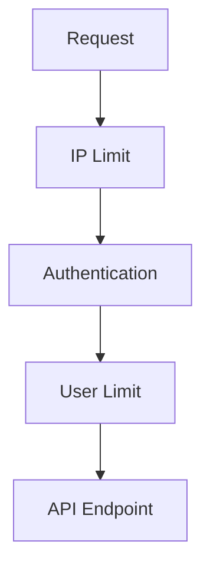

This prevents an attacker from simply creating multiple accounts to bypass a per-user limit.

---

# 26. Monitoring

Rate limiting should be observable.

Track:

- Allowed requests
- Rejected requests
- Requests per endpoint
- Requests per user
- Requests per API key
- Requests per IP
- Redis latency
- Redis errors
- Rate-limit hit percentage
- Retry behavior

Example metrics:

```text
rate_limit_allowed_total
rate_limit_rejected_total
rate_limit_redis_latency
rate_limit_errors_total
rate_limit_hits_by_endpoint
```

Example dashboard:

```text
Endpoint       Requests     429s
--------------------------------
/login         10,000       1,200
/orders        50,000         350
/products     200,000          50
```

This helps determine whether limits are too strict or too loose.

---

# 27. Protect the Rate Limiter

The rate limiter itself becomes part of the critical request path.

```text
Client
  ↓
API
  ↓
Rate Limiter
  ↓
Redis
  ↓
Application
```

If Redis becomes slow:

```text
Every API request
       ↓
Waits for Redis
       ↓
Application latency increases
```

Consider:

- Redis high availability
- Redis clustering where needed
- Connection pooling
- Short timeouts
- Monitoring
- Capacity planning
- Memory limits
- Hot-key analysis

---

# 28. Rate-Limit Key Design

Keys should represent the policy dimensions.

Examples:

```text
rate:ip:203.0.113.10
```

```text
rate:user:12345
```

```text
rate:user:12345:orders
```

```text
rate:tenant:456:api
```

```text
rate:key:abc123:endpoint:orders
```

A complex policy might use:

```text
rate:{tenantId}:{userId}:{endpoint}
```

Avoid unnecessary high-cardinality keys if they create excessive storage or operational overhead.

---

# 29. Example SaaS Policy

Imagine a SaaS application with three plans.

```text
Anonymous:
60 requests/minute/IP

Free:
100 requests/minute/user

Pro:
1,000 requests/minute/user

Enterprise:
Custom limits
```

Sensitive endpoints:

```text
Login:
5 attempts/minute/IP + account

Password reset:
5 requests/hour/account

Expensive reports:
10 requests/hour/user
```

This is more effective than applying:

```text
100 requests/minute
```

to every endpoint.

---

# 30. Example Node.js Middleware

A simple middleware interface might look like:

```javascript
async function rateLimit(req, res, next) {
  const key = `rate:user:${req.user.id}`;

  const allowed = await checkRateLimit({
    key,
    limit: 100,
    window: 60
  });

  if (!allowed) {
    return res.status(429).json({
      error: "rate_limit_exceeded",
      message: "Too many requests"
    });
  }

  next();
}
```

Apply it:

```javascript
app.use("/api", rateLimit);
```

For sensitive endpoints:

```javascript
app.post(
  "/login",
  loginRateLimiter,
  loginController
);

app.post(
  "/orders",
  orderRateLimiter,
  orderController
);
```

---

# 31. Example Token Bucket Configuration

Suppose:

```text
Capacity = 100 tokens
Refill = 10 tokens/sec
```

Interpretation:

```text
Maximum immediate burst:
100 requests

Sustained rate:
10 requests/sec
```

A client that consumes all 100 tokens must wait for tokens to refill.

This is useful when you want to allow legitimate short bursts but prevent sustained overload.

---

# 32. Choosing the Best Algorithm

A practical guide:

```text
Simple requirement
        ↓
Fixed Window

Need precise rolling limits
        ↓
Sliding Window

Need bursts + controlled average rate
        ↓
Token Bucket

Need predictable processing rate
        ↓
Leaky Bucket
```

For many modern distributed APIs:

```text
Token Bucket
      +
Redis
      +
API Gateway / Application Middleware
```

is a strong general-purpose architecture.

However, there is no universally best algorithm.

The right choice depends on:

- Traffic pattern
- Burst tolerance
- Accuracy requirement
- Memory budget
- Latency requirements
- Implementation complexity
- Downstream capacity

---

# 33. Production Architecture

A production-grade architecture may look like:

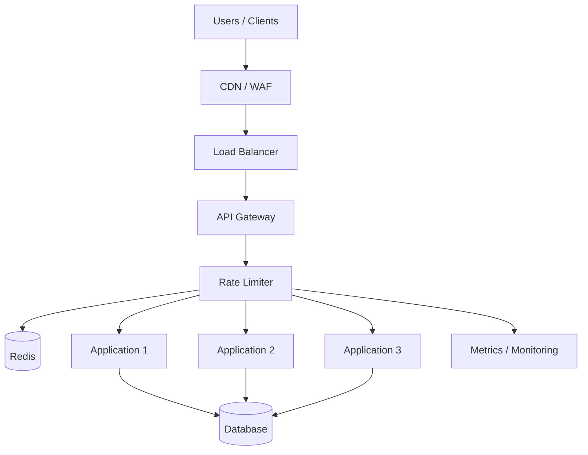

Request flow:

```text
Client
  ↓
CDN / WAF
  ↓
Load Balancer
  ↓
API Gateway
  ↓
Rate Limiter
  ↓
Redis
  ↓
Allow / Reject
  ↓
Application
  ↓
Database
```

---

# 34. Step-by-Step Implementation Plan

A practical implementation sequence:

```text
1. Identify expensive endpoints
        ↓
2. Define rate-limit policies
        ↓
3. Decide client identity
        ↓
4. Select algorithm
        ↓
5. Implement basic middleware
        ↓
6. Add shared Redis state
        ↓
7. Make the decision atomic
        ↓
8. Return HTTP 429
        ↓
9. Add Retry-After
        ↓
10. Add monitoring
        ↓
11. Load test
        ↓
12. Tune limits
        ↓
13. Add endpoint-specific limits
        ↓
14. Define Redis failure behavior
        ↓
15. Add layered protection
```

---

# 35. Common Mistakes

## Mistake 1 — Only Limiting by IP

Shared IPs can represent many legitimate users.

## Mistake 2 — Local Memory Counters

They do not provide a global limit across multiple application instances.

## Mistake 3 — Ignoring Race Conditions

Concurrent requests can bypass naive counters.

## Mistake 4 — One Limit for Every Endpoint

Different endpoints have different costs.

## Mistake 5 — No Retry-After

Clients do not know when they should retry.

## Mistake 6 — Unlimited Retries

Aggressive clients can create another traffic spike.

## Mistake 7 — No Monitoring

You cannot understand whether limits are effective.

## Mistake 8 — Redis as an Unplanned Single Point of Failure

A limiter dependency needs a deliberate availability strategy.

## Mistake 9 — Arbitrary Limits

Limits should be based on:

- Downstream capacity
- Expected traffic
- Business requirements
- Load testing

## Mistake 10 — Choosing the Most Complex Algorithm First

Start simple.

Only introduce more sophisticated algorithms when the requirement justifies them.

---

# 36. Testing Rate Limiting

Rate limiting should be load tested before production.

Test:

### Normal Traffic

```text
Requests < Limit
```

Expected:

```text
All requests allowed
```

### Limit Boundary

```text
Requests = Limit
```

Expected:

```text
Allowed according to policy
```

### Exceeding Limit

```text
Requests > Limit
```

Expected:

```text
429 responses
```

### Concurrent Requests

Send many requests simultaneously.

Verify:

```text
No significant limit bypass
```

### Multiple Application Servers

Verify:

```text
Global limit remains correct
```

### Redis Failure

Test both:

```text
Fail Open
Fail Closed
```

according to your policy.

### Recovery

After the limit window expires or tokens refill:

```text
Requests should become allowed again
```

---

# 37. Capacity Planning

The rate limiter also needs capacity planning.

Consider:

- Requests per second
- Number of clients
- Number of active keys
- TTL duration
- Memory usage
- Redis operations per request
- Peak traffic
- Number of application instances

Example:

```text
Peak API traffic = 50,000 RPS
```

If every request creates multiple Redis operations:

```text
50,000 RPS
×
3 Redis operations
=
150,000 Redis operations/sec
```

The rate limiter itself now becomes a workload that needs capacity planning.

---

# 38. Cache vs Rate Limiter

Caching and rate limiting solve different problems.

### Cache

```text
Reduce expensive repeated work
```

### Rate Limiter

```text
Control how much work a client is allowed to generate
```

They can work together:

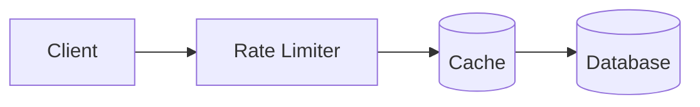

Rate limiting protects the system.

Caching reduces the work required by allowed requests.

---

# 39. Rate Limiting vs Concurrency Limiting

Rate limiting controls:

```text
Requests per time period
```

Concurrency limiting controls:

```text
How many requests can execute simultaneously
```

Example:

```text
Rate limit:
1000 requests/minute

Concurrency limit:
20 requests at once
```

For expensive operations, both may be useful.

Example:

```text
POST /generate-report

Rate:
10/hour

Concurrency:
2 simultaneous reports
```

This protects CPU, memory, database connections, or external dependencies.

---

# 40. Final Mental Model

When designing rate limiting, think in this order:

```text
1. What are we protecting?
        ↓
2. Who should be limited?
        ↓
3. What endpoint/resource is being protected?
        ↓
4. What traffic pattern is acceptable?
        ↓
5. Which algorithm fits that pattern?
        ↓
6. Where should the limiter run?
        ↓
7. Does it need shared state?
        ↓
8. How do we make decisions atomic?
        ↓
9. What happens when the limit is exceeded?
        ↓
10. What happens when the limiter fails?
        ↓
11. How do clients retry?
        ↓
12. How do we monitor and tune it?
```

---

# 41. Recommended Architecture

For a typical distributed API:

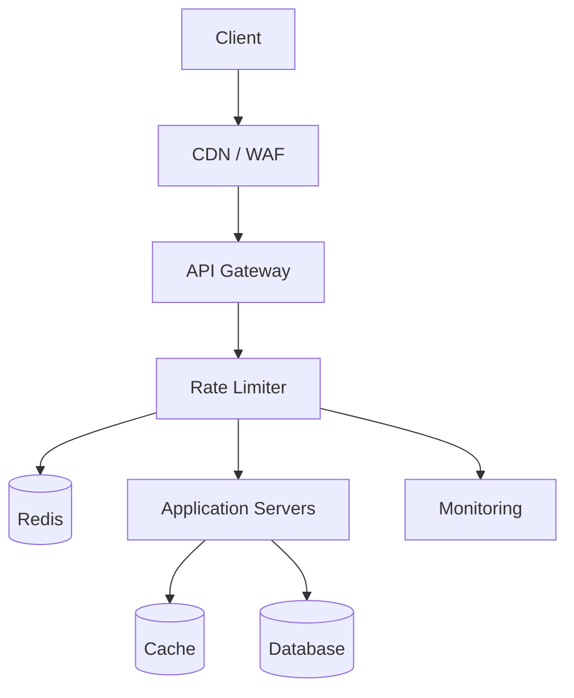

A practical default:

```text
Algorithm:
Token Bucket

State:
Redis

Location:
API Gateway or Application Middleware

Identity:
User + API Key + IP where appropriate

Response:
429 + Retry-After

Reliability:
Timeouts + monitoring + explicit failure policy
```

---

# 42. Final Takeaway

Rate limiting is not simply:

```javascript
if (count > limit) {
  reject();
}
```

A production implementation requires decisions about:

- Algorithm
- Identity
- Storage
- Distributed state
- Atomicity
- Endpoint-specific policies
- Burst behavior
- Client retries
- Failure handling
- Monitoring
- Capacity planning

For many distributed APIs, a strong starting point is:

```text
Token Bucket
      +
Redis
      +
API Gateway / Middleware
      +
Endpoint-specific policies
      +
429 + Retry-After
      +
Monitoring
```

But the best solution depends on the workload.

Start with the simplest algorithm that satisfies the requirement.

Measure real traffic.

Load test the system.

Tune the limits.

Then introduce additional complexity only when the system actually needs it.

> **Good rate limiting protects the system without unnecessarily blocking legitimate users.**


---

# 43. Redis + Node.js: Production-Style Example

This section shows how to implement a distributed rate limiter using:

```text
Node.js
Express
Redis
```

The example uses a **Fixed Window Counter** first because it is easy to understand and provides a good foundation.

For more advanced workloads, the same architecture can be extended to Token Bucket or Sliding Window.

---

## 43.1 Architecture

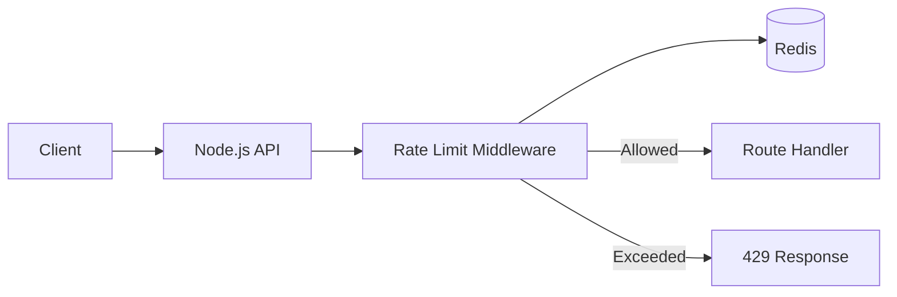

With multiple Node.js servers:

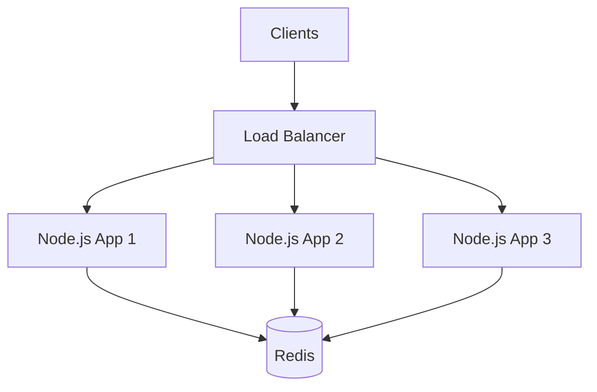

All application instances use the same Redis state.

---

## 43.2 Install Dependencies

Create a Node.js project:

```bash
npm init -y
```

Install Express and the Redis client:

```bash
npm install express redis
```

For development:

```bash
npm install -D nodemon
```

---

## 43.3 Start Redis With Docker

If Redis is not installed locally:

```bash
docker run -d \
  --name rate-limit-redis \
  -p 6379:6379 \
  redis:7
```

Verify:

```bash
docker exec -it rate-limit-redis redis-cli ping
```

Expected:

```text
PONG
```

---

## 43.4 Redis Connection

Create:

```text
src/redis.js
```

```javascript
const { createClient } = require("redis");

const redis = createClient({
  url: process.env.REDIS_URL || "redis://localhost:6379",
});

redis.on("error", (error) => {
  console.error("Redis error:", error);
});

async function connectRedis() {
  if (!redis.isOpen) {
    await redis.connect();
  }
}

module.exports = {
  redis,
  connectRedis,
};
```

---

# 44. Basic Fixed Window Rate Limiter

Create:

```text
src/rateLimiter.js
```

A simple implementation:

```javascript
const { redis } = require("./redis");

function rateLimit({
  limit = 100,
  windowSeconds = 60,
  keyGenerator = (req) => req.ip,
} = {}) {
  return async function rateLimitMiddleware(req, res, next) {
    try {
      const identifier = keyGenerator(req);

      const key = `rate:${identifier}`;

      const current = await redis.incr(key);

      if (current === 1) {
        await redis.expire(key, windowSeconds);
      }

      const remaining = Math.max(limit - current, 0);

      res.setHeader("RateLimit-Limit", limit);
      res.setHeader("RateLimit-Remaining", remaining);
      res.setHeader(
        "RateLimit-Reset",
        windowSeconds
      );

      if (current > limit) {
        res.setHeader("Retry-After", windowSeconds);

        return res.status(429).json({
          error: "rate_limit_exceeded",
          message: "Too many requests. Try again later.",
        });
      }

      next();
    } catch (error) {
      console.error("Rate limiter error:", error);

      /*
       * Decide intentionally whether your application
       * should fail open or fail closed.
       *
       * This example fails open so a Redis outage
       * does not automatically take down the API.
       */
      next();
    }
  };
}

module.exports = rateLimit;
```

---

# 45. Express Application

Create:

```text
src/server.js
```

```javascript
const express = require("express");

const { connectRedis } = require("./redis");
const rateLimit = require("./rateLimiter");

const app = express();

app.set("trust proxy", true);

app.use(express.json());

const apiRateLimit = rateLimit({
  limit: 100,
  windowSeconds: 60,
  keyGenerator: (req) => {
    return req.ip;
  },
});

app.use("/api", apiRateLimit);

app.get("/api/products", (req, res) => {
  res.json({
    products: [],
  });
});

app.get("/health", (req, res) => {
  res.json({
    status: "ok",
  });
});

async function start() {
  await connectRedis();

  const port = process.env.PORT || 3000;

  app.listen(port, () => {
    console.log(`Server running on port ${port}`);
  });
}

start().catch((error) => {
  console.error("Failed to start server:", error);
  process.exit(1);
});
```

Run:

```bash
node src/server.js
```

The API is now:

```text
GET http://localhost:3000/api/products
```

---

# 46. How the Redis Counter Works

When the first request arrives:

```text
INCR rate:127.0.0.1
```

Redis returns:

```text
1
```

The application then sets:

```text
EXPIRE rate:127.0.0.1 60
```

The next request:

```text
INCR rate:127.0.0.1
```

returns:

```text
2
```

Eventually:

```text
100 requests
→ allowed

101st request
→ rejected with 429
```

After the TTL expires:

```text
Redis key disappears
```

and the next request starts a new window.

---

# 47. Important Race Condition

This implementation is easy to understand, but there is an important detail.

These are two separate Redis operations:

```javascript
await redis.incr(key);
await redis.expire(key, windowSeconds);
```

Under normal operation this is often fine, but a failure between the two commands could leave a key without the intended expiration.

A more robust implementation combines the operations atomically.

---

# 48. Atomic Redis Implementation With Lua

Create:

```text
src/rateLimiter.js
```

```javascript
const { redis } = require("./redis");

const rateLimitScript = `
local current = redis.call("INCR", KEYS[1])

if current == 1 then
    redis.call("EXPIRE", KEYS[1], ARGV[1])
end

local limit = tonumber(ARGV[2])

if current > limit then
    return {0, current}
end

return {1, current}
`;

function rateLimit({
  limit = 100,
  windowSeconds = 60,
  keyGenerator = (req) => req.ip,
} = {}) {
  return async function rateLimitMiddleware(req, res, next) {
    try {
      const identifier = keyGenerator(req);

      const key = `rate:${identifier}`;

      const [allowed, current] = await redis.eval(
        rateLimitScript,
        {
          keys: [key],
          arguments: [
            String(windowSeconds),
            String(limit),
          ],
        }
      );

      const remaining = Math.max(
        limit - Number(current),
        0
      );

      res.setHeader("RateLimit-Limit", limit);
      res.setHeader("RateLimit-Remaining", remaining);

      if (Number(allowed) === 0) {
        res.setHeader(
          "Retry-After",
          windowSeconds
        );

        return res.status(429).json({
          error: "rate_limit_exceeded",
          message: "Too many requests",
        });
      }

      next();
    } catch (error) {
      console.error("Rate limiter error:", error);

      next();
    }
  };
}

module.exports = rateLimit;
```

The important benefit is that:

```text
INCR
+
EXPIRE
+
LIMIT CHECK
```

are executed together inside Redis.

---

# 49. User-Based Rate Limiting

IP-based limiting is not always enough.

For authenticated APIs, use the user ID.

```javascript
const apiRateLimit = rateLimit({
  limit: 100,
  windowSeconds: 60,

  keyGenerator: (req) => {
    return `user:${req.user.id}`;
  },
});
```

The resulting Redis key becomes:

```text
rate:user:12345
```

This means:

```text
User 12345
→ 100 requests/minute
```

regardless of which Node.js server handles the request.

---

# 50. Endpoint-Specific Limits

Different endpoints can have different limits.

```javascript
const loginRateLimit = rateLimit({
  limit: 5,
  windowSeconds: 60,

  keyGenerator: (req) => {
    return `login:${req.ip}`;
  },
});

const orderRateLimit = rateLimit({
  limit: 100,
  windowSeconds: 60,

  keyGenerator: (req) => {
    return `orders:${req.user.id}`;
  },
});
```

Use them:

```javascript
app.post(
  "/login",
  loginRateLimit,
  loginController
);

app.post(
  "/orders",
  orderRateLimit,
  orderController
);
```

Now:

```text
/login
→ 5/min/IP

/orders
→ 100/min/user
```

---

# 51. Plan-Based Rate Limiting

A SaaS application can use different limits based on subscription.

```javascript
const limits = {
  free: 100,
  pro: 1000,
  enterprise: 10000,
};

const apiRateLimit = rateLimit({
  windowSeconds: 60,

  keyGenerator: (req) => {
    return `user:${req.user.id}`;
  },

  limit: (req) => {
    return limits[req.user.plan] || limits.free;
  },
});
```

For this design, the middleware should resolve the limit before executing the Redis decision.

A more flexible implementation:

```javascript
function rateLimit({
  limit,
  windowSeconds = 60,
  keyGenerator,
}) {
  return async function (req, res, next) {
    const resolvedLimit =
      typeof limit === "function"
        ? limit(req)
        : limit;

    // Redis rate-limit logic...
  };
}
```

This allows:

```text
Free       → 100/min
Pro        → 1000/min
Enterprise → 10000/min
```

---

# 52. Adding the Endpoint to the Redis Key

If limits differ by endpoint, include the route in the key.

```javascript
const keyGenerator = (req) => {
  return [
    "user",
    req.user.id,
    req.method,
    req.route?.path || req.path,
  ].join(":");
};
```

Possible key:

```text
rate:user:123:POST:/orders
```

This prevents requests to one endpoint from consuming the limit assigned to another endpoint.

---

# 53. IP + User + Endpoint

A more complete policy can use several dimensions:

```javascript
const key = [
  "rate",
  req.ip,
  req.user?.id || "anonymous",
  req.method,
  req.path,
].join(":");
```

Example:

```text
rate:
203.0.113.10:
12345:
POST:
/orders
```

Do not automatically include every possible dimension.

More dimensions mean:

- More Redis keys
- Higher memory usage
- More complex policies

Only include dimensions required by the security and business requirements.

---

# 54. Token Bucket With Redis

Fixed Window is simple, but Token Bucket is often better when controlled bursts are required.

Conceptually:

```text
Capacity = 100 tokens
Refill   = 10 tokens/sec
```

A request consumes one token.

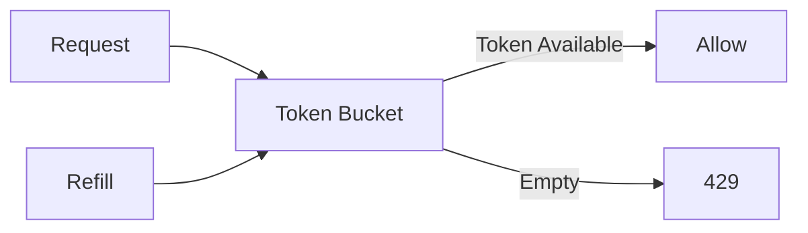

A Redis implementation needs to store state such as:

```text
tokens
last_refill_timestamp
```

For example:

```json
{
  "tokens": 74,
  "lastRefill": 1760000000000
}
```

The decision algorithm becomes:

```text
elapsed = now - lastRefill

newTokens =
  elapsed × refillRate

tokens =
  min(capacity, tokens + newTokens)

if tokens >= 1:
    tokens -= 1
    allow
else:
    reject
```

For production, perform the calculation and state update atomically using a Redis Lua script.

---

# 55. Why Token Bucket Is Often a Good Default

Suppose:

```text
Capacity = 100
Refill = 10/sec
```

A legitimate client can make a short burst:

```text
100 requests
```

but cannot sustain:

```text
100 requests/sec
```

for a long time.

The long-term average is constrained by:

```text
10 requests/sec
```

This makes Token Bucket useful for APIs where short bursts are normal.

---

# 56. Redis Key Expiration

Redis keys should not live forever.

For a fixed window:

```text
rate:user:123
TTL = 60 seconds
```

For a token bucket:

```text
rate:user:123
TTL = based on inactivity / policy
```

Expiration prevents abandoned clients from consuming memory indefinitely.

Monitor:

```text
Active rate-limit keys
Memory usage
Key creation rate
Expired keys
```

---

# 57. Redis Failure Strategy

The rate limiter is part of the request path.

You must explicitly decide:

```text
What happens if Redis is down?
```

## Fail Open

```javascript
catch (error) {
  console.error(error);
  return next();
}
```

Request continues.

Good for:

```text
Low-risk read endpoints
```

## Fail Closed

```javascript
catch (error) {
  return res.status(503).json({
    error: "rate_limiter_unavailable",
  });
}
```

Request is blocked.

Potentially appropriate for:

```text
High-risk authentication endpoints
```

There is no universal answer.

---

# 58. Redis Timeout

Never allow a Redis problem to hold API requests indefinitely.

Configure a reasonable Redis socket timeout and application-level safeguards.

Conceptually:

```javascript
const redis = createClient({
  url: process.env.REDIS_URL,
  socket: {
    connectTimeout: 3000,
  },
});
```

The exact timeout should be tuned to your latency requirements.

A rate limiter should normally be extremely fast compared with the protected operation.

---

# 59. Testing the API

Start the server:

```bash
node src/server.js
```

Send requests:

```bash
curl http://localhost:3000/api/products
```

Check headers:

```text
RateLimit-Limit
RateLimit-Remaining
```

After the limit is exceeded:

```http
HTTP/1.1 429 Too Many Requests
```

with:

```http
Retry-After: 60
```

You can generate traffic using:

```bash
for i in {1..110}; do
  curl -s -o /dev/null \
    -w "%{http_code}\n" \
    http://localhost:3000/api/products
done
```

You should see successful responses followed by:

```text
429
```

---

# 60. Production Improvements

The simple example is intentionally educational.

For production, consider:

### 1. Atomic operations

Use Lua or another atomic approach.

### 2. Shared Redis

All application instances should use the same rate-limit state.

### 3. High availability

Use an appropriate Redis deployment for your availability requirements.

### 4. Endpoint-specific policies

Do not use one limit everywhere.

### 5. Identity-aware policies

Use:

```text
IP
User
API key
Tenant
Endpoint
```

where appropriate.

### 6. Monitoring

Track:

```text
allowed
rejected
Redis latency
Redis errors
429 rate
```

### 7. Load testing

Test:

```text
Normal traffic
Peak traffic
Concurrent requests
Redis failure
Multiple application instances
```

---

# 61. Complete Project Structure

A clean small project can look like:

```text
rate-limiter/
├── src/
│   ├── redis.js
│   ├── rateLimiter.js
│   └── server.js
├── package.json
└── .env
```

Example `.env`:

```env
PORT=3000
REDIS_URL=redis://localhost:6379
```

For production, secrets and infrastructure configuration should be managed using your deployment environment rather than committed to Git.

---

# 62. Recommended Production Architecture

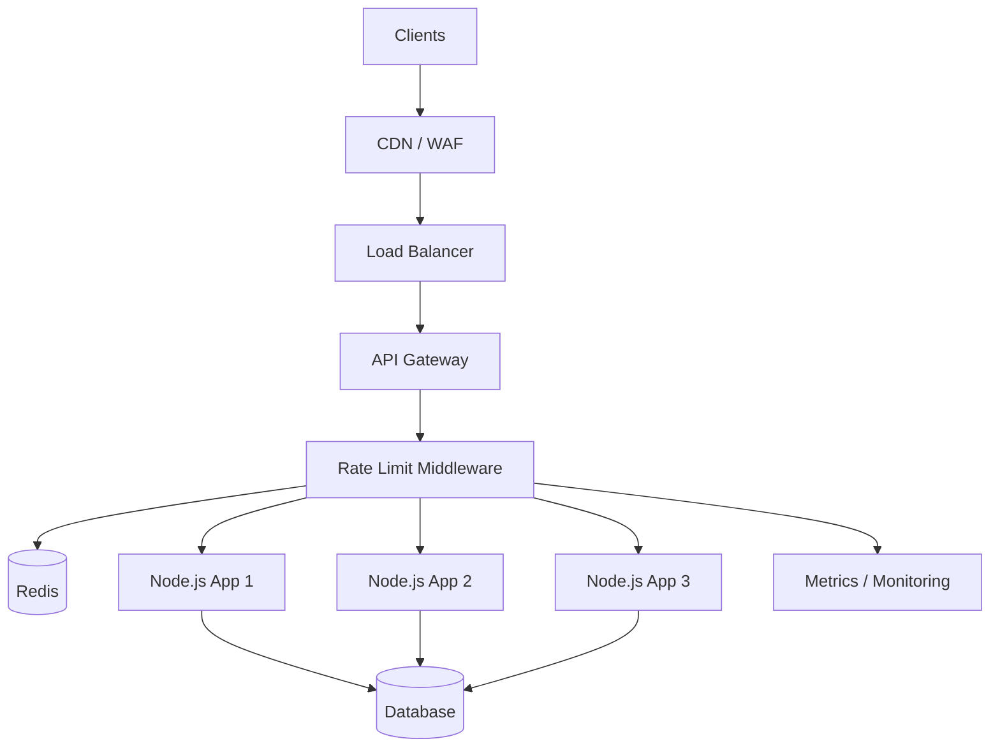

Request path:

```text
Client
  ↓
CDN / WAF
  ↓
Load Balancer
  ↓
API Gateway
  ↓
Rate Limiter
  ↓
Redis
  ↓
Allow / Reject
  ↓
Node.js
  ↓
Database
```

---

# 63. Practical Recommendation

For a typical distributed Node.js API:

```text
Algorithm
→ Token Bucket

Shared State
→ Redis

Location
→ API Gateway or Node.js middleware

Identity
→ User / API key / IP depending on endpoint

Exceeded Limit
→ HTTP 429

Retry Information
→ Retry-After

Atomicity
→ Redis Lua script

Observability
→ Metrics + logs

Failure Strategy
→ Explicit fail-open or fail-closed policy
```

For a first implementation, however:

```text
Fixed Window
+
Redis INCR
+
TTL
+
Node.js middleware
```

is a good way to understand the fundamentals before moving to a production Token Bucket implementation.
