<p align="center">
  <a href="https://topmate.io/codewithayaan/new/wMSkSWH5su">
    
  </a>
</p>


# Load Balancing — From Fundamentals to Production

A practical System Design + DevOps guide covering load-balancing fundamentals, algorithms, L4/L7, health checks, failover, Nginx, Docker, Kubernetes, cloud load balancers, autoscaling, multi-region routing, observability, and production architecture.

## 1. What is Load Balancing?

Load balancing distributes incoming traffic across multiple healthy servers instead of sending everything to one server.

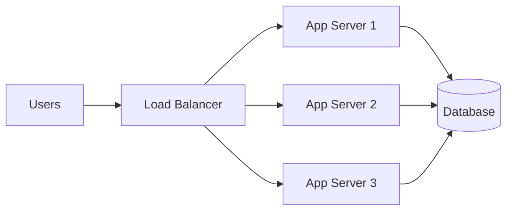

It helps with:
- Horizontal scaling
- High availability
- Fault tolerance
- Traffic distribution
- Zero/low-downtime deployments

## 2. Request Lifecycle

```text
Client → DNS → Load Balancer → Healthy App Server → Response
```

The client only knows the public endpoint. The load balancer decides which backend handles the request.

## 3. Common Algorithms

### Round Robin

```text
Request 1 → Server 1
Request 2 → Server 2
Request 3 → Server 3
Request 4 → Server 1
```

Best when servers have similar capacity.

### Weighted Round Robin

Give stronger servers higher weights.

```text
Server 1 = weight 5
Server 2 = weight 3
Server 3 = weight 1
```

Useful when instances have different capacities.

### Least Connections

Send the next request to the server with the fewest active connections.

```text
Server 1 = 20 connections
Server 2 = 7 connections  ← next request
Server 3 = 13 connections
```

### IP Hash

Hash the client IP to select a backend. Useful for affinity, but shared public IPs can cause uneven distribution.

### Consistent Hashing

Useful when backend membership changes and you want to minimize remapping. Common in distributed caches and sharded systems.

## 4. L4 vs L7

### L4

Works at the transport layer using TCP/UDP, IP and ports.

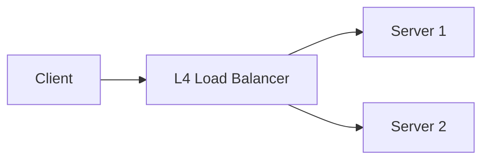

Fast, lightweight, and useful when HTTP-level inspection is unnecessary.

### L7

Understands HTTP/HTTPS and can route using host, path, headers, cookies, and methods.

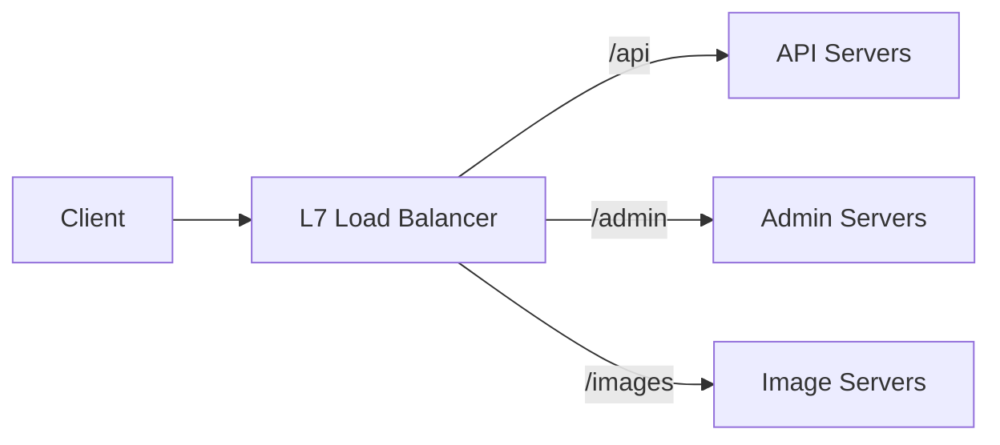

Use L7 when application-aware routing is required.

## 5. Health Checks

A load balancer should send traffic only to healthy capacity.

Typical endpoint:

```text
GET /health
```

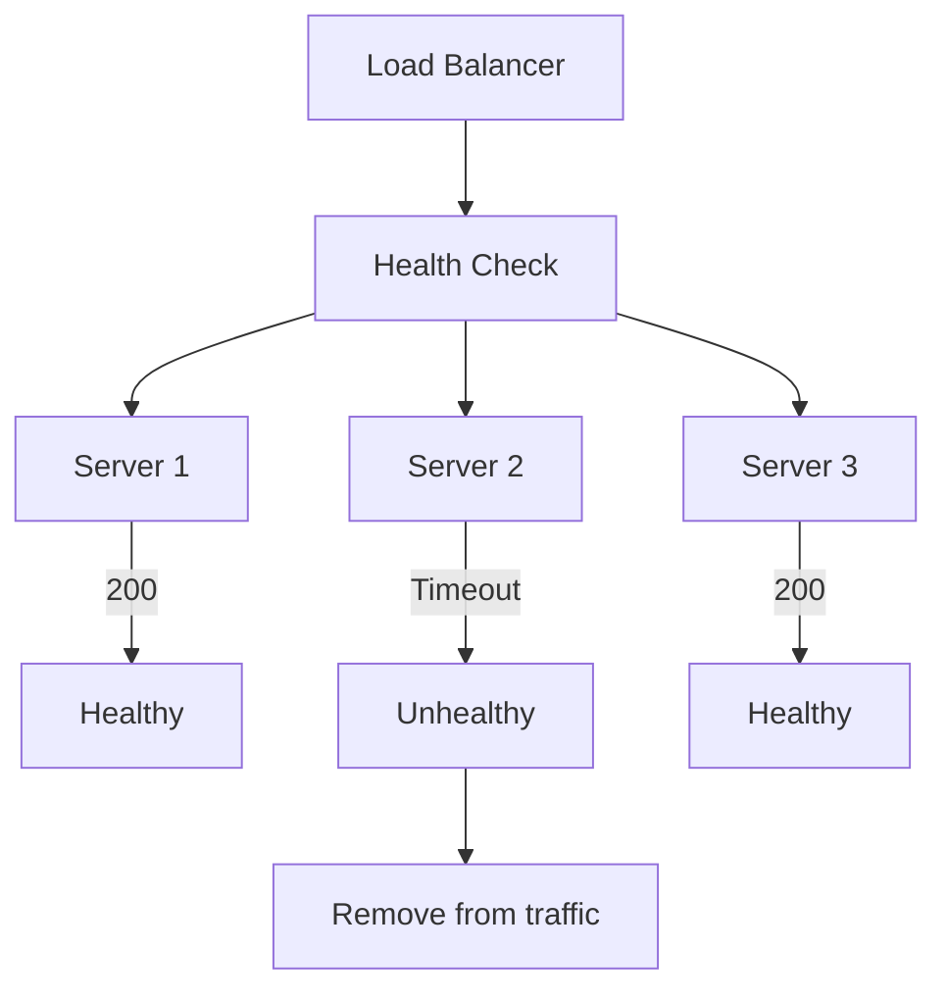

### Liveness vs Readiness

**Liveness:** Is the process alive?

**Readiness:** Is the instance ready to receive traffic?

A container may be alive but still loading configuration or dependencies. Readiness prevents traffic from reaching it too early.

## 6. Failover

If a backend fails, traffic is redirected to healthy capacity.

```text
Before:
LB → Server 1
LB → Server 2
LB → Server 3

Server 1 fails

After:
LB → Server 2
LB → Server 3
```

Common strategies:
- Active-passive
- Active-active
- Health-check based failover
- Regional failover

## 7. Session Stickiness

If session state lives inside Server 1:

```text
User → Server 1
User → Server 1
User → Server 1
```

the user may need to keep reaching that server.

Mechanisms:
- Cookies
- IP hash
- Load-balancer affinity

A more scalable approach is usually stateless application servers with shared state:

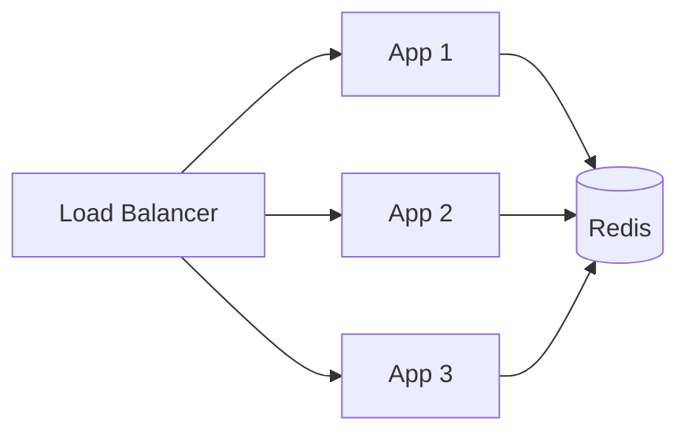

## 8. Reverse Proxy vs Load Balancer

A reverse proxy can provide:
- TLS termination
- Routing
- Compression
- Caching
- Header manipulation
- Authentication

A load balancer primarily distributes traffic.

One component can perform both roles.

```text
Internet → Nginx → App 1 / App 2 / App 3
```

## 9. Nginx

Simple upstream configuration:

```nginx
upstream backend {
    server app1:3000;
    server app2:3000;
    server app3:3000;
}

server {
    listen 80;

    location / {
        proxy_pass http://backend;
    }
}
```

Weighted example:

```nginx
upstream backend {
    server app1:3000 weight=5;
    server app2:3000 weight=3;
    server app3:3000 weight=1;
}
```

Nginx can act as both reverse proxy and load balancer.

## 10. Docker / DevOps

A useful local architecture:

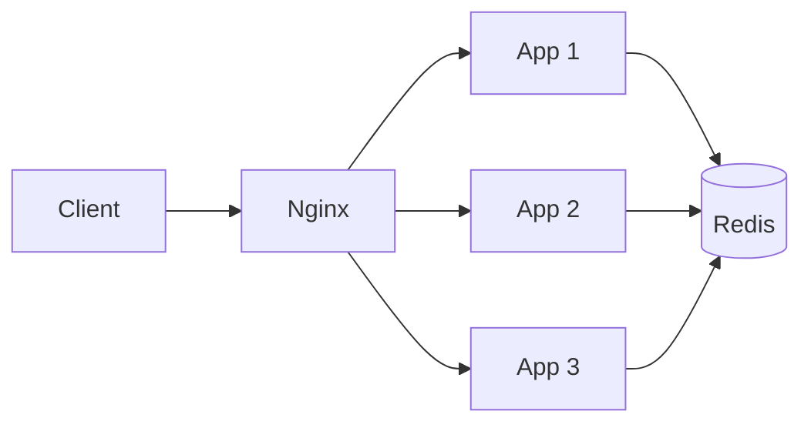

Practice:
1. Build one application image.
2. Run multiple containers.
3. Put Nginx in front.
4. Configure upstream servers.
5. Test traffic distribution.
6. Stop one container.
7. Verify that traffic continues through healthy containers.

This teaches the foundation before Kubernetes.

## 11. Kubernetes

A typical Kubernetes flow is:

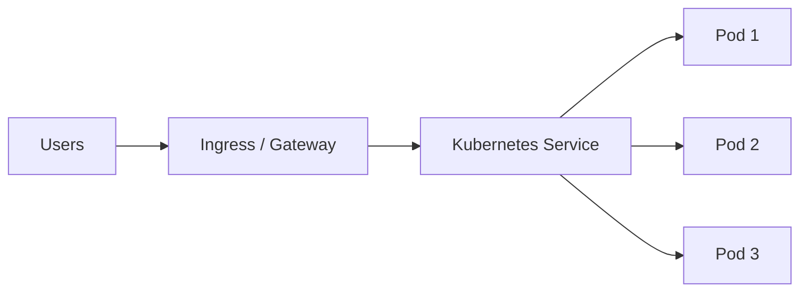

### Service

A Service provides a stable endpoint for a changing group of Pods.

Pods can restart, move between nodes, scale up, or be replaced without clients needing to know their individual addresses.

### Readiness Probe

```yaml
readinessProbe:
  httpGet:
    path: /health
    port: 3000
  initialDelaySeconds: 5
  periodSeconds: 10
```

Only ready Pods should receive traffic.

### Liveness Probe

Use it to detect a stuck or unhealthy process that should be restarted.

## 12. Kubernetes Horizontal Scaling

Load balancing and autoscaling solve different problems.

**Load balancing:** Where should traffic go?

**Autoscaling:** How many instances should exist?

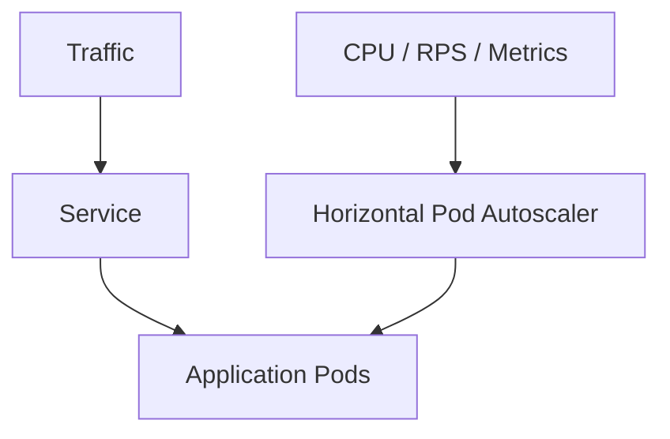

Typical flow:

```text
Traffic increases
→ Metrics increase
→ HPA adds Pods
→ New Pods become Ready
→ Service sends traffic to them
```

## 13. Kubernetes Ingress / Gateway

Ingress or Gateway can route HTTP traffic:

```text
/api     → API Service
/admin   → Admin Service
```

Typical production path:

```text
Internet
  ↓
Cloud Load Balancer
  ↓
Ingress / Gateway
  ↓
Kubernetes Service
  ↓
Pods
```

## 14. Cloud Load Balancers

Managed cloud load balancers commonly provide:
- Health checks
- TLS termination
- Availability-zone distribution
- HTTP routing
- Autoscaling integration
- Monitoring
- Security integration

Examples:
- AWS Elastic Load Balancing
- Google Cloud Load Balancing
- Azure load-balancing products
- Cloudflare traffic/load-balancing services

Choose based on protocol, routing requirements, geography, and cloud architecture.

## 15. TLS Termination

TLS can terminate at the load balancer:

```text
Client
  |
 HTTPS
  ↓
Load Balancer
  |
 HTTP/HTTPS
  ↓
Application
```

For stricter security requirements, traffic can be re-encrypted between the load balancer and backend.

## 16. Connection Draining

During deployment or scale-in, don't immediately kill an instance that has active requests.

```text
New requests
      X
      |
   Server 2

Existing requests
      |
      ↓
   Server 2
      |
    Finish
      |
   Shutdown
```

This supports graceful deployments and autoscaling.

## 17. Rolling Deployments

```text
Version 1: App 1 + App 2 + App 3
        ↓
Remove App 1 from traffic
        ↓
Deploy Version 2
        ↓
Health check passes
        ↓
Add App 1 back
        ↓
Repeat
```

This is a foundation for low-downtime deployments.

## 18. Canary Deployments

Gradually shift traffic:

```text
Old version = 95%
New version = 5%

→ 80/20
→ 50/50
→ 0/100
```

Monitor:
- Error rate
- p95/p99 latency
- CPU
- Business metrics

Load balancing/routing infrastructure enables this gradual traffic shift.

## 19. Blue-Green Deployments

```text
Blue  = current production
Green = new version

Users → Blue

After validation:

Users → Green
```

If Green fails, route traffic back to Blue.

## 20. Global Load Balancing

For global applications:

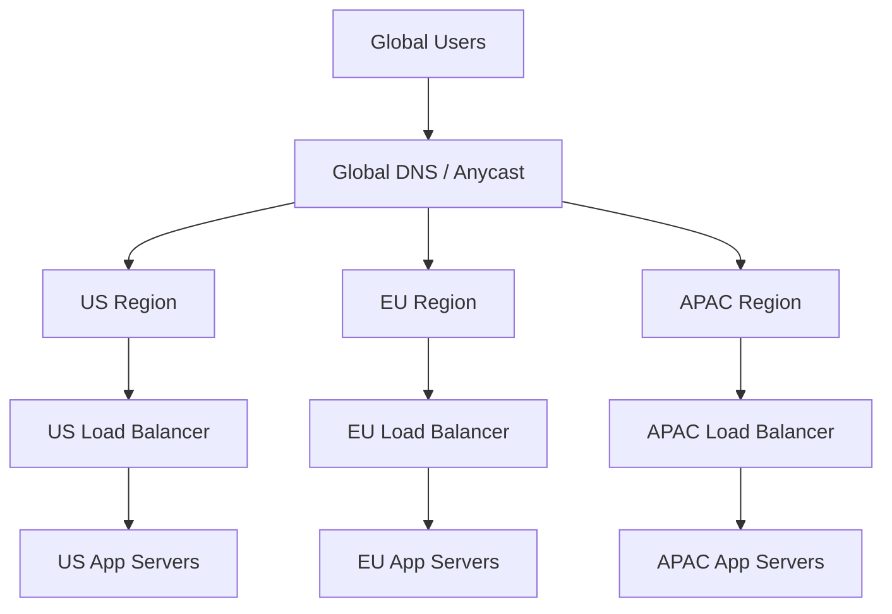

Routing can use:
- Geography
- Latency
- Weighted routing
- Region health
- Failover rules

## 21. Multi-Region Data

Traffic routing is easier than data consistency.

```text
US App → US Database
EU App → EU Database
```

You must decide how data is replicated and what consistency users need.

Options include:
- Single primary + replicas
- Multi-primary
- Eventually consistent replication
- Globally distributed databases

Global load balancing therefore connects directly to database and distributed-system design.

## 22. Observability

Monitor:

### Traffic
- Requests/sec
- Connections
- Bytes in/out

### Performance
- p50
- p95
- p99 latency

### Errors
- 4xx
- 5xx
- Timeouts
- Connection failures

### Backend health
- Healthy backend count
- Unhealthy backend count
- Health-check failures

### Distribution
- Requests per backend
- Active connections per backend
- Backend latency

Useful alerts:

```text
Healthy backends < minimum
5xx rate > threshold
p99 latency > threshold
No healthy backend available
Connection errors spike
Region becomes unhealthy
```

## 23. Load Balancing + Caching

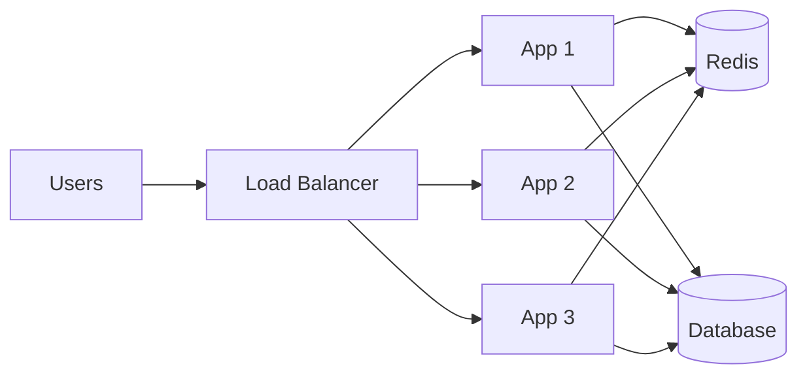

A shared Redis cache allows multiple application instances to use the same cache instead of maintaining isolated in-process state.

## 24. Load Balancing + Rate Limiting

These solve different problems:

```text
Rate Limiting → How much traffic is allowed?
Load Balancing → Which backend handles allowed traffic?
```

Typical flow:

```text
Client
 ↓
WAF / Rate Limiter
 ↓
Load Balancer
 ↓
App Servers
```

## 25. Load Balancing + Autoscaling

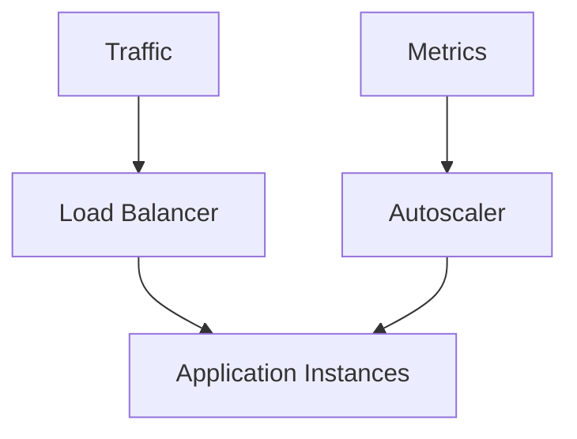

More traffic can trigger more instances; the load balancer then distributes traffic across the new healthy instances.

## 26. Production Kubernetes Architecture

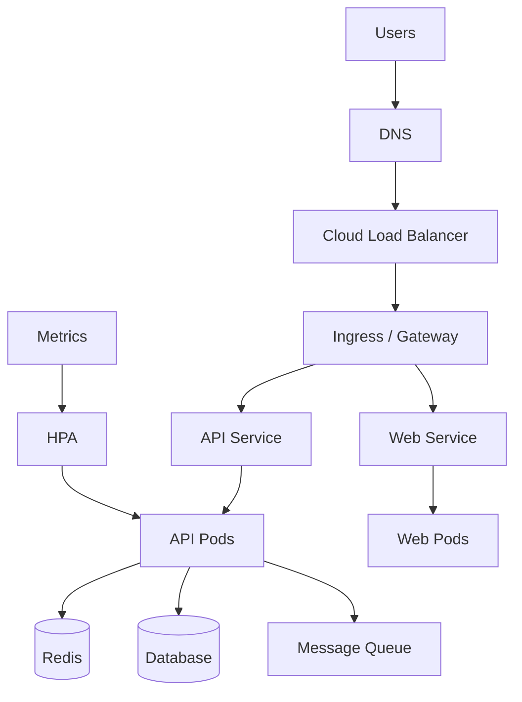

Typical responsibilities:

```text
DNS              → Domain resolution
Cloud LB         → External traffic
Ingress/Gateway  → HTTP routing
Service          → Stable internal endpoint
Pods             → Application execution
Readiness        → Traffic eligibility
HPA              → Capacity scaling
Redis            → Shared cache/session state
Database         → Persistent data
Queue            → Async processing
```

## 27. Generic Pseudocode

### Handle request

```text
on request:

    get healthy servers

    if none exist:
        return failure

    select server using load-balancing strategy

    forward request

    return response
```

### Health monitoring

```text
every few seconds:

    for each server:

        run health check

        if successful:
            mark healthy

        otherwise:
            mark unhealthy
            stop sending new traffic
```

### Autoscaling

```text
continuously:

    observe traffic and resource metrics

    if capacity is too high:
        add instance

    if capacity is low:
        remove instance safely

    send traffic only to ready instances
```

## 28. Common Mistakes

### 1. Assuming load balancing solves every bottleneck

A database, cache, queue, network, or storage system can become the next bottleneck.

### 2. Keeping important state only in application memory

This makes horizontal scaling harder.

### 3. No health checks

Traffic may continue going to failed instances.

### 4. No graceful shutdown

Deployments can terminate active requests.

### 5. Monitoring only CPU

Latency, connections, errors, memory, and downstream dependencies matter too.

### 6. Ignoring database capacity

Adding application instances can increase database connections and load.

## 29. Production Checklist

### Traffic
- [ ] Redundant/managed load balancer
- [ ] Timeouts configured
- [ ] Connection limits understood
- [ ] Traffic distribution monitored

### Health
- [ ] Health checks
- [ ] Readiness
- [ ] Automatic unhealthy-node removal
- [ ] Recovery tested

### Application
- [ ] Stateless where possible
- [ ] External session store when required
- [ ] Graceful shutdown
- [ ] Connection draining

### Security
- [ ] TLS
- [ ] Certificate management
- [ ] Firewall/security policies
- [ ] Rate limiting
- [ ] Correct client-IP forwarding

### Scaling
- [ ] Horizontal scaling
- [ ] Autoscaling
- [ ] Database capacity planning
- [ ] Cache capacity planning

### Observability
- [ ] Access logs
- [ ] Metrics
- [ ] Tracing where needed
- [ ] Alerts
- [ ] Backend health monitoring

### Disaster Recovery
- [ ] Failover tested
- [ ] Regional strategy if required
- [ ] Database recovery understood
- [ ] DNS failover tested

## 30. Final Production Architecture

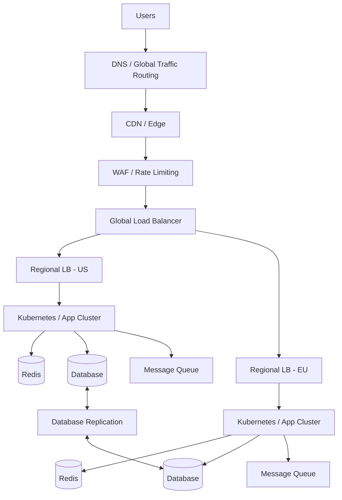

This combines:

```text
DNS
 ↓
CDN
 ↓
WAF / Rate Limiting
 ↓
Global Load Balancing
 ↓
Regional Load Balancing
 ↓
Kubernetes
 ↓
Horizontal Scaling
 ↓
Caching
 ↓
Database
 ↓
Message Queue
```

## 31. Mental Model

Ask five questions:

1. **Who receives traffic?** → Load balancer
2. **Which server receives it?** → Algorithm
3. **Is the server healthy?** → Health check/readiness
4. **What happens when traffic grows?** → Horizontal scaling/autoscaling
5. **What happens when infrastructure fails?** → Failover

The key principle:

> Distribute traffic intelligently, send traffic only to healthy capacity, and make the system capable of adding, removing, or replacing instances without disrupting users.

## 32. Recommended Learning Path

```text
Basic Load Balancing
        ↓
Algorithms
        ↓
L4 vs L7
        ↓
Health Checks
        ↓
Failover
        ↓
Nginx / Reverse Proxy
        ↓
Docker
        ↓
Kubernetes Service
        ↓
Ingress / Gateway
        ↓
Autoscaling
        ↓
Cloud Load Balancers
        ↓
Multi-Region Routing
        ↓
Disaster Recovery
```

## 33. Interview Questions

1. Why do we need a load balancer?
2. Round Robin vs Least Connections?
3. What is weighted round robin?
4. What is L4 load balancing?
5. What is L7 load balancing?
6. When would you choose L4 over L7?
7. What is a health check?
8. Liveness vs readiness?
9. What happens when a backend fails?
10. What is session stickiness?
11. Why are stateless applications easier to scale?
12. Reverse proxy vs load balancer?
13. How does Nginx load balance?
14. How does Kubernetes Service distribute traffic?
15. What is Kubernetes Ingress?
16. How does HPA work with load balancing?
17. What is connection draining?
18. How do you perform zero-downtime deployment?
19. How would you design global load balancing?
20. How would you handle regional failure?
21. Can a load balancer become a bottleneck?
22. How would you monitor one?
23. What happens if the database becomes the bottleneck?
24. How would you design a highly available load-balancing architecture?

---

# Summary

Load balancing is not simply distributing requests between servers.

A production architecture combines:

**Traffic Distribution + Health Checks + Failover + Horizontal Scaling + Stateless Services + Caching + Autoscaling + Observability + Security + Disaster Recovery**

Once you understand these layers, you can move from a simple Nginx setup to Docker, Kubernetes, cloud load balancers, and finally multi-region distributed architectures.
