# System Scale: Horizontal and Vertical

When a system grows, it needs more resources to handle more users, more requests, more data, and more traffic.

There are two classic ways to scale a system:

* **Vertical scaling**: make one machine bigger
* **Horizontal scaling**: add more machines

Both are important. Most real systems use a mix of the two.

---

## 1. What is Scaling?

Scaling means increasing a system’s capacity so it can handle more load.

Load can mean:

* more requests per second
* more users
* more data
* more storage
* more background jobs
* more concurrent connections
* more read/write operations

A system that works for 1,000 users may fail at 1 million unless it is scaled properly.

---

## 2. Vertical Scaling

Vertical scaling means adding more power to a single machine.

Examples:

* more CPU
* more RAM
* faster SSD
* better network card
* more cores
* larger instance type in cloud

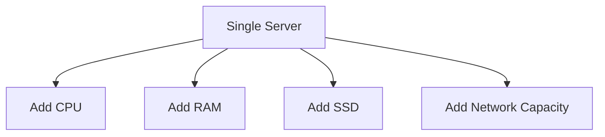

### Example

A database running on a 4-core, 16 GB machine may be upgraded to:

* 16 cores
* 64 GB RAM
* NVMe storage

That is vertical scaling.

---

## 3. Horizontal Scaling

Horizontal scaling means adding more machines to share the load.

Examples:

* 1 app server becomes 10 app servers
* 1 cache node becomes 5 cache nodes
* 1 database shard becomes 8 shards
* 1 worker becomes 100 workers

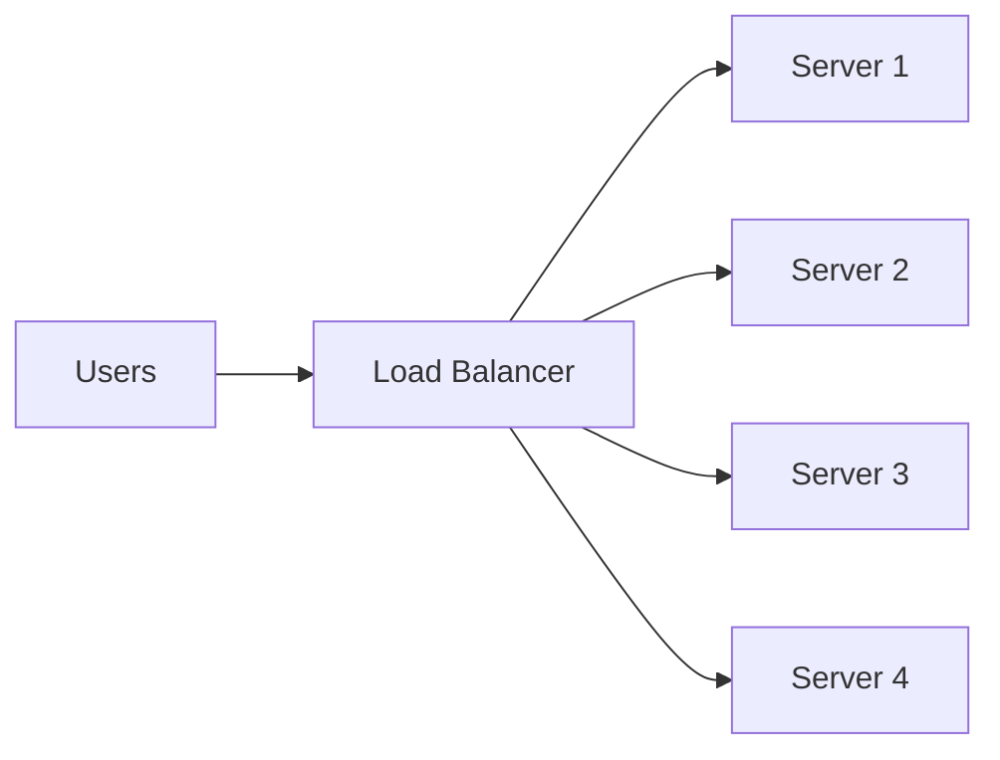

This is also called **scale out**.

---

## 4. Vertical Scaling in Detail

Vertical scaling is the simplest approach.

### How it works

Instead of changing architecture, you improve the machine itself.

### Benefits

* simple to implement
* no load balancer required
* no distributed coordination
* easier debugging
* no data partitioning needed

### Limitations

* hard upper limit
* one machine can still fail
* expensive at high end
* downtime may be needed for upgrades
* single point of failure if not replicated

### Good use cases

* small applications
* monoliths in early stage
* databases before sharding
* internal tools
* workloads that fit on one powerful box

---

## 5. Horizontal Scaling in Detail

Horizontal scaling adds more nodes and spreads the workload.

### How it works

A load balancer or router sends traffic to multiple servers.

### Benefits

* can grow much larger
* better fault tolerance
* easier to absorb traffic spikes
* supports high availability
* allows geographic distribution

### Limitations

* more complex architecture
* distributed coordination problems
* network latency
* consistency challenges
* load balancing required
* debugging becomes harder

### Good use cases

* web applications
* APIs
* microservices
* caches
* search clusters
* message queues
* analytics systems

---

## 6. Visual Comparison

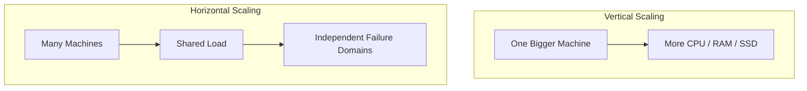

---

## 7. Vertical vs Horizontal: Main Difference

| Aspect                 | Vertical Scaling              | Horizontal Scaling                 |
| ---------------------- | ----------------------------- | ---------------------------------- |
| Approach               | Make one machine bigger       | Add more machines                  |
| Complexity             | Low                           | Higher                             |
| Cost                   | Can become expensive          | Often more cost-efficient at scale |
| Fault tolerance        | Lower                         | Higher                             |
| Maximum capacity       | Limited by hardware           | Nearly unlimited in theory         |
| Downtime risk          | Higher during upgrades        | Lower if managed well              |
| Operational complexity | Simple                        | Complex                            |
| Best for               | Small systems, DBs, monoliths | Large distributed systems          |

---

## 8. When Vertical Scaling Is Enough

Vertical scaling is enough when:

* traffic is low or moderate
* data is manageable on one machine
* the team wants speed and simplicity
* the product is early-stage
* the workload is mostly single-node friendly

Example:

* a startup app with 5,000 daily users
* a small admin dashboard
* a local company intranet
* a backend with light traffic

In such cases, a bigger server may be the easiest path.

---

## 9. When Horizontal Scaling Becomes Necessary

Horizontal scaling becomes necessary when:

* one machine cannot keep up
* downtime becomes too risky
* traffic spikes are too large
* storage exceeds a single node
* availability matters
* global traffic must be supported

Example:

* social media feed
* payment system
* ride-hailing app
* streaming platform
* e-commerce checkout
* search engine

At this point, one machine is no longer enough.

---

## 10. Scaling an Application Server

Application servers are usually easiest to scale horizontally.

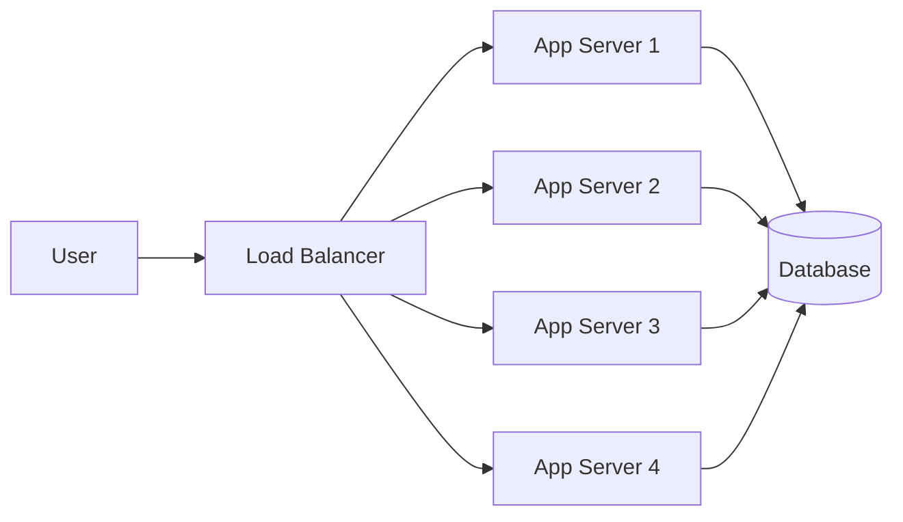

This works well if:

* app servers are stateless
* sessions are stored externally
* shared state is minimized

### Stateless app design

A stateless app server does not keep user session data in memory.
That makes it easy to add or remove instances.

---

## 11. Scaling a Database

Databases are harder to scale than app servers.

### Vertical scaling for DB

You can upgrade:

* CPU
* memory
* storage speed

This often helps a lot initially.

### Horizontal scaling for DB

You may need:

* read replicas
* sharding
* partitioning
* distributed databases

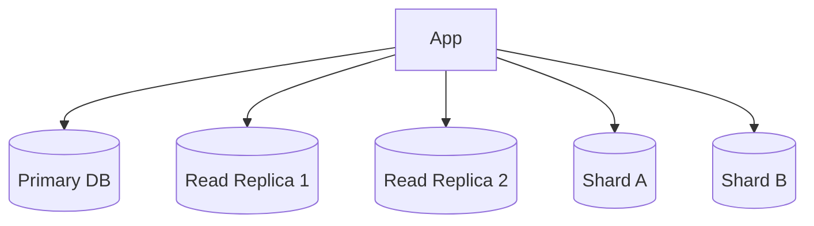

---

## 12. Why Databases Are Hard to Scale Horizontally

Because databases must manage:

* consistency
* transactions
* locks
* replication
* failover
* ordering
* schema changes

When you split data across machines, you introduce distributed system problems.

---

## 13. Read Scaling vs Write Scaling

### Read scaling

Reads are easier to scale horizontally using replicas or caches.

### Write scaling

Writes are harder because all writes must remain correct and consistent.

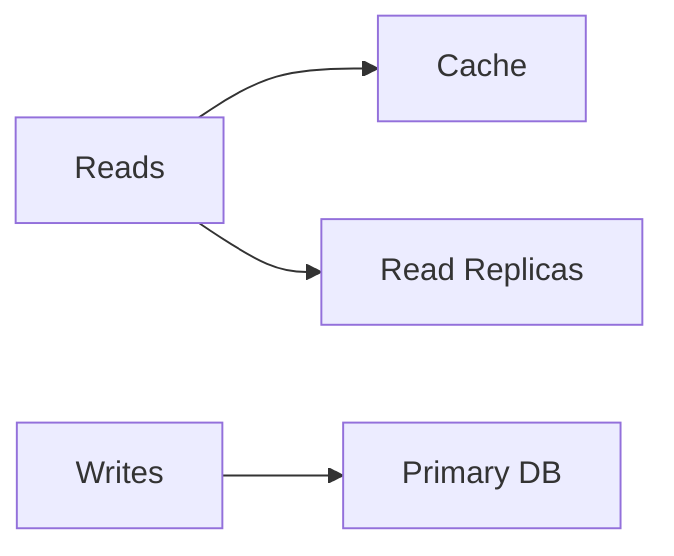

A common pattern:

* scale reads horizontally
* keep writes on a primary
* later shard writes if needed

---

## 14. Caching as a Scale Tool

Caching is not exactly vertical or horizontal scaling, but it helps reduce pressure on both.

Examples:

* Redis cache
* CDN cache
* in-memory cache
* browser cache

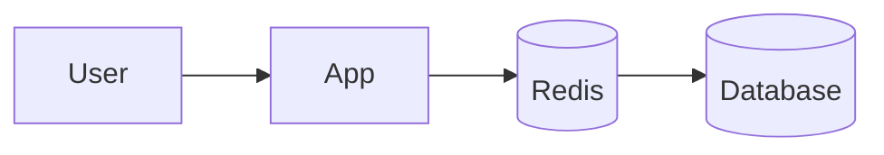

Caching can:

* lower latency
* reduce DB load
* improve throughput
* smooth traffic spikes

---

## 15. Scaling Web Traffic

A common path for web systems looks like this:

1. start with one server
2. upgrade server hardware
3. add cache
4. separate database
5. add read replicas
6. add load balancer
7. add more app servers
8. shard database if needed
9. split into microservices if necessary

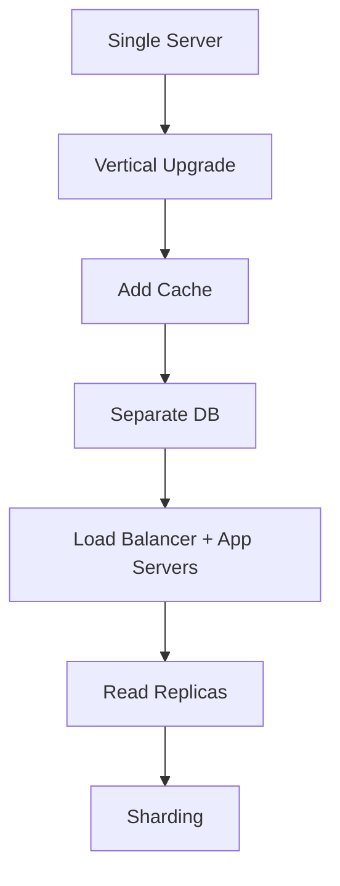

This is a very common growth path.

---

## 16. Horizontal Scaling Patterns

### 16.1 Load balancing

Distributes requests across servers.

### 16.2 Replication

Copies data or services across nodes.

### 16.3 Partitioning

Splits data into smaller pieces.

### 16.4 Sharding

Stores different parts of data on different machines.

### 16.5 Queue-based scaling

Uses background workers to absorb bursts.

### 16.6 Autoscaling

Adds or removes servers based on load.

---

## 17. Load Balancer Role

A load balancer is essential for horizontal scaling of stateless services.

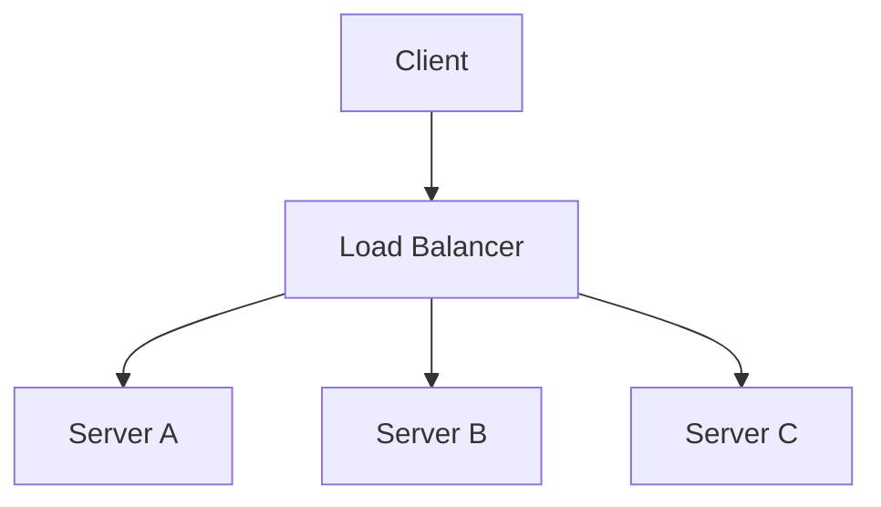

Load balancers may use:

* round robin
* least connections
* weighted routing
* latency-based routing
* health checks

---

## 18. Stateless vs Stateful Systems

Horizontal scaling works best for stateless systems.

### Stateless

Each request is independent.

Examples:

* API server
* image processing worker
* authentication gateway with external session store

### Stateful

The server keeps important data in memory.

Examples:

* local file server
* in-memory session app
* single-node database
* realtime game state

Stateful systems are harder to scale horizontally.

---

## 19. Scaling State

When a system has state, you must decide where the state lives.

Possible options:

* external DB
* Redis
* distributed cache
* object storage
* shared filesystem
* replicated store

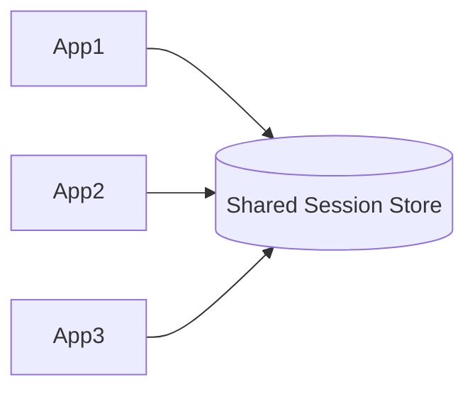

That is how a stateless application layer is made possible.

---

## 20. Scaling Through Replication

Replication copies data to multiple nodes.

### Benefits

* higher read capacity
* better fault tolerance
* regional availability

### Drawbacks

* replication lag
* consistency issues
* failover complexity

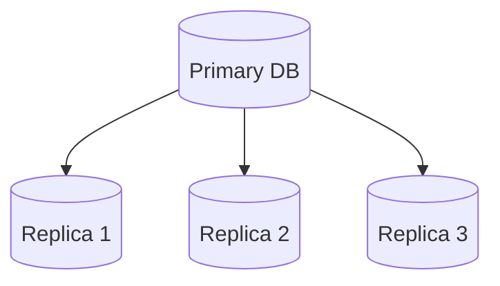

---

## 21. Scaling Through Sharding

Sharding splits data by key.

Example:

* user IDs 1–1M on shard A
* user IDs 1M–2M on shard B
* user IDs 2M–3M on shard C

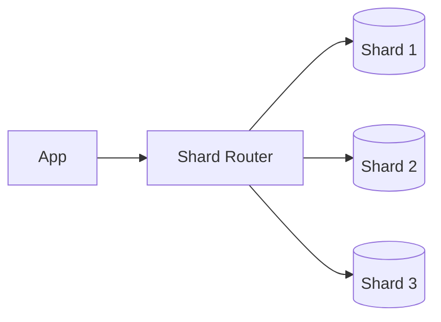

### Benefits

* horizontal write scaling
* smaller per-node data size
* better data locality

### Costs

* complex queries
* cross-shard joins are hard
* rebalancing is difficult
* shard key design is critical

---

## 22. Autoscaling

Autoscaling is a horizontal scaling technique that adjusts resources automatically.

### Example

* CPU > 70% for 5 minutes → add node
* traffic drops → remove node

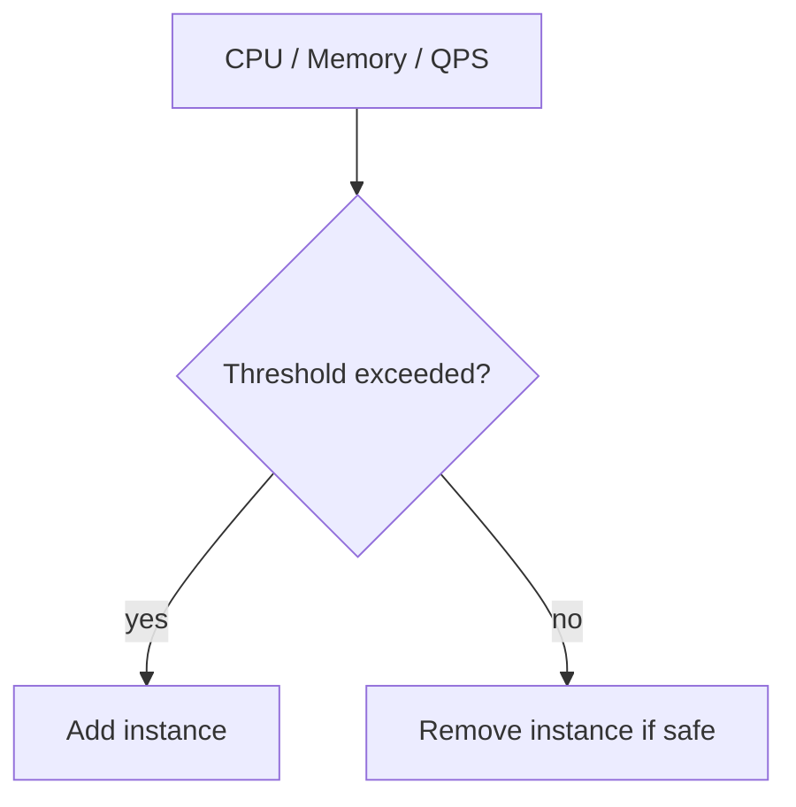

Autoscaling is common in cloud environments.

---

## 23. Scaling Costs

### Vertical scaling cost

Usually increases sharply at the high end.

A larger machine may cost disproportionately more.

### Horizontal scaling cost

Costs more in:

* networking
* orchestration
* operational effort
* observability
* service coordination

So the cheaper option depends on where you are in the scale curve.

---

## 24. Failure Modes

### Vertical scaling failure

One large machine goes down and a lot of capacity disappears at once.

### Horizontal scaling failure

One node fails, but the system should continue running.

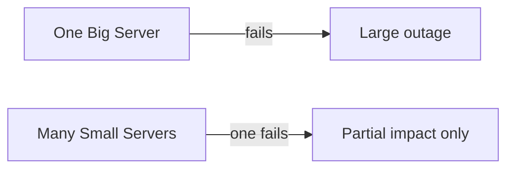

Horizontal scaling usually improves availability, but only if redundancy is designed properly.

---

## 25. Latency and Throughput

### Latency

How long one request takes.

### Throughput

How many requests the system can handle per second.

Vertical scaling may reduce latency for one box up to a point.

Horizontal scaling is usually better for throughput.

---

## 26. Real-World Example: E-commerce

An e-commerce app may scale like this:

* app servers: horizontal scaling
* product images: CDN
* checkout service: horizontal scaling with strong consistency
* database: vertical first, then replicas, then sharding
* cache: horizontal Redis cluster
* search: distributed search cluster

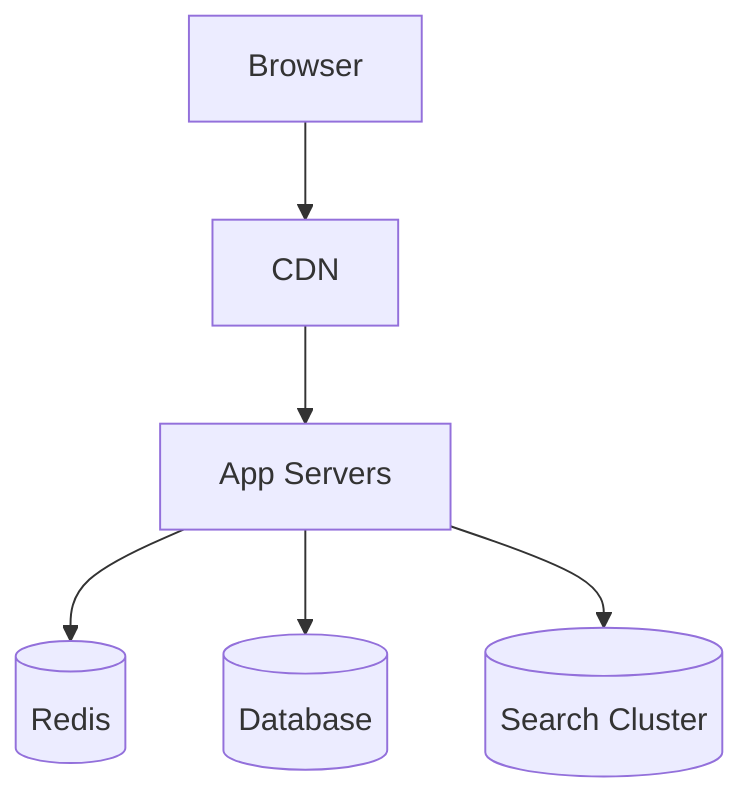

---

## 27. Real-World Example: Chat App

A chat app needs:

* many concurrent connections
* low latency
* fanout messaging
* presence tracking

Scaling path:

* vertical first for prototype
* horizontal WebSocket servers later
* shared pub/sub
* sharded message storage

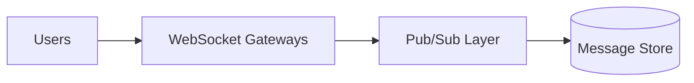

---

## 28. Real-World Example: Database-Heavy App

A reporting system may need:

* vertical scaling for the database early
* columnar storage later
* read replicas
* caching
* precomputed aggregates

In analytics systems, vertical scaling can help initially, but horizontal architectures become necessary for larger data volumes.

---

## 29. Common Mistakes

### 29.1 Scaling too early

Adding complexity before it is needed.

### 29.2 Scaling only compute

Ignoring database, cache, and network bottlenecks.

### 29.3 Treating horizontal scaling as free

It is powerful, but much harder to operate.

### 29.4 Keeping state in app memory

Makes scaling across multiple servers painful.

### 29.5 Bad shard key design

Can create hot partitions and uneven load.

---

## 30. How to Decide

Ask these questions:

* Can one machine handle current load?
* Is the system mostly stateless?
* Is downtime acceptable during upgrades?
* Is the database the bottleneck?
* Do you need high availability?
* Do you need regional traffic support?
* Is operational complexity worth the benefit?

---

## 31. Practical Scaling Strategy

A sensible order is often:

1. optimize code
2. add caching
3. upgrade machine size
4. separate components
5. add load balancing
6. scale horizontally
7. replicate data
8. shard where needed
9. use async processing
10. add geo-distribution

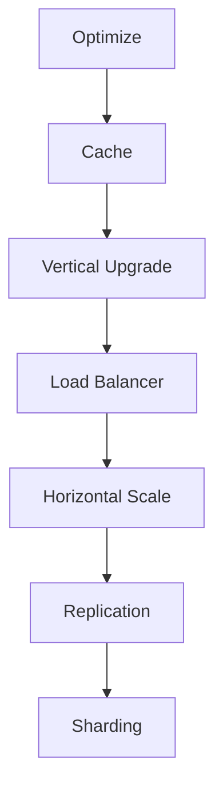

---

## 32. Interview Summary

### Vertical scaling

Make one server bigger.

### Horizontal scaling

Add more servers.

### Key takeaway

Vertical scaling is simpler, but horizontal scaling is more powerful and fault-tolerant.

Most real production systems use both:

* vertical scaling for fast wins and early stage growth
* horizontal scaling for reliability and large-scale traffic

---

## 33. Final Takeaway

Scaling is not just about more hardware. It is about choosing the right architecture for growth.

* **Vertical scaling** is the easiest way to increase capacity on a single machine.
* **Horizontal scaling** is the way to grow a system across many machines.

The best systems start simple, then evolve gradually:

* optimize first
* scale vertically next
* scale horizontally when the limit is near
* then solve consistency, sharding, and observability

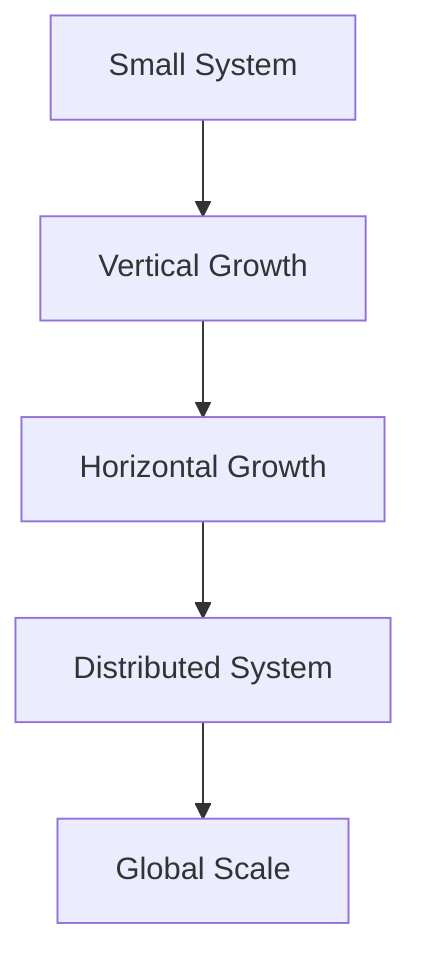
